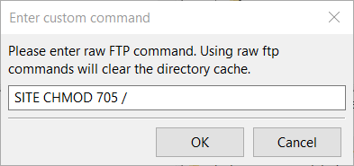
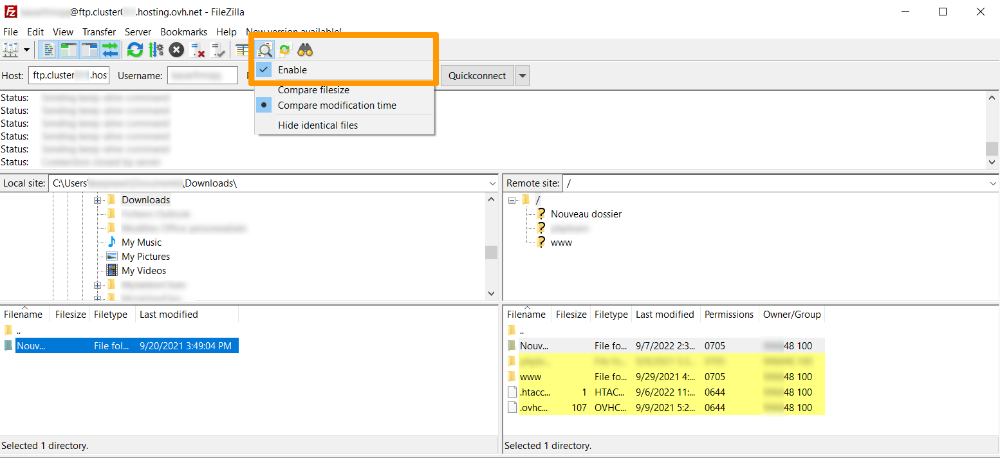
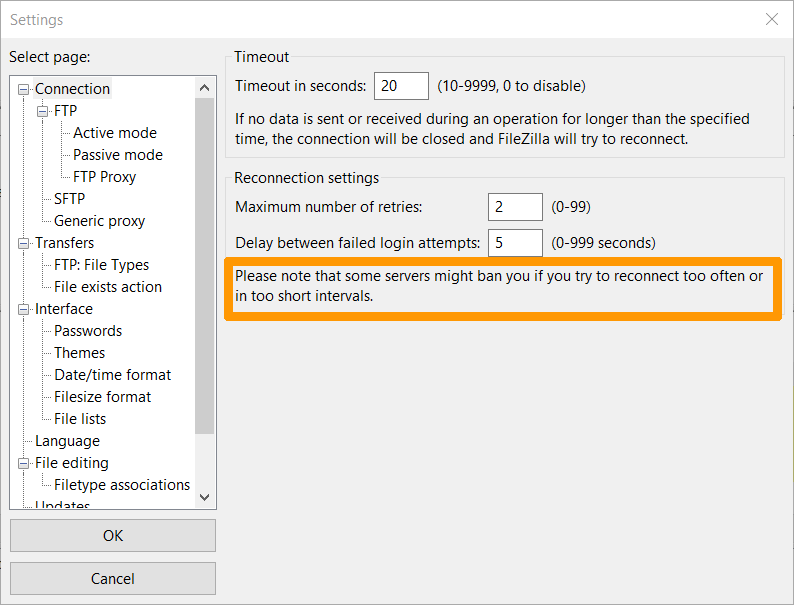

## Presentación
FileZilla es un programa disponible para varios sistemas operativos (Windows, Mac, etc.) que ofrece la posibilidad de publicar un sitio web, al permitirle conectarse a su espacio de alojamiento por FTP.

Para descargarlo, visite la web oficial de [FileZilla](https://filezilla-project.org/).

{.thumbnail}


## Interfaz

## La interfaz de FileZilla
La zona 1 ofrece información sobre el estado de la conexión, transferencias, errores de conexión, etc. Por lo general, la información que aparece no es útil para usuarios principiantes.

La zona 2 muestra la estructura de carpetas hasta la carpeta que contiene el sitio web (u otros archivos que quiera transferir) en su ordenador.

La zona 3 muestra la estructura de carpetas hasta la carpeta actual en el servidor.

La zona 4 muestra el contenido de la carpeta del ordenador, indicando el nombre, tamaño, tipo y fecha de la última modificación de los archivos.

La zona 5 muestra el contenido de la carpeta del servidor, indicando el nombre, tamaño, tipo, fecha de la última modificación, permisos y propietario de los archivos.

La zona 6 muestra la lista de espera de los archivos pendientes de transferencia (o que están siendo transferidos) al servidor o al ordenador.

En la barra de conexión rápida, situada bajo la zona encuadrada en verde en la imagen, aparece el nombre del servidor al que está conectado y el nombre de usuario del FTP, su contraseña y el puerto utilizado.

{.thumbnail}

## Barra de herramientas
La barra de herramientas, que aparece en la imagen en un recuadro verde, contiene los iconos necesarios para el funcionamiento básico de la aplicación. Para transferir archivos no se utilizan todos ellos.

A continuación se ofrece una breve descripción de estos iconos:

 Abrir el gestor de sitios
 Ocultar o mostrar el área de mensajes (1)
 Ocultar o mostrar el árbol de directorios local (2)
 Ocultar o mostrar el árbol de directorios remoto (3)
 Ocultar o mostrar la cola de transferencia (6)
 Actualizar las listas de archivos y carpetas
 Iniciar o detener el proceso de la cola de transferencias
 Cancelar operación en curso
 Desconectar del servidor
 Reconectar al último servidor usado
 Mostrar el cuadro de diálogo para filtrar el listado del directorio
 Activar o desactivar la comparación de directorios
 Activar o desactivar la navegación sincronizada
 Búsqueda de archivos


## Conexión FTP
Para establecer la conexión con el servidor remoto, introduzca los siguientes datos en la barra de conexión rápida (recuadro verde en la imagen):

|Información solicitada|Detalles|
|---|---|
|Servidor FTP|Es la dirección del servidor que permite acceder al espacio de almacenamiento.<br>Según el cliente FTP utilizado, puede denominarse «servidor», «dirección del servidor», «host», «nombre del host»...|
|Usuario FTP|Es el usuario que permite acceder al espacio de almacenamiento.<br>Según el cliente FTP utilizado, puede denominarse «usuario», «nombre de usuario», «identificador», «login», «username»...|
|Contraseña del usuario FTP|Es la contraseña asociada al usuario FTP.<br>Según el cliente FTP utilizado, puede denominarse «contraseña» o «password».|
|Puerto de conexión|Este campo suele autocompletarse. Si tuviera que rellenarlo:<br>- utilice el puerto 21 para conectarse mediante el protocolo FTP;<br>- utilice el puerto 22 para conectarse mediante el protocolo SFTP (en caso de que esté activado).|

Si no dispone de esta información, conéctese al [área de cliente de OVHcloud](https://ca.ovh.com/auth/?action=gotomanager&from=https://www.ovh.com/world/&ovhSubsidiary=ws){.external} en la sección **Web** y, haga clic en `Alojamientos`{.action}. Seleccione el alojamiento correspondiente y abra la pestaña `FTP - SSH`{.action}. Se mostrará la información relativa a su espacio de almacenamiento, así como una tabla con los usuarios FTP y SSH creados en el alojamiento.

Cuando haya completado todos los datos, haga clic en «Conexión rápida» para establecer la conexión con el servidor.

{.thumbnail}


## Conexión SFTP
El SFTP (de SSH File Transfer Protocol) es una conexión FTP en el puerto 22, por lo que permite una conexión segura.

Este tipo de conexión solo es válido a partir del plan [Profesional](https://www.ovhcloud.com/es/web-hosting/).

Permite, por ejemplo, cambiar los permisos de archivos que no se pueden ejecutar estando conectado por FTP al puerto 21.

Para establecer la conexión con el servidor remoto por SFTP, introduzca los siguientes datos en la barra de conexión rápida:


- Servidor: ftp.mi-dominio.tld o ftp.cluster0XX.ovh.net o newftp.cluster0XX.ovh.net
- Nombre de usuario: Su usuario FTP
- Contraseña: Contraseña FTP asociada al usuario
- Puerto:22


Haga clic en «Conexión rápida». Se abrirá el cuadro de diálogo de la imagen, en el que deberá confirmar la conexión al servidor.

Como la conexión se realiza con un servidor de OVHcloud, puede marcar la casilla «Confiar siempre en este sitio, añadir su clave a la caché» para que la aplicación no vuelva a preguntarle.

{.thumbnail}


## Errores de conexión
El mensaje de la imagen indica un error de identificación en la conexión por FTP al alojamiento compartido.

Este tipo de mensaje se debe a un error en la pareja usuario-contraseña.

Compruebe sus claves para asegurarse de no haber cometido un error al introducirlas. Si lo desea, puede cambiar la contraseña del acceso FTP del alojamiento directamente en el área de cliente.

En la siguiente guía puede consultar cómo cambiar la contraseña del FTP en los planes de alojamiento compartido: 

- [Cambiar la contraseña de un usuario FTP](../cambiar-contrasena-usuario-ftp/)


{.thumbnail}
En esta imagen, el error se debe a que el nombre del servidor introducido no es correcto.

{.thumbnail}


## Transferencia de los archivos
Para transferir los archivos por FTP, puede simplemente seleccionarlos en el recuadro de la izquierda (los archivos locales) y arrastrarlos al recuadro de la derecha (el espacio de alojamiento).

Preste atención para seleccionar correctamente la carpeta de destino en el recuadro derecho.

A continuación, los archivos se pondrán automáticamente en la cola para subirlos al servidor.

{.thumbnail}


## Archivos en cola
En la interfaz puede ver los archivos en cola:


- archivos pendientes de subir al servidor remoto que aún están en la cola,
- archivos para los que ha fallado la transferencia,
- archivos que han sido transferidos correctamente al alojamiento remoto.


{.thumbnail}


## Menú contextual del servidor
Haciendo clic derecho en cualquiera los archivos contenidos en el servidor remoto (5), aparecerá un menú contextual con las siguientes opciones:


- Descargar: Descarga el archivo en el directorio local abierto.
- Añadir archivos a la cola: Añade el archivo a la cola, permitiendo, por ejemplo, diferir la descarga de los datos.
- Ver/Editar: Permite ver o editar directamente un archivo contenido en el alojamiento. No obstante, es necesario tener instalado en el equipo un programa capaz de leer el archivo.
- Crear directorio: Permite crear una nueva carpeta directamente en el alojamiento remoto.
- Actualizar: Actualiza la visualización de los datos para mostrar correctamente todos los archivos guardados.
- Borrar: Elimina el archivo seleccionado.
- Renombrar: Permite renombrar el archivo seleccionado.
- Copiar URL(s) al portapapeles: Copia automáticamente el enlace directo al archivo seleccionado, generando una URL de tipo ftp://loginftp@ftp.cluster0XX.ovh.net/www/micarpeta/miarchivo.jpg
- Permisos de archivo: Ofrece la posibilidad de editar los permisos de los archivos (CHMOD).


{.thumbnail}


## Permisos de los archivos y carpetas
Para acceder a este cuadro de diálogo, haga clic derecho en uno de los archivos contenidos en el servidor y seleccione «Permisos de archivo...».

Desde ahí podrá editar los permisos (CHMOD) de los archivos y carpetas guardados en el alojamiento.

Introduzca los permisos que quiera asignar; el valor CHMOD se actualizará automáticamente.

Para las carpetas, marque si lo desea la casilla «Incluir todos los subdirectorios» para editar los permisos de la carpeta, así como de las subcarpetas y archivos que pudiera contener.

{.thumbnail}


## Reapertura de un sitio web
En el menú superior de FileZilla, haga clic en «Servidor» y seleccione «Introducir comando personalizado».

Introduzca el siguiente comando: 


```
SITE CHMOD 705 /
```


Si obtiene el error «550 would not chance perms on /. not such file or directory», utilice el comando siguiente:


```
SITE CHMOD 705 .
```


Para comprobar si el sitio se ha reabierto, simplemente pruébelo desde un navegador de internet.

Este comando no funciona en SFTP.

{.thumbnail}
Recordamos que para probar que el sitio esté abierto, debe esperar un máximo de 3 horas. Nuestros robots pasan cada 3 horas para comprobar si se han realizado cambios de estado. En función del momento en el que haya realizado la operación, el sitio puede tardar más o menos en volver a visualizarse.

Si ha transcurrido el intervalo de 3 horas y su sitio web sigue sin estar disponible, contacte con el soporte.


## Transferencia de archivos bancarios
Para los archivos de tipo binario, como los archivos CGI, puede ser interesante elegir la forma en la que se realizará la transferencia.

Para cambiarla, en el menú superior haga clic en «Transferencia» y seleccione «Tipo de transferencia».

{.thumbnail}


## Comparación de carpetas
Esta opción utiliza colores en las zonas (3) y (4) para comparar las diferencias entre los archivos locales y el servidor.

Haga clic derecho en el icono  para cambiar el modo de comparación. Además de la posibilidad de activar o desactivar la opción, podrá elegir entre:

- Comparar tamaño de archivo
- Comparar tiempo de modificación
- Ocultar archivos idénticos


El significado de los colores utilizados para la comparación es el siguiente:

- Amarillo: El archivo solo existe en un lado.
- Verde: El archivo es más nuevo que el archivo sin marcar en el otro lado.
- Rojo: Los tamaños de los archivos son diferentes.


{.thumbnail}


## Opciones

## Conexión
Es posible editar los ajustes de reconexión al servidor. Sin embargo, tenga en cuenta que algunos servidores pueden considerarlo como abuso y banear su dirección IP.

Para cambiar estos ajustes, acceda al menú superior «Edición» y seleccione «Opciones». Las opciones de conexión aparecerán por defecto en primer lugar.

{.thumbnail}

## Transferencias
Es posible editar los ajustes relativos a las acciones que se ejecutan por defecto al actualizar un archivo existente.

Para cambiar estos ajustes, acceda al menú superior «Edición», seleccione «Opciones» y haga clic en «Transferencias».

{.thumbnail}


## Conocer el servidor de conexión
En algunos casos, el soporte puede preguntarle a qué servidor se ha conectado FileZilla.

Esta comprobación puede pedirse en caso de ralentización o de anomalías diversas en su espacio FTP. 

Para conocer el servidor de conexión:

- En el recuadro situado bajo la barra de conexión, suba hasta el principio de los logs.
- Consulte el servidor webmXXX.


{.thumbnail}

