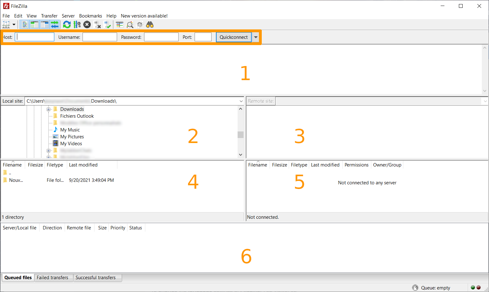
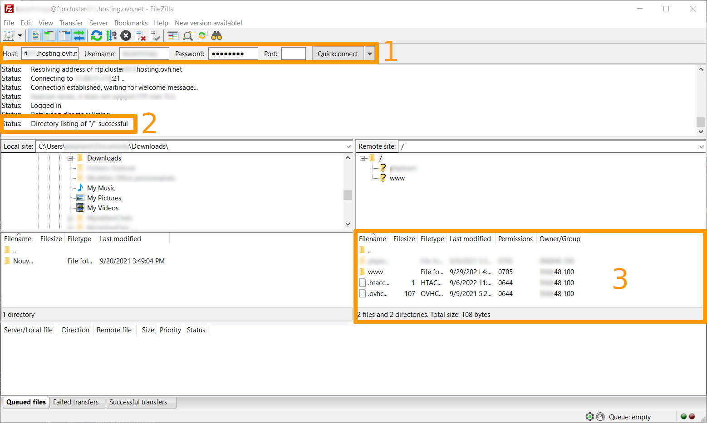
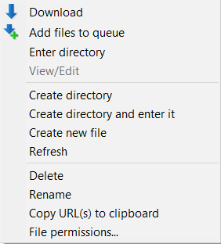
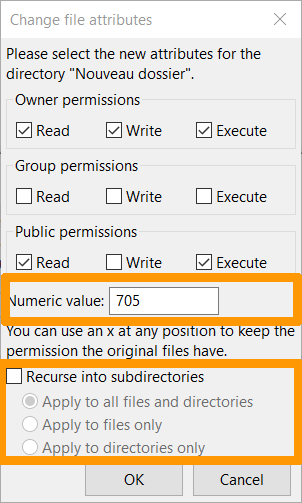

**Dernière mise à jour le 09/09/2022**

## Objectif

Apprendre à utiliser le logiciel Filezilla avec votre hébergement mutualisé.

Dans le cadre de votre offre d'hébergement web OVHcloud, vous pourrez vous [connecter à l'espace "FTP"](https://docs.ovh.com/fr/hosting/connexion-espace-stockage-ftp-hebergement-web/) pour y déposer les pages de votre site internet ou tous simplement des fichiers.

> [!warning]
>
> OVHcloud met à votre disposition des services dont la configuration, la gestion et la responsabilité vous incombent. Il vous revient de ce fait d'en assurer le bon fonctionnement.
> 
> Nous mettons à votre disposition ce guide afin de vous accompagner au mieux sur des tâches courantes. Néanmoins, nous vous recommandons de faire appel à un [prestataire spécialisé](https://partner.ovhcloud.com/fr/) et/ou de contacter l'éditeur du logiciel si vous éprouvez des difficultés. En effet, nous ne serons pas en mesure de vous fournir une assistance. Plus d'informations dans la section [« Aller plus loin »](#go-further) de ce guide.
> 

## Prérequis

- Être connecté à votre [espace client OVHcloud](https://www.ovh.com/auth/?action=gotomanager&from=https://www.ovh.com/fr/&ovhSubsidiary=fr).
- Posséder une [offre d'hébergement web](https://www.ovhcloud.com/fr/web-hosting/){.external}.
- Avoir installé le logiciel Filezilla sur votre ordinateur. Celui-ci est disponible gratuitement depuis la page [filezilla-project.org](https://filezilla-project.org/download.php){.external}

## En pratique

<center></center>

### Présentation

FileZilla est un logiciel disponible gratuitement sur plusieurs systèmes d'exploitations (Windows, MacOS, etc).

Ce dernier permet de mettre en ligne des fichiers ou votre site internet en vous [connectant à l'espace "FTP"](https://docs.ovh.com/fr/hosting/connexion-espace-stockage-ftp-hebergement-web/) de votre hébergement.

### L'interface <a name="interface"></a>

{.thumbnail}

- La partie suppérieure **encadrée** permet une connexion rapide à votre hébergement en y renseignant son nom d’**hôte**, le nom d’**utilisateur**, son **mot de passe** associé et le numéro de **port** utilisé.

- **zone 1** : Détails sur l’historique des opérations, la connexion à l’espace FTP, les transferts de fichiers, les erreurs, etc. Pour en savoir plus, rendez-vous sur la [documentation officielle de Filezilla](https://filezilla-project.org/){.external}.

- **zone 2** : Arborescence des répertoires/fichiers locaux sur votre ordinateur.

- **zone 3** : Arborescence des répertoires/fichiers distants lorsque vous êtes connecté à votre hébergement.

- **zone 4** : Liste des répertoires/fichiers dans le répertoire sélectionné en local sur votre ordinateur.

- **zone 5** : Liste des répertoires/fichiers distants dans le répertoire sélectionné sur votre hébergement.

- **zone 6** : Liste les opérations de transfert en cours, en attente ou en erreur entre votre ordinateur et votre hébergement.

### Connexion avec Filezilla en FTP

{.thumbnail}

Depuis la barre de connexion rapide, complétez les informations selon le tableau ci-dessous :

|Information à renseigner|Détails|
|---|---|
|Hôte| Adresse du serveur permettant d'accéder à l'espace de stockage de votre hébergement.<br><br> Pour les hébergements mutualisés, il a généralement cette forme : **ftp.clusterXXX.hosting.ovh.net** (les "XXX" représentent le numéro de cluster où se trouve votre hébergement)|
|Utilisateur|Identifiant vous permettant d'accéder à à l'espace de stockage de votre hébergement.|
|Mot de passe|Mot de passe associé à l'utilisateur.|
|Port|Il est généralement complété automatiquement par le logiciel. Sinon, renseignez :<br><br>- le port « 21 » pour une connexion FTP ;<br>- le port « 22 » pour une connexion SFTP (dans le cas où celui-ci est activé).|

Si vous n’êtes pas en possession de ces éléments, connectez-vous à votre [espace client OVHcloud](https://www.ovh.com/auth/?action=gotomanager&from=https://www.ovh.com/fr/&ovhSubsidiary=fr){.external} dans la partie « Web Cloud », puis cliquez sur `Hébergements`{.action}. Choisissez alors le nom de l'hébergement concerné, puis positionnez-vous sur l'onglet `FTP - SSH`{.action}. Les informations liées à votre espace de stockage apparaissent alors :

{.thumbnail}

Une fois que tout est correctement saisi dans l'encadré **1** de l'image ci-dessous, cliquez sur `Connexion rapide`{.action}.

{.thumbnail}

Si la connexion a bien été effectuée avec succès, vous retrouvez le statut présent dans l'encadré **2** de l'image ci-dessus. Vous pouvez ainsi voir vos répertoires/dossiers et fichiers déjà présents sur votre hébergement dans l'encadré **3**.

### Connexion avec Filezilla SFTP

Le **SFTP** (pour **S**ecure **F**ile **T**ransfer **P**rotocol) est un protocole similaire au **FTP**. Il utilise, comme le SSH, le port 22 par défaut au lieu du port 21. En plus d'établir une connexion sécurisée, il vous permettra, par exemple, de modifier des droits de fichiers que vous ne pouvez pas exécuter en étant connecté en **FTP** sur le port 21.

> [!success]
>
> SFTP est activable gratuitement pour toutes les offres d'hébergements d'OVHcloud (sauf les anciennes offres 60free/demo1g) !
> 

#### **Verifiez l'activation de SFTP**

Vérifiez tout d'abord que le SFTP est activé pour votre "Login FTP".

Rendez-vous dans votre [espace client OVHcloud](https://www.ovh.com/manager/web){.external}, dans la partie « Web Cloud », puis cliquez sur `Hébergements`{.action}. Choisissez alors le nom de l'hébergement concerné, puis positionnez-vous sur l'onglet `FTP - SSH`{.action}.

Vérifier ensuite si le "SFTP" est actif dans le tableau en bas de page.

{.thumbnail}

S'il n'est pas actif :

- Cliquez sur les `"..."`{.action} à droite du tableau puis sur `Editer`{.action}.

{.thumbnail}

- Dans la fenêtre qui s'affiche, vérifiez alors que l'une des 2 options suivantes est activée :

    - "FTP et SFTP" : pour activer uniquement **le SFTP** en plus du FTP.
    - "FTP, SFTP et SSH" : pour activer le FTP, le **SFTP** et le **SSH**.

{.thumbnail}

- Cliquez ensuite sur `Suivant`{.action} puis sur `Valider`{.action}

#### **Lancez la connexion SFTP**

{.thumbnail}

Sur la partie haute dans Filezilla et afin d'établir la connexion au serveur distant (hébergement), renseignez les éléments ci-après :

- Hôte : ftp.clusterXXX.hosting.ovh.net (n'oubliez pas de remplacer les "X" par ceux de votre cluster d'hébergement)
- Identifiant : "votre login FTP"
- Mot de passe : "le mot de passe FTP associé au login"
- Port : 22 cette fois

Après avoir cliqué sur le bouton `Connexion rapide`{.action}, une boîte de dialogue s'ouvre (voir l'image ci-dessous) afin de certifier la connexion à l'hôte sur lequel vous vous apprêtez à vous connecter. En étant connecté sur un hôte OVHcloud, vous pouvez cocher la case "*Toujours faire confiance à cet hôte, ajouter cette clé au cache*" afin que le logiciel ne vous le redemande plus à l'avenir.

{.thumbnail}

### Erreurs de connexion

Le message affiché ci-dessous indique une erreur d'identification lors de la connexion en FTP ou SFTP à l'hébergement mutualisé :

{.thumbnail}

Ce type de message est généré par une erreur dans le couple : Login/Mot de passe

Vérifiez vos identifiants afin de vous assurer qu'aucune erreur ne soit renseignée. Le cas échéant, vous pouvez modifier le mot de passe de l'accès FTP de votre hébergement directement dans l'[espace client OVHcloud](https://www.ovh.com/manager/web){.external}.

*Un guide est disponible concernant la [modification du mot de passe FTP](https://docs.ovh.com/fr/hosting/modifier-mot-de-passe-utilisateur-ftp/) sur les offres mutualisées.*

Dans le cas ci-dessous, l'erreur est générée par un nom d'hôte incorrect :

{.thumbnail}

Vérifiez alors ce dernier par rapport au nom d'hôte déclaré dans votre [espace client OVHcloud](https://www.ovh.com/manager/web){.external}.

### Transfert des fichiers

Pour réaliser le transfert de vos fichiers en FTP, vous pouvez les sélectionner puis réaliser un glisser-déposer des répertoires/fichiers de la fenêtre de gauche *(ordinateur)* vers la fenêtre de droite *(hébergement)* (**zones 4 et 5** décrites dans la section de ce tutoriel relative à [l'interface](#interface) de Filezilla).

- Attention à bien sélectionner le répertoire cible dans la fenêtre de droite.

Une fois cette action réalisée, vos fichiers vont automatiquement se mettre en file d'attente pour être déposés sur le serveur.

{.thumbnail}

### Vue sur la file d'attente

Une vue sur la file d'attente est disponible (**zone 6** décrite dans la section de ce tutoriel relative à [l'interface](#interface) de Filezilla).

À ce niveau il vous est possible de retrouver :

- les fichiers en attente d'être déposés sur le serveur distant encore présents dans la file d'attente.
- les fichiers pour lesquels le transfert à échoué.
- les fichiers pour lesquels le transfert est réussi sur l'hébergement distant.

{.thumbnail}

### Menu contextuel Serveur

Si vous réalisez un clic droit sur l'un des fichiers présents (**zone 5** décrite dans la section de ce tutoriel relative à [l'interface](#interface) de Filezilla).

Un menu contextuel apparait, et plusieurs choix vous sont proposés :

- Télécharger : *télécharge le fichier dans le dossier local ouvert.*
- Ajouter les fichiers à la file d'attente : *ajoute le fichier à la file d'attente, vous permet par exemple de différer le téléchargement des données.*
- Afficher/Éditer : *vous permet d'afficher ou d'éditer directement un fichier présent sur votre hébergement, vous devez cependant avoir un logiciel capable de lire le fichier installé sur votre poste.*
- Créer un dossier : *vous permet de créer un nouveau dossier directement sur l'hébergement distant.*
- Actualiser : *actualise l'affichage des données afin d'afficher correctement les différents fichiers présents.*
- Supprimer : *vous permet de supprimer le fichier sélectionné.*
- Renommer : *vous permet de renommer le fichier sélectionné.*
- Copier l'(es) adresse(s) dans le presse-papier : *vous permet de copier automatiquement le lien direct vers le fichier sélectionné.* *Exemple d'URL qui peut être générée : ftp://loginftp@ftp.cluster0XX.hosting.ovh.net/www/mondossier1/monfichier.jpg*
- Permissions de fichier : *vous donne la possibilité de modifier les droits des fichiers (Chmod)*

{.thumbnail}

## Informations utiles

### Droits d'accès (Chmod) sur les fichiers et les dossiers

Faites un clic droit sur l'un des fichiers présents sur le serveur, puis sélectionnez `Permissions de fichier ...`{.action}.

Vous pouvez modifier les droits d'accès (Chmod) de vos fichiers et de vos dossiers présents sur l'hébergement.

Généralement, il est plus facile de gérer les droits "Chmod" avec la valeur chiffrée (composée de 3 chiffres pouvant aller de "0" à "7") : "XXX". Le panel de permissions peut alors aller de "000" (aucun droits) à "777" (tous les droits).

[!warning]
>
> Attention, il n'est pas recommandé de mettre les droits "Chmod 000" sur vos dossiers ou vos fichiers. En effet, vous n'aurez plus la possibilité (du moins en FTP) de gérer cet élément (y compris en tant qu'administrateur FTP).
>
> Il en va de même pour les droits "Chmod 777" car, à l'inverse du "Chmod 000", tout le monde peut agir sur le dossier ou le fichier : ce qui présente une faille de sécurité conséquente pour vos données hébergées.
>

Le premier des trois chiffres "XXX" définissant le "Chmod" correspond au droits du propriétaire/administrateur, le deuxième aux droits de groupes (rarement utilisé et généralement égal à 0) et le troisième aux "visiteurs" de votre site sur votre hébergement.

Par défaut, nous recommandons de ne pas dépasser les droits "Chmod **705**" pour les dossiers et les droits "Chmod **604**" pour les fichiers.

Plus le chiffre est élevé, plus les permissions sont importantes.

{.thumbnail}

Renseignez les permissions que vous souhaitez attribuer, la valeur "Chmod" sera automatiquement mise à jour.

Vous pouvez cocher "Récursion dans les sous-dossiers".

Cela aura pour effet de modifier les droits du dossier en question, ainsi que des dossiers et des fichiers qui pourraient être présents dans celui-ci.

### Reouverture de site

> [!primary]
>
> Indépendamment d'une action de votre part, il est possible que suite à la détection de fichiers malveillants ou non autorisés sur votre hébergement par nos systèmes de sécurité, votre hébergement soit désactivé.
>
> Vous devrez alors [sécuriser vos solutions](https://docs.ovh.com/fr/hosting/diagnostic-403-forbidden/#etape-2-securiser-vos-solutions) tout en corrigeant les failles de sécurité évoquées dans la notification de blocaque reçue par mail.
>

Cliquez ensuite sur `Serveur`{.action} puis sélectionnez `Saisir une commande personnalisée`{.action}.

> [!primary]
>
> A la place de `Saisir une commande personnalisée`{.action} il est possible d'avoir `Entrez une commande FTP`{.action}.*
>

Renseignez la commande :

```bash
SITE CHMOD 705 /
```

> [!alert]
>
>Cette commande n'est pas fonctionnelle en SFTP.
>

{.thumbnail}

Si vous obtenez l'erreur suivante :

**550 would not chance perms on /. not such file or directory**

Utilisez la commande :

```bash
SITE CHMOD 705 .
```

> [!primary]
>
> Pour vérifier que la réouverture est bien effective, testez votre site depuis un navigateur Internet au bout de quelques minutes.
>

> [!alert]
>
> Veillez à tester l'affichage après 3 heures maximum. 
> En effet, nos robots passent toutes les 3 heures minimum pour vérifier les changements d'état.
> En fonction du moment où la manipulation ci-dessus sera réalisée, le rétablissement de l'affichage de votre site pourra donc être plus ou moins rapide.
> Si le délai des 3 heures est passé et que votre site n'est toujours pas en ligne, vérifiez que la commande renseignée est bien passée en réitérant l'opération.
> Si cela ne fonctione toujours pas, veuillez contacter notre support.
> 

### Transfert de fichiers binaires

Pour les fichiers de type binaire, comme les fichiers de type **CGI** : il peut être intéressant de choisir la manière dont le transfert sera réalisé.

Pour modifier cela, sélectionnez `Transfert`{.action} dans le menu principal puis `Type de transfert`{.action}.

{.thumbnail}

### Comparaison de dossiers

{.thumbnail}

Cette option affiche des couleurs dans les  **zones 4** et  **5** évoquées dans la section de ce tutoriel relative à [l'interface](#interface) de Filezilla. Cela compare les différences entre les fichiers et dossiers locaux avec le serveur. 

En effectuant un clic-droit sur l'icône, vous pouvez changer le mode de comparaison. On vous proposera alors d'activer ou de désactiver l'option, mais également de :

- Comparer la taille des fichiers
- Comparer l'horodatage
- Masquer les fichiers identiques

Correspondance des couleurs :

- Jaune : le fichier existe uniquement d'un seul côté
- Vert : le fichier est plus récent que le fichier non marqué de l'autre côté
- Rouge : les tailles des fichiers sont différentes

## Aller plus loin <a name="go-further"></a>

Vous trouverez ci-après le lien vers notre documentation pour [résoudre les erreurs récurrentes lors de l'utilisation d'un logiciel FTP](https://docs.ovh.com/fr/hosting/mutualise-les-problemes-ftp-recurrents/).

Plus généralement, retrouvez [l'ensemble de nos guides relatifs aux hébergements mutualisés](https://docs.ovh.com/fr/hosting/).

N'hésitez pas à consulter la [Page officielle de Filezilla](https://filezilla-project.org/).

Pour des prestations spécialisées (référencement, développement, etc), contactez les [partenaires OVHcloud](https://partner.ovhcloud.com/fr/).

Si vous souhaitez bénéficier d'une assistance à l'usage et à la configuration de vos solutions OVHcloud, nous vous proposons de consulter nos différentes [offres de support](https://www.ovhcloud.com/fr/support-levels/).

Échangez avec notre communauté d'utilisateurs sur <https://community.ovh.com>.
