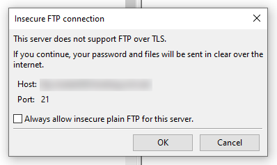

> [!primary]
> Esta traducción ha sido generada de forma automática por nuestro partner SYSTRAN. En algunos casos puede contener términos imprecisos, como en las etiquetas de los botones o los detalles técnicos. En caso de duda, le recomendamos que consulte la versión inglesa o francesa de la guía. Si quiere ayudarnos a mejorar esta traducción, por favor, utilice el botón «Contribuir» de esta página.
>

**Última actualización: 05/01/2022**

## Objetivo

El uso de software FTP durante la conexión a su [hosting Cloud](https://www.ovhcloud.com/es-es/web-hosting/) puede provocar diferentes anomalías. Esta guía explica cómo solucionar los problemas más comunes.

**Esta guía explica cómo solucionar los errores relacionados con el software FTP.**

> [!warning]
>
> La configuración, la gestión y la responsabilidad de los servicios que OVHcloud pone a su disposición recaen sobre usted. Por lo tanto, usted deberá asegurarse de que estos funcionen correctamente.
>
> Esta guía le ayudará a realizar las operaciones más habituales. No obstante, si tiene alguna duda le recomendamos que contacte con un proveedor de servicios especializado o con el editor del servicio. Nosotros no podremos asistirle al respecto. Para más información, consulte el apartado [Más información](#gofurther) de esta guía.
>

## Requisitos

- Tener contratado un plan de [hosting Cloud](https://www.ovhcloud.com/es-es/web-hosting/).
- Haber iniciado sesión en el [área de cliente de OVHcloud](hhttps://www.ovh.com/auth/?action=gotomanager&from=https://www.ovh.es/&ovhSubsidiary=es).

## Procedimiento

### "Este servidor no soporta FTP en TLS" (FileZilla)

{.thumbnail}

Este mensaje en el programa [FileZilla](https://docs.ovh.com/fr/hosting/mutualise-guide-utilisation-filezilla/) indica que no ha activado la opción SFTP o SSH desde el [área de cliente de OVHcloud](hhttps://www.ovh.com/auth/?action=gotomanager&from=https://www.ovh.es/&ovhSubsidiary=es). Por ese motivo, la información intercambiada entre el servidor de hosting de OVHcloud y su ordenador no se cifrará.

Si los datos que desea intercambiar por este medio no son confidenciales, haga clic en `Aceptar`{.action}.

En caso contrario, acceda al [área de cliente de OVHcloud](hhttps://www.ovh.com/auth/?action=gotomanager&from=https://www.ovh.es/&ovhSubsidiary=es), en la sección `Web Cloud`{.action} y, seguidamente, `Alojamientos`{.action}. Seleccione el alojamiento correspondiente y abra la pestaña `FTP-SSH`{.action}.

Haga clic en el botón `..`{.action} a la derecha del usuario FTP correspondiente y, seguidamente, en `Editar`{.action}. 
Seleccione SFTP o SSH (si dispone de un [hosting Profesional](https://www.ovh.com/fr/hebergement-web/hebergement-pro.xml) o [Performance](https://www.ovh.com/fr/hebergement-web/hebergement-performance.xml)), haga clic en `Siguiente`{.action} y luego en `Aceptar`{.action}.

> [!primary]
>
> Para más información sobre los errores, consulte la sección `Diagnóstico` de nuestras guías de [alojamiento web](../).
>

### He transferido mis archivos con un programa FTP, pero mi sitio web no aparece.

En primer lugar, compruebe que los archivos y carpetas del sitio web estén presentes en la [carpeta raíz](https://docs.ovh.com/fr/hosting/mettre-mon-site-en-ligne/#3-telecharger-les-fichiers-sur-lespace-de-stockage) del alojamiento.

Si ha realizado alguna modificación en sus [servidores o su zona DNS](https://docs.ovh.com/fr/domains/editer-ma-zone-dns/#comprendre-la-notion-de-dns) hace menos de 48 horas, espere y reinicie regularmente sus dispositivos para vaciar su caché.

### Mis claves FTP no funcionan.

Si no puede autenticarse, modifique su contraseña FTP siguiendo las instrucciones de esta [guía](https://docs.ovh.com/fr/hosting/modifier-mot-de-passe-utilisateur-ftp/).

### Encuentro errores aleatorios en mi sitio web.

La falta de espacio en su alojamiento compartido puede provocar fallos de funcionamiento en su sitio web al intentar modificarlo o actualizarlo.

Para comprobar el espacio de almacenamiento restante del alojamiento, conéctese al [área de cliente de OVHcloud](hhttps://www.ovh.com/auth/?action=gotomanager&from=https://www.ovh.es/&ovhSubsidiary=es). Haga clic en `Web Cloud`{.action} y, seguidamente, en `Alojamientos`{.action}. Seleccione el alojamiento correspondiente.

La cantidad de datos almacenados en el servidor de alojamiento (excluyendo las bases de datos) se muestra en la sección `Información general` > `del espacio en disco`.

{.thumbnail}

### No puedo transferir mis archivos al servidor FTP.

Compruebe que su programa FTP esté conectado en modo "Pasivo" (Modo de configuración de un servidor FTP en el que el servidor determina el puerto de conexión).

Por ejemplo, en [Filezilla](https://docs.ovh.com/fr/hosting/mutualise-guide-utilisation-filezilla/), haga clic en `Editar`{.action} ` `{.action} ` `{.action} ` `{.action} ` `{.action} y seleccione Pasivo (recomendado).

Limite también el tamaño de sus transferencias de datos (no podrá enviar más de **5.000 archivos y carpetas** a los servidores compartidos de OVHcloud en una sola transferencia). Realice sus importaciones varias veces si es necesario utilizando carpetas comprimidas.

Si dispone de una [fórmula Pro](https://www.ovhcloud.com/es-es/web-hosting/professional-offer/) o [Performance](https://www.ovhcloud.com/es-es/web-hosting/performance-offer/), utilice preferentemente el [protocolo SSH](https://docs.ovh.com/fr/hosting/mutualise-le-ssh-sur-les-hebergements-mutualises/) para importar los archivos en el espacio de almacenamiento de los archivos del alojamiento.

### No puedo eliminar el enlace simbólico "index.html" en mi espacio FTP.

Este enlace se instala por defecto en los alojamientos compartidos de OVHcloud. El cartel dice:

{.thumbnail}

Si no ha utilizado la funcionalidad "[Módulo en 1 clic](https://docs.ovh.com/fr/hosting/modules-en-1-clic/)" para crear su sitio web, deberá utilizar el programa [Net2FTP](https://docs.ovh.com/fr/hosting/connexion-espace-stockage-ftp-hebergement-web/#1-connexion-via-le-ftp-explorer) accesible desde el [área de cliente de OVHcloud](hhttps://www.ovh.com/auth/?action=gotomanager&from=https://www.ovh.es/&ovhSubsidiary=es) para eliminar manualmente la página "Sitio en construcción".

## Más información 

[Uso de FileZilla con el alojamiento](https://docs.ovh.com/fr/hosting/mutualise-guide-utilisation-filezilla/)

Para servicios especializados (posicionamiento, desarrollo, etc.), contacte con los [partners de OVHcloud](https://partner.ovhcloud.com/fr/).

Si quiere disfrutar de ayuda para utilizar y configurar sus soluciones de OVHcloud, consulte nuestros distintos [servicios de soporte](https://www.ovhcloud.com/fr/support-levels/).

Interactúe con nuestra comunidad de usuarios en <https://community.ovh.com/>.
