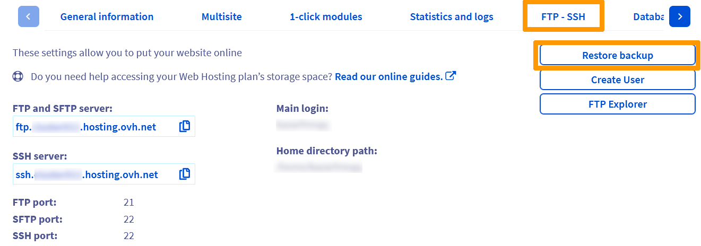
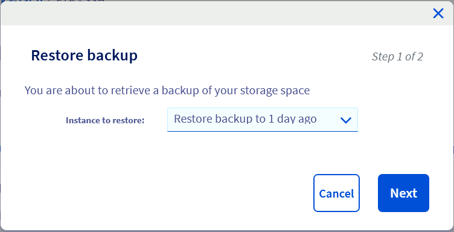

**Última actualización: 05/05/2020**

## Objetivo

Los planes de hosting de OVHcloud incluyen un espacio de almacenamiento en el que puede alojar sus sitios web. Existen diversos motivos por los que podría necesitar restaurar todos los datos de su espacio de almacenamiento o un archivo concreto, por ejemplo, si el sitio web ha dejado de estar accesible después de haber eliminado o modificado erróneamente algún archivo.

**Esta guía explica cómo restaurar un archivo o el espacio de almacenamiento de un alojamiento web.**

## Requisitos

- Tener contratado un [plan de hosting de OVH](https://www.ovhcloud.com/es/web-hosting/){.external} (salvo el hosting Cloud Web).
- Según el método utilizado, tener acceso a la gestión del plan de hosting desde el [área de cliente de OVHcloud](https://ca.ovh.com/auth/?action=gotomanager&from=https://www.ovh.com/world/&ovhSubsidiary=ws){.external} o disponer de la contraseña FTP necesaria para conectarse al espacio de almacenamiento. 

## Procedimiento

Antes de empezar, asegúrese de que las fechas de restauración posibles le permitirían restaurar el espacio de almacenamiento del alojamiento web al estado deseado. Estas fechas son las siguientes:

- el mismo día, a las 00:01;
- el día anterior, a las 00:01;
- dos días antes, a las 00:01;
- el domingo anterior, a la 01:00;
- el domingo de dos semanas antes, a la 01:00.

OVH no podrá ofrecerle una copia de seguridad más antigua. Si la necesita, deberá utilizar una copia de seguridad del sitio web que usted mismo haya realizado en el pasado. 

Asimismo, deberá decidir el método de restauración que quiera utilizar:

|Método de restauración|Descripción|
|---|---|
|Restauración desde el área de cliente|Restaura el contenido íntegro del espacio de almacenamiento. Todo el contenido actual será sustituido por el de la copia de seguridad seleccionada.|
|Restauración desde un programa o una interfaz web|Permite conectarse en modo de solo lectura a una copia de seguridad del espacio de almacenamiento. Este método, aunque es más técnico, permite restaurar uno o varios archivos a una fecha anterior sin tener que borrar todo el contenido actual del espacio de almacenamiento.|

Una vez que haya elegido el método de restauración más adecuado en función de sus necesidades, continúe la lectura de esta guía en el apartado correspondiente:

- [Restaurar el espacio de almacenamiento desde el área de cliente](./#restaurar-el-espacio-de-almacenamiento-desde-el-area-de-cliente){.external}
- [Restaurar un archivo desde un programa o una interfaz web](./#restaurar-un-archivo-desde-un-programa-o-una-interfaz-web){.external}

### Restaurar el espacio de almacenamiento desde el área de cliente

Conéctese al [área de cliente de OVHcloud](https://ca.ovh.com/auth/?action=gotomanager&from=https://www.ovh.com/world/&ovhSubsidiary=ws){.external}, haga clic en `Alojamientos`{.action} en la columna izquierda y seleccione el alojamiento correspondiente. Abra la pestaña `FTP - SSH`{.action} y haga clic en el botón `Restaurar una copia de seguridad`{.action}.

{.thumbnail}

Se abrirá una ventana en la que deberá seleccionar la fecha de restauración deseada en el menú desplegable.

|Fecha|Momento de la copia de seguridad|
|---|---|
|1 día antes|El mismo día, a las 00:01|
|2 días antes|El día anterior, a las 00:01|
|3 días antes|Dos días antes, a las 00:01|
|1 semana|El domingo anterior, a la 01:00|
|2 semanas|El domingo de dos semanas antes, a la 01:00|

Una vez seleccionada la fecha, haga clic en el botón `Siguiente`{.action}. 

{.thumbnail}

Asegúrese de que no se ha perdido ningún archivo en el proceso de restauración (por ejemplo, cualquier archivo que hubiera guardado en su espacio de almacenamiento después de la fecha de restauración seleccionada). Como ya hemos indicado, la restauración borrará todos los datos actuales para sustituirlos por los de la copia de seguridad.

Haga clic en `Aceptar`{.action} para restaurar la copia de seguridad.

### Restaurar un archivo desde un programa o una interfaz web

Esta operación se realiza en varios pasos. Asegúrese de tener la contraseña del usuario FTP para acceder a su espacio de almacenamiento. 

> [!warning]
>
> Para realizar las siguientes acciones, debe tener conocimientos sobre el programa o la interfaz web que vaya a utilizar. A continuación ofrecemos algunas indicaciones sobre cómo realizarlas. No obstante, si tiene alguna duda, le recomendamos que contacte con un proveedor de servicios especializado o con el editor del programa o la interfaz. Nosotros no podremos asistirle.
>

#### 1. Elegir el programa o la interfaz web que vaya a utilizar

En primer lugar, debe decidir qué programa o interfaz web va a utilizar para conectarse a la copia de seguridad de su espacio de almacenamiento. Si ya lo ha decidido, vaya al paso 2. En caso contrario, le recomendamos que utilice una de las siguientes soluciones:

- **FileZilla**: Puede descargar este programa desde la web oficial. Para más información, consulte nuestra [guía de uso de FileZilla](../web_hosting_guia_de_uso_de_filezilla/){.external}. Esta guía no sustituye a la documentación oficial del editor.

- **Cyberduck**: Puede descargar este programa desde la web oficial. Para más información, consulte nuestra [guía de uso de Cyberduck (Mac)](../web_hosting_guia_de_uso_de_cyberduck_mac/){.external}. Esta guía no sustituye a la documentación oficial del editor.

- **FTP Explorer**: Puede acceder desde el [área de cliente de OVHcloud](https://ca.ovh.com/auth/?action=gotomanager&from=https://www.ovh.com/world/&ovhSubsidiary=ws){.external}. Para ello, haga clic en `Alojamientos`{.action} en la columna izquierda y seleccione el alojamiento correspondiente. Abra la pestaña `FTP - SSH`{.action} y haga clic en el botón `Explorador FTP`{.action}.

{.thumbnail}

El explorador se abrirá en una nueva ventana. Introduzca sus claves de acceso y haga clic en `Iniciar`{.action} para conectarse.

#### 2. Conectarse a la copia de seguridad

Una vez en la interfaz web o el programa elegido, deberá conectarse a su espacio de almacenamiento para acceder a los datos de la copia de seguridad que quiera recuperar. Para realizar esta operación, necesitará el nombre de usuario FTP, la contraseña y el nombre de host del servidor FTP.

Puede consultar esta información en la pestaña `FTP - SSH`{.action} de su alojamiento. Si no tiene la contraseña FTP, siga las indicaciones de la guía [Cambiar la contraseña de un usuario FTP](../cambiar-contrasena-usuario-ftp/){.external}.

{.thumbnail}

Al conectarse, deberá añadir a su nombre de usuario FTP el sufijo correspondiente a la copia de seguridad que desee, como se indica en la siguiente tabla:

|Fecha de la copia de seguridad|Sufijo|Ejemplo de nombre de usuario completo|
|---|---|---|
|El mismo día, a las 00:01|-snap0|usuarioftp-**snap0**|
|El día anterior, a las 00:01|-snap1|usuarioftp-**snap1**|
|Dos días antes, a las 00:01|-snap2|usuarioftp-**snap2**|
|El domingo anterior, a la 01:00|-snap3|usuarioftp-**snap3**|
|El domingo de dos semanas antes, a la 01:00|-snap4|usuarioftp-**snap4**|

En la tabla anterior, no olvide sustituir el valor **usuarioftp** por su nombre de usuario FTP y añádale el sufijo correspondiente en función de la copia de seguridad a la que quiera acceder.

La forma de conectarse al espacio de almacenamiento varía en función de la interfaz web o el programa que utilice. La imagen de abajo muestra la pantalla de conexión de FTP Explorer.

{.thumbnail}

#### 3. Descargar los archivos

Una vez que se haya conectado, deberá descargar los archivos que quiera restaurar. Para ello, navegue por el contenido de su espacio de almacenamiento y descargue los archivos. La operación varía en función de la interfaz web o el programa que utilice.

Antes de continuar en el siguiente paso, asegúrese de haber descargado todos los archivos que quiera restaurar y desconéctese del espacio de almacenamiento.

#### 4. Restaurar los archivos 

Una vez que haya descargado los archivos, vuelva a conectarse al espacio de almacenamiento, pero esta vez sin añadir ningún sufijo al usuario FTP. Así se conectará al contenido actual del espacio de almacenamiento y no a una copia de seguridad anterior.

Una vez que se haya conectado, solo tiene que restaurar los archivos que desee. Para ello, navegue por el contenido del espacio de almacenamiento hasta localizar los archivos que quiera remplazar y sustitúyalos por los archivos descargados en el paso anterior.

## Más información

[Web hosting: guía de uso de FileZilla](../web_hosting_guia_de_uso_de_filezilla/){.external}

[Web hosting: Guía de uso de Cyberduck (Mac)](../web_hosting_guia_de_uso_de_cyberduck_mac/){.external}

Interactúe con nuestra comunidad de usuarios en [https://community.ovh.com/en/](https://community.ovh.com/en/){.external}.
