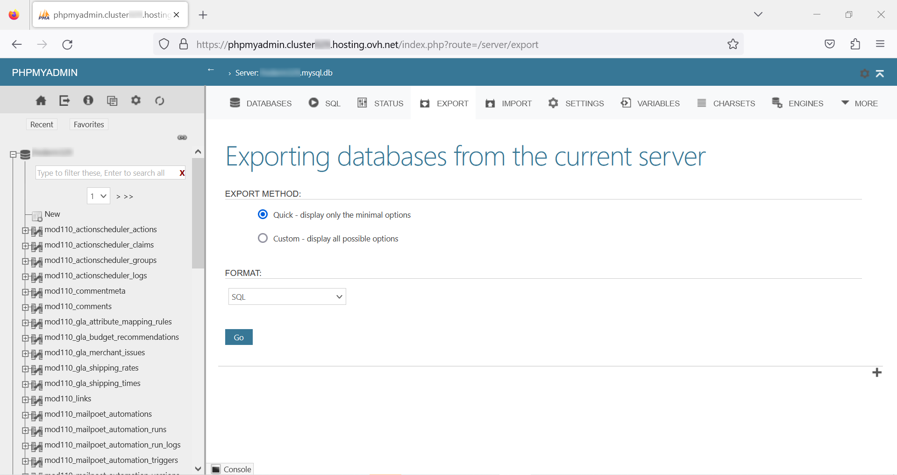
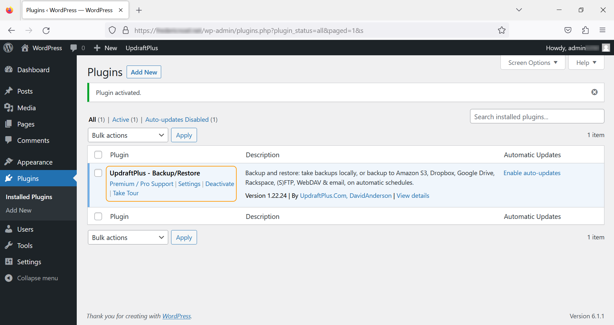
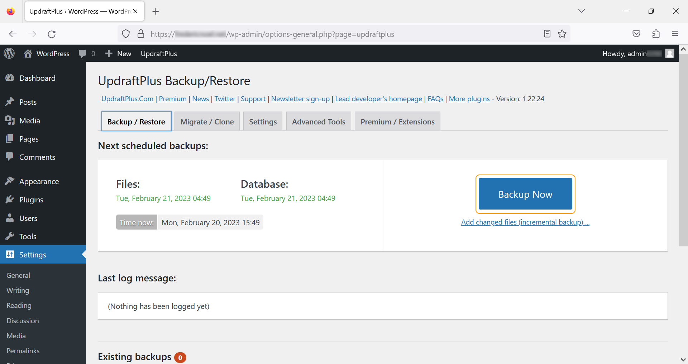

**Dernière mise à jour le 12/01/2023**

## Objectif

Même si vous prenez toutes les précautions, votre site web n'est jamais complètement à l'abri d'un dysfonctionnement ayant pour conséquence la perte partielle ou totale de vos données (erreur de manipulation, écrasement accidentel de fichiers, erreur d'inattention, mauvaise configuration, problème de sécurité ou piratage). Tout comme vos données personnelles, sauvegarder les informations de votre site web doit faire partie des habitudes à mettre en œuvre pour pouvoir revenir à un état antérieur lorsque vous rencontrez un dysfonctionnement.

Sur un hébergement web mutualisé, vous êtes responsable des sauvegardes de votre site web. OVHcloud propose des sauvegardes (non contractuelles) mais nous vous recommandons vivement de réaliser vous-même des sauvegardes régulières et de gérer vos propres supports de sauvegarde (disque dur, clé USB, _etc._) pour plus de précaution.

> [!warning]
>
> OVHcloud met à votre disposition des services dont la configuration, la gestion et la responsabilité vous incombent. Il vous revient de ce fait d'en assurer le bon fonctionnement.
> 
> Nous mettons à votre disposition ce guide afin de vous accompagner au mieux sur des tâches courantes. Néanmoins, nous vous recommandons de faire appel à un [prestataire spécialisé](https://partner.ovhcloud.com/fr/) ou [l'éditeur du CMS WordPress](https://wordpress.com/fr/support/){.external} si vous éprouvez des difficultés. En effet, nous ne serons pas en mesure de vous fournir une assistance. Plus d'informations dans la section [« Aller plus loin »](#go-further) de ce guide.
>

**Découvrez comment sauvegarder le contenu de votre site WordPress et sa base de données.**

## Prérequis

- Disposer d'un [hébergement web](https://www.ovhcloud.com/fr/web-hosting/) et avoir installé WordPress

## En pratique

Vous pouvez effectuer vos sauvegardes de deux façons : manuellement ou par le biais d'une extension.

OVHcloud fourni un service (non contractuel) de sauvegarde automatique des données ainsi que la mise à disposition de ces sauvegardes. Il est toutefois de votre responsabilité de mettre en place votre propre politique de restauration et de déterminer des points de restaurations aux moments que vous jugez opportuns.

### Méthode 1 - réaliser une sauvegarde manuelle

La sauvegarde manuelle doit se faire en deux étapes. Vous devez d'une part sauvegarder les fichiers PHP de votre site web et, d'autre part, exporter votre base de données.

#### 1.1 - Sauvegarder les fichiers de votre site web

La récupération se fait via un client FTP comme FileZilla, vous trouverez un guide d'utilisation de ce logiciel à cette adresse : [https://docs.ovh.com/fr/hosting/mutualise-guide-utilisation-filezilla/](https://docs.ovh.com/fr/hosting/mutualise-guide-utilisation-filezilla/).

Lors que vous vous connecterez sur votre serveur en FTP, vous devrez récupérer (en effectuant un cliquer/glisser) le contenu du répertoire `/www` que vous verrez sur l'écran de droite. Ce répertoire contient la totalité des fichiers et répertoires de votre site WordPress (configuration, thèmes, médias, _etc._).

Cliquez sur le répertoire "www" et glissez-le sur le répertoire de votre choix dans la fenêtre de gauche. Le transfert des fichiers commencera automatiquement.

En cas de problème sur votre site web, il faudra réaliser l'opération inverse en précisant que l'on souhaite écraser les fichiers de destination.

#### 1.2 - Exporter votre base de données

Pour exporter votre base de données, rendez-vous sur l'interface _PHPMyAdmin_ dont l'URL vous a été communiquée lors de la souscription de votre offre d'hébergement web.

Si besoin, consultez notre guide sur [l'export d'une base de données](https://docs.ovh.com/fr/hosting/exportation-bases-donnees/).

Cliquez maintenant sur "Exporter" en haut de la page :

Laissez les choix proposés par défaut : méthode d'exportation rapide et format SQL. Cliquez sur "Exécuter", vous téléchargerez alors votre base de données complète au format SQL _(Structured Query Language)_.

### Méthode 2 - réaliser une sauvegarde avec une extension

Il existe de nombreuses extensions WordPress pour gérer vos sauvegardes. La plus populaire est [UdraftPlus](https://wordpress.org/plugins/updraftplus/){.external} qui compte plusieurs millions d'installations actives. La version *gratuite* est suffisante pour sauvegarder votre site web. La version *premium* offre plus d'options telles les sauvegardes incrémentales, un outil de migration, la sauvegarde multisites, plus de choix dans les clouds sur lesquels stocker les données, _etc._

Téléchargez l'extension au format `.zip` sur votre ordinateur. Pour des raisons de lisibilité, le fichier téléchargé de l'extension sera renommé _updraftplus.zip_ dans les explications qui suivent.

#### 2.1 - Se connecter à son interface d'administration pour installer l'extension

Par défaut, il s'agit de votre nom de domaine suivi de `/wp-admin` :

Sur la page d'accueil, rendez-vuos dans la section "Extensions", puis cliquez sur "Ajouter" :

Téléversez l'extension en cliquant sur le bouton "Parcourir&hellip;" :

Cliquez sur "Installer maintenant" :

Si l'installation s'est déroulé correctement, vous serez invité à activer l'extension en cliquant sur le bouton prévu à cet effet :

Votre extension activée apparaît alors dans la liste des extensions :

#### 2.2 - Configurer ses sauvegardes

Sur la page mentionnée ci-dessus, cliquez sur "Réglages" puis, sur la page _UpdraftPlus Backup/Restore_, cliquez sur l'onglet "Réglages" :

Ci-après, nous allons définir la sauvegarde quotidienne de vos fichiers et de votre base de données :

Choisissez la sauvegarde par e-mail. L'adresse e-mail sur laquelle seront envoyées les sauvegardes est l'adresse du compte administrateur (le compte que vous utilisez) :

Validez en bas de la page en cliquant sur "Enregistrer les modifications".

#### 2.3 - Effectuer votre première sauvegarde

Revenez sur l'onglet "Sauvegarder/restaurer" et cliquez sur le bouton "Sauvegarder" :

Sur la fenêtre modale qui s'affiche, cliquez à nouveau sur "Sauvegarder" :

Vos sauvegardes sont alors réalisées, vous recevrez deux mails : l'un avec le contenu de votre Wordpress, l'autre avec la base de données de votre site web.
Si vos mails n'arrivent pas, vérifiez l'adresse e-mail du compte que vous utilisez (dans la section "Comptes") puis regardez si les e-mails ne sont pas arrivés dans vos SPAMs.

### À quelle fréquence effectuer des sauvegardes ?

La fréquence de vos sauvegardes est déterminée en premier lieu par la fréquence à laquelle vous allez modifier votre contenu. Une sauvegarde quotidienne est utile si vous publiez tous les jours du contenu sur votre site web. Adaptez donc la fréquence en fonction de celle de vos publications. Vous pouvez également faire la mise à jour manuellement (c'est l'option qui est proposée par défaut).

Vous pouvez également faire une sauvegarde dès que vous installez ou modifiez un thème ou une extension.

### Ce qu'il faut retenir

- Les sauvegardes régulières sont des bonnes pratiques à mettre en place pour tout vos sites web
- Veillez à ce que vos sauvegardes soient elles-mêmes sécurisées
- Réalisez-les avant d'effectuer une mise à jour et vérifiez après celle-ci que tout fonctionne correctement sur votre site web. 

Vous aurez ainsi toujours la possibilité de revenir à la version antérieure.

## Aller plus loin 

- [Site officiel WordPress](https://wordpress.org){.external}
- [Plus d'informations sur les sauvegardes de votre hébergement web](https://docs.ovh.com/fr/hosting/specificites-techniques-hebergements-mutualises/#informations-sur-les-sauvegardes-automatiques)
