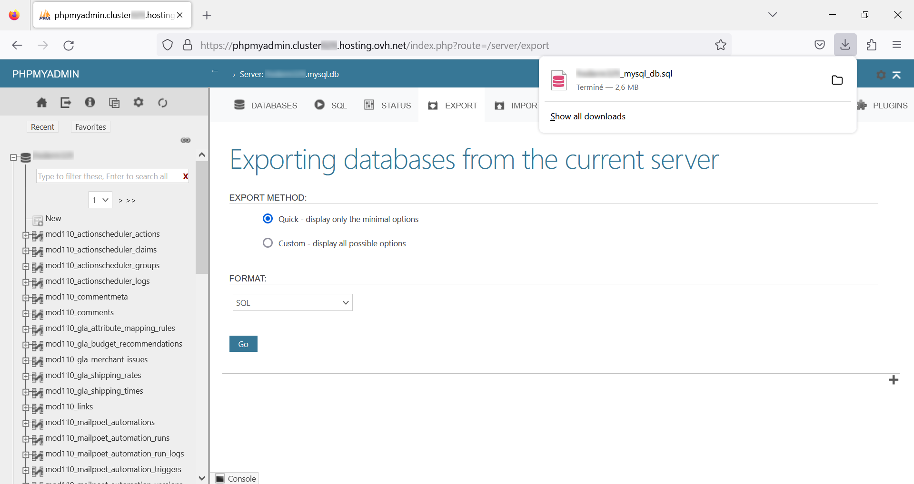
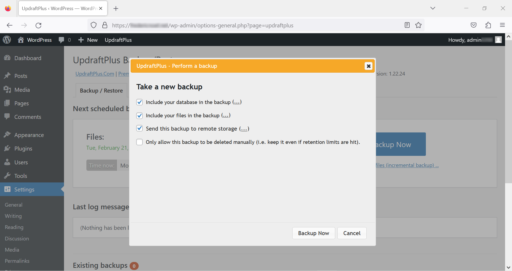

**Dernière mise à jour le 15/11/2022**

## Objectif

Malgré toutes les précautions qui peuvent être prise, votre site n'est jamais complètement à l'abri d'un dysfonctionnement pouvant avoir pour conséquence la perte partielle ou totale de vos données : erreur de manipulation (écrasement accidentel de fichiers, erreur d'inattention), mauvaise configuration, problème de sécurité ou piratage. Tout comme vos données personnelles, sauvegarder les informations de votre site doivent faire partie des habitudes à mettre en œuvre pour pouvoir revenir à un état antérieur en cas de (gros) problème.

À la différence des usages que vous pouvez avoir sur votre ordinateur ou votre smartphone, via un cloud, vous devez gérer vous-même vos sauvegardes sur votre site. Vous devrez donc gérez vos supports de sauvegarde (disque dur, clé USB, _etc._).

## Prérequis

Vous devez disposer d'un [hébergement web](https://www.ovhcloud.com/fr/web-hosting/) et avoir installé WordPress.

## En pratique

Vous pouvez effectuer vos sauvegardes de deux façons : manuellement ou par le biais d'une extension.

OVHcloud s’engage à fournir un service de sauvegarde automatique des données ainsi que la mise à disposition de ces sauvegardes. Il est toutefois de votre responsabilité de mettre en place votre propre politique de restauration, et de déterminer des points de restaurations aux moments que vous jugez opportuns.

### 1re méthode : la sauvegarde manuelle

La sauvegarde manuelle doit se faire en deux étapes. Vous devez d'une part sauvegarder les fichiers PHP de votre site et, d'autre part, exporter votre base de données.

#### Sauvegarder les fichiers de votre site

La récupération se fait via un client FTP comme FileZilla, vous trouverez un guide d'utilisation de ce logiciel à cette adresse : [https://docs.ovh.com/fr/hosting/mutualise-guide-utilisation-filezilla/](https://docs.ovh.com/fr/hosting/mutualise-guide-utilisation-filezilla/).

Lors que vous vous connecterez sur votre serveur en FTP, vous devrez récupérer (avec un simple cliquer/glisser) le contenu du répertoire `/www` que vous verrez sur l'écran de droite. Ce répertoire contient la totalité des fichiers et répertoires de votre site WordPress (configuration, thèmes, médias, _etc._).

Vous pouvez cliquer sur le répertoire "www" et le glisser sur le répertoire de votre choix dans la fenêtre de gauche. Le transfert des fichiers commencera automatiquement.

En cas de problème sur votre site, il faudra faire l'opération inverse en précisant que l'on souhaite écraser les fichiers de destination.

#### Exporter votre base de données

Pour exporter votre base de données, vous devez vous rendre sur l'interface _PHPMyAdmin_ dont l'URL vous a été communiquée lors de la souscription de votre offre.

Cliquez maintenant sur "Exporter" en haut de la page :

Laisser les choix proposés par défaut : méthode d'exportation rapide et format SQL. Cliquez sur "Exécuter", vous téléchargerez alors votre base de données complète au format SQL _(Structured Query Language)_.

### 2e méthode : utiliser une extension

Il existe de nombreuses extensions WordPress pour gérer plus facilement vos sauvegardes. La plus populaire est [UdraftPlus](https://wordpress.org/plugins/updraftplus/) qui compte plusieurs millions d'installations actives. Parfaitement fonctionnelle dans sa version gratuite pour sauvegarder votre site, la version premium offre plus d'options telles les sauvegardes incrémentales, un outil de migration, la sauvegarde multisites, plus de choix dans les clouds sur lesquels stocker les données, _etc._

Téléchargez l'extension au format `.zip` sur votre ordinateur. Pour des raisons de lisibilité, le fichier de l'extension téléchargé sera renommé _updraftplus.zip_ dans les explications qui suivent.

#### Se connecter à son interface d'administration pour installer l'extension

Par défaut, il s'agit de votre nom de domaine suivi de `/wp-admin` :

Sur la page d'accueil, aller sur "Extensions", puis "Ajouter" :

Téléversez l'extension en cliquant sur le bouton "Parcourir&hellip;" :

Puis sur "Installer maintenant" :

Si l'installation s'est déroulé comme prévu, vous serez invité à activer l'extension en cliquant sur le bouton prévu à cet effet :

Votre extension activée apparaît alors dans la liste des extensions :

#### Configurer ses sauvegardes

Sur la page mentionnée ci-dessus, cliquez sur "Réglages". Puis, sur la page _UpdraftPlus Backup/Restore_, cliquez sur l'onglet "Réglages" :

Nous allons définir des sauvegardes des fichiers et de la base de données quotidiennement :

Choisissez la sauvegarde par mail. L'adresse mail sur laquelle seront envoyées les sauvegardes est l'adresse du compte administrateur (le compte que vous utilisez) :

Enfin, validez en bas de la page en cliquant sur "Enregistrer les modifications".

#### Effectuer votre première sauvegarde

Revenez sur l'onglet "Sauvegarder/restaurer" et cliquez sur le bouton "Sauvegarder" :

Sur la fenêtre modale qui s'affiche, cliquez à nouveau sur "Sauvegarder" :

Vos sauvegardes sont alors réalisées, vous recevrez deux mails : un pour le contenu, un pour la base de données.
Si vos mails n'arrivent pas, pensez à vérifier l'adresse mail du compte que vous utilisez (dans "Comptes) et regardez si les mails ne sont pas arrivés dans vos spams.

### À quelle fréquence faire des sauvegardes ?

La fréquence de vos sauvegardes sera déterminée en premier lieu par la fréquence à la quelle vous allez modifier votre contenu. Une sauvegarde quotidienne a du sens si vous publiez tous les jours du contenu sur votre site. Adaptez donc cette fréquence en fonction de celle de vos publications. Vous pouvez également faire la mise à jour manuellement (c'est l'option qui est proposée par défaut).

Vous pouvez également faire une sauvegarde dès que vous installez ou modifiez un thème ou une extension.

### Ce qu'il faut retenir

- Les sauvegardes régulières sont des bonnes pratiques à mettre en place pour chacun de vos sites
- Veillez à ce que vos sauvegardes soient elles-mêmes sécurisées
- Faites-les avant une mise à jour et vérifiez après celle-ci que tout fonctionne correctement sur votre site (vous aurez toujours la possibilité de revenir à la version antérieure).

## Aller plus loin

- [Plus d'informations sur les sauvegardes de votre hébergement web](https://docs.ovh.com/fr/hosting/specificites-techniques-hebergements-mutualises/#informations-sur-les-sauvegardes-automatiques)