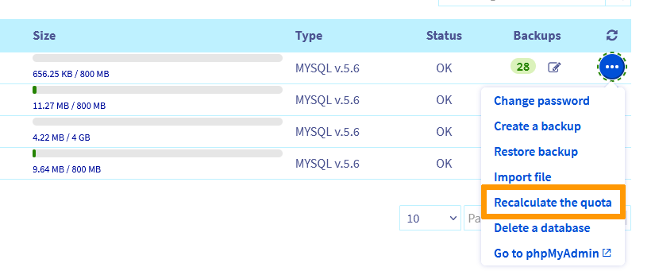
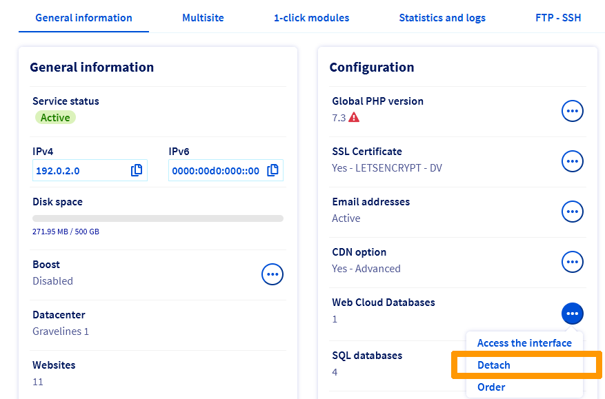

**Last updated 22nd June 2022**

## Objective

In your [OVHcloud Control Panel](https://www.ovh.com/auth/?action=gotomanager&from=https://www.ovh.co.uk/&ovhSubsidiary=GB), you can increase the capacity of your [web hosting offers](https://www.ovhcloud.com/en-gb/web-hosting/) to have more compute resources, storage space, databases or email addresses. Additional features such as [mailing lists](https://docs.ovh.com/gb/en/emails/guide-dutilisation-mailing-list/) (from the [Personal plan](https://www.ovhcloud.com/en-gb/web-hosting/personal-offer/)) or [Private SQL](https://www.ovhcloud.com/en-gb/web-hosting/options/private-sql/) (included with the offers of the [Performance range](https://www.ovhcloud.com/en-gb/web-hosting/performance-offer/)) will also become available with a subscription upgrade.

**Find out how to scale your OVHcloud hosting plan without any service interruptions.**

## Requirements

- An [OVHcloud web hosting plan](https://www.ovhcloud.com/en-gb/web-hosting/)
- Access to the [OVHcloud Control Panel](https://www.ovh.com/auth/?action=gotomanager&from=https://www.ovh.co.uk/&ovhSubsidiary=GB)

## Instructions

> [!success]
> 
> **Need to temporarily boost your hosting?**
>
> With the option [BOOST](https://www.ovhcloud.com/en-gb/web-hosting/options/boost/), available on our *Performance* offers, you can temporarily increase your web hosting plan’s resources to absorb seasonal traffic spikes. If this increase in traffic becomes permanent, you can also upgrade to a higher solution, so you permanently have more resources.
>

### Important - Billing in case of subscription change

When you change your current plan, a "time transfer" applies your new plan. This extension corresponds to the remaining subscription duration on your current solution.

**Example:** 
You are switching from a [Personal](https://www.ovhcloud.com/en-gb/web-hosting/personal-offer/) offer to a [Professional](https://www.ovhcloud.com/en-gb/web-hosting/professional-offer/) offer, but your current subscription has not ended. 
As a result, the remaining duration will be automatically **added** to your new **Pro** subscription on a pro rata basis. 
The service will therefore last **a little more than a year**, until its next renewal.

### Modifying your hosting plan 

> [!primary]
>
> You can only change your subscription to a plan that delivers fewer resources if the plan is the **next lowest**.
> For example, you cannot switch from a *Performance 2* hosting to a *Pro* hosting in a single operation.
> You will **first** need to downgrade your web hosting plan from the *Performance 2* plan to the *Performance 1* plan, **then** to the *Professional plan*.
>
> The following steps concern paid offers. To upgrade a [free Start10M hosting](https://docs.ovh.com/gb/en/hosting/activate-start10m/) solution, follow [these instructions](#start10m).
>

> [!warning]
>
> **Before** you change your subscription to a lower plan, make sure that the use you make of your current plan is compatible with the features of your [next plan](https://www.ovhcloud.com/en-gb/web-hosting/).
>
> To do this, follow [these instructions](#checks), upgrade your solution, and repeat these steps as required.
>

To change your subscription, go to your [OVHcloud Control Panel](https://www.ovh.com/auth/?action=gotomanager&from=https://www.ovh.co.uk/&ovhSubsidiary=GB) in the `Web Cloud`{.action} section. Click `Hosting plans`{.action} and select the plan concerned.

In the `Plan` box, click the `...`{.action} button to the right of `Solution`, then `Change plan`{.action}.

{.thumbnail}

Then select your new subscription and its duration. Confirm the corresponding contracts, then click `Send`{.action}.

> [!primary]
>
> **Special case**
>
> If you wish to upgrade your [Start10M plan](https://docs.ovh.com/en-gb/hosting/activer-start10m/), only the [Personal plan](https://www.ovhcloud.com/en-gb/web-hosting/personal-offer/) will be available. However, once you have switched to the Personal hosting plan, you can migrate it to all of our [web hosting plans](https://www.ovhcloud.com/en-gb/web-hosting/).

### Checking that your hosting plan is compatible with a lower plan 

#### Number of sites

With the [Kimsufi Web](https://www.ovhcloud.com/en-gb/web-hosting/old-web-hosting-offers/) solution, you cannot have more than one domain name on your hosting plan’s [multisite](https://docs.ovh.com/gb/en/hosting/multisites-configuring-multiple-websites/).

Before you switch from the [Personal](https://www.ovhcloud.com/en-gb/web-hosting/personal-offer/) solution to the [Kimsufi Web](https://www.ovhcloud.com/en-gb/web-hosting/old-web-hosting-offers/) solution, please check that your web hosting plan only has one website.

#### Start SQL databases

Before moving your hosting plan to a lower plan, please ensure that the new plan has enough [databases](https://www.ovhcloud.com/en-gb/web-hosting/options/start-sql/). Also make sure they are of sufficient size.

Otherwise, delete unused databases and reduce the amount of data they contain, if necessary. This quantity must not exceed the maximum size of the databases in the new solution (for any requests for assistance with the operations to be carried out, contact the [OVHcloud partners](https://partner.ovhcloud.com/en-gb/directory/)).

If you have deleted data from your databases, you can recalculate the quota used from the `Databases`{.action} tab in the `Hosting`{.action} section of the OVHcloud Control Panel. Click on the `...`{.action} button to the right of the database concerned, then `Recalculate the quota`{.action}.

{.thumbnail}

#### CloudDB

If you are using the [CloudDB](https://docs.ovh.com/gb/en/hosting/getting-started-with-clouddb/#clouddb-server-activation-included-with-your-web-hosting-plan) solution included with your [Performance](https://www.ovhcloud.com/en-gb/web-hosting/performance-offer/) hosting plan, and you wish to switch your hosting plan to a [Pro](https://www.ovhcloud.com/en-gb/web-hosting/professional-offer/) solution, go to the `Hosting plans`{.action} section in your Control Panel. 
Click the `... `{.action} button in the `Private database`{.action} section, then `Detach`{.action}.

{.thumbnail}

With this action, you can order a CloudDB solution independent of your *Performance* subscription. Your server data will be stored.

If you do not want to keep this data, you can also delete your Private SQL before going to the *Pro* offer: 

1. Back up your data by following the instructions in this [guide](https://docs.ovh.com/gb/en/hosting/backup-export-database-server/). 
2. Delete your CloudDB server via your [OVHcloud Control Panel](https://www.ovh.com/auth/?action=gotomanager&from=https://www.ovh.co.uk/&ovhSubsidiary=GB). To do this, click on your name in the top right-hand corner, then `Service management`{.action}. Then click on the `...`{.action} button to the right of the row concerned, then `Delete my Private SQL hosting service`{.action}.

#### FTP space

Before switching your hosting plan to a lower plan, please ensure that the new plan includes enough [FTP storage space](https://docs.ovh.com/gb/en/hosting/log-in-to-storage-ftp-web-hosting/) so that you can import files from your current hosting plan.

The quota used on your FTP hosting plan is visible in the `Hosting plans`{.action} section of the OVHcloud Control Panel. Click on the `General information`{.action} tab, and you will see the quota under `Disk space`.

{.thumbnail}

#### Email accounts

Please also check that your new solution has a sufficient number of available email accounts. Otherwise, delete the extra accounts, after you have [backed up](https://docs.ovh.com/gb/en/emails/migrate-email-addresses-manually/) the contents if necessary.

If you would like to keep the same number of email accounts, before moving your web hosting to a lower plan, you can also order a new **MX Plan** email solution. In the `Emails`{.action} section of the OVHcloud Control Panel, click on the solution concerned, then on the `...`{.action} button to the right of the `solution`. Next, click `Change solution`{.action}.

{.thumbnail}

#### Mailing lists

The [Mailing lists](https://docs.ovh.com/gb/en/emails/guide-dutilisation-mailing-list/) feature is optional on [Personal](https://www.ovhcloud.com/en-gb/web-hosting/personal-offer/) and [Kimsufi Web](https://www.ovhcloud.com/en-gb/web-hosting/old-web-hosting-offers/) hosting plans.

To set up your hosting plan on a [Personal](https://www.ovhcloud.com/en-gb/web-hosting/personal-offer/) solution, you will need to delete the mailing lists first, or order an email solution with this feature (**MX Plan 100** or **MX Plan Full**) from your [OVHcloud Control Panel](https://www.ovh.com/auth/?action=gotomanager&from=https://www.ovh.co.uk/&ovhSubsidiary=GB).

In the `Emails`{.action} section of your Control Panel, select the solution concerned, then click on `...`{.action} to the right of `Solution`{.action}. Next, click `Change solution`{.action}.

## Go further 

[Accessing a website’s logs and statistics on a web hosting](https://docs.ovh.com/gb/en/hosting/shared_view_my_websites_logs_and_statistics/)

[Optimising your website’s performance](https://docs.ovh.com/gb/en/hosting/web_hosting_optimise_your_website_performance/)

For specialised services (SEO, development, etc.), contact [OVHcloud partners](https://partner.ovhcloud.com/en-gb/directory/).

If you would like assistance using and configuring your OVHcloud solutions, please refer to our [support offers](https://www.ovhcloud.com/en-gb/support-levels/).

Join our community of users on <https://community.ovh.com/en/>.
