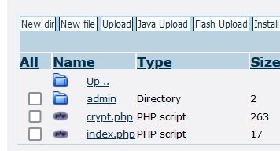

**Last updated 20th September 2021**

## Objective

You may need to protect access to part of your website with login credentials. You can set up a ".htaccess" file to protect access to its administration interface.

**Find out how to protect the access to the admin section of your website with a .htaccess file.**

> [!warning]
>
> OVHcloud provides services which you are responsible for with regard to their configuration and management. You are therefore responsible for ensuring they function correctly.
>
> We have provided you with this guide in order to help you with common tasks. Nevertheless, we recommend contacting a specialist provider and/or the service’s software publisher if you encounter any difficulties. We will not be able to assist you ourselves. You can find more information in the [Go further](#gofurther) section of this guide.
>

## Requirements

- a [web hosting plan](https://www.ovh.co.uk/web-hosting/)
- access to the [OVHcloud Control Panel](https://www.ovh.com/auth/?action=gotomanager&from=https://www.ovh.co.uk/&ovhSubsidiary=GB)
- the login details to log in to the [storage space on your Web Hosting plan](../log-in-to-storage-ftp-web-hosting/)

## Instructions

> [!primary]
>
> The solution proposed here is only one technical possibility among others to set up an administrator space on your website. You can also use the [1-click Module](../web_hosting_web_hosting_modules/) feature offered by [OVHcloud](https://www.ovhcloud.com/en-gb/).
>
> If you have any question regarding the creation or programming of your site, please contact our [community of users](https://community.ovh.com/en/) or [OVHcloud partners](https://partner.ovhcloud.com/en-gb/). We will not be able to assist you with these matters.
>

### Step 1: create the tree

Log in to your [hosting plan’s storage space](../log-in-to-storage-ftp-web-hosting/) and open your site's [root folder](../multisites-configuring-multiple-websites/#step-21-adding-an-ovhcloud-registered-domain).<br>
Create a file named "crypter.php".

{.thumbnail}

Open or create the folder that contains the admin section of your site. Create a ".htpasswd" file and a ".htaccess" file there.

{.thumbnail}

> [!primary]
>
> The ".htpasswd" and ".htaccess" files can be in different folders. Only one ".htpasswd" file can be used for several ".htaccess" files.
>
> The settings defined by a ".htaccess" file apply to the directory where it is installed and to all its subdirectories.
>

### Step 2: complete the file "crypter.php"

In the "crypter.php" file created earlier, enter the following lines (to be repeated depending on the number of passwords you need to generate):

```php
<?php
$string_1 = crypt('clear_password_1');
$string_2 = crypt('clear_password_2');
$string_3 = crypt('clear_password_3');
echo nl2br(`$string_1 \n $string_2 \n $string_3`);
 ?>
```

If you have a [Pro](https://www.ovh.co.uk/web-hosting/web-hosting-pro.xml) or [Performance](https://www.ovh.co.uk/web-hosting/performance-web-hosting.xml) hosting plan, log in to your hosting plan via [SSH](../web_hosting_ssh_on_web_hosting_packages/). Run the following command:

```bash
php crypt.php
```

> [!warning]
>
> For security reasons, using SSH in this case is recommended. However, if you have a [Kimsufi Web](https://www.kimsufi.com/uk/) or [Personal](https://www.ovh.co.uk/web-hosting/web-hosting-personal.xml) offer and you do not want to upgrade it to a [Pro](https://www.ovh.co.uk/web-hosting/web-hosting-pro.xml) or [Performance](https://www.ovh.co.uk/web-hosting/performance-web-hosting.xml) one, you can also run the "crypter.php" file with your web browser (by going to a URL like https://votre-domaine.ovh/crypter.php for example).
>
> For any additional questions on how to encrypt your passwords, please contact our [community of users](https://community.ovh.com/en/) or [OVHcloud partners](https://partner.ovhcloud.com/en-gb/). We will not be able to assist you with this matter.
>

Retrieve the encrypted passwords (Do not copy the "&#60;br />" if you run the "php crypter.php" command in SSH):

```bash
encrypted_password1
encrypted_password2
encrypted_password3
```

### Step 3: complete the ".htpasswd" file

The ".htpasswd" file contains the list of users authorised to log in to your website's administration interface and their encrypted password.

Enter a line in this file for **each user** indicating their username and encrypted password:

```bash
user1:encrypted_password1
user2:encrypted_password2
user3:encrypted_password3
```

### Step 4: complete the ".htaccess" file

#### Block access to a full directory

In the directory to be protected, create a ".htaccess" file with the following code:

```bash
AuthName `Please enter your admin username and password`
AuthType Basic
AuthUserFile `/home/your_login_ftp/root_folder/admin/.htpasswd`
Require valid-user
```

> [!warning]
>
> In this example, replace "your_login_ftp" with your [FTP username](../log-in-to-storage-ftp-web-hosting/#step-1-retrieve-your-login-information). In the `Hosting plans`{.action} section, you will find it in the `FTP-SSH`{.action} tab of the hosting plan concerned.
>
> In the example below, replace "root_folder" with the name of the [folder containing your site files](../multisites-configuring-multiple-websites/#step-21-adding-an-ovhcloud-registered-domain).
>

#### Block access to one or more files

To block access to one or more specific files, add a ["Files" directive](https://httpd.apache.org/docs/2.4/fr/mod/core.html#files){.external} to the ".htaccess":

```bash
<Files test.php>

AuthName `Enter your login details`
AuthType Basic
AuthUserFile `/home/your_login_ftp/root_folder/admin/.htpasswd`
Require valid-user

</Files>
```

> [!warning]
>
> You will need to specify a ["Files" directive](https://httpd.apache.org/docs/2.4/fr/mod/core.html#files){.external} for **each file** to be protected.
>
> The "Files" directives apply to all files with the same name or ending with the specified name, that are contained in the same directory as the ".htaccess" or in one of its subdirectories (In the configuration shown here, the "Files" directive would apply for example on a "new_test.php" file contained in a subdirectory of the "admin" folder).
>

## Go further <a name="gofurther"></a>

[All about the .htaccess file](../all_about_the_htaccess_file/)

For specialised services (SEO, development, etc.), contact [OVHcloud partners](https://partner.ovhcloud.com/en-gb/).

Join our community of users on <https://community.ovh.com/en/>.
