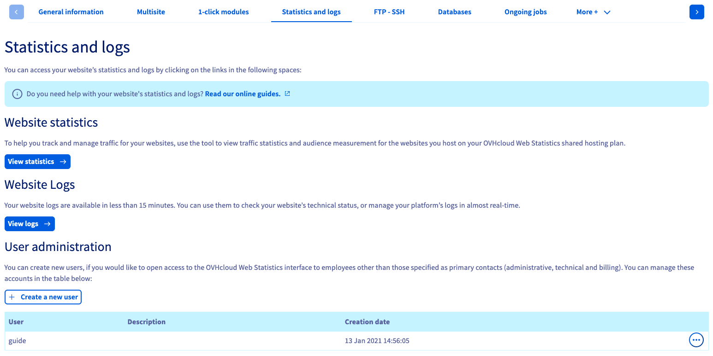

**Last updated 5th January 2021**

## Objective

Access to your website’s logs and statistics is included in your web hosting plan, which you can access from your OVHcloud Control Panel.

**Find out how to view your website’s statistics and logs.**

## Requirements

- an [OVHcloud Web Hosting plan](https://www.ovh.co.uk/web-hosting)
- access to the [OVHcloud Control Panel](https://www.ovh.com/auth/?action=gotomanager)

## Instructions

In the services bar on the left-hand side of your [OVHcloud Control Panel](https://www.ovh.com/auth/?action=gotomanager){.external}, Click on the `Web Cloud`{.action} tab, then `Hosting`{.action} in the left-hand column.

Select the web hosting plan concerned, then click on the `Statistics and logs tab`{.action}

{.thumbnail}

The window that opens will contain 3 sections. The first one presents the **statistics**, the second the raw **logs** of your hosting, the last one is dedicated to **the administration of users** authorised to access the statistics.

{.thumbnail}

### User administration

Creating a user will allow someone to access your hosting plan’s statistics without having access to your OVHcloud Control Panel. 

Click the `Create New User`{.action} button in the `User` Administration section and follow the instructions as below.  

{.thumbnail}

> [!warning] 
>
> If you have enabled separate logs on a [multisite entry](../multisites-configuring-multiple-websites/#step-2-add-a-domain-or-subdomain), users created here cannot access statistics for that multisite entry.
>

### Visit statistics

To help you better track and manage traffic for your websites, you can use the **OVHcloud Web Statistics** tool, which can be used to measure the traffic to and from your websites hosted on your shared hosting plan.

{.thumbnail}

The OVHcloud Web Statistics dashboard is divided into 6 sections in the left-hand pane.

- Dashboard: viewing traffic on your web hosting plan websites.
- Browsers: ranking of the internet browsers most used to view your websites.
- Geolocalisation:  proportion of visitors depending on their location.
- Requests: ranking of the most visited pages on your sites.
- Robots: viewing the robots that pass through your websites.
- Status: statistics of failures and successes based on the HTTP codes returned.
- FAQ: frequently asked questions section

The `Period selection` box in the top right-hand corner allows you to select a specific period.

### Logs

You can view your website’s raw logs with a delay of around 5 minutes.

{.thumbnail}

Different types of logs are available:

- Web logs: here you can find various logs for visiting your website, as well as the different actions taken from your website. You can use it to detect malicious action attempts.
- FTP logs: FTP connections will be recorded and stored in these logs.
- Error logs: errors generated by your website
- CGI logs: the different calls to cgi.bin scripts that have been made
- Logs out: your web hosting plan’s statistics on the various external calls it makes
- SSH logs: These logs indicate the different connections made with SSH protocol.
- CRON logs: the result of the execution of your scheduled tasks ([Automated tasks (CRON) on your hosting](../hosting_automated_taskscron/)).

### Hosting activities

In this section, you can view your hosting plan’s infrastructure activity, and view the resource usage.

Click the `General information`{.action}  tab, then scroll to the bottom of the page.

{.thumbnail}

You can display different types of graphics from the drop-down menu in the top left-hand corner:

- Outgoing connections: requests sent from your website to an external website.
- CPU usage: the level of processor consumption on your hosting instance.
- Exceeding the resource ceiling: indicates when your hosting exceeds its resource quota.
- SQL requests: quantity of requests to your hosting database.
- SQL response time: response time of requests sent to your hosting database.

## Go further

Join our community of users on <https://community.ovh.com>.
