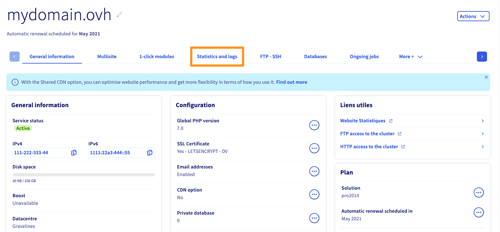

**Last updated 23rd September 2020**

## Objective

Web server logs and website statistics are included in your Web Hosting plan, easily accessible from your OVHcloud Control Panel.

**This guide provides an overview of the available logs and statistics.**

## Requirements

- an [OVHcloud Web Hosting plan](https://www.ovh.com/world/web-hosting/)
- access to the [OVHcloud Control Panel](https://ca.ovh.com/auth/?action=gotomanager&from=https://www.ovh.com/world/&ovhSubsidiary=we)

## Instructions

Log in to your [OVHcloud Control Panel](https://ca.ovh.com/auth/?action=gotomanager&from=https://www.ovh.com/world/&ovhSubsidiary=we) and select `Web Cloud`{.action} in the top navigation bar. Click `Hosting plans`{.action} in the services bar on the left-hand side, then choose the Web Hosting plan concerned.

Next, navigate to the `Statistics and logs`{.action} tab by selecting it in the `More +`{.action} submenu.

{.thumbnail}

In this tab, you can choose between two links: one to display the **website visit statistics** and the other to access the raw **logs** of your hosting.

|Web Hosting using the "Urchin 6" statistics|Web Hosting using the   "OVHcloud Web Statistics"|
|----------|:-------------:|
| {.thumbnail} | {.thumbnail} |

### Website visit statistics

#### OVHcloud Web Statistics

This tool helps you to track and control the traffic of websites hosted on your Web Hosting plan, by visually compiling statistics of page visits and audience measurement.

{.thumbnail}

The dashboard of OVHcloud Web Statistics is presented in 6 sections in the left panel.

- Dashboard: visualises the website traffic on your Web Hosting plan.
- Browsers: shows a ranking of the most used internet browsers to view your sites.
- Geolocalization: groups site visitors according to their location.
- Requests: displays the ranking of the most visited pages on your sites.
- Robots: visualises the automated attempts to connect to your sites.
- Status: displays statistics of the failures and successes encountered, based on the HTTP codes returned.
- FAQ: opens the section dedicated to frequently asked questions.

The `Period selection` box allows you to select a specific time frame.

#### Urchin v6 (legacy)

If access to the OVHcloud Web Statistics is not available on your hosting, you will have the legacy tool Urchin v6 instead.

{.thumbnail}

Urchin provides information about:

- the website traffic
- the number of visitors
- the number of pages viewed
- the weighting of the viewed pages
- the number of *http* requests
- the average connection times to your entire site or a particular page
- referrer URLs, to see where visitors come from
- the search engines used to find the site
- the keywords used in web searches leading to the site
- the most visited pages on the site

### Logs

You can view the raw logs of your site with a delay of about 5 minutes.

{.thumbnail}

Different types of logs are available:

- **web**: Here you can find the various logs of your site visits, as well as the outgoing actions from your site. For example, this allows you to detect malicious access attempts.
- **ftp**: The different FTP connections will be stored in these logs.
- **error**: These logs contain the errors generated by your site.
- **cgi**: These logs collect the various calls to the cgi.bin scripts that were made.
- **out**: These are the external calls of your hosting.
- **ssh**: These logs indicate the different connections made with the SSH protocol.
- **cron**: The results of executing your [scheduled tasks](../hosting_automated_taskscron) are logged here.

## Go further

Join our community of users on <https://community.ovh.com/en/>.
