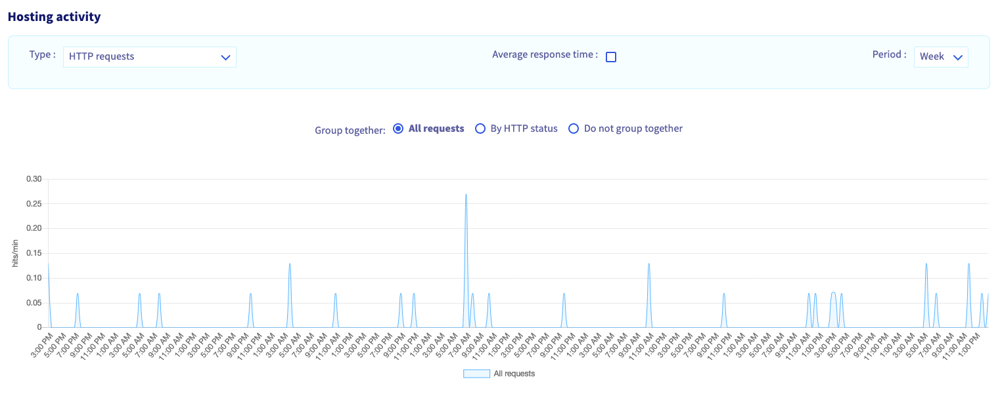

> [!primary]
> Tłumaczenie zostało wygenerowane automatycznie przez system naszego partnera SYSTRAN. W niektórych przypadkach mogą wystąpić nieprecyzyjne sformułowania, na przykład w tłumaczeniu nazw przycisków lub szczegółów technicznych. W przypadku jakichkolwiek wątpliwości zalecamy zapoznanie się z angielską/francuską wersją przewodnika. Jeśli chcesz przyczynić się do ulepszenia tłumaczenia, kliknij przycisk „Zaproponuj zmianę” na tej stronie.
> 

**Ostatnia aktualizacja z dnia 05-01-2021**

## Wprowadzenie

Dostęp do logów i statystyk Twojej strony WWW jest zawarty w ofercie hostingu WWW dostępnej w Panelu klienta OVHcloud.

**Dowiedz się, jak sprawdzić statystyki i logi Twojej strony WWW.**

## Wymagania początkowe

- Posiadanie kompatybilnego [hostingu](https://www.ovhcloud.com/pl/web-hosting/){.external}.
- Dostęp do [Panelu klienta OVHcloud](https://www.ovh.com/auth/?action=gotomanager&from=https://www.ovh.pl/&ovhSubsidiary=pl){.external}.

## W praktyce

Przejdź do Panelu [klienta OVHcloud](https://www.ovh.com/auth/?action=gotomanager&from=https://www.ovh.pl/&ovhSubsidiary=pl){.external}. Kliknij kartę `Web Cloud`{.action}, a następnie `Hosting`{.action}.

Wybierz odpowiedni hosting i kliknij zakładkę `Statystyki i logi`{.action}

{.thumbnail}

Okno, które się wyświetla składa się z 3 sekcji. Pierwsza zawiera **statystyki**, druga **logi** brutto Twojego hostingu. Ostatnia jest przeznaczona **do zarządzania użytkownikami** uprawnionymi do dostępu do statystyk.

{.thumbnail}

### Zarządzanie użytkownikami

Utworzenie użytkownika umożliwi osobie uzyskanie dostępu do statystyk hostingu bez dostępu do Panelu klienta OVHcloud. 

Kliknij przycisk `Utwórz nowego użytkownika`{.action} w sekcji `Administracja użytkownikami` i postępuj zgodnie z instrukcjami podanymi poniżej.  

{.thumbnail}

> [!warning] 
>
> Jeśli włączyłeś oddzielne logi w [pozycji MultiSite](../konfiguracja-multisite-na-hostingu/#etap-2-dodanie-domeny-lub-subdomeny), użytkownicy utworzeni tutaj nie mogą uzyskać dostępu do statystyk dla tego wpisu MultiSite.
>

### Statystyki odwiedzin

Aby lepiej monitorować ruch na Twoich stronach WWW i zarządzać nim, masz do dyspozycji narzędzie do statystyki odwiedzin i pomiaru odwiedzin Twoich stron WWW hostowanych na hostingu **OVHcloud Web Statistics**.

{.thumbnail}

Panel zarządzania OVHcloud Web Statistics dostępny jest w 6 sekcjach w panelu po lewej stronie.

- Dashboard: wizualizacja ruchu na stronach hostingu.
- Browsers: ranking najpopularniejszych przeglądarek internetowych do przeglądania stron internetowych.
- Geolokalizacja:  odsetek odwiedzających w zależności od ich lokalizacji.
- Zapytania: ranking najczęściej odwiedzanych stron na Twoich stronach.
- Roboty: wizualizacja robotów przechodzących przez twoje strony.
- Status: statystyki niepowodzeń i sukcesów napotkanych na podstawie zwracanych kodów HTTP.
- FAQ: sekcja poświęcona najczęstszym pytaniom

Ramka `Period selection` w prawym górnym rogu pozwala wybrać określony czas.

### Logi

Możesz wyświetlić logi brutto swojej strony z opóźnieniem wynoszącym około 5 minut.

{.thumbnail}

Dostępne są różne typy logów:

- Logi WWW: znajdziesz tutaj różne logi przeglądania Twojej strony WWW oraz operacje wykonywane na Twojej stronie. Dzięki temu możesz na przykład wykryć próby popełnienia złośliwego czynu.
- Logi FTP: Połączenia FTP będą rejestrowane i przechowywane w tych logach.
- Logi błąd: różne błędy generowane przez Twoją stronę.
- Logi CGI: przeprowadzone wywołania skryptów cgi.bin.
- Logi out: statystyki hostingu w zakresie wywołań zewnętrznych.
- Logi SSH: te logi przedstawiają różne połączenia zrealizowane za pomocą protokołu SSH.
- Logi CRON: wynik wykonywania zaplanowanych zadań ([Zadania zautomatyzowane (CRON) na Twoim hostingu](../hosting_www_automatyczne_zadania_cron/)).

### Obciążenie hostingu

W tej sekcji znajdziesz opis działalności związanej z infrastrukturą Twojego hostingu, aby sprawdzić zużycie dostępnych zasobów.

Kliknij kartę `Informacje ogólne`{.action}, a następnie przejdź na dół strony.

{.thumbnail}

Możesz wyświetlić różne rodzaje wykresów z menu rozwijanego w lewym górnym rogu:

- Połączenia wychodzące: zapytania wysyłane z Twojej strony WWW na zewnątrz.
- Wykorzystanie procesora: poziom zużycia procesora na instancji hostingowej.
- Przekroczenie pułapu zasobów: wskazuje chwile lub hosting przekracza jego limit zasobów.
- Zapytania SQL: ilość zapytań do baz danych Twojego hostingu.
- Czas odpowiedzi SQL: czas odpowiedzi zapytań wysyłanych do baz danych Twojego hostingu.

## Sprawdź również

Dołącz do społeczności naszych użytkowników na stronie <https://community.ovh.com/en/>.
