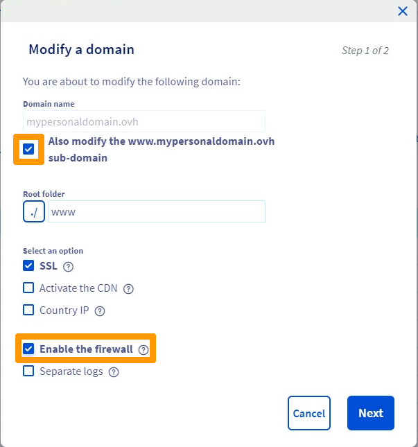

> [!primary]
> Diese Übersetzung wurde durch unseren Partner SYSTRAN automatisch erstellt. In manchen Fällen können ungenaue Formulierungen verwendet worden sein, z.B. bei der Beschriftung von Schaltflächen oder technischen Details. Bitte ziehen Sie beim geringsten Zweifel die englische oder französische Fassung der Anleitung zu Rate. Möchten Sie mithelfen, diese Übersetzung zu verbessern? Dann nutzen Sie dazu bitte den Button «Mitmachen» auf dieser Seite.
>

**Letzte Aktualisierung am 26. April 2021**

## Ziel

*ModSecurity* ist ein zusätzliches Apache-Modul, das alle auf Ihrem Webserver eingehenden Anfragen filtert. Sie erhöht die Sicherheit gegen bekannte Schwachstellen, indem sie Anfragen abfängt und filtert, bevor sie mit Skripten bearbeitet werden.

Die vorkonfigurierte Reihe von Grundregeln, der "Core Rule Set" (CRS) unserer *ModSecurity*, schützt Ihre Webseiten vor den häufigsten Angriffen, zum Beispiel:

- Trojans
- E-Mail Injection,
- Sicherheitslücken in PDF Dateien,
- Dateiinjection auf Ihrem Hosting,
- SQL oder XSS Injection,
- usw.

**In dieser Anleitung erfahren Sie, wie Sie die Application Firewall über Ihr OVHcloud Kundencenter aktivieren, um einen verbesserten Schutz zu erreichen.**

## Voraussetzungen

- Sie verfügen über ein OVHcloud [Webhosting Angebot](https://www.ovh.de/hosting/){.external}.
- Sie verfügen über mindestens einen mit dem [Hosting verbundenen Domainnamen](https://www.ovh.de/domains/){.external}.
- Sie sind in Ihrem [OVHcloud Kundencenter](https://www.ovh.com/auth/?action=gotomanager&from=https://www.ovh.de/&ovhSubsidiary=de){.external} angemeldet.

## In der praktischen Anwendung

Loggen Sie sich in Ihr [OVHcloud Kundencenter](https://www.ovh.com/auth/?action=gotomanager&from=https://www.ovh.de/&ovhSubsidiary=de) ein und wählen Sie `Web Cloud`{.action} aus. Klicken Sie links im Menü auf den Bereich `Hosting`{.action}-Pakete und dann auf das betreffende Hosting.

### Die Application Firewall in der PHP Konfiguration aktivieren

Klicken Sie auf den Tab `Allgemeine Informationen`{.action}. Die `aktuelle globale PHP` Version wird im Bereich **Konfiguration** angezeigt. Klicken Sie auf den Button `...`{.action} und wählen Sie `Konfiguration ändern`{.action}. Wählen Sie im angezeigten Fenster das Element `Aktuelle Konfiguration ändern`{.action} und klicken Sie auf Weiter `und`{.action}.

{.thumbnail}

Überprüfen Sie im neuen Fenster, dass die **Firewall-Anwendung** auf `Aktiviert`{.action} festgelegt ist. Um die Konfiguration zu bestätigen, klicken Sie auf den Button `Bestätigen`{.action}.

### Die Application Firewall für einzelne Domainnamen auf einer Multisite aktivieren

Klicken Sie auf den Tab `Multisite`{.action} Ihres Webhosting-Angebots. Klicken Sie auf den Button `...`{.action}. rechts neben der betreffenden Domain und wählen Sie die Option `Die Domain ändern`{.action}.

{.thumbnail}

Setzen Sie im Konfigurationsfenster einen Haken bei `Firewall aktivieren`{.action}. Sie können auch die `www`-Subdomain in diese Konfiguration aufnehmen, indem Sie oben ein Häkchen setzen.

Klicken Sie auf `Weiter`{.action} und dann auf `Bestätigen`{.action}, um die Multisite-Einstellungen zu ändern.

{.thumbnail}

### Aktivierungstask überprüfen

{.thumbnail}

Die Updates Ihrer Multisite-Konfiguration werden im Tab Laufende `Operationen aufgeführt`{.action} (der ursprüngliche Status ist "geplant"). Die Firewall wird aktiv, sobald ihr Update-Auftrag nicht mehr in der Liste angezeigt wird.

### Überprüfung der Domainnamen, für die die Firewall aktiviert ist

Der Tab `Multisite`{.action} Ihres Webhosting-Angebots enthält Informationen zu den Domainnamen, für die die Firewall-Option aktiviert ist.

{.thumbnail}

Die angezeigte Tabelle enthält alle Domains, die Ihrem Webhosting Angebot hinzugefügt wurden. In der Spalte "Firewall"wird der Aktivierungsstatus jeder Domain angezeigt.

## Weiterführende Informationen

Tauschen Sie sich mit unserer User Community aus <https://community.ovh.com/en/>.
