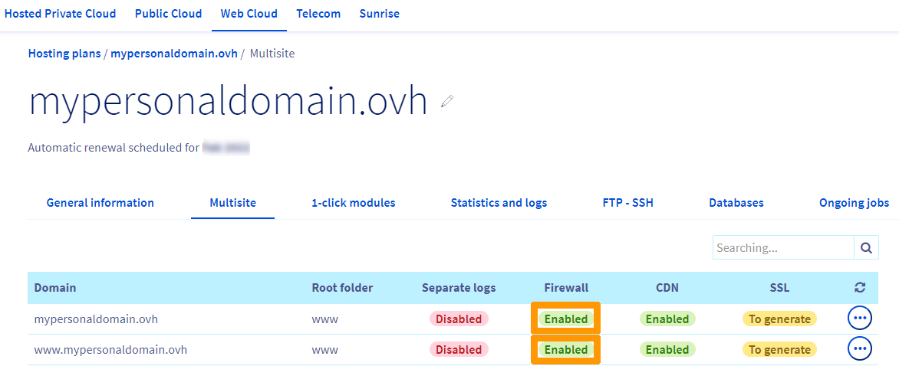

**Last updated 26th April 2021**

 ## Objective

*ModSecurity* is a complementary Apache module that filters all incoming requests on your web server. It increases security against known vulnerabilities by intercepting and filtering requests before they are processed by any scripts. 

The preconfigured Core Rule Set (CRS) of our *ModSecurity* protects your websites against the most common attacks, for example:

- Trojans
- Email injections
- Broken PDF files
- File injections on your hosting system
- SQL or XSS type injections

**This guide explains how to enable your application firewall for enhanced protection in your OVHcloud Control Panel.**

## Requirements

- an [OVHcloud Web Hosting plan](https://www.ovh.co.uk/web-hosting/){.external}
- at least one [domain name](https://www.ovh.co.uk/domains/){.external} attached to the hosting
- access to the [OVHcloud Control Panel](https://www.ovh.com/auth/?action=gotomanager&from=https://www.ovh.co.uk/&ovhSubsidiary=GB)

## Instructions

Log in to the [OVHcloud Control Panel](https://www.ovh.com/auth/?action=gotomanager&from=https://www.ovh.co.uk/&ovhSubsidiary=GB) and switch to `Web Cloud`{.action}. 
Click on `Hosting Plans`{.action} in the services bar on the left-hand side and select the plan concerned.

### Activating the application firewall in PHP configuration

Click on the `General information`{.action} tab. The current `Global PHP version` is displayed in the **Configuration** box.  Click on the `...`{.action} icon and select `Modify configuration`{.action}. In the popup window, select the item `Modify the current configuration`{.action} and click on the `Next`{.action} button.

{.thumbnail}

In the new window, make sure that **Application firewall** is set to `activated`{.action}. To confirm the configuration, click on the `Confirm`{.action} button.

### Activating the application firewall for individual domains in Multisite

Switch to the `Multisite`{.action} tab of your hosting plan. Click on the `...` {.action} button in the row of the respecive domain and select the `Modify domain`{.action} option. 

{.thumbnail}

In the configuration window, check the `Enable the firewall`{.action} box. You can also include the www subdomain in this configuration by checking the box at the top.
Click on `Next`{.action} and then on `Confirm`{.action} to modify the Multisite settings.

{.thumbnail}

### Checking the status of the activation task

{.thumbnail}

Tasks to update your Multisite configuration will be listed in the `Ongoing jobs`{.action} tab (initial status is `Planned`). The firewall will be active once its update task no longer appears in the list.

### Verifying which domains have the firewall enabled

The `Multisite`{.action} tab of your hosting plan provides information on which domains have the firewall option turned on.

{.thumbnail}

The table displayed contains all of the domain names that have been added to your Web Hosting plan. In the "Firewall" column, you will see the activation status for each domain. 

## Go further

Join our community of users on <https://community.ovh.com/en/>.