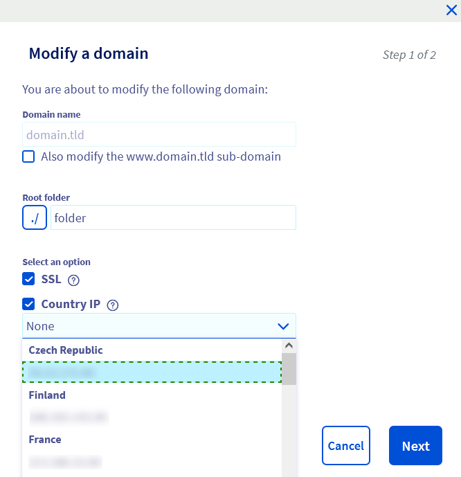

> [!primary]
> Diese Übersetzung wurde durch unseren Partner SYSTRAN automatisch erstellt. In manchen Fällen können ungenaue Formulierungen verwendet worden sein, z.B. bei der Beschriftung von Schaltflächen oder technischen Details. Bitte ziehen Sie beim geringsten Zweifel die englische oder französische Fassung der Anleitung zu Rate. Möchten Sie mithelfen, diese Übersetzung zu verbessern? Dann nutzen Sie dazu bitte den Button «Mitmachen» auf dieser Seite.
>

**Letzte Aktualisierung am 22.12.2022**
  
## Ziel

Suchmaschinen (Google, Bing, Yahoo, ...) verwenden Roboter zur Indexierung und Referenzierung auf allen Webseiten. Sie beziehen sich vorrangig auf geolokalisierte Seiten in dem Land, von dem aus Sie Ihre Suche durchführen.

**Beispiel**: Wenn Sie über eine Suchmaschine suchen und sich in England befinden, werden die geolokalisierten Websites in England in den Suchergebnissen höher angezeigt als andere Websites.

Diese Geolokalisierung basiert auf der IP-Adresse des Hostings, auf dem sich Ihre Website befindet.

Die Geolokalisierungsoption für Ihr Webhosting kann für die Referenzierung (SEO) nützlich sein, wenn Ihre Website hauptsächlich in einem anderen Land als dem Ihres Webhostings aufgerufen wird.

**Diese Anleitung erklärt, wie Sie Ihre Website mithilfe unserer geolokalisierten IP-Adressen geolokalisieren.**

## Voraussetzungen

- Sie haben Zugriff auf Ihr [OVHcloud Kundencenter](https://www.ovh.com/auth/?action=gotomanager&from=https://www.ovh.de/&ovhSubsidiary=de).
- Sie haben ein [OVHcloud Webhosting](https://www.ovhcloud.com/de/web-hosting/) in Ihrem Kunden-Account.
- Sie verfügen über einen [Domainnamen](https://www.ovhcloud.com/de/domains/).

## In der praktischen Anwendung

Für Webseiten, die hauptsächlich im Ausland abgerufen und auf unserer Shared Hosting Infrastruktur von OVHcloud gehostet werden, bieten wir eine Geolokalisierungsoption nach IP-Adresse an. Sie ermöglicht eine bessere Referenzierung der Websites in dem Land, in dem sich die mit der Option gewählte IP-Adresse befindet.

Um die IP-Geolokalisierungsoption zu verwenden, loggen Sie sich in Ihr [OVHcloud Kundencenter](https://www.ovh.com/auth/?action=gotomanager&from=https://www.ovh.de/&ovhSubsidiary=de){.external} ein.

Gehen Sie nach dem Login in den Bereich `Web Cloud`{.action}, klicken Sie auf `Hosting-Pakete`{.action} und wählen Sie das betreffende Hosting aus der Liste aus. 
Klicken Sie dann auf den Tab `Multisite`{.action} und anschließend auf den Button `...`{.action} rechts neben Ihrer Domain in der Tabelle. Klicken Sie ` Domain bearbeiten`{.action} ändern.

{.thumbnail}

Setzen Sie im neu geöffneten Fenster einen Haken im Feld `IP des Landes`{.action}, um das Drop-down-Menü anzugeben.

{.thumbnail}

Wählen Sie aus den 12 angebotenen Ländern die IP-Adresse des Landes aus, für das Sie Ihre Website geolokalisieren möchten: *Tschechische Republik, Finnland, Frankreich, Deutschland, Irland, Italien, Littuanie, Niederlande, Polen, Portugal, Spanien, Vereinigtes Königreich*.

Klicken Sie auf `Weiter`{.action} und dann auf im zusammenfassenden Fenster `Bestätigen`{.action}.

>[!primary]
>
> Wenn die aktive DNS-Zone Ihrer Domain vollständig in Ihrem [OVHcloud Kundencenter](https://www.ovh.com/auth/?action=gotomanager&from=https://www.ovh.de/&ovhSubsidiary=de) verwaltet wird, ändert sich automatisch der A-Eintrag in der DNS-Zone Ihrer Domain. Um zu überprüfen, ob die IP-Adresse korrekt aktualisiert wurde, lesen Sie unsere Anleitung zur [Bearbeitung der OVHcloud DNS-Zone](https://docs.ovh.com/de/domains/webhosting_bearbeiten_der_dns_zone/).
>
> Ist das nicht der Fall, müssen Sie die Änderung manuell beim Anbieter vornehmen, der die aktive DNS Zone Ihrer Domain verwaltet. [Hier](https://docs.ovh.com/de/hosting/verzeichnis-der-ip-adressen-web-hosting-cluster/) finden Sie die Dokumentation, in der alle IP-Adressen unserer Shared Hosting Infrastruktur von OVHcloud aufgeführt sind.
>
> In jedem Fall ist eine Propagationszeit von **4 bis 24 Stunden** nach der Änderung erforderlich, damit die Änderung im Internet voll wirksam und sichtbar ist.
>

## Weiterführende Informationen

Kontaktieren Sie für spezialisierte Dienstleistungen (SEO, Web-Entwicklung etc.) die [OVHcloud Partner](https://partner.ovhcloud.com/de/directory/).

Wenn Sie Hilfe bei der Nutzung und Konfiguration Ihrer OVHcloud Lösungen benötigen, beachten Sie unsere [Support-Angebote](https://www.ovhcloud.com/de/support-levels/).

Für den Austausch mit unserer User Community gehen Sie auf <https://community.ovh.com/en/>.