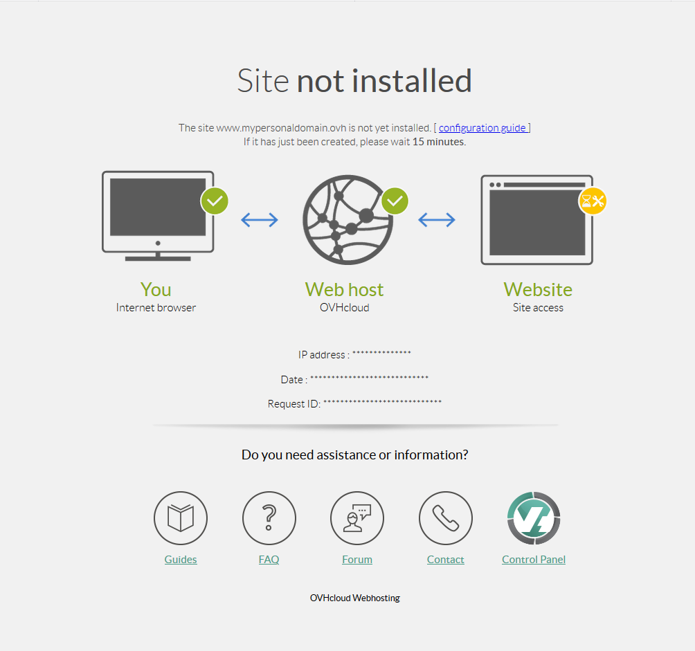

**Last updated 07/05/2021**

## Objective

You may see a **Site not installed** error page appear on your web browser, particularly when you first install your website.

{.thumbnail}

**Find out how to identify and resolve the “Website not installed” error page**

> [!warning]
> OVHcloud provides services which you are responsible for with regard to their configuration and management. You are therefore responsible for ensuring they function correctly.
>
> We have provided you with this guide in order to help you with common tasks. Nevertheless, we recommend contacting a specialist provider and/or the service’s software publisher if you encounter any difficulties. We will not be able to assist you ourselves. You can find more information in the [Go further](#gofurther) section of this guide.

## Requirements

- an [OVHcloud Web Hosting plan](https://www.ovh.co.uk/web-hosting)
- access to the [OVHcloud Control Panel](https://www.ovh.com/auth/?action=gotomanager&from=https://www.ovh.co.uk/&ovhSubsidiary=GB)
- access to the [DNS zone](../../domains/web_hosting_how_to_edit_my_dns_zone/) your domain name is attached to.

## Instructions

The **Website not installed** page appears in two situations:

1. Your domain is not present in the [multisite](../multisites-configuring-multiple-websites/#step-1-access-multisite-management) part of your hosting.

2. Your domain name is not linked to your hosting plan via its `DNS zone`{.action}.

The following steps will help you correct the `Website not installed` error in these two situations.

### Step 1: check the multisite section of your hosting plan

In the [OVHcloud](https://www.ovh.com/auth/?action=gotomanager&from=https://www.ovh.co.uk/&ovhSubsidiary=GB) Control Panel, click `Web cloud`{.action}, then `Hosting`{.action}.

Select the web hosting plan concerned in the list, then click on the `Multisite`{.action} tab.

|Scenario|What to do|
|---|---|
|Your website name will appears in the table.|If you just added your website name to the multisite section of your hosting plan, wait around twenty minutes then refresh your web browser’s cache. If the message \`Site not installed\` still appears, proceed to [step 2](#checkdomainlink).|
|The domain or subdomain linked to your website does not appear in the table.|Add your domain to the `multisite`{.action} by following the dedicated section of the guide [Hosting multiple websites on your domain - add a domain or subdomain](../multisites-configuring-multiple-websites/#step-21-adding-an-ovhcloud-registered-domain).|
|The domain name has been deleted from the multisite without any action on your part.|Your domain or its DNS zone may be managed from another account. Add your domain to the multisite by following the dedicated section of the guide on [Hosting multiple websites on your Web Hosting plan - multisites-configuring-multiple-websites/#step-22-adding-an-external-domain](../multisites-configuring-multiple-websites/#step-22-adding-an-external-domain) domain name.|

### Step 2: check your domain’s DNS zone 

> [!primary]
>
> This step involves checking that your domain name via its DNS `zone`{.action} is linked to your website’s hosting plan.
> To find out more about the concept of DNS, please refer to our guide on [Editing an OVHcloud](../../domains/editer-ma-zone-dns/#comprendre-la-notion-de-dns) DNS zone.

#### 2.1 Identify the IP address of your OVHcloud web hosting plan

To find the IP address, click `Hosting` in the left-hand column of the OVHcloud Control [Panel](https://www.ovh.com/auth/?action=gotomanager&from=https://www.ovh.com/fr/&ovhSubsidiary=fr), then select the plan concerned.

{.thumbnail}

#### 2.2 Check the IP address recorded in your domain’s DNS zone

You must now check that your hosting plan’s IP address appears in your domain’s active DNS zone.

To do this, go to the `Domains`{.action} section, select your domain, then go to the `DNS`{.action} zone tab.

|Possible outcomes|What to do|
|---|---|
|In the DNS zone, your domain is linked to your hosting plan’s IP address by an A record (for IPv4) or an AAAA record (for IPv6) {.thumbnail}|This means your domain name has been correctly configured.  Following the latest changes in your DNS, your website will be displayed within a maximum of 48 hours.  Also remember to restart your devices (PC, smartphone, box, etc.) and clear your browser’s cache.|
|Your DNS zone does not have an A or AAAA record linking your domain to your hosting plan’s IP address. Or the existing entry points to another IP address.|Add a new A or AAAA record, or correct the existing record by following [this guide](../../domains/editer-ma-zone-dns/).|
|Your domain does not appear in the `Domains`{.action} section of the OVHcloud Control Panel. Or your domain's DNS `Zone`{.action} tab will appear as follows: {.thumbnail}|This means that your domain is not managed from your OVHcloud Control Panel.  Determine your registrar using our > You can find and modify the relevant DNS zone accordingly, following this [guide](../multisites-configurer-un-multisite-sur-mon-hebergement-web/#etape-22-ajouter-un-nom-de-domaine-externe).|
|This warning appears in the `DNS`{.action} Zone tab: {.thumbnail}|You will need to modify your domain’s DNS servers accordingly, following [this guide](../../domains/generalites-serveurs-dns/).|

## Go further 

[Hosting multiple websites on your Web Hosting plan](../multisites-configurer-un-multisite-sur-mon-hebergement-web/)

[List of IP addresses for clusters and Web Hostings ](../liste-des-adresses-ip-des-clusters-et-hebergements-web/)

Join our community of users on <https://community.ovh.com>.
