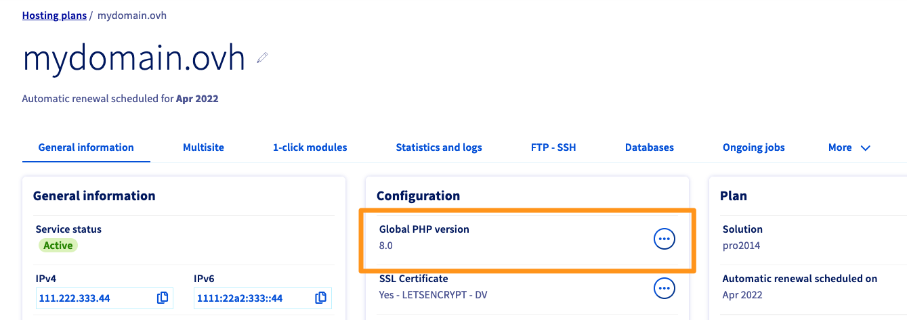

**Última actualización: 27/09/2018**

## Objetivo

Actualmente, hay una ingente cantidad de sitios web en la red. Los [planes de hosting de OVH](https://www.ovhcloud.com/es-es/web-hosting/){.external} le permiten alojar cualquier sitio web, siempre que sea compatible con la [configuración de nuestras infraestructuras](https://webhosting-infos.hosting.ovh.net){.external}. En algunos casos podría ser necesario cambiar la versión de PHP del alojamiento web.

**Esta guía explica cómo cambiar la versión de PHP de un alojamiento web de OVH.**

## Requisitos

- Tener contratado un [plan de hosting de OVH](https://www.ovhcloud.com/es-es/web-hosting/){.external} (salvo los planes de hosting Cloud Web).
- Según el método utilizado, tener acceso a la gestión del plan de hosting desde el [área de cliente de OVH](https://www.ovh.com/auth/?action=gotomanager&from=https://www.ovh.es/&ovhSubsidiary=es) o disponer de las claves necesarias para conectarse al espacio de almacenamiento. 

## Procedimiento

Actualmente existen diversas versiones del lenguaje de programación PHP. Las más recientes corrigen bugs de las anteriores e incorporan o prescinden de determinadas funcionalidades. OVH ofrece las últimas versiones mayores de PHP, que puede consultar en el siguiente enlace: <https://www.ovhcloud.com/es-es/web-hosting/uc-programming-language/>. 

Debido a que las nuevas versiones podrían no incluir ciertas funcionalidades, **asegúrese de que la nueva versión de PHP es compatible con su sitio web antes de realizar cualquier cambio.**

### 1. Comprobar que el sitio web es compatible

OVH se encarga de instalar las últimas versiones de PHP en sus servidores. Sin embargo, usted deberá asegurarse de que su sitio web está actualizado y es compatible con las últimas versiones de PHP. Existen dos formas de hacerlo, en función del sitio web:

**Si se trata de un sitio web basado en un sistema de gestión de contenidos (CMS, de *content management system*), como WordPress o Joomla!:** 

- Consulte la documentación oficial del CMS. 
- Compruebe los requisitos técnicos imprescindibles para que funcione el CMS, así como las operaciones necesarias para actualizarlo.
- Si necesita actualizar su CMS, asegúrese de que la nueva versión es compatible con su alojamiento web de OVH.

**Si el sitio web está basado en una solución personalizada:** 

- Contacte con el desarrollador que haya creado el sitio web.
- Si desea más información sobre las actualizaciones de versión, consulte la documentación oficial de PHP en el siguiente enlace: <http://php.net/manual/en/appendices.php>.
- Si necesita actualizar el código del sitio web, asegúrese de que la nueva versión es compatible con su alojamiento web de OVH.

Puede consultar la versión de PHP que utiliza su alojamiento web de dos formas distintas: 

|Método|Descripción|
|---|---|
|Desde el área de cliente|Conéctese al [área de cliente de OVH](https://www.ovh.com/auth/?action=gotomanager&from=https://www.ovh.es/&ovhSubsidiary=es){.external}, haga clic en `Alojamientos`{.action} en la columna izquierda y seleccione el alojamiento correspondiente. En la pestaña `Información general`{.action}, puede consultar la versión de PHP en el recuadro **Configuración**, en el apartado **Versión PHP global**. Si aparece un círculo de color azul en lugar de la versión, espere hasta que esta termine de actualizarse.|
|Mediante un script|Cree un script **.php** que contenga únicamente el siguiente código: `<?php phpinfo(); ?>`. A continuación súbalo a su espacio de almacenamiento y llámelo accediendo a su dirección URL completa desde un navegador de internet.|

{.thumbnail}

En última instancia, si no está seguro de que su sitio web sea compatible con la nueva versión de PHP, existe la posibilidad de cambiar la versión actual y volver a la anterior. No obstante, **este método no es seguro y, por tanto, le recomendamos que intente evitarlo** en la medida de lo posible, ya que podría provocar fallos en el funcionamiento del sitio web. Además, aunque el sitio web siga estando publicado tras el cambio de versión y no sea apreciable a simple vista, es posible que alguna de sus funcionalidades se haya visto afectada. 

Una vez que esté listo para realizar el cambio de versión, vaya al siguiente paso.

### 2. Cambiar la versión de PHP del alojamiento web

Puede cambiar la versión de PHP de su alojamiento web de dos formas distintas:

- **Utilizando el asistente de configuración del área de cliente de OVH**:  Esta opción es menos técnica y requiere estar conectado al área de cliente, desde donde podrá elegir la versión de PHP que desee. Para más información, consulte nuestra guía [Modificar la configuración de un alojamiento web](https://docs.ovh.com/es/hosting/cambiar_el_entorno_de_ejecucion_de_un_alojamiento/){.external}.

- **Modificando manualmente un archivo en el espacio de almacenamiento**: Esta opción es más técnica y requiere estar conectado al espacio de almacenamiento, desde donde deberá editar el archivo **.ovhconfig**. Para más información, consulte la guía [Configurar el archivo .ovhconfig de un alojamiento web](https://docs.ovh.com/es/hosting/configurar-archivo-ovhconfig/){.external}.

Para los amantes de la tecnología, lamentamos informarles de que en los últimos [planes de hosting de OVH](https://www.ovhcloud.com/es-es/web-hosting/){.external} no es posible cambiar la versión de PHP mediante un archivo **.htaccess**. La directiva que permite cambiar la versión de PHP en el archivo .htaccess no permite utilizar las últimas versiones de PHP en nuestras infraestructuras. Así pues, se deberá utilizar obligatoriamente el archivo .ovhconfig.

## Más información

[Modificar la configuración de un alojamiento web](https://docs.ovh.com/es/hosting/cambiar_el_entorno_de_ejecucion_de_un_alojamiento/){.external}

[Configurar el archivo .ovhconfig de un alojamiento web](https://docs.ovh.com/es/hosting/configurar-archivo-ovhconfig/){.external}

Interactúe con nuestra comunidad de usuarios en <https://community.ovh.com/en/>.