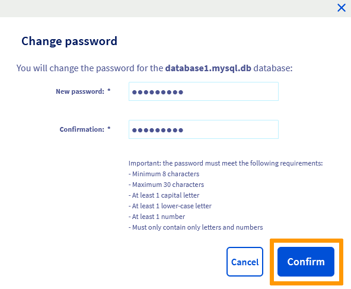

**Ostatnia aktualizacja dnia 2018-06-20**

## Wprowadzenie

Baza danych (z ang.*database* lub w skrócie „DB”) umożliwia przechowywanie elementów dynamicznych, takich jak komentarze czy artykuły. Bazy danych są wykorzystywane przez niemal wszystkie systemy zarządzania treścią (*Content Management System* lub w skrócie CMS), takie jak WordPress czy Joomla! Dostęp do nich chroniony jest hasłem.

**Dowiedz się, jak zmienić hasło do bazy danych utworzone w ramach usługi hostingu.**

## Wymagania początkowe

- Posiadanie [hostingu OVH](https://www.ovh.pl/hosting/){.external}
- Dostęp do interfejsu zarządzania hostingiem w [Panelu klienta OVH](https://www.ovh.com/auth/?action=gotomanager&from=https://www.ovh.pl/&ovhSubsidiary=pl){.external}

> [!warning]
>
> Po zmianie hasła do bazy danych pamiętaj, aby zmienić również hasło w pliku konfiguracyjnym łączącym bazę z Twoją stroną WWW.
>

## W praktyce

### Etap 1: sprawdzenie stanu obecnego

**Zmiana hasła do bazy danych jest operacją wymagającą odpowiedniej wiedzy**: błędnie przeprowadzona modyfikacja mogłaby uniemożliwić dostęp do wszystkich stron WWW używających tej bazy. Świadomość możliwych konsekwencji modyfikacji pozwoli Ci lepiej zrozumieć wprowadzane zmiany.

Obecnie niemal wszystkie systemy zarządzania treścią (WordPress, Joomla!, etc.) wykorzystują bazę danych do przechowywania elementów dynamicznych, takich jak komentarze czy artykuły. Aby taka strona WWW mogła poprawnie działać, konieczne jest połączenie jej z bazą danych. Umożliwia to plik konfiguracyjny zawierający informacje dotyczące połączenia z bazą danych.  Po zmianie hasła do bazy danych pamiętaj również o wprowadzeniu tej modyfikacji w pliku służącym do powiązania strony z bazą danych.

> [!primary]
>
> Zalecamy, abyś przed wprowadzeniem jakiejkolwiek zmiany sprawdził, czy Twoja strona jest powiązana z bazą danych. Jeśli jest powiązana, upewnij się, w jaki sposób należy zmienić hasło w pliku służącym do połączenia strony z bazą, aby nie spowodować niedostępności Twojej strony WWW.
>
> Ponieważ operacja ta wymaga konfiguracji Twojej strony WWW, a nie samego rozwiązania OVH, w razie wątpliwości zalecamy skontaktowanie się z administratorem strony lub wyspecjalizowanym w tym zakresie webmasterem.
>

### Etap 2: zarządzanie bazami danych na hostingu

Przed rozpoczęciem operacji zaloguj się do [Panelu klienta](https://www.ovh.com/auth/?action=gotomanager&from=https://www.ovh.pl/&ovhSubsidiary=pl){.external}, kliknij `Hosting`{.action} na pasku usług po lewej stronie, następnie wybierz nazwę odpowiedniego hostingu. Teraz przejdź do zakładki `Bazy danych`{.action}.

Tabela, która się wyświetla zawiera listę wszystkich baz danych utworzonych w ramach Twojego pakietu hostingowego.

{.thumbnail}

### Etap 3: zmiana hasła do bazy danych 

Aby zmienić hasło, kliknij na trzy kropki po prawej stronie odpowiedniej bazy danych, a następnie kliknij przycisk `Zmień hasło`{.action}.

{.thumbnail}

W oknie, które się wyświetli, wprowadź nowe hasło i kliknij przycisk Zatwierdź.

**Nowe hasło będzie aktywne po kilku minutach.**

> [!primary]
>
> Przy wyborze nowego hasła zalecamy zastosowanie zwyczajowych zasad bezpieczeństwa. Prosimy również:
>
> - nie używać dwa razy tego samego hasła; 
>
> - wybrać hasło, które nie ma żadnego związku z Twoimi danymi osobistymi (takimi jak nazwisko, imię czy data urodzenia);
>
> - regularnie zmieniać hasła;
>
> - nie zapisywać haseł na kartce ani nie przesyłać ich na Twój adres e-mail;
>
> - nie zapisywać haseł w przeglądarce internetowej, nawet jeśli wyświetli się taka sugestia.
>

{.thumbnail}

### Etap 4: połączenie strony WWW z bazą danych

> [!primary]
>
> Etap ten może być opcjonalny, jeśli Twoja strona WWW nie jest powiązana z bazą danych.
>

Jeśli na Twojej stronie WWW pojawia się komunikat informujący, że połączenie z bazą danych nie może być zrealizowane, oznacza to, że nie wprowadziłeś zmiany hasła w pliku zawierającym dane do połączenia Twojej strony WWW z bazą danych.

Aby Twoja strona WWW mogła połączyć się z bazą danych, na przestrzeni dyskowej zapisany został plik zawierający informacje umożliwiające połączenie: nazwa użytkownika, hasło, nazwa bazy danych i adres serwera. W związku ze zmianą hasła do bazy danych w Panelu klienta połączenie to jest obecnie zerwane.

Aby je ponownie ustanowić, wprowadź nowe hasło do pliku zawierającego informacje o bazie danych. Ponieważ operacja ta wymaga konfiguracji Twojej strony WWW, a nie samego rozwiązania OVH, w razie wątpliwości zalecamy skontaktowanie się z administratorem strony lub wyspecjalizowanym w tym zakresie webmasterem.

## Sprawdź również

Przyłącz się do społeczności naszych użytkowników na stronie <https://community.ovh.com/en/>.