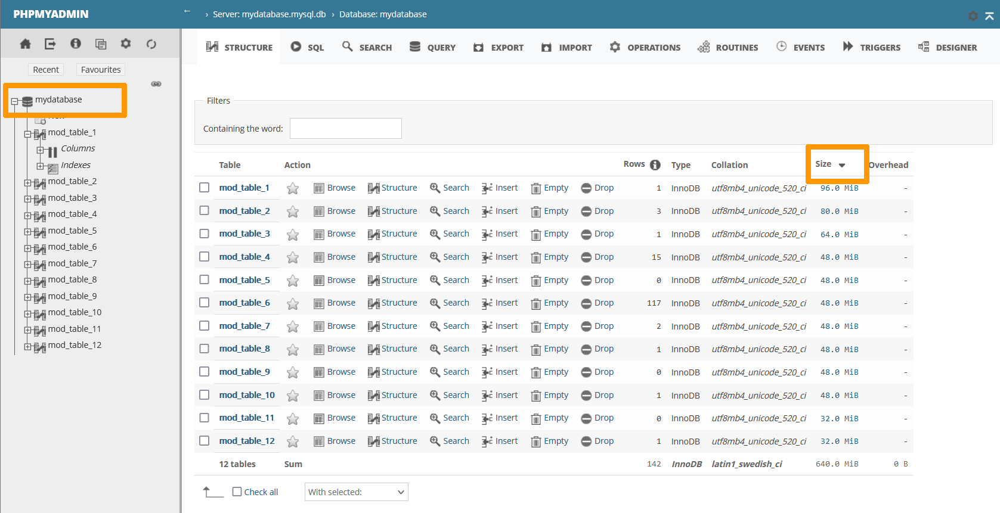
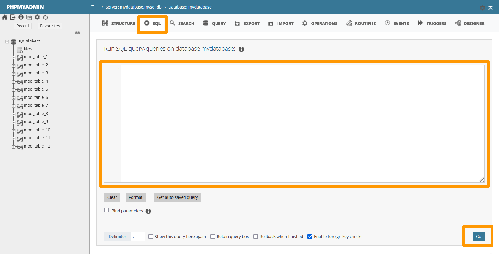

**Letzte Aktualisierung am 19.01.2023**

> [!primary]
> Diese Übersetzung wurde durch unseren Partner SYSTRAN automatisch erstellt. In manchen Fällen können ungenaue Formulierungen verwendet worden sein, z.B. bei der Beschriftung von Schaltflächen oder technischen Details. Bitte ziehen Sie beim geringsten Zweifel die englische oder französische Fassung der Anleitung zu Rate. Möchten Sie mithelfen, diese Übersetzung zu verbessern? Dann nutzen Sie dazu bitte den Button «Mitmachen» auf dieser Seite.
>

## Ziel

Eine Datenbank kann beispielsweise Daten zu einer Website und deren Funktionen speichern. Diese Informationen sind so strukturiert, dass Ihre Website einfach darauf zugreifen kann, was einen optimalen und personalisierten Zugang für Benutzer/Besucher Ihrer Website ermöglicht. 

Während der Nutzung kann eine Datenbank Informationen abrufen, ändern oder löschen (Verbindungsdaten, Benutzerdaten, Anzeigedaten, Daten, die für das ordnungsgemäße Funktionieren Ihrer Website erforderlich sind usw.). 

In manchen Fällen werden in der Datenbank so viele Informationen gespeichert, dass der zugewiesene Speicherplatz überlastet wird. Wenn eine Datenbank voll ist, wird dieser Zustand als **overquota** bezeichnet.

Dieses Tutorial zeigt Ihnen die Aktionen, die Sie ergreifen können, wenn Ihre gemeinsam genutzte Datenbank von OVHcloud fast ausgelastet ist oder sich bereits im **overquota** befindet.

**Diese Anleitung erklärt, wie Sie vorgehen, wenn Ihre Datenbank voll ist.**

## Voraussetzungen

- Zugang zum [OVHcloud Kundencenter](https://www.ovh.com/auth/?action=gotomanager&from=https://www.ovh.de/&ovhSubsidiary=de)
- Ein [OVHcloud Webhosting-Plan](https://www.ovhcloud.com/de/web-hosting/) mit einer zugehörigen gemeinsam genutzten OVHcloud Datenbank
  
## Beschreibung

> [!warning]
>
> OVHcloud stellt Dienste zur Verfügung, für deren Konfiguration und Verwaltung Sie die alleinige Verantwortung tragen. Es liegt somit bei Ihnen, sicherzustellen, dass diese ordnungsgemäß funktionieren.
> 
> Wenn Sie Schwierigkeiten haben, die Schritte in diesem Tutorial durchzuführen, empfehlen wir Ihnen, einen [spezialisierten Anbieter](https://partner.ovhcloud.com/de/directory/) zu kontaktieren oder die OVHcloud Community zu kontaktieren. Wir können Ihnen leider keine Unterstützung anbieten. Weitere Informationen finden Sie im Abschnitt [Weiterführende Informationen](#go-further) in dieser Anleitung.
>

Wenn Ihre OVHcloud Shared Database eine bestimmte Sättigung (**overquota**) erreicht, senden unsere Roboter eine Benachrichtigung an die E-Mail-Adresse des [Administratorkontakts](https://docs.ovh.com/de/customer/verwaltung-der-kontakte/) der Datenbank. 

Die erste E-Mail wird versandt, wenn Ihre Datenbank mehr als **80%** ihrer Speicherkapazität belegt hat. Eine zweite E-Mail wird gesendet, wenn **90%** dieser Speicherkapazität erreicht sind.

Wenn Ihre Datenbank **das Limit überschreitet**, erhalten Sie eine dritte Warnung per E-Mail. Ihre Datenbank wird dann auf *READ ONLY* umgestellt. Sie können Ihre Datenbankeinträge nicht mehr hinzufügen oder ändern, aber sie können weiterhin **gelesen** und **gelöscht** werden. 

### Schritt 1: Identifizieren großer Tabellen

Eine Datenbank besteht aus einer oder mehreren **Tabellen**, die ihrerseits aus einer oder mehreren **Zeilen** bestehen, die anhand vorgegebener **Spalten** organisiert sind.

Im ersten Schritt werden die großen Tabellen in der Datenbank identifiziert.

> [!primary]
>
> Alle folgenden in diesem Tutorial beschriebenen Aktionen werden über das **phpMyAdmin**-Interface ausgeführt.
>
> [phpMyAdmin](https://www.phpmyadmin.net/){.external} ist für alle gemeinsam genutzten Datenbanken von OVHcloud verfügbar.
> Mit dieser Anwendung zur Datenbankverwaltung können Sie die manuellen Aktionen, die Sie mit Ihrer Datenbank durchführen können, ganz einfach durchführen.
>

#### 1.1 - Verbindung zur Datenbank über phpMyAdmin

Das Passwort für den Zugriff auf Ihre Datenbank erhalten Sie direkt aus der Konfigurationsdatei Ihrer Seite. Führen Sie diese Aktion mithilfe von **Schritt 1** in unserer Anleitung zur [Änderung des Datenbankpassworts](https://docs.ovh.com/de/hosting/datenbank-passwort-aendern/) durch.

Loggen Sie sich in Ihrem [OVHcloud Kundencenter](https://www.ovh.com/auth/?action=gotomanager&from=https://www.ovh.de/&ovhSubsidiary=de) ein und wählen Sie in der Navigationsleiste oben auf dem Bildschirm `Web Cloud`{.action} aus. Klicken Sie auf `Hosting-pakete`{.action} Angebote und wählen Sie das Webhosting zu Ihrer geteilten OVHcloud Datenbank. Gehen Sie anschließend in den Tab `Datenbanken`{.action}.

{.thumbnail}

Klicken Sie im Register `Datenbanken`{.action} auf den Button `...`{.action} rechts neben der vollen Datenbank und `rufen Sie phpMyAdmin auf`{.action}.

{.thumbnail}

Geben Sie zusätzlich zu den bereits ausgefüllten Informationen Ihr Datenbankpasswort ein und klicken Sie dann auf `Ausführen`{.action}.

#### 1.2 - Suchen der größten Tabellen

> [!alert]
>
> Ab hier wirken sich Ihre Aktionen auf den Inhalt Ihrer Datenbank aus. Die Änderungen, die Sie an **phpMyAdmin** vornehmen, können irreversible Folgen haben, wenn sie nicht korrekt durchgeführt werden.
>
> Achten Sie auf jeden Befehl, den Sie in der Datenbank ausführen. Sollten Sie Probleme haben, empfehlen wir Ihnen, einen [spezialisierten Dienstleister](https://partner.ovhcloud.com/de/directory/) zu kontaktieren. OVHcloud kann Ihnen beim Inhalt Ihrer Datenbank nicht helfen.
>

Sobald die Verbindung hergestellt wurde, wird die folgende Seite angezeigt:

{.thumbnail}

Klicken Sie in der linken Spalte auf `"Ihr Datenbankname"`{.action} und dann in der rechten oberen Ecke der Tabelle auf `Größe`{.action}:

{.thumbnail}

Die größten Tabellen werden oben in der sortierten Liste angezeigt. Identifizieren Sie sie, und fahren Sie mit **Schritt 2** fort.

### Schritt 2: Bestimmen Sie den Nutzen des Inhalts in der großen Tabelle(n).

Nachdem Sie die großen Tabellen identifiziert haben, bestimmen Sie, ob der gesamte Inhalt für das Funktionieren Ihrer Website erforderlich ist.

> [!primary]
>
> Falls Sie ein Content Management System (CMS) wie WordPress, Joomla!, PrestaShop oder Drupal verwenden, stellen Sie sicher, dass Ihre großen Tabellen nicht mit einem kürzlich installierten oder aktualisierten Plugin/Theme verbunden sind.
>
> Wenden Sie sich in diesem Fall an den Entwickler des Plugins/Themes, um die geeigneten Aktionen für Ihr CMS zu bestimmen.
>
 
Für andere CMS-Typen empfehlen wir Ihnen, sich an Ihren CMS-Herausgeber zu wenden, bevor Sie die folgenden Aktionen ausführen.

Unten stehend finden Sie Links zu den offiziellen CMS-Websites für die "**1-Klick-Module**" von OVHcloud:

- [WordPress](https://wordpress.org/){.external}
- [Joomla!](https://www.joomla.org){.external}
- [PrestaShop](https://www.prestashop.com/){.external}
- [Drupal](https://drupal.org){.external}

> [!primary]
>
> Wenn es sich bei Ihrer Website um eine von einem spezialisierten Anbieter entwickelte, **maßgeschneiderte** Software handelt, empfehlen wir Ihnen, sich mit dem jeweiligen Anbieter in Verbindung zu setzen.
>

### Schritt 3: Korrekturmaßnahmen ergreifen

Sobald Sie festgestellt haben, ob der Inhalt der Tabellen für das Funktionieren Ihrer Website erforderlich ist, stehen Ihnen mehrere Optionen zur Verfügung:

#### Fall 1: Damit Ihre Website korrekt funktioniert, sind alle Inhalte der großen Tabelle erforderlich

Führen Sie ein Upgrade Ihres Datenbankdienstes auf einen Dienst durch, der mehr Speicherplatz für Datenbanken enthält.

Bitte konsultieren Sie unser Angebot [Cloud Databases](https://www.ovh.de/cloud/cloud-databases/), um sich über Ihren neuen Datenbankdienst zu informieren. 

Wir empfehlen diese Lösung für große Datenbanken.

Folgen Sie dann unseren Anleitungen, um den Inhalt Ihrer alten Datenbank auf die neue zu verschieben:

- [Extrahieren Sie Ihre bestehende Datenbank](https://docs.ovh.com/de/hosting/webhosting_hilfe_zum_export_von_datenbanken/)
- [Erste Schritte mit Cloud Databases](https://docs.ovh.com/de/clouddb/erste-schritte-mit-clouddb/)
- [Importieren Sie Ihre alte Datenbank in Ihre Cloud Databases](https://docs.ovh.com/de/clouddb/datenbank-importieren/)

#### Case 2 - Der Inhalt der großen Tabelle ist nicht vollständig oder teilweise für das Funktionieren Ihrer Website erforderlich

Bevor Sie die folgenden Schritte ausführen, überprüfen Sie, ob die Daten in der großen Tabelle Elementen entsprechen, die aus Ihrem CMS-Verwaltungspanel gelöscht werden können. 

**Beispiele**:

- Alte Kommentare / Posts
- Elemente im `Trash`-Menü Ihres CMS
- Daten zu einem alten Theme und/oder Plugin

> [!alert]
>
> Im Rest dieses Tutorials wird Ihnen gezeigt, wie Sie in Ihrer Datenbank gespeicherte Daten löschen. Achten Sie darauf, welche Aktionen Sie durchführen müssen, oder wenden Sie sich im Zweifelsfall an einen [Spezialisten](https://partner.ovhcloud.com/de/directory/).
>

Für geteilte OVHcloud Datenbanken sind verschiedene SQL Befehle verfügbar, um den Inhalt zu beeinflussen.

Bei einem Überquota oder einer großen Tabelle sind **drei Befehle** verfügbar.

Sie können diese Anfragen über das **phpMyAdmin** Interface, das auch den Tab `SQL`{.action} enthält, durchführen:

{.thumbnail}

- Der Befehl **DELETE**:

Sie können damit **eine oder mehrere Zeilen** aus einer bestimmten Tabelle entfernen. Dieser Befehl ist nützlich, wenn ein Teil des Tabelleninhalts für das ordnungsgemäße Funktionieren Ihrer Website erforderlich ist.

**Beispiel**:

```bash
DELETE FROM `table_1` WHERE `id` = 1
```

> In diesem Beispiel löscht der Befehl die Zeile(n) in **table_1**, deren Wert in der Spalte **id** **1** ist.

- Der Befehl **TRUNCATE**:

Mit diesem Befehl werden **alle Zeilen** aus einer bestimmten Tabelle gelöscht.

**Beispiel**:

```bash
TRUNCATE TABLE `table_1`
```

> In diesem Beispiel löscht der Befehl ausnahmslos alle Zeilen aus **table_1**.

- Der Befehl **DROP**:

Damit können Sie **eine Tabelle und alle darin enthaltenen** Zeilen vollständig entfernen. Dieser Befehl sollte nicht verwendet werden, wenn die Tabelle weiterhin benötigt wird.

**Beispiel**:

```bash
DROP TABLE `table_1`
```

> In diesem Beispiel löscht der Befehl die Tabelle **table_1** und alle darin enthaltenen Zeilen.

## Weiterführende Informationen <a name="go-further"></a>

Kontaktieren Sie für spezialisierte Dienstleistungen (SEO, Web-Entwicklung etc.) die [OVHcloud Partner](https://partner.ovhcloud.com/de/directory/).

Wenn Sie Hilfe bei der Nutzung und Konfiguration Ihrer OVHcloud Lösungen benötigen, beachten Sie unsere [Support-Angebote](https://www.ovhcloud.com/de/support-levels/).

Für den Austausch mit unserer User Community gehen Sie auf <https://community.ovh.com/en/>.