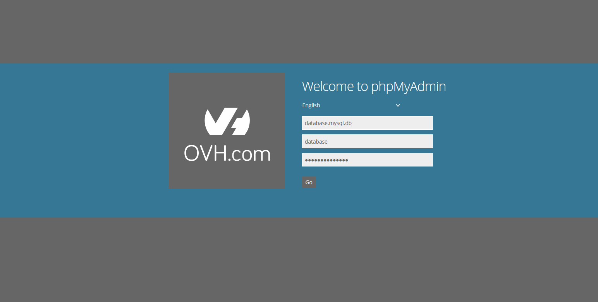
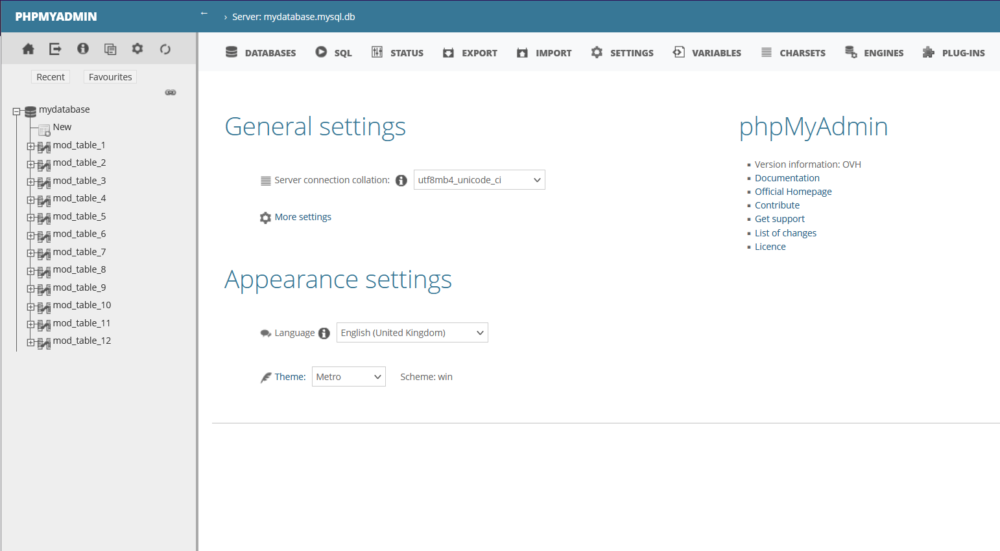

**Ostatnia aktualizacja z dnia 16-02-2023**

> [!primary]
> Questa traduzione è stata generata automaticamente dal nostro partner SYSTRAN. I contenuti potrebbero presentare imprecisioni, ad esempio la nomenclatura dei pulsanti o alcuni dettagli tecnici. In caso di dubbi consigliamo di fare riferimento alla versione inglese o francese della guida. Per aiutarci a migliorare questa traduzione, utilizza il pulsante "Contribuisci" di questa pagina.
>
  
## Wprowadzenie

Na przykład baza danych umożliwia przechowywanie informacji dotyczących Twojej strony WWW i jej działania. Informacje te są tak skonstruowane, aby Twoja strona WWW mogła z łatwością dotrzeć do Twojej strony WWW, co pozwala na optymalne i spersonalizowane przeglądanie stron przez użytkowników/użytkowników Twojej strony WWW. 

Baza danych może gromadzić, modyfikować lub usuwać informacje (dane logowania, dane użytkowników, dane dotyczące wyświetlania, dane niezbędne do prawidłowego działania Twojej strony WWW itp.). 

W niektórych przypadkach baza danych rejestruje ilość informacji, która powoduje przeciążenie przestrzeni dyskowej. Gdy baza danych jest przeciążona, mówimy o **overquota**.

Tutorial ten wyjaśnia, jakie działania należy podjąć, gdy wirtualna baza danych OVHcloud znajduje się blisko przeciążenia lub znajduje się już w **overquota**.

**Dowiedz się, jak działać, gdy baza danych jest przeciążona.**

## Wymagania początkowe

- Dostęp do [Panelu klienta OVHcloud](https://www.ovh.com/auth/?action=gotomanager&from=https://www.ovh.pl/&ovhSubsidiary=pl)
- Posiadanie [hostingu OVHcloud](https://www.ovhcloud.com/pl/web-hosting/) wraz z powiązaną bazą danych współdzieloną OVHcloud.
  
## W praktyce

> [!warning]
>
> OVHcloud oddaje do Twojej dyspozycji usługi, których konfiguracja, zarządzanie i odpowiedzialność spoczywa na Ciebie. W związku z tym należy zapewnić ich prawidłowe funkcjonowanie.
> 
> Oddajemy do Twojej dyspozycji niniejszy tutorial, którego celem jest pomoc w jak najlepszym wykonywaniu bieżących zadań. W przypadku trudności zalecamy skorzystanie z pomocy [wyspecjalizowanego usługodawcy](https://partner.ovhcloud.com/pl/). Niestety firma OVH nie będzie mogła udzielić wsparcia w tym zakresie. Więcej informacji znajduje się w sekcji ["Sprawdź również"](#go-further) niniejszego przewodnika.
>

Gdy baza danych współdzielona OVHcloud zostanie przeciążona (**overquota**), nasze roboty prześlą do Ciebie e-mail na adres e-mail [kontaktu administratora](https://docs.ovh.com/pl/customer/zarzadzanie_kontaktami/) bazy danych. 

Pierwszy e-mail jest wysyłany, gdy baza danych zużywa ponad **80%** swojej przestrzeni dyskowej. Druga wiadomość e-mail jest wysyłana po osiągnięciu **90%** tej pojemności pamięci masowej.

Jeśli Twoja baza danych jest zapisana w **overquota**, otrzymasz trzeci e-mail z ostrzeżeniem. Baza danych zmienia się wówczas na "*READ ONLY*" (tylko odczyt). Nie można dodawać ani modyfikować wpisów w bazie danych, ale jest ona dostępna w **odczyt** i **usuwanie**. 

### Etap 1: zidentyfikować tabelę(-y) powiększającą(-e)

Baza danych składa się z jednej lub kilku **tabel**, które składają się z jednej lub więcej **wierszy** zorganizowanych z wykorzystaniem wcześniej określonych **kolumn**.

Pierwszy etap polega na zidentyfikowaniu obszernej(-ych) tabeli(-ych) w Twojej bazie danych.

> [!primary]
>
> Wszystkie poniższe działania opisane w tym tutorialu będą przeprowadzane z **phpMyAdmin**.
>
> [phpMyAdmin](https://www.phpmyadmin.net/){.external} jest dostępny we wszystkich współdzielonych bazach danych OVHcloud.
> Ta aplikacja do zarządzania bazami danych ułatwia wykonywanie czynności ręcznych, które możesz wykonać za pomocą bazy danych.
>

#### 1.1 - Logowanie do bazy danych przez phpMyAdmin

Pobierz hasło dostępowe do bazy danych bezpośrednio w pliku konfiguracyjnym Twojej strony WWW. Wykonaj tę operację za pomocą **etapu 1** w naszym przewodniku dotyczącym [zmiany hasła do bazy danych] (https://docs.ovh.com/pl/hosting/zmiana-hasla-do-bazy-danych/).

Zaloguj się do [Panelu klienta OVHcloud](https://www.ovh.com/auth/?action=gotomanager&from=https://www.ovh.pl/&ovhSubsidiary=pl) i wybierz `Web Cloud`{.action} na pasku nawigacyjnym na górze ekranu. Kliknij przycisk `Hosting`{.action}, następnie wybierz hosting powiązany z Twoją bazą danych na hostingu OVHcloud. Teraz przejdź do zakładki `Bazy danych`{.action}.

{.thumbnail}

Zawsze w zakładce `Bazy danych`{.action}, kliknij przycisk `...`{.action} po prawej stronie bazy danych, która jest nasycona, a następnie `Dostęp do phpMyAdmin`{.action}.

{.thumbnail}

Wpisz hasło dostępowe do bazy danych jako uzupełnienie wypełnionych wcześniej informacji, a następnie kliknij `Uruchom`{.action}.

#### 1.2 - Wyszukaj największe tabele

> [!alert]
>
> Od tej pory interweniujesz bezpośrednio w zawartość bazy danych. Operacje, które wykonujesz w phpMyAdmin mogą mieć nieodwracalne konsekwencje, jeśli operacje te nie zostały przeprowadzone prawidłowo.
>
> Upewnij się, że wykonywane są operacje. W przypadku trudności zalecamy skorzystanie z pomocy [wyspecjalizowanego usługodawcy](https://partner.ovhcloud.com/pl/). Niestety OVHcloud nie będzie w stanie udzielić wsparcia w zakresie treści bazy danych.
>

Po zalogowaniu wyświetla się następująca strona:

{.thumbnail}

W kolumnie po lewej stronie kliknij `"Nazwa bazy danych"`{.action}, a następnie `Rozmiar`{.action} w prawym górnym rogu tabeli, która się wyświetli:

{.thumbnail}

Największe stoły wyświetlają się na szczycie tabeli. Wyszukaj je i przejdź do **etapu 2**.

### Etap 2: określenie użyteczności treści zawartych w tabeli lub tabelach

Po zidentyfikowaniu obszernych tabel, sprawdź, czy ich zawartość jest niezbędna do działania Twojej strony WWW.

> [!primary]
>
> Jeśli korzystasz z Content Managment System (CMS) takiego jak WordPress, Joomla!, PrestaShop lub Drupal, sprawdź, czy Twoje obszerne tabele nie są powiązane z niedawno zainstalowaną lub zaktualizowaną wtyczką/tematem.
>
> W takim przypadku skontaktuj się z wydawcą wtyczki/tematu, w celu uzyskania informacji na temat operacji, jakie należy przeprowadzić na Twoim CMS.
>
 
W pozostałych przypadkach związanych z CMS-ami zalecamy kontakt z producentem Twojego CMS-a przed wykonaniem następujących operacji.

Poniżej znajdziesz linki do oficjalnych stron WWW proponowanych przez OVHcloud "**Za jednym kliknięciem**":

- [WordPress](https://wordpress.org/){.external}
- [Joomla!](https://www.joomla.org){.external}
- [PrestaShop](https://www.prestashop.com/){.external}
- [Drupal](https://drupal.org){.external}

> [!primary]
>
> Jeśli Twoja strona została stworzona przez wyspecjalizowanego usługodawcę "**ręcznie**", zalecamy kontakt z dostawcą usług hostingowych.
>

### Etap 3: podjęcie działań naprawczych

Po określeniu, czy zawartość Twoich tabel jest niezbędna czy nie, masz do wyboru kilka opcji:

#### Przypadki nr 1 - Cała zawartość tabeli jest niezbędna do prawidłowego działania Twojej strony WWW.

Musisz zmienić bazę danych na większą bazę danych.

Zapoznaj się z naszą ofertą baz danych [Web Cloud Databasess](https://www.ovh.pl/cloud/cloud-databases/), aby wybrać nową usługę baz danych. 

Zalecamy tę ofertę dla dużych baz danych.

Następnie postępuj zgodnie z naszymi przewodnikami, aby przenieść zawartość Twojej starej bazy danych do nowej:

- [Eksport istniejącej bazy danych](https://docs.ovh.com/pl/hosting/eksport-bazy-danych/)
- [Pierwsze kroki z usługą Web Cloud Databasess](https://docs.ovh.com/pl/clouddb/pierwsze-kroki-z-clouddb/)
- [Import Twojej starej bazy danych do Twojej oferty Web Cloud Databasess](https://docs.ovh.com/pl/clouddb/przywracanie-importowanie-bazy-danych/)

#### Przypadki nr 2 - Część lub całość zawartości tabeli nie jest konieczna do działania strony

Zanim wykonasz poniższe kroki, sprawdź, czy dane zawarte w obszernej tabeli odpowiadają elementom, które mogą zostać usunięte z przestrzeni administracyjnych Twojego CMS. 

**Przykłady**:

- stare uwagi/posty;
- elementów z menu `Kosz` Twojego CMS;
- dane związane ze starym tematem i/lub wtyczką.

> [!alert]
>
> W dalszej części przewodnika dowiesz się, jak usunąć dane znajdujące się w Twojej bazie danych. W przypadku wątpliwości sprawdź, co robisz lub skontaktuj się z [wyspecjalizowanym dostawcą](https://partner.ovhcloud.com/pl/).
>

Współdzielone bazy danych OVHcloud dysponują kilkoma poleceniami SQL, które umożliwiają modyfikowanie ich zawartości.

W przypadku opcji overquota lub dużego stołu, **trzy zamówienia** są dostępne.

Możesz wykonywać te zapytania bezpośrednio w interfejsie **phpMyAdmin**, w zakładce `SQL`{.action}:

{.thumbnail}

- zamówienie **DELETE** : 

Umożliwia usunięcie **jednej lub kilku linii** z danej tabeli. To polecenie jest przydatne, jeśli część zawartości tabeli jest niezbędna do prawidłowego działania Twojej strony WWW.

**Przykład**:

```sql
DELETE FROM `table_1` WHERE `id` = 1
```

> W tym przykładzie polecenie usuwa wiersz(-y) z **table_1** o wartości w kolumnie **id*** równej **1**.

- zamówienie **TRUNCATE** : 

Umożliwia usunięcie **wszystkich linii** z danej tabeli.

**Przykład**:

```sql
TRUNCATE TABLE `table_1`
```

> W tym przykładzie polecenie usuwa wszystkie wiersze z **table_1** bez wyjątku.

- zamówienie **DROP** : 

Pozwala ona na całkowite usunięcie **tabeli i wszystkich linii w niej zawartych**. Polecenie to nie jest używane, jeśli tabela nadal istnieje.

**Przykład**:

```sql
DROP TABLE `table_1`
```

> W tym przykładzie polecenie usuwa tabelę **table_1** i wszystkie linie, które ona zawiera.

## Sprawdź również <a name="go-further"></a>

W przypadku wyspecjalizowanych usług (pozycjonowanie, rozwój, etc.) skontaktuj się z [partnerami OVHcloud](https://partner.ovhcloud.com/pl/).

Jeśli chcesz otrzymywać wsparcie w zakresie konfiguracji i użytkowania Twoich rozwiązań OVHcloud, zapoznaj się z naszymi [ofertami pomocy](https://www.ovhcloud.com/pl/support-levels/).

Dołącz do społeczności naszych użytkowników na stronie <https://community.ovh.com/en/>. 