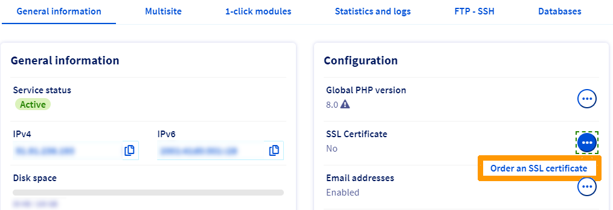
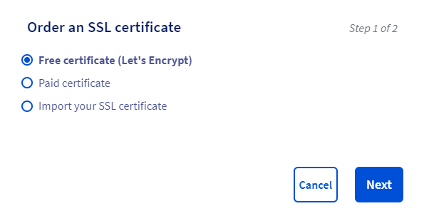

> [!primary]
> Tłumaczenie zostało wygenerowane automatycznie przez system naszego partnera SYSTRAN. W niektórych przypadkach mogą wystąpić nieprecyzyjne sformułowania, na przykład w tłumaczeniu nazw przycisków lub szczegółów technicznych. W przypadku jakichkolwiek wątpliwości zalecamy zapoznanie się z angielską/francuską wersją przewodnika. Jeśli chcesz przyczynić się do ulepszenia tłumaczenia, kliknij przycisk „Zaproponuj zmianę” na tej stronie.
>

**Ostatnia aktualizacja z dnia 26-07-2022**

## Wprowadzenie

Hosting umożliwia zarządzanie certyfikatem SSL. Certyfikat możesz uzyskać za pośrednictwem OVHcloud lub we własnym zakresie poprzez import certyfikatu na Twój hosting. Kiedy certyfikat zostanie zainstalowany na hostingu, strona lub strony WWW uzyskają bezpieczne połączenie SSL i zaczną używać protokołu HTTPS. 

**Dowiedz się, jak zarządzać certyfikatem SSL na hostingu OVHcloud.**

## Wymagania początkowe

- Posiadanie [hostingu OVHcloud](https://www.ovhcloud.com/pl/web-hosting/){.external}
- Zarejestrowanie co najmniej jednej [domeny](https://www.ovhcloud.com/pl/domains/){.external}
- Dostęp do [Panelu klienta OVHcloud](https://www.ovh.com/auth/?action=gotomanager&from=https://www.ovh.pl/&ovhSubsidiary=pl){.external}, sekcja `Web Cloud`{.action}

## W praktyce

Na Twoim hostingu OVHcloud można zarządzać certyfikatem SSL. Przejdź do opisu operacji, którą chcesz przeprowadzić.

- [1. Aktywacja certyfikatu SSL na Twoim hostingu](#enablessl): pomoże Ci aktywować certyfikat SSL na Twoim hostingu. Może to być bezpłatny lub płatny certyfikat zamówiony przez OVHcloud. Możesz również zaimportować własny certyfikat SSL zamówiony u innego dostawcy.

- [2. Aktywacja certyfikatu SSL na stronie podpiętej w opcji MultiSite](#multisite): jeśli pozwalają na to Twoje rozwiązanie lub certyfikat SSL, możesz podłączyć kilka stron podpiętych w opcji MultiSite do bezpiecznego połączenia SSL.

- [3. Odnowienie certyfikatu SSL na hostingu](#regeneratessl): umożliwia wygenerowanie certyfikatu SSL Let's Encrypt na Twoim hostingu, gdy aktywujesz certyfikat SSL na jednej lub kilku stronach podpiętych w opcji MultiSite.

Możesz również [usunąć certyfikat SSL na hostingu](#deletessl). **Pamiętaj, że może to stwarzać ryzyko, jeśli jedna ze stron WWW korzysta obecnie z certyfikatu, który ma zostać usunięty**.

### 1. Aktywacja certyfikatu SSL na hostingu 

Twój hosting umożliwia uruchomienie [certyfikatu SSL w zależności od potrzeb](https://www.ovhcloud.com/pl/web-hosting/options/ssl/){.external}:

- bezpłatny certyfikat SSL Let's Encrypt [zawarty w ofercie kompatybilnego hostingu](https://www.ovhcloud.com/pl/web-hosting/options/ssl/){.external};
- płatny certyfikat SSL [w opcji z kompatybilnym hostingiem](https://www.ovhcloud.com/pl/web-hosting/options/ssl/){.external};
- import certyfikatu SSL uzyskanego we własnym zakresie.

Przed rozpoczęciem operacji zaloguj się do [Panelu klienta](https://www.ovh.com/auth/?action=gotomanager&from=https://www.ovh.pl/&ovhSubsidiary=pl){.external}i wybierz `Web Cloud`{.action}. Kliknij `Hosting`{.action}, po czym wybierz nazwę odpowiedniego hostingu. Następnie przejdź do sekcji `Informacje ogólne`{.action}. W zakładce „Certyfikat SSL” powinna pojawić się informacja „Nie” wskazująca, że na Twoim hostingu nie został zainstalowany żaden certyfikat SSL.

> [!primary]
>
> Przed przeprowadzeniem tej konfiguracji upewnij się, że poprzedni etap [aktywacji certyfikatu SSL na stronie podpiętej w opcji MultiSite](#multisite) został wykonany poprawnie. Przynajmniej jedna domena musi mieć aktywowaną domenę SSL lub domenę A, aby aktywować certyfikat SSL. 
> Informacje te nie mają zastosowania, jeśli zaznaczysz `Płatny` certyfikat{.action} lub `Importuj certyfikat SSL`{.action}.
>

Kliknij przycisk `...`{.action} obok napisu „Certyfikat SSL”, a następnie `Zamów certyfikat SSL`{.action}.

Jeśli pojawi się informacja „Tak”, oznacza to, że certyfikat SSL jest już zainstalowany i skonfigurowany na hostingu. Nie będziesz mógł więc zamówić nowego, dopóki na hostingu będzie zainstalowany poprzedni.

{.thumbnail}

W oknie, które się pojawi wybierz certyfikat SSL, który chcesz zamówić. Nie wszystkie rozwiązania wymienione powyżej mogą być dostępne. Zależy to od wykupionego przez Ciebie [pakietu hostingowego](https://www.ovhcloud.com/pl/web-hosting/){.external} lub konfiguracji. Po wybraniu opcji kliknij `Dalej`{.action}.

{.thumbnail}

W zależności od wybranego rozwiązania mogą pojawić się dodatkowe etapy:

- **jeśli wybrałeś bezpłatny certyfikat SSL**: niepotrzebne będzie żadne dodatkowe działanie, z wyjątkiem sytuacji, w której jakiś element techniczny uniemożliwia aktywację certyfikatu SSL (w Panelu klienta wyświetli się wówczas stosowna informacja zawierająca listę elementów, które powinieneś zweryfikować) lub potwierdzenie, że Twoja domena może uzyskać certyfikat SSL. W takim przypadku otrzymasz ostrzeżenie wraz z instrukcją postępowania;

- **jeśli wybrałeś płatny certyfikat SSL**: wykonaj kolejne kroki zamówienia, które się wyświetlają. W przypadku niektórych typów certyfikatów SSL może być wymagana specjalna weryfikacja. Możesz otrzymać jedną lub kilka wiadomości e-mail w związku z tym etapem. Postępuj zgodnie z instrukcjami zawartymi w przesłanych wiadomościach, aż do zakończenia instalacji;

- **jeśli wybrałeś import certyfikatu SSL**: wprowadź informacje w odpowiednich polach, które się wyświetlają. Wykorzystaj w tym celu informacje podane przez dostawcę, który wystawił Ci certyfikat. 

Wdrożenie certyfikatu może zająć od kilku minut do kilku dni, w zależności od typu wybranego certyfikatu. Aby sprawdzić, czy certyfikat SSL jest zainstalowany na Twoim hostingu, przejdź do zakładki `Informacje ogólne`{.action} w Twoim Panelu klienta. Informacja „Tak” powinna pojawić się poniżej sekcji „Certyfikat SSL”.

{.thumbnail}

### 2. Aktywacja certyfikatu SSL na stronie podpiętej w opcji MultiSite 

> [!primary]
>
> Przed przypisaniem certyfikatu SSL do jednej z Twoich stron podpiętych w opcji MultiSite upewnij się, że wcześniej aktywowałeś certyfikat SSL na Twoim hostingu. W tym celu sprawdź [poprzedni etap](#enablessl).

W zależności od [certyfikatu SSL](https://www.ovhcloud.com/pl/web-hosting/options/ssl/){.external}, który chcesz zamówić, możesz aktywować bezpieczne połączenie SSL na jednej lub kilku stronach podpiętych w opcji MultiSite. W tym celu zaloguj się do [Panelu klienta OVHcloud](https://www.ovh.com/auth/?action=gotomanager&from=https://www.ovh.pl/&ovhSubsidiary=pl){.external} i wybierz `Web Cloud`{.action}. Kliknij `Hosting`{.action}, po czym wybierz odpowiedni hosting. Przejdź następnie do zakładki `MultiSite`{.action}.

Tabela, która się wyświetla zawiera wszystkie nazwy domen dodanych do Twojego hostingu. W kolumnie "SSL" możesz sprawdzić stan aktywacji bezpiecznego połączenia SSL dla Twoich stron podpiętych w opcji MultiSite.

{.thumbnail}

Mogą pojawić się wówczas trzy statusy:

|Statusy|Opis |
|---|---|
|Aktywny|Wskazuje, że certyfikat SSL jest już aktywny dla tej strony podpiętej w opcji MultiSite. Jeśli Twoja strona WWW nie używa protokołu HTTPS, skorzystaj z instrukcji zawartych w dokumentacji OVHcloud [Aktywacja protokołu HTTPS na stronie WWW za pomocą certyfikatu SSL](../aktywacja-https-ssl-na-stronie-WWW/){.external}.|
|Do wygenerowania|Wskazuje, że certyfikat SSL został aktywowany dla danej strony podpiętej w opcji MutiSite, ale nie jest jeszcze aktywny. Odnów certyfikat SSL dla Twojego hostingu, aby uwzględniał nowe domeny.|
|Wyłączony|Wskazuje, że certyfikat SSL nie jest aktywny dla danej strony podpiętej w opcji MultiSite. Aby go aktywować, postępuj zgodnie z instrukcjami podanymi poniżej.|

Aby aktywować certyfikat SSL na stronie podpiętej w opcji MultiSite, kliknij przycisk `...`{.action} po prawej stronie podpiętej w opcji MultiSite, a następnie `Zmień domenę`{.action}. W oknie, które się wyświetla zaznacz kratkę `SSL`{.action}. Możesz również włączyć opcję, aby zmienić subdomenę www w tym samym czasie co powiązana nazwa domeny. Postępuj zgodnie z instrukcjami, aż do potwierdzenia modyfikacji.

Po zatwierdzeniu, status bezpiecznego połączenia SSL dla strony podpiętej w opcji MultiSite zaktualizuje się w ciągu kilku sekund, po czym zostaje wyświetlony komunikat "Do wygenerowania". Powtórz operację, jeśli chcesz aktywować SSL na innych stronach podpiętych w opcji MultiSite.

> [!primary]
>
> Możesz mieć w tym stanie dwie sytuacje:
>
> - **Nie masz certyfikatu.**
> Aby przeczytać ten przewodnik, przejdź do sekcji [Aktywuj certyfikat SSL na Twoim hostingu](#enablessl) i wybierz "Darmowy certyfikat (Let's Encrypt)", który obsługuje strony podpięte w opcji MultiSite.
>
> - **Certyfikat SSL jest aktywny, ale dodałeś inne strony podpięte w opcji MultiSite.**
> Aby ponownie wygenerować certyfikat SSL dla pozostałych stron w opcji MultiSite, zapoznaj się z tym przewodnikiem w sekcji [Odnowienie certyfikatu SSL na hostingu WWW](#regeneratessl).
>

### 3. Ponowne wygenerowanie certyfikatu SSL na hostingu 

> [!primary]
>
> Operacja ta dotyczy wyłącznie certyfikatów SSL Let's Encrypt [zawartych w ofercie kompatybilnego hostingu](https://www.ovhcloud.com/pl/web-hosting/options/ssl/) umożliwiających aktywację bezpiecznego połączenia SSL dla kilku stron podpiętych w opcji MultiSite.
>

Po aktywowaniu bezpiecznego połączenia SSL na jednej lub kilku stronach podpiętych w opcji MultiSite status wskazuje: „Do wygenerowania”. Operacja ta konieczna jest, aby dodać do certyfikatu SSL na Twoim hostingu wybraną domenę lub domeny.

Zaloguj się do [Panelu klienta](https://www.ovh.com/auth/?action=gotomanager&from=https://www.ovh.pl/&ovhSubsidiary=pl){.external} i wybierz `Web Cloud`{.action}. Kliknij `Hosting`{.action}, po czym wybierz odpowiedni hosting. Następnie przejdź do sekcji `Informacje ogólne`{.action}. Kliknij trzy kropki obok napisu „Certyfikat SSL”, a następnie kliknij `Wygeneruj ponownie certyfikat SSL`{.action}.

{.thumbnail}

Zapoznaj się z informacjami w oknie, które się wyświetli, po czym kliknij `Zatwierdź`{.action}. Zaczekaj następnie, aż certyfikat SSL zostanie odnowiony. Może to potrwać kilka godzin.

Pamiętaj jednak, że Let's Encrypt, organizacja dostarczająca certyfikat SSL zawarty w Twoim hostingu, [ogranicza liczbę dopuszczalnych odnowień certyfikatu do pięciu tygodniowo](https://letsencrypt.org/docs/rate-limits/){.external}. Zalecamy ostrożność, gdyż zbyt duża liczba odnowień w krótkim czasie może spowodować czasową blokadę możliwości odnowienia certyfikatów.

{.thumbnail}

### Usunięcie certyfikatu SSL na hostingu 

Możesz usunąć certyfikat SSL aktualnie zainstalowany na Twoim hostingu. Jednak przed wykonaniem tej operacji **radzimy upewnić się, czy usunięcie certyfikatu nie zakłóci dostępności Twoich stron WWW**. Pamiętaj, że użytkownikom odwiedzającym Twoją stronę będzie wyświetlał się błąd bezpieczeństwa, jeśli będą mieli dostęp do strony WWW poprzez HTTPS, ale nie korzystającej z bezpiecznego połączenia SSL.

Ponieważ weryfikacja ta jest ściśle związana z ustawieniami Twojej strony WWW, w przypadku trudności zalecamy skorzystanie z pomocy webmastera. Niestety firma OVHcloud nie będzie mogła udzielić wsparcia w tym zakresie.

Gdy będziesz gotowy do usunięcia certyfikatu SSL zaloguj się do [Panelu klienta](https://www.ovh.com/auth/?action=gotomanager&from=https://www.ovh.pl/&ovhSubsidiary=pl){.external} i wybierz `Web Cloud`{.action}. Kliknij `Hosting`{.action}, po czym wybierz nazwę odpowiedniego hostingu. Następnie przejdź do sekcji`Informacje ogólne`{.action}. Kliknij trzy kropki obok napisu „Certyfikat SSL”, a następnie kliknij `Usuń certyfikat SSL`{.action}.

Na stronie, która się wyświetli, zatwierdź usunięcie certyfikatu. Certyfikat zostanie usunięty maksymalnie w ciągu kilku godzin.

{.thumbnail}

## Sprawdź również

Przyłącz się do społeczności naszych użytkowników na stronie <https://community.ovh.com/en/>.