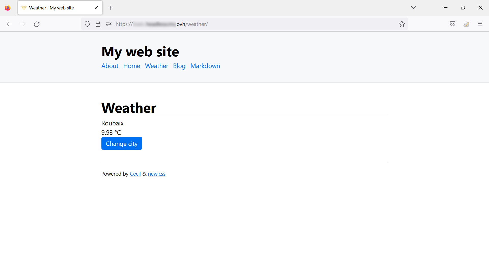
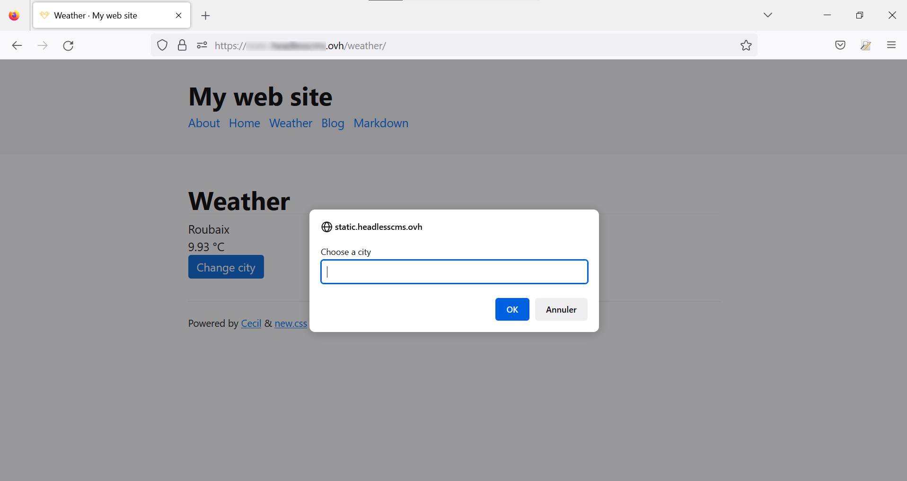

> [!primary]
> Questa traduzione è stata generata automaticamente dal nostro partner SYSTRAN. I contenuti potrebbero presentare imprecisioni, ad esempio la nomenclatura dei pulsanti o alcuni dettagli tecnici. In caso di dubbi consigliamo di fare riferimento alla versione inglese o francese della guida. Per aiutarci a migliorare questa traduzione, utilizza il pulsante "Contribuisci" di questa pagina.
>

**Ultimo aggiornamento: 20/01/2023**

## Obiettivo

Questa guida ti mostra come utilizzare il generatore del sito [Cecil](https://cecil.app){.external} per visualizzare il contenuto di una pagina dinamica. Il tutto chiamando un'API per recuperare e visualizzare le informazioni su una pagina generata via **Cecil**.

**Questa guida ti mostra come aggiungere una chiamata verso un'API esterna dalla tua pagina Web statica.**

> [!warning]
>
> OVHcloud mette a tua disposizione servizi di cui tu sei responsabile per la configurazione e la gestione. Garantirne quotidianamente il corretto funzionamento è quindi responsabilità dell’utente.
> 
> Se hai difficoltà a seguire gli step di questo tutorial, ti consigliamo di rivolgerti a un [professionista specializzato](https://partner.ovhcloud.com/it/directory/). OVHcloud non potrà fornirti alcuna assistenza. Per maggiori informazioni consulta la sezione ["Per saperne di più"](#go-further) di questa guida.
>

## Prerequisiti

- Disporre di una [soluzione di hosting Web OVHcloud](https://www.ovhcloud.com/it/web-hosting/) che include un accesso SSH Questo accesso permette di installare, da riga di comando, una o più soluzioni alternative a quelle proposte di default nelle nostre offerte di hosting Web.
- Aver familiarità con l'inserimento da riga di comando
- Aver installato e configurato l'applicazione **Cecil** sul tuo hosting (consulta [la nostra guida sull'installazione e la configurazione di Cecil](https://docs.ovh.com/it/hosting/install-configure-cecil/))

## Procedura

L'esempio scelto è l'utilizzo di una delle API di un servizio che fornisce dati meteorologici. Questo in base a una città presa dall'utente.

Gli step sono i seguenti:

- creare una nuova pagina su Cecil e aggiungere questa pagina al menu del sito web
- creare un account e recuperare la chiave per effettuare richieste sull'API meteo
- modificare il file.`md` creato aggiungendo il codice HTML
- aggiungere `assets` (JavaScript e CSS)
- generare e testare la soluzione.

### Crea una nuova pagina

Prepara il tuo ambiente di sviluppo accedendo in SSH sul tuo hosting Web e consulta la guida [Installare e configurare Cecil](https://docs.ovh.com/it/hosting/install-configure-cecil/) per installare la tua applicazione **Cecil** in una directory dedicata.

Crea una directory e inserisci:

```bash
mkdir myWebSite
cd myWebSite
```

### Utilizzo dell'API OpenWeather

In questa guida utilizzeremo un'API fornita dal sito [OpenWeather](https://openweathermap.org/){.external}. In questo modo è possibile conoscere le informazioni meteorologiche in base al nome di una città.

Crea un account su <https://home.openweathermap.org/users/sign_up><br>
Una volta confermato l'account (tramite email di conferma), accedi al menu "My API keys". Una chiave è stata generata di default, recuperala e conservala per il seguito di questa guida.

{.thumbnail}

### Aggiunta del codice HTML

Crea una nuova pagina con il seguente comando:

```bash
php cecil.phar new:page weather.md
```

Modifica la pagina generata:

```bash
nano pages/weather.md
```

Modifica l'intestazione del file per far apparire la pagina nel menu:

```
---
title: "Weather"
data: 2022-11-28
published: true
menu: mano
---
```

Dopo l'intestazione, aggiungi il codice HTML per visualizzare la città che hai scelto, le temperature reindirizzate dall'API e un pulsante per cambiare parametro:

```html
---
title: "Weather"
date: 2022-11-28
published: true
menu: main
---
<h1>Weather</h1>
<div>
    <span id="city">Roubaix</span>
    <div id="temperature"><span id="temperatureValue"></span> °C</div>
    <div id="modify">Change city</div>
</div>
```

Genera la pagina HTML con il seguente comando:

```bash
php cecil.phar build
```

Verifica il risultato nel browser e clicca sul link "Weather" che è stato aggiunto nel menu principale:

{.thumbnail}

### Aggiungi il codice JavaScript

Non è possibile aggiungere un tag `<script>` in un file Markdown. Dovrai modificare il template fornito di default.

#### Modifica il template

I template sono disponibili nella directory `layout`. Per visualizzarli, esegui questo comando:

```bash
ls -la layout
```

Il file contiene una directory `blog` e un file `index.html.twig`:

{.thumbnail}

Apri il file `index.html.twig`:

{.thumbnail}

Il file si riferisce a un template che non è presente nella directory. Questo file (e altri) sono in realtà nel file `cecil.phar`. Le estensioni.`phar` designano archivi di file PHP che possono essere manipolati senza decomprimerli.
Elimina i file di questo archivio per renderli visibili:

```bash
php cecil.phar util:extract
```

Mostra nuovamente il contenuto della directory `layout`:

{.thumbnail}

Modifica il template di default per inserire un tag `<script>` che contenga il codice che permette la chiamata all'API:

```bash
nano layouts/_default/page.html.twig
```

Il tag e il suo contenuto devono essere posizionati prima del tag `</body>` in fondo alla pagina:

```twig
    </footer>
    
    
    <script src="{ asset( script.js', {minify: true})}"></script>
    
  </body>
</html>
```

Quando uno o più file `assets` sono modificati, ricostruisci la cache con il seguente comando:

```bash
php cecil.phar cache:clear:assets
```

Se le modifiche non sono effettive sul tuo browser, svuota la cache del browser.
Puoi anche eliminare i file generati sul tuo hosting Web:

```bash
php cecil.phar clear
```

Per ricostruire la tua soluzione utilizza questo comando:

```bash
php cecil.phar build
```

#### Aggiungi il file JavaScript

I file JavaScript, come i file CSS, devono essere inseriti nella directory `assets`. Puoi organizzarli in diverse directory.

Crea il file `script.js` menzionato in precedenza alla root della directory `assets`:

```bash
nano assets/script.js
```

Sostituisci il valore della variabile `apiKey` con la chiave recuperata precedentemente sul sito [OpenWeather](https://openweathermap.org/){.external}

```javascript
let apiKey = '123456789'; // Sostituisci questo valore
let city = 'Roubaix'; // Indica qui la città di default che verrà visualizzata sulla pagina meteo
getTemperature(city);  // Chiamata della funzione che chiama l'API con il parametro 'city'

// Aggiunta di un evento sul click del pulsante "Change city"
let button = document.querySelector('#modify');
button.addEventListener('click', () => {
    city = prompt('Choose a city');
    getTemperature(city);
});

// Funzione di chiamata all'API utilizzando un oggetto XMLHttpRequest per una richiesta asincrona
function getTemperature(city) {
    let url = 'https://api.openweathermap.org/data/2.5/weather?q=' + city + '&appid=' + apiKey + '&units=metric';
    let xhrQuery = new XMLHttpRequest();
    xhrQuery.open('GET', url);
    xhrQuery.responseType = 'json';
    xhrQuery.send();

    xhrQuery.onload = function() {
        if (xhrQuery.readyState === XMLHttpRequest.DONE) {
            if (xhrQuery.status === 200) {
                let city = xhrQuery.response.name;
                let temperature = xhrQuery.response.main.temp;
                document.querySelector('#city').textContent = city;
                document.querySelector('#temperatureValue').textContent = temperature;
            } else {
                alert('A problem has occurred, please come try later.');
            }
        }
    };
}
```

### Test

Consulta il tuo sito Web tramite browser:

{.thumbnail}

Clicca su "Cambia città" e inserisci il nome di un comune:

{.thumbnail}

{.thumbnail}

### Conclusione

Questa guida ti mostra un esempio di integrazione di dati dinamici recuperati da fonti esterne tramite API. Costruisci e fai vivere un sito web modificando manualmente il contenuto di queste pagine o creandone di nuove. Il tutto arricchendo il loro contenuto da altri siti web.

## Per saperne di più

- Alcune API da testare sul tuo sito Web
    - [API Numbers](http://numbersapi.com/#42){.external}
    - [NASA](https://api.nasa.gov/){.external}
    - [News API](https://newsapi.org/){.external}
    - [Polygon.io](https://polygon.io/){.external}
    - una lista di [API pubbliche](https://github.com/public-api-lists/public-api-lists){.external}
- I [comandi Cecil](https://cecil.app/documentation/commands/){.external}.

Per prestazioni specializzate (referenziamento, sviluppo, ecc...), contatta i [partner OVHcloud](https://partner.ovhcloud.com/it/directory/).

Per usufruire di un supporto per l'utilizzo e la configurazione delle soluzioni OVHcloud, consulta le nostre [soluzioni di supporto](https://www.ovhcloud.com/it/support-levels/).

Contatta la nostra Community di utenti all’indirizzo <https://community.ovh.com/en/>.
