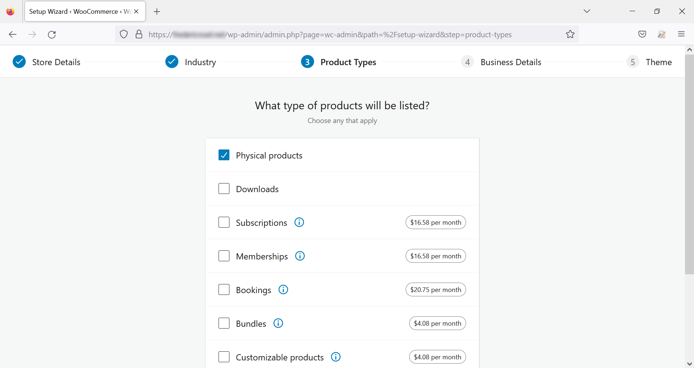
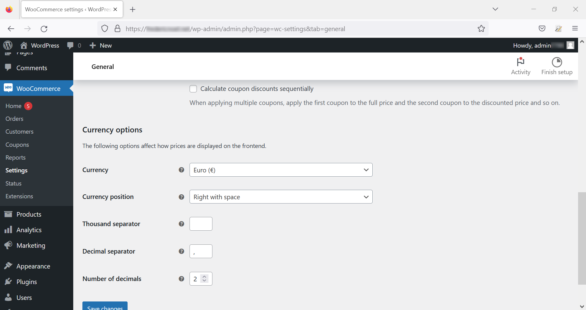

**Última actualización: 23/02/2023**

> [!primary]
> Esta traducción ha sido generada de forma automática por nuestro partner SYSTRAN. En algunos casos puede contener términos imprecisos, como en las etiquetas de los botones o los detalles técnicos. En caso de duda, le recomendamos que consulte la versión inglesa o francesa de la guía. Si quiere ayudarnos a mejorar esta traducción, por favor, utilice el botón «Contribuir» de esta página.
>
  
## Objetivo

Esta guía explica cómo crear una tienda online con la extensión open source **WooCommerce** con el Content Management System (CMS) **WordPress**. 

> [!warning]
>
La configuración, la gestión y la responsabilidad de los servicios que OVHcloud pone a su disposición recaen sobre usted. Por lo tanto, usted deberá asegurarse de que estos funcionan correctamente.
> 
> Ponemos a su disposición este tutorial para ayudarle lo mejor posible en tareas habituales. No obstante, le recomendamos que contacte con un [proveedor especializado](https://partner.ovhcloud.com/es/), [el editor del CMS WordPress](https://wordpress.com/support/){.external} o con [el editor de WooCommerce](https://woocommerce.com/){.external} si tiene alguna dificultad. Nosotros no podremos asistirle. Más información en la sección ["Más información"](#go-further) de este tutorial.
>
  
## Requisitos

- Tener contratado un plan de [hosting de OVHcloud](https://www.ovhcloud.com/es/web-hosting/) que contenga al menos una base de datos.
- Tener un [dominio](https://www.ovhcloud.com/es/domains/).
- Haber contratado previamente [WordPress](https://docs.ovh.com/us/es/hosting/modulos-en-un-clic/) en su alojamiento web.

Si todavía no lo ha hecho, le recomendamos que cambie el sitio web a HTTPS antes de continuar con este tutorial con la guía "[Habilitar HTTPS en un sitio web gracias al SSL](https://docs.ovh.com/us/es/hosting/activar-https-en-un-sitio-web-con-ssl/)".
  
## Procedimiento
  
**WooCommerce** es una extensión de **WordPress**. Se instala como cualquier otra extensión.

### Instalación

Conéctese al panel de administración tecleando `/wp-admin` o utilizando el `/wp-login` en la barra de búsqueda después de la URL del dominio (la redirección se realiza automáticamente):

{.thumbnail}

En el menú de la izquierda, acceda al menú `Extensiones`{.action} y haga clic en `Añadir`{.action}.

{.thumbnail}

En la nueva página `Añadir extensiones`{.action}, introduzca "woocommerce" en la barra de búsqueda situada en la esquina superior derecha y haga clic en `Instalar ahora`{.action} en el recuadro asociado a la extensión **WooCommerce**:

{.thumbnail}

Haga clic en `Activar`{.action}.

{.thumbnail}

### Configuración 

#### Método n°1 - Uso del asistente de configuración

Si todavía no ha configurado la extensión **WooCommerce**, un asistente de configuración le ayudará a introducir la información relativa a su tienda online. Introduzca el formulario y haga clic en `Continuar`{.action} :

{.thumbnail}

A continuación, seleccione el dominio o dominios de actividad:

{.thumbnail}

Elija el tipo de productos que desea vender en su sitio web (algunas opciones son de pago):

{.thumbnail}

Indique a continuación la naturaleza de su actividad:

{.thumbnail}

Añada funcionalidades opcionales (y gratuitas) si lo desea:

{.thumbnail}

Por último, elija un tema entre los propuestos:

{.thumbnail}

**WooCommerce** le solicita entonces para crear una cuenta con el fin de utilizar la extensión **Jetpack**, extensión instalada automáticamente además de la extensión **WooCommerce**. Esta creación de cuenta es opcional y tendrá acceso a las funciones limitadas de **Jetpack** sin tener que autenticarse.

Su tienda online ya está configurada con los parámetros generales.

#### Método n°2 - configuración manual

Haga clic en `Extensions`{.action} para ver las extensiones instaladas y, seguidamente, en `Extensiones instaladas`. Se mostrará una lista de las extensiones. Haga clic en `Ajustes`{.action} en el módulo **WooCommerce** :

{.thumbnail}

También puede acceder a estas configuraciones haciendo clic directamente en el botón `WooCommerce`{.action} y, seguidamente, en `Ajustes`{.action} :

{.thumbnail}

### Ajustes

La página de configuración tiene varias pestañas:

{.thumbnail}

#### General

Esta pestaña le permite definir los siguientes elementos:

- dirección de la empresa
- zonas de venta y entrega
- localización por defecto del cliente (opcional)
- activación/desactivación de impuestos
- cupones
- datos monetarios (divisa del sitio, visualización).

{.thumbnail}

#### Productos

La gestión de los productos se realiza a través de una serie de subsecciones :

- **General**: sirve para definir elementos como la página de inicio que se mostrará por defecto (tienda, menciones legales, cesta, etc.), las unidades de medida, la posibilidad o no de hacer comentarios sobre los productos o notas.
- **Inventario** : sirve para configurar o no la gestión de su stock y configurar el comportamiento del sitio web (stock decretado cuando un objeto está en la canasta, umbrales de alerta, posibilidad de ocultar los productos que ya no están almacenados).
- **Productos descargables**: se refiere a los casos de puesta a disposición de documentos que deben descargar los usuarios.
- **Directorios de descarga aprobados**: especifica el directorio o directorios en el servidor en el que se descargarán los archivos.
- **Avanzado**: se utiliza para configurar más finamente los atributos de los productos.

#### Expedición

Si ha activado las extensiones por defecto gratuitas durante la instalación, dispone de la extensión [WooCommerce Shipping](https://woocommerce.com/es-es/woocommerce-shipping/){.external}. Si no es el caso, puede instalarlo accediendo al menú `Extensiones`{.action}.

- **Zonas de expedición**: permite definir y configurar las zonas de envío.
- **Opciones de entrega**: se utiliza para configurar la aplicación en relación con los gastos de envío.
- **Clases de envío**: pueden utilizarse para agrupar productos similares por tipo de envío.

#### Pagos

Esta pestaña se utiliza para activar o desactivar las formas de pago que ofrece su sitio web. Consulte la [documentación oficial](https://woocommerce.com/document/payments/) para configurar su(s) forma(s) de pago.

#### Cuentas y confidencialidad

Esta sección engloba todas las funcionalidades relativas a la gestión de cuentas y datos personales.

#### Correo electrónico

Permite configurar los *emails tipo* enviados por la aplicación (inscripción, pedidos, cancelaciones de pedido, etc.).

#### Integración

Para geolocalizar a sus clientes en función de su dirección IP, puede introducir en esta subsección la clave de licencia de [MaxMind](https://www.maxmind.com/){.external}, servicio de geolocalización de pago.

#### Adelantado

- **Instalación de las páginas**: útil para cambiar las páginas a las que se redirigirán los usuarios durante el proceso de pedido.
- **API REST**: Sección que permite configurar y configurar los accesos a WooCommerce a través de su API REST.
- **Webhook**: Gestionar las funciones de recordatorio HTTP.
- **Antigua API**: reactivar la antigua API de WooCommerce (desactivada por defecto).
- **WooCommerce.com** : activar o desactivar el rastreo de la actividad de su tienda online por WooCommerce, tener sugerencias para extensiones dedicadas (la mayoría son de pago).
- **Funcionalidades**: Página que reúne las funcionalidades de prueba en WooCommerce o recientemente añadidas.
  
## Más información 

Algunos enlaces útiles:

- El [sitio web oficial de WordPress](https://wordpress.org){.external}.
- La extensión [Jetpack](https://jetpack.com/){.external}.
- El [WooCommerce](https://woocommerce.com/){.external}
- La tienda [WooCommerce extensions](https://woocommerce.com/products/){.external}

Para servicios especializados (posicionamiento, desarrollo, etc.), contacte con [partners de OVHcloud](https://partner.ovhcloud.com/es/).

Si quiere disfrutar de ayuda para utilizar y configurar sus soluciones de OVHcloud, puede consultar nuestras distintas soluciones [pestañas de soporte](https://www.ovhcloud.com/es/support-levels/).

Interactúe con nuestra comunidad de usuarios en <https://community.ovh.com/en/>.