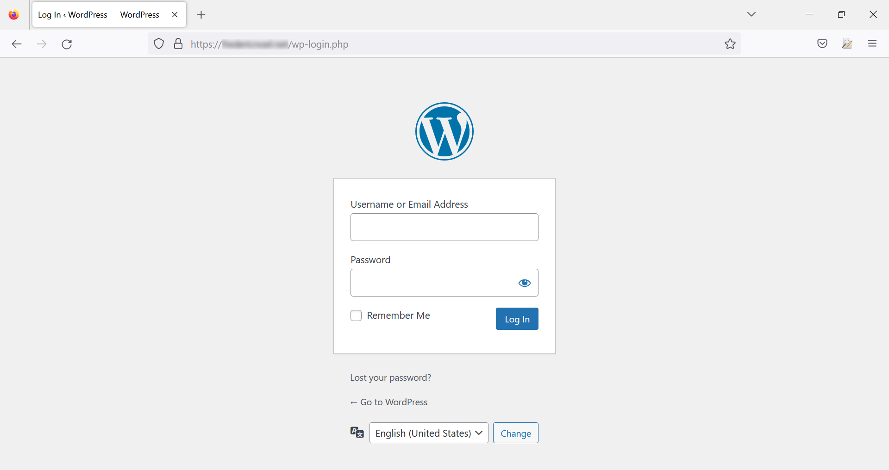
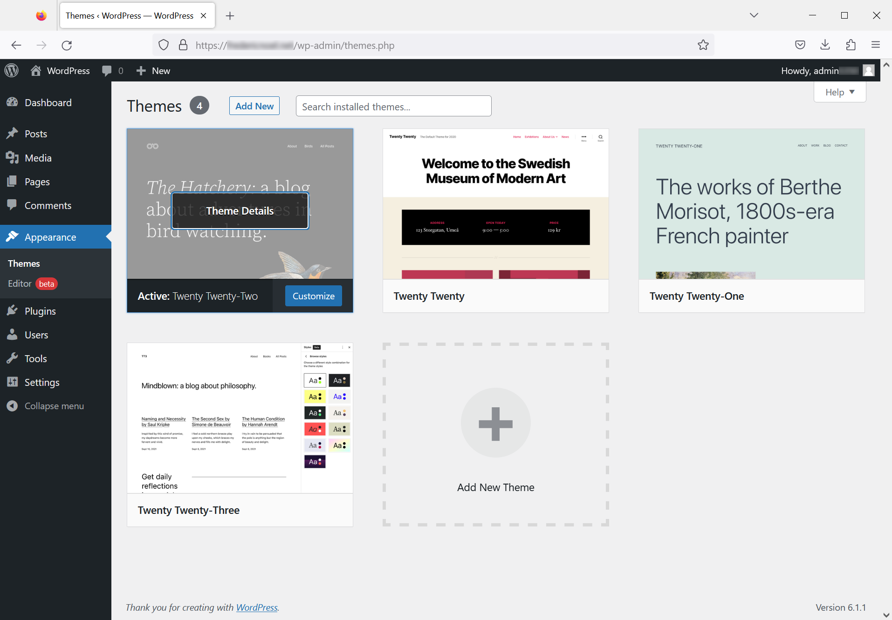
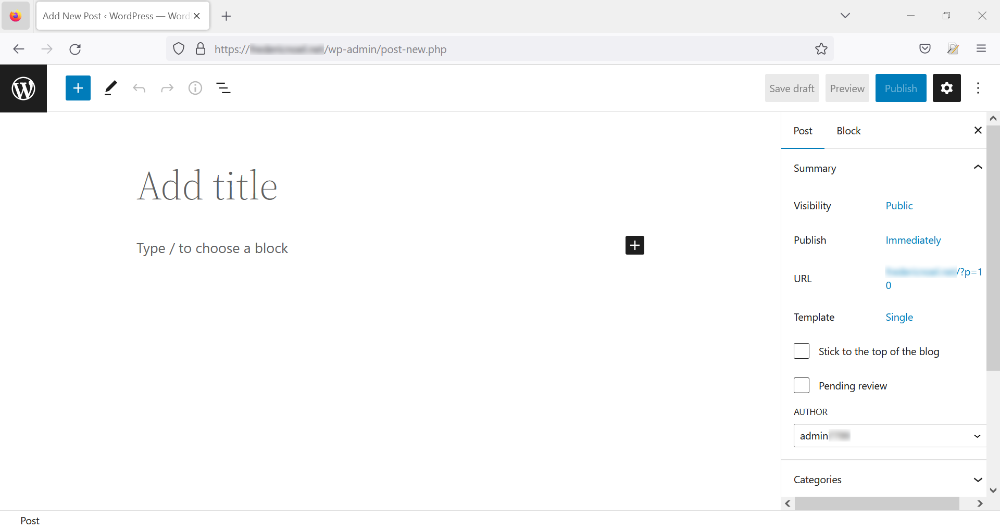
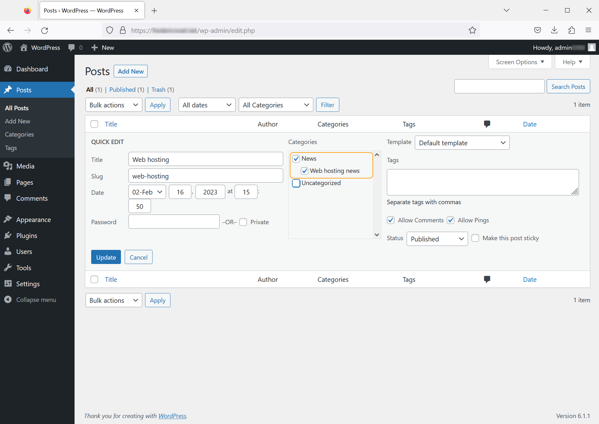
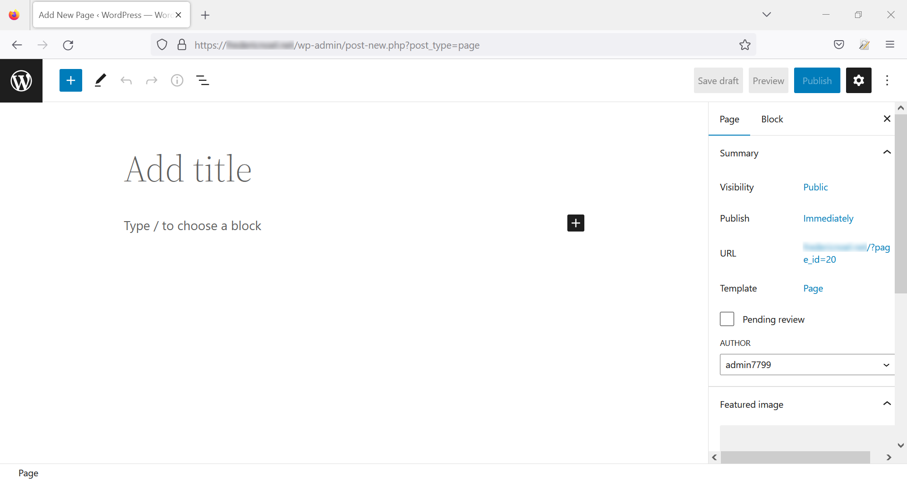
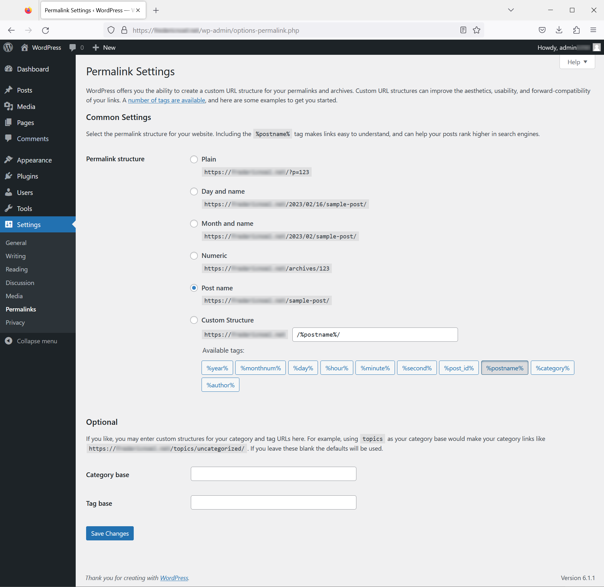

**Last updated 17th February 2023**
  
## Objective

This tutorial will help you create your first content, organise it, put it online and change the theme of your website with the Content Management System (CMS) **WordPress**. You can build your website without any particular knowledge of programming, with a wide range of topics such as a company website, a blog, or even a website to publicise your activity or passion.

> [!warning]
>
> OVHcloud provides services that you are responsible for with regard to their configuration and management. It is therefore your responsibility to ensure that they function properly.
>
> This tutorial is designed to help you with common tasks. Nevertheless, we recommend contacting a [specialist provider](https://partner.ovhcloud.com/asia/) or the [WordPress support](https://wordpress.com/support/){.external} if you encounter any difficulties. We will not be able to assist you. You can find more information in the [Go further](#go-further) section of this guide.
>

**This tutorial explains how to create a website with WordPress CMS.**

## Requirements

- An [OVHcloud web hosting plan](https://www.ovhcloud.com/asia/web-hosting/) that contains at least one database.
- A [domain name](https://www.ovhcloud.com/asia/domains/)
- [WordPress installed](https://docs.ovh.com/asia/en/hosting/web_hosting_web_hosting_modules/) on your web hosting plan
- Access to the [OVHcloud Control Panel](https://ca.ovh.com/auth/?action=gotomanager&from=https://www.ovh.com/asia/&ovhSubsidiary=asia)

## Instructions

If one is not already installed, [add an SSL certificate](https://docs.ovh.com/asia/en/hosting/activate-https-website-ssl/#step-1-activate-the-ssl-certificate-on-the-web-hosting-plan) for the domain name associated with your website before you continue.

When you installed your 1-click CMS, you received an email containing the information you need to follow this tutorial:

- The access link to the administration interface
- The administrator's username
- A link to get the administrator password

Retrieve these items before continuing.

### Log in to the administration interface

Go to the admin interface access link sent by email when you installed the CMS. By default, the URL ends with `wp-admin`. If you have not logged in to your admin interface, **WordPress** will automatically redirect you to a URL ending with `wp-login`:

{.thumbnail}

> [!primary]
> 
> On this homepage, you can change the default language of the **WordPress** interface. Go to the dropdown menu at the bottom of the page, select the language, then confirm by pressing the `Change`{.action} button. The language can be changed anytime.
> 

Enter the login (Administrator's username) that was provided to you by email and the WordPress password indicated in the same email. You will then land on your dashboard:

{.thumbnail}

### Change the theme of your WordPress website

**WordPress themes** are sets of files that allow you to modify the presentation of your website without modifying its content. There are many themes available on the Web, free and paid, with different styles (websites, blogs, e-commerce, online press, etc.).

To change your theme, go to the left-hand menu in your Dashboard, click on `Appearance`{.action} then `Themes`{.action}:

{.thumbnail}

Choose a theme from the list and click on `Activate`{.action}:

{.thumbnail}

You can view the result by opening your website in a browser via your domain name.

### Write an article

WordPress allows you to easily create content without having any web development knowledge.

To create an article, go to the `Posts`{.action} section on the left-hand menu, then click on `Add new`{.action}:

{.thumbnail}

Since version 5, **WordPress** offers an interface to simplify the writing and formatting of articles: **Gutenberg**. This is a WYSIWYG editor ("*what you see is what you get*"). It allows you to compose your page directly by adding items such as titles, paragraphs, lists, images, etc.:

{.thumbnail}

Click `Add title`{.action} to add a title to your page:

{.thumbnail}

To add content, click the `+`{.action} symbol and choose what you want to insert:

{.thumbnail}

On the right side of your page, you can find three links to do the following:

- `Save draft`{.action}, an action you can also do with the `Ctrl` + `S` (or `cmd` + `S` in macOS) key combination
- `Preview`{.action}
- `Publish`{.action} to your website

Click on `View`{.action}, then `Preview in New Tab`{.action}. Choose the type of device to render on (PC, tablet or smartphone).

{.thumbnail}

To return to the **WordPress** administration interface, click on the icon in the top left-hand corner.

### Manage categories

**WordPress** allows you to define categories and associate your articles with one or more of them. To manage categories for your website, go to the `Posts`{.action} section, then to the `Categories`{.action} section:

{.thumbnail}

Now fill in the form to add a new category:

- **Name**: The name of your category as it will appear on your website.
- **Slug**: Element that will appear at the end of your URL (useful for improving your SEO).
- **Parent category**: Allows you to prioritise your categories (the category you create can be a subcategory of an existing category).
- **Description**: Not visible by default, however, the description of your category can be made visible by certain themes.

{.thumbnail}

Once you have entered this information, click the `Add new category`{.action} button:

{.thumbnail}

You can manage the hierarchy of your categories. A new category can be linked to an existing category:

{.thumbnail}

### Assign a category to an item

To assign an item to one or more categories, click `Posts`{.action}. You will have the list containing all the articles and their statuses. Hover over the title of the item you want to classify and click `Quick Edit`{.action}:

{.thumbnail}

You can then edit the categories by checking or unchecking the items listed in the `Categories`{.action} column:

{.thumbnail}

> [!warning]
>
> Selecting a subcategory does not automatically select the parent category.
>

### Create pages

Pages are to be distinguished from articles. They are mainly used to publish content that will not evolve over time, such as legal notices, general conditions of use, etc.

Go to the `Pages`{.action} page:

{.thumbnail}

> [!primary]
>
> A default page is generated when you install **WordPress**. For readability, this page was removed from the example.
>

Click `Add new`{.action}. You will see the Gutenberg editor:

{.thumbnail}

Create and publish your page content:

{.thumbnail}

If you go back to your website's homepage, you will see a link to your new page:

{.thumbnail}

### Improve permalinks

By default, links on your **WordPress** pages are written with a syntax of the type `parameter=value`, where `value` is an integer without explicit meaning. Modifying the syntax of permalinks allows URLs with a more readable format. Your URLs will be easier to interpret and improve your website's SEO.

On the dashboard home page, go to `Settings`{.action} then `Permalinks`{.action}:

{.thumbnail}

You can choose between several types of permalinks. Select the “Publication title”, then confirm at the bottom of the page:

{.thumbnail}

Your links will then be built from the slug you entered when you edited your articles and pages.

## Go further 

- Store your credentials in a password manager like [KeePass](https://keepass.info/){.external}.
- Test online the default editor [Gutenberg](https://wordpress.org/gutenberg/){.external}.
- Some resources where to find WordPress themes:
    - [WordPress Themes](https://wordpress.com/themes){.external}
    - [TemplaMonster](https://www.templatemonster.com/wordpress-themes.php){.external}
    - [Elegant Themes](https://www.elegantthemes.com/){.external}, editor of the theme builder Divi
    - [Elementor](https://elementor.com/){.external}, another theme editor
- Find more resources on the official [WordPress] website (https://wordpress.org/){.external}.

For specialised services (SEO, development, etc.), contact [OVHcloud partners](https://partner.ovhcloud.com/asia/directory/).

If you would like assistance using and configuring your OVHcloud solutions, please refer to our [support offers](https://www.ovhcloud.com/asia/support-levels/).

Join our community of users on <https://community.ovh.com/en/>.