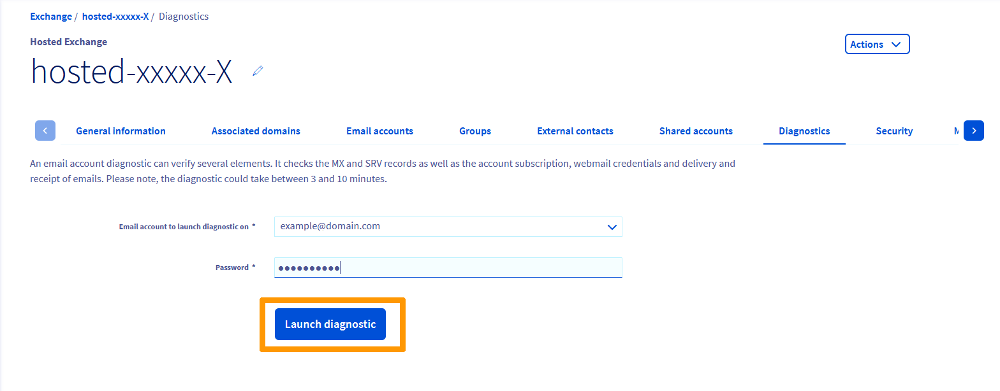

**Last updated 8th July 2022**

## Objective

Since there is a multitude of reasons why errors might occur on Exchange email accounts, an automatic check of the account's functionalities helps to narrow down possible causes. The test results are therefore useful for a support request regarding issues on your Exchange service.

**This guide explains how to launch an Exchange diagnostic check and interpret the results.**

## Requirements

- an [OVHcloud Exchange solution](https://www.ovhcloud.com/en-gb/emails/hosted-exchange/) already set up
- credentials for the Exchange account to be checked
- access to the [OVHcloud Control Panel](https://www.ovh.com/auth/?action=gotomanager&from=https://www.ovh.co.uk/&ovhSubsidiary=GB)

## Instructions

### Running the diagnostic

Log in to your [OVHcloud Control Panel](https://www.ovh.com/auth/?action=gotomanager&from=https://www.ovh.co.uk/&ovhSubsidiary=GB) and switch to `Web Cloud`{.action}. Open `Microsoft`{.action}, then `Exchange`{.action} and select your service.

{.thumbnail}

Click on the tab `Diagnostics`{.action} and choose the Exchange account concerned from the drop-down menu. Enter the account password in the field below, then click on `Launch diagnostic`{.action}. 

{.thumbnail}

The diagnostic routine will take approximately 3 to 10 minutes to complete. Below is an example output of the results:

{.thumbnail}

The results page offers two actions to continue:

- `New diagnostic`{.action}: starts another diagnostic check.

- `Open a support ticket`{.action}: allows you to create a request to our technical support which will include the diagnostic results. 

### Error explanations

Refer to the following summary of possible errors to find the quickest resolution.

### The account has been blocked for sending spam 

A blocked account still receives emails but sending has been disabled by the automatic spam protection system.

You can verify this in the `Email accounts`{.action} tab of your Exchange service. The account will have the `SPAM`{.action} status displayed in the table.

Please follow the instructions in [this guide](../blocked-for-spam/) to enable our security teams to re-enable the account.

### Subscription to the account has expired 

Your subscription is no longer active, sending and receiving has been disabled. 
To reactivate your subscription, simply reconfigure its [billing frequency](https://docs.ovh.com/gb/en/microsoft-collaborative-solutions/manage-exchange-billing/#periodicity) in the [OVHcloud Control Panel](https://www.ovh.com/auth/?action=gotomanager&from=https://www.ovh.co.uk/&ovhSubsidiary=GB).

### Account locked due to the security policy

If there is a security policy activated in the [OVHcloud Control Panel](https://www.ovh.com/auth/?action=gotomanager&from=https://www.ovh.co.uk/&ovhSubsidiary=GB), the account could be temporarily locked. 

You can for example decide that the account will be locked after multiple unsuccessful login attempts, for a period of time determined by you. 

In this case, you can either wait until the account becomes available again or you can contact our Exchange teams by creating a support request.

You can find more information about this topic in the [security policy guide](../manage-security-policy-password/).

### Webmail authentication has failed 

This can be caused by entering an incorrect account password. First verify via a [webmail login](../exchange_2016_outlook_web_app_user_guide/) that the password is correct, then restart the diagnostics.

If necessary, you can change the password of the account concerned in the Exchange tab `Email accounts`{.action} of your [OVHcloud Control Panel](https://www.ovh.com/auth/?action=gotomanager&from=https://www.ovh.co.uk/&ovhSubsidiary=GB). If the issue persists, create a support request.

### The domain MX record is not valid

This error indicates that emails cannot be received and it is also linked to the error "**WARNING: The test email has not been received.**".

Depending on your Exchange service usage, the following MX servers are valid:

- Exchange only: mx0.mail.ovh.net, mx1.mail.ovh.net, mx2.mail.ovh.net, mx3.mail.ovh.net & mx4.mail.ovh.net
- Exchange & POP/IMAP email hosted by OVHcloud: mx0.mail.ovh.net, mx1.mail.ovh.net mx2.mail.ovh.net, mx3.mail.ovh.net & mx4.mail.ovh.net
- Exchange & POP/IMAP email not hosted by OVHcloud: ex<b>?</b>.mail.ovh.net

> [!warning]
> In our guides, we use as the server name: ex<b>?</b>.mail.ovh.net. You will need to replace the "?" with the actual number indicating the appropriate server  for your Exchange service.
>
> You can find this information in the OVHcloud Control Panel, in the `Web Cloud`{.action} section: Open `Microsoft`{.action}, then `Exchange`{.action} and select your service. The server name is displayed in the **Connection** box in the `General Information`{.action} tab.
>

### The domain's SRV record is not valid

The SRV record is essential to the automatic configuration of your Exchange account with a compatible email software such as Microsoft Outlook.

You can verify these settings in your [domain's DNS zone](../../domains/web_hosting_how_to_edit_my_dns_zone/).

Here are the mandatory values for an Exchange service:

Field        | Value
------------ | -------------
Priority     | 0
Weight       | 0
Port         | 443
Target       | [Your hostname](#hostname) (ex<b>?</b>.mail.ovh.net)

### The test email could not be sent from this account 

This error indicates a general email sending failure wich may have several causes:

- [Your account has been suspended](#expired)
- [The password that was entered is incorrect](#password)
- [Your account has been blocked for sending spam](#blocked)
- [An incident has occurred on the infrastructure](https://web-cloud.status-ovhcloud.com/)

## Go further

Join our community of users on <https://community.ovh.com/en/>.
