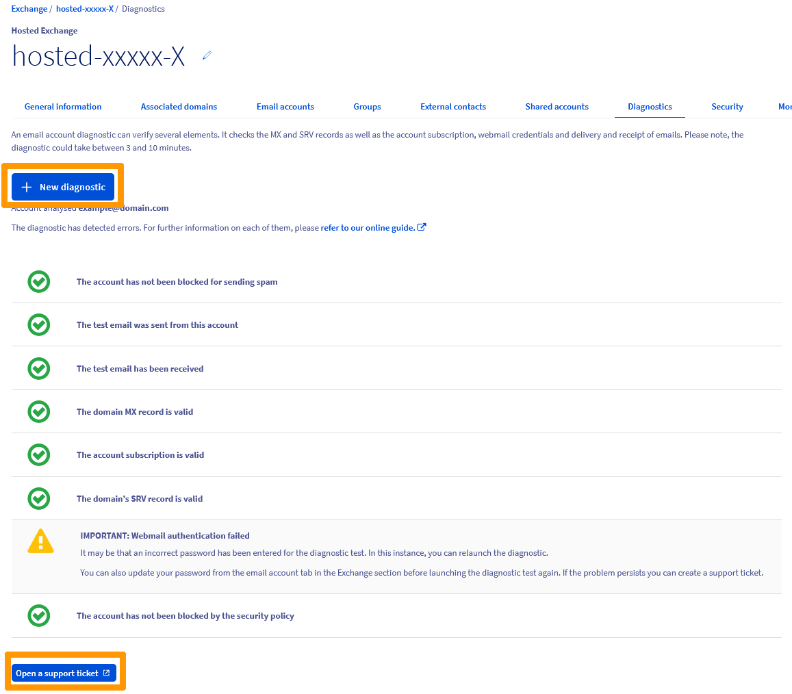

> [!primary]
> Questa traduzione è stata generata automaticamente dal nostro partner SYSTRAN. I contenuti potrebbero presentare imprecisioni, ad esempio la nomenclatura dei pulsanti o alcuni dettagli tecnici. In caso di dubbi consigliamo di fare riferimento alla versione inglese o francese della guida. Per aiutarci a migliorare questa traduzione, utilizza il pulsante "Modifica" di questa pagina.
>

**Ultimo aggiornamento: 08/07/2022**

## Obiettivo

Gli errori sugli account email Exchange possono avere diverse cause. Una diagnostica automatica delle funzionalità dell'account permette di ridurre questo numero di cause. I risultati di questi test saranno utili anche in caso di richiesta di assistenza relativa al tuo servizio Exchange.

**Questa guida ti mostra come avviare una diagnostica Exchange e interpretarne i risultati.**

## Prerequisiti

- Disporre di una [soluzione Exchange OVHcloud](https://www.ovhcloud.com/it/emails/hosted-exchange/) già installata
- Disporre delle credenziali di accesso per l'account Exchange da verificare
- Avere accesso allo [Spazio Cliente OVHcloud](https://www.ovh.com/auth/?action=gotomanager&from=https://www.ovh.it/&ovhSubsidiary=it)
- Essere aggiornato nei [pagamenti](https://docs.ovh.com/it/billing/gestire-fatture-ovhcloud/#pay-bills) di questo servizio e del dominio associato

## Procedura

### Realizza una diagnostica

Accedi allo [Spazio Cliente OVHcloud](https://www.ovh.com/auth/?action=gotomanager&from=https://www.ovh.it/&ovhSubsidiary=it) nella sezione `Web Cloud`{.action}. Seleziona `Microsoft`{.action}, clicca su `Exchange`{.action} e seleziona il tuo servizio.

{.thumbnail}

Clicca sulla scheda `Diagnostica`{.action} e seleziona l'account Exchange nel menu a tendina. Inserisci la password dell'account nel campo corrispondente e clicca su `Avvia la diagnostica`{.action}.

{.thumbnail}

La procedura di diagnostica richiederà circa 3-10 minuti. Ecco un esempio di risultati:

{.thumbnail}

La pagina dei risultati propone due azioni per continuare:

- `Nuova diagnostica`{.action}: avvia un'altra diagnostica.

- `Crea una richiesta di assistenza`{.action}: ti permette di creare un ticket presso il nostro supporto tecnico. Il ticket conterrà i risultati della diagnostica.

### Spiegazione degli errori

Per trovare la soluzione più rapida, consulta il riepilogo seguendo alcuni errori.

### L'account è bloccato per invio di Spam 

Un account bloccato riceve ancora email ma l'invio è stato disattivato dal sistema di protezione automatica contro lo Spam.

Puoi verificarlo nella scheda `Account email`{.action} del tuo servizio Exchange. L'account visualizzerà una dicitura `SPAM` nella colonna "Stato" della tabella.

Consulta la nostra guida [Cosa fare in caso di account bloccato per Spam?](../blocco-per-spam/) per consentire ai nostri team di sicurezza di riattivare l'account.

### L'abbonamento all'account è scaduto 

Il tuo abbonamento non è più attivo e l'invio e la ricezione sono stati disattivati. 
Per riattivare il tuo abbonamento, è sufficiente riconfigurarne la [periodicità di fatturazione](https://docs.ovh.com/it/microsoft-collaborative-solutions/gestisci-fatturazione-exchange/#periodicity) nello [Spazio Cliente OVHcloud](https://www.ovh.com/auth/?action=gotomanager&from=https://www.ovh.it/&ovhSubsidiary=it).

### La politica di sicurezza ha bloccato l'account

Se nello [Spazio Cliente OVHcloud](https://www.ovh.com/auth/?action=gotomanager&from=https://www.ovh.it/&ovhSubsidiary=it) è attiva una politica di sicurezza, l'account può essere temporaneamente bloccato.

Ad esempio, puoi decidere di bloccare l'account dopo diversi tentativi di connessione non andati a buon fine, per un periodo determinato da te.

In questo caso, puoi aspettare che l'account sia nuovamente disponibile o contattare il nostro team Exchange tramite una richiesta di assistenza.

Per maggiori informazioni su questa funzionalità, consulta la nostra [guida sulla politica di sicurezza](../gestire-politica-di-sicurezza-password/).

### L'autenticazione alla Webmail è fallita 

Questa operazione può essere dovuta all'inserimento di una password dell'account non corretta. Verifica che la password sia corretta, accedendo alla [Webmail](../exchange_2016_guida_allutilizzo_di_outlook_web_app/) e riavvia la diagnostica.

Se necessario, modifica la password dell'account nella scheda `Account email`{.action} del tuo [Spazio Cliente OVHcloud](https://www.ovh.com/auth/?action=gotomanager&from=https://www.ovh.it/&ovhSubsidiary=it). Se il problema persiste, crea una richiesta di assistenza.

### Il record MX del dominio non è valido

Questo errore indica che le email non possono essere ricevute e sarà associato anche all'errore "**ATTENZIONE: L'email di test non è stata ricevuta.** ".

In base all'utilizzo del tuo servizio Exchange, i server MX seguenti sono validi:

- Exchange: mx0.mail.ovh.net, mx1.mail.ovh.net mx2.mail.ovh.net, mx3.mail.ovh.net & mx4.mail.ovh.net
- Exchange + E-mail POP/IMAP ospitati da OVHcloud: mx0.mail.ovh.net, mx1.mail.ovh.net mx2.mail.ovh.net, mx3.mail.ovh.net & mx4.mail.ovh.net
- Exchange + E-mail POP/IMAP non ospitati da OVHcloud: ex<b>?</b>.mail.ovh.net

> [!warning]
> Nelle nostre guide, utilizziamo come nome server: ex<b>?</b>.mail.ovh.net. Dovrai sostituire il ""? " dal numero corrispondente al server del tuo servizio Exchange. 
> Queste informazioni sono disponibili nello Spazio Cliente OVHcloud, sezione `Web Cloud`{.action}. Apri `Microsoft`{.action}, poi `Exchange`{.action} e seleziona il tuo servizio. Il nome del server compare nella sezione **Connessione** della scheda `Informazioni generali`{.action}.
>

> [!primary]
>
> Il nome tecnico di un servizio Exchange OVHcloud è composto da un prefisso (**hosted-** o **private-**), da una parte del tuo "identificativo cliente" e da un numero incrementale che indica il numero di servizi Exchange ospitati o privati registrati nel tuo account cliente.
>

### Il record SRV del dominio non è valido

Il record SRV serve alla configurazione automatica del tuo account Exchange con un client di posta compatibile come Microsoft Outlook.

Puoi verificare queste impostazioni nella [zona DNS del tuo dominio](../../domains/web_hosting_modifica_la_tua_zona_dns/).

Ecco i valori per un servizio Exchange:

Campo | Valore
------------ | -------------
sottodominio | _autodiscover._tcp
Priorità | 0
Peso | 0
Porta | 443
Destinazione | [ex<b>?</b>.mail.ovh.net](#hostname)(sostituisci il "?" dal numero corrispondente al server del tuo servizio Exchange)

### Impossibile inviare l'email di test da questo account

Questo errore indica un errore generale nell'invio di email che può avere diverse cause:

- [Il tuo account è stato sospeso](#expired)
- [La password inserita non è corretta](#password)
- [Il tuo account è stato bloccato per invio di posta indesiderata](#blocked)
- [Si è verificato un incidente sull'infrastruttura](https://web-cloud.status-ovhcloud.com/)

## Per saperne di più

Contatta la nostra Community di utenti all’indirizzo <https://community.ovh.com/en/>.
