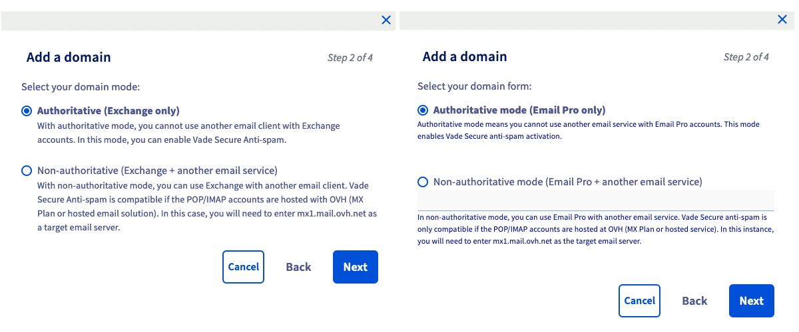
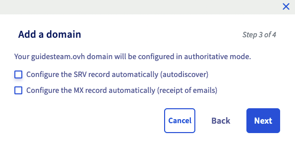

> [!primary]
> Questa traduzione è stata generata automaticamente dal nostro partner SYSTRAN. I contenuti potrebbero presentare imprecisioni, ad esempio la nomenclatura dei pulsanti o alcuni dettagli tecnici. In caso di dubbi consigliamo di fare riferimento alla versione inglese o francese della guida. Per aiutarci a migliorare questa traduzione, utilizza il pulsante "Contribuisci" di questa pagina.
>

**Ultimo aggiornamento: 07/10/2022**

## Obiettivo

Aggiungere un dominio su Exchange è un’operazione fondamentale per utilizzare gli account inclusi in questa soluzione. È anche possibile aggiungere più domini a un servizio Exchange o Email Pro.

**Questa guida ti mostra come aggiungere un dominio alla piattaforma Exchange o Email Pro.**

## Prerequisiti

- Disporre di una soluzione [Exchange](https://www.ovhcloud.com/it/emails/) o [Email Pro](https://www.ovhcloud.com/it/emails/email-pro/)
- Aver registrato uno o più domini
- Poter modificare la configurazione del dominio [zona DNS](https://docs.ovh.com/it/domains/web_hosting_modifica_la_tua_zona_dns/)
- Avere accesso allo [Spazio Cliente OVHcloud](https://www.ovh.com/auth/?action=gotomanager&from=https://www.ovh.it/&ovhSubsidiary=it)

## Procedura

### Accedi alla gestione del tuo servizio

Una volta che il tuo Exchange o Email Pro è stato creato e reso disponibile, è possibile gestirlo dallo [Spazio Cliente OVHcloud](https://www.ovh.com/auth/?action=gotomanager&from=https://www.ovh.it/&ovhSubsidiary=it).

Nella sezione `Web Cloud`{.action}:

- **Exchange**: Clicca su `Microsoft`{.action} e poi su `Exchange`{.action}. 
- **Email Pro**: Clicca su `Email Pro`{.action}.

e seleziona il nome del servizio.

### Aggiungi un dominio

Per aggiungere un dominio, clicca sulla scheda `Domini associati`{.action}, Visualizzi una tabella con tutti i domini associati al tuo servizio. Clicca su `Aggiungi un dominio`{.action} e segui gli step indicati.

> [!warning]
>
> Tutti gli indirizzi creati sul tuo servizio di posta elettronica saranno in grado di visualizzare nella stessa directory tutti gli indirizzi email associati al servizio, inclusi quelli con un dominio diverso. Se vuoi che alcuni domini non vengano visualizzati nella stessa directory, è necessario ordinare una nuova [soluzione Exchange o Email Pro](https://www.ovhcloud.com/it/emails/) per il dominio o i domini interessati.
>

{.thumbnail}

Scegli una delle opzioni disponibili:

- **Seleziona un dominio dalla lista**: vengono mostrati solo i domini configurati con OVHcloud e associati al tuo identificativo cliente

- **Inserisci un dominio non gestito dal tuo account OVHcloud**: per il corretto funzionamento del servizio, assicurati di essere in grado di modificare la configurazione del dominio (zona DNS). In questo caso, è necessario aggiungere un record DNS CNAME.

Una volta effettuata la scelta, clicca su `Continua`{.action}. 

{.thumbnail}

Compare un messaggio con le informazioni relative alla configurazione della modalità del dominio.

- **Se hai inserito un dominio non gestito da OVHcloud**: la modalità non autoritativa verrà configurata di default.

- **Se hai selezionato nella lista un dominio gestito da OVHcloud**: dovrai scegliere tra due modalità.

|Modalità |Descrizione|
|---|---|
|Autoritativa|È la più indicata se con il tuo dominio utilizzi esclusivamente la soluzione Exchange o Email Pro. Non consente l'utilizzo di un altro servizio di posta elettronica.|
|Non autoritativa|È la più indicata se con il tuo dominio utilizzi contemporaneamente la soluzione Exchange o Email Pro e un'altra soluzione email. È necessario indicare il server dell’altra soluzione email.|

> [!primary]
>
> La scelta di una modalità non è definitiva e può essere modificata in un secondo momento direttamente dallo Spazio Cliente OVHcloud.
>

Una volta effettuata la scelta, clicca su `Continua`{.action}. 

{.thumbnail}

**Se il dominio selezionato dalla lista** è gestito da OVHcloud, è possibile configurarlo automaticamente selezionando le caselle e cliccando su `Seguente`{.action}.

**Se il dominio inserito non è gestito da OVHcloud**, la configurazione verrà eseguita nello step successivo.

{.thumbnail}

A questo punto, verifica che le informazioni siano corrette e clicca su `Conferma`{.action} per aggiungere il dominio. Ripeti l’operazione per tutti i domini che vuoi aggiungere.

### Configura il dominio (DNS)

Una volta associato il dominio, assicurati che la sua configurazione sia corretta verificando la colonna “Diagnostica” nella tabella: se le caselle sono verdi significa il dominio è configurato correttamente. Se, invece, sono rosse:

- **se hai scelto una configurazione automatica durante l'aggiunta del dominio**: l'aggiornamento della pagina nello Spazio Cliente OVHcloud potrebbe richiedere alcuni minuti.

- **se hai inserito un dominio non gestito da OVHcloud**: clicca sulla casellina rossa per visualizzare le modifiche da apportare. Se il dominio non utilizza i server DNS OVHcloud, è necessario effettuare le modifiche tramite l’interfaccia di gestione della configurazione del dominio. Per cambiare le impostazioni di un record CNAME, consulta la guida [Creare un record CNAME per aggiungere un dominio associato](https://docs.ovh.com/it/microsoft-collaborative-solutions/exchange_20132016_aggiungi_un_record_di_tipo_cname/).

> [!primary]
>
> La propagazione della modifica della configurazione di un dominio potrebbe richiedere da 4 a 24 ore.
>

Per verificare la correttezza della configurazione di un dominio, clicca di nuovo sulla tabella `Domini associati`{.action} al tuo servizio. Se la casella è diventata verde, significa che il dominio è stato configurato correttamente. In caso contrario, è possibile che la propagazione delle modifiche non sia ancora terminata.

{.thumbnail}

### Configura e utilizza gli account

Una volta aggiunti i domini al servizio, è possibile configurare i tuoi account email. Per effettuare questa operazione, utilizza la scheda `Account email`{.action}. Se necessario, è possibile ordinare account aggiuntivi cliccando sul pulsante `Azione`{.action}/`Ordina account`{.action} o `Aggiungi account`{.action}.

Ti ricordiamo che tutti gli indirizzi creati sul tuo servizio saranno in grado di visualizzare nell'elenco tutti gli indirizzi di questo servizio, inclusi quelli con un dominio diverso.

Una volta completata la configurazione, puoi iniziare a utilizzare i tuoi account. OVHcloud mette a tua disposizione la **Webmail** accessibile all'indirizzo <https://www.ovh.com/it/mail/>. Per un utilizzo ottimale del tuo indirizzo di posta su un software, assicurati che sia compatibile con il servizio. 

Per configurare un account email su un client di posta o un dispositivo come smartphone o tablet o ottenere assistenza sulle funzionalità del tuo servizio di posta, consulta la documentazione disponibile sulle pagine [Exchange](https://docs.ovh.com/it/microsoft-collaborative-solutions/) ed [Email Pro](https://docs.ovh.com/it/emails-pro/).

Le licenze Outlook sono disponibili nello [Spazio Cliente OVHcloud](https://www.ovh.com/auth/?action=gotomanager&from=https://www.ovh.it/&ovhSubsidiary=it) e le licenze Office 365 sono disponibili alla pagina <https://www.ovhcloud.com/it/collaborative-tools/microsoft-365/>. Per utilizzare un client di posta Outlook o una o più applicazioni della suite Office, ti consigliamo di optare per una di queste soluzioni.

### Elimina un dominio da una piattaforma

Per rimuovere un dominio associato al tuo servizio Exchange o Email Pro, è necessario accertarsi che esso non sia associato ad account email, alias, risorse, account condivisi (solo su Exchange), gruppi, contatti esterni o piedi di pagina sempre configurati. In questo caso, sarà necessario **associare questi account a un altro dominio** sulla tua piattaforma o **eliminarli**.

> [!warning]
>
> Prima di eliminare account email, assicurati che non siano utilizzati. Potrebbe essere necessario eseguire un backup di questi account. Se necessario, consulta la guida [Migrare manualmente il tuo indirizzo email](https://docs.ovh.com/it/emails/migrare-i-indirizzi-email-manualmente/) che ti descriverà come esportare i dati di un account dal tuo Spazio Cliente OVHcloud o da un client di posta.

Clicca sulla scheda `Domini associati`{.action} della tua piattaforma. Dalla tabella, la colonna `Account` ti indica il numero di account associati ai domini della tua lista.

{.thumbnail}

Se al dominio da scollegare sono associati account email, è possibile:

- **Associa gli account a un altro dominio**: accedi alla scheda `Account email`{.action}. A destra degli account da modificare, clicca sul pulsante `...`{.action} e poi su `Modifica`{.action}.
    {.thumbnail}
    Dalla finestra di modifica è possibile modificare il dominio associato all'account tramite il menu a tendina.
    {.thumbnail}

- **Elimina gli account della tua piattaforma**: accedi alla scheda `Account email`{.action}. A destra dell'account da eliminare, clicca sul pulsante `...`{.action} e poi `Reimposta questo account`{.action} o `Reimposta`{.action}
    {.thumbnail}

Una volta effettuata la riassegnazione degli account a un altro dominio o la loro reinizializzazione, è possibile procedere alla cancellazione del dominio. 

Dalla scheda `Domini associati`{.action} della tua piattaforma, clicca sul pulsante `...`{.action} a destra del dominio in questione e seleziona `Elimina questo dominio`{.action}.

{.thumbnail}

## Per saperne di più

[Creare un record CNAME per aggiungere un dominio associato](https://docs.ovh.com/it/microsoft-collaborative-solutions/exchange_20132016_aggiungi_un_record_di_tipo_cname/)

[Modifica una zona DNS OVHcloud](https://docs.ovh.com/it/domains/web_hosting_modifica_la_tua_zona_dns/)

Per prestazioni specializzate (referenziamento, sviluppo, ecc...), contatta i [partner OVHcloud](https://partner.ovhcloud.com/it/).
Per usufruire di un supporto per l'utilizzo e la configurazione delle soluzioni OVHcloud, consulta le nostre [soluzioni di supporto](https://www.ovhcloud.com/it/support-levels/)

Contatta la nostra Community di utenti all’indirizzo <https://community.ovh.com/en/>.
