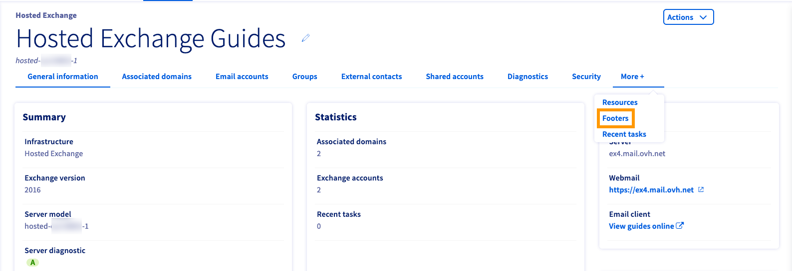

**Ostatnia aktualizacja: 26-03-2020**

## Wprowadzenie

W Panelu klienta OVHcloud można utworzyć uniwersalne podpisy (stopki) dla adresów e-mail używanych w tej samej domenie (podpisy „firmowe”). Będą one dołączane automatycznie do e-maili wysyłanych z konta użytkownika.

**Dowiedz się, jak utworzyć automatyczny podpis przy użyciu Panelu klienta OVHcloud.**

> [!primary]
>
> Choć ten przewodnik dotyczy usług Exchange, z instrukcji można skorzystać również w przypadku kont E-mail Pro.
>

## Wymagania początkowe

- dostęp do [Panelu klienta OVHcloud](https://www.ovh.com/auth/?action=gotomanager&from=https://www.ovh.pl/&ovhSubsidiary=pl)
- skonfigurowane rozwiązanie [OVHcloud Exchange](https://www.ovhcloud.com/pl/emails/hosted-exchange/) lub [E-mail Pro](https://www.ovhcloud.com/pl/emails/email-pro/)

## W praktyce

Najpierw zaloguj się do [Panelu klienta OVHcloud](https://www.ovh.com/auth/?action=gotomanager&from=https://www.ovh.pl/&ovhSubsidiary=pl), przejdź do sekcji „Web” i wybierz usługę Exchange z kolumny znajdującej się w obszarze `Microsoft`{.action} `Exchange`{.action} (po lewej stronie). Kliknij kartę `Więcej+`{.action} w menu poziomym i wybierz pozycję `Stopki`{.action}.

{.thumbnail}

W tej sekcji zobaczysz przyłączone domeny, dla których możesz utworzyć schemat stopki. Kliknij ikonę `...`{.action}, a następnie pozycję `Konfiguracja`{.action}, aby otworzyć edytor HTML.

{.thumbnail}

Edytor umożliwia wybór zmiennych odpowiadających danym użytkownika w ustawieniach konta. Przy użyciu tych zmiennych możesz na przykład utworzyć ogólne zakończenie wiadomości i dodać odpowiedni podpis lub informacje kontaktowe poniżej wiadomości. Kliknij strzałkę w dół, aby wybrać zmienną. Następnie kliknij przycisk `Wstaw zmienną`{.action}, aby dodać ją do okienka edycji.

{.thumbnail}

Stopkę tworzy się przy użyciu tagów HTML, które umożliwiają formatowanie. Dostosuj podpis przy użyciu paska narzędzi u góry. Możesz też zweryfikować kod HTML, klikając przycisk `Źródło`{.action}.
 
{.thumbnail}

Zaznacz pole wyboru „Włącz ten podpis tylko dla poczty wychodzącej”, aby zapobiec dodawaniu stopki do e-maili przesyłanych między użytkownikami w tej samej domenie. Gdy podpis będzie gotowy, kliknij przycisk `Potwierdź`{.action}. Podpis będzie dołączany do e-mali wysyłanych z kont użytkowników tej domeny. Po utworzeniu podpisów można je edytować lub usunąć z poziomu Panelu klienta OVHcloud.

Przed zastosowaniem podpisów u użytkowników weź pod uwagę następujące aspekty:

- Szczegółów konta innych niż „Imię”, „Nazwisko” i „Nazwa wyświetlana” nie można edytować z poziomu Panelu klienta OVHcloud, lecz należy je określić w interfejsie OWA („Opcje”, „Ogólne”, „Moje konto”).

{.thumbnail}

- Podpis zostanie dodany do treści e-maila bez odstępu, co oznacza, że dobrze byłoby zacząć podpis od co najmniej jednego pustego wiersza.
- W interfejsie OWA nie jest wskazane, czy stopka jest aktywna w danej domenie i **nie ma synchronizacji**. Jeśli użytkownicy dodadzą [własne podpisy](../exchange_2016_przewodnik_dotyczacy_korzystania_z_outlook_web_app/#dodawanie-podpisu/), e-maile będą zawierać zarówno ich indywidualną stopkę, jak i ogólną stopkę domeny.
- Edytor obsługuje formatowanie HTML, hiperlinki, obrazy itd. Nie należy jednak zbytnio polegać na tych opcjach. Odbiorcy mogą korzystać z klientów poczty, które blokują kod HTML, i osadzone obrazy lub podpisy mogą wyglądać inaczej niż zamierzono. Tagi HTML zostaną całkowicie usunięte, jeśli według ustawień w interfejsie OWA wiadomość jest wysyłana jako „zwykły tekst”.
- „Inicjały” nie są aktywne w usłudze. Dodanie tej zmiennej nie przyniesie żadnego efektu.

## Sprawdź również

[Korzystanie z interfejsu Outlook Web App wraz z kontem Exchange](../exchange_2016_przewodnik_dotyczacy_korzystania_z_outlook_web_app/)

[Delegowanie uprawnień do konta Exchange](../exchange_2013_przyznanie_uprawnien_full_access/)

[Exchange: współdzielenie kalendarza w interfejsie OWA](../exchange_2016_wspoldzielenie_kalendarza_poprzez_webmail_owa/)

Przyłącz się do społeczności naszych użytkowników na stronie <https://community.ovh.com/en/>.
