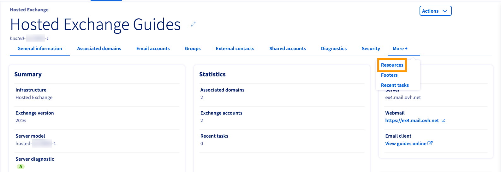
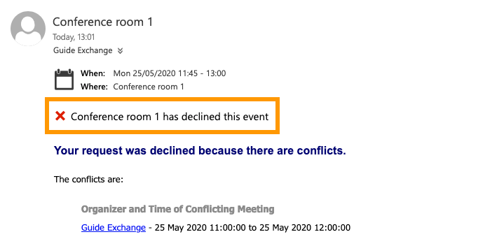

**Última actualización: 22 de diciembre de 2020**

> [!primary]
> Esta traducción ha sido generada de forma automática por nuestro partner SYSTRAN. En algunos casos puede contener términos imprecisos, como en las etiquetas de los botones o los detalles técnicos. En caso de duda, le recomendamos que consulte la versión inglesa o francesa de la guía. Si quiere ayudarnos a mejorar esta traducción, por favor, utilice el botón «Contribuir» de esta página.
> 

## Objetivo

Esta función colaborativa de Exchange permite crear direcciones de correo dedicadas a los recursos de su organización, como las salas de conferencias y los dispositivos compartidos. El uso de estas cuentas de recursos permite optimizar la organización de eventos en un entorno de trabajo colaborativo, proporcionando controles de disponibilidad e integrando los recursos de manera transparente a sus calendarios Exchange.

**Esta guía explica cómo gestionar los recursos desde el área de cliente de OVHcloud y la aplicación Outlook Web App (OWA).**

## Requisitos

- Tener una [solución Exchange de OVHcloud](https://www.ovh.com/world/es/emails/hosted-exchange/) ya configurada.
- Estar conectado al [área de cliente de OVHcloud.](https://ca.ovh.com/auth/?action=gotomanager)
- Disponer de las claves de acceso para las cuentas de correo que tengan acceso al recurso.

## Procedimiento

Conéctese al [área de cliente de OVHcloud](https://ca.ovh.com/auth/?action=gotomanager) y seleccione `Web Cloud`{.action} en la barra de navegación superior. En la columna izquierda, haga clic en `Microsoft`{.action} y seleccione `Exchange`{.action}. A continuación, seleccione el servicio Exchange correspondiente. Abra la pestaña `Plus +`{.action} y haga clic en `Recursos`{.action}.

### 1\. crear un recurso

{.thumbnail}

Haga clic en el botón `Añadir una cuenta de recursos`{.action} para crear su primer recurso. En la nueva ventana, introduzca los siguientes campos:

{.thumbnail}

|Apellidos|Descripción|
|---|---|
|Correo electrónico del recurso|Introduzca la dirección del recurso. Tenga en cuenta que no puede elegir una dirección de correo existente.|
|Nombre del recurso|Nombre completo que aparece en el [área de cliente de OVHcloud](https://ca.ovh.com/auth/?action=gotomanager) y en [el webmail OVHcloud](https://www.ovh.com/world/es/mail/) (OWA).|
|Capacidad|Puede definir el tamaño máximo de un recurso (especificando, por ejemplo, el número de asientos de una pieza o los asientos de un vehículo de empresa compartido).|
|Permitir conflictos|Si esta casilla está marcada, podrá crear eventos de calendario que se solapen e impliquen el mismo recurso.|
|Tipo de recurso|Seleccione el tipo de recurso: "Equipo" o "Sala".|

Haga clic en `Siguiente`{.action} para ir al resumen y confirme la tarea haciendo clic en `Crear`{.action}.

### 2\. utilizar recursos

Los recursos pueden gestionarse desde la pestaña "Recursos". Haga clic en `...`{.action} para editar o eliminar un recurso. También se mostrará la opción `Configurar delegaciones`{.action}. Con esta opción, podrá delegar el acceso del mismo modo que para una cuenta Exchange. Consulte los detalles en [esta guía](../exchange_2013_dar_permisos_full_access_a_una_cuenta/).

{.thumbnail}

### Añadir un calendario de recursos a OWA

> [!primary]
>
Consulte también nuestra guía [Compartir calendarios desde la interfaz OWA](../exchange_2016_compartir_un_calendario_con_el_webmail_owa/).
>

Conéctese a su cuenta Exchange a través del [webmail OVHcloud](https://www.ovh.com/world/es/mail/). Vaya a la interfaz "Calendario" haciendo clic en el botón "Aplicación lanzada" en la esquina superior izquierda y seleccionando el icono `Calendario`{.action}.

{.thumbnail}

En la barra de navegación superior, haga clic en `Añadir un calendario`{.action} y seleccione `En el directorio`{.action}.

{.thumbnail}

Escriba texto para mostrar las sugerencias de sus contactos, escriba una dirección de correo electrónico completa o utilice la opción de búsqueda `Desde el directorio`{.action}. No obstante, en esta etapa debe sugerirse la dirección de correo del recurso, ya que se ha añadido automáticamente a la lista de direcciones global (GAL) al crearlo. Haga clic en `Abrir`{.action} para añadir el calendario de este recurso a la vista general de su calendario.

### Crear un evento en OWA

Para planificar un evento, haga clic en `Nuevo`{.action} en la barra superior y seleccione `Evento de calendario`{.action}. En la nueva ventana, podrá definir los detalles de su evento y añadir el equipo y la ruta necesarios añadiendo los recursos correspondientes.

{.thumbnail}

El gestor de eventos se compone de tres elementos:

#### Detalles

- (1) Añadir un título para el evento: se mostrará en los calendarios.
- (2) Añadir una ubicación o una sala: puede elegir entre sus cuentas de recursos.
- (3) Inicio/Fin: defina la duración del evento.
- (4) Repetir: en su caso, elija un ciclo de repetición (diario, el mismo día cada mes, etc.).
- (5) Recordatorio: OWA muestra una ventana de recordatorio en la hora especificada.
- (6) Mostrar como: seleccione un estado para su calendario de disponibilidad.
- (7) Añadir un recordatorio por correo: una opción que permite enviar recordatorios por correo electrónico a usted mismo o a todos los participantes.

Escriba su invitación en el editor (8) y continúe agregando asistentes a su evento.

Si intenta añadir un recurso ya reservado ("ocupado"), aparecerá un mensaje sugiriendo que utilice el [Asistente de Planificación](./#planificacion) (9), que proporciona una visión general más amplia del calendario del período seleccionado.

#### Contactos

Como una cuenta de recursos es también un contacto, puede añadir salas y equipos en este panel, igual que para los demás participantes (10). Comience a escribir para mostrar las sugerencias de sus contactos, escriba un correo electrónico completo o utilice la opción de búsqueda (haciendo clic en `+`{.action} abrirá sus contactos).

Una vez que haya finalizado la planificación pulsando sobre `Enviar`{.action} en la barra superior, la cuenta de recursos le enviará un mensaje confirmando que está reservada para su evento. Marque la casilla "Solicitar respuestas" si necesita confirmación activa de los invitados para actualizar su calendario automáticamente.

#### Planificación

Un extracto del calendario de sus propios eventos, llamado **Planificar**, aparece a la derecha cuando se añade un recurso o persona al evento. Proporciona una vista gráfica de la disponibilidad de recursos el día elegido. puede definir la hora y la duración del evento directamente haciendo clic con el ratón y seleccionando el menú de la parte superior derecha.

Si lo necesita, haga clic en `Asistente de planificación`{.action} en el panel de **contactos** para abrir una visión general más detallada. Este asistente es útil para eventos más importantes o si tiene que gestionar conflictos, ya que visualiza todo el proceso de planificación. Puede comprobar la disponibilidad y ajustar su planificación seleccionando ubicaciones y contactos, sin salir de esta interfaz.

{.thumbnail}

### Mensajes de respuesta del recurso

Después de crear el evento (haciendo clic en `Enviar`{.action} en la barra superior), Exchange enviará mensajes automáticamente:

- Los participantes recibirán invitaciones (para actualizar los calendarios correspondientes o únicamente los suyos propios, según su elección de "Solicitar respuestas" antes).

- Recibirá un email de confirmación de cada cuenta de recursos elegida (si el recurso está disponible o está reservado, pero que **ha marcado** "Permitir conflictos" durante la creación).

{.thumbnail}

- Recibirá un mensaje de correo electrónico de denegación de cada cuenta de recursos elegida (si el recurso no está disponible y **no ha marcado** "Permitir conflictos" durante la creación).

{.thumbnail}

## Más información

[Consultar una cuenta Exchange desde la interfaz OWA](../exchange_2016_guia_de_uso_de_outlook_web_app/)

[Compartir un calendario desde la interfaz OWA](../exchange_2016_compartir_un_calendario_con_el_webmail_owa/)

[Compartir una carpeta desde la interfaz OWA](../exchange_2016_compartir_una_carpeta_con_el_webmail_owa/)

Interactúe con nuestra comunidad de usuarios en <https://community.ovh.com/en/>.
