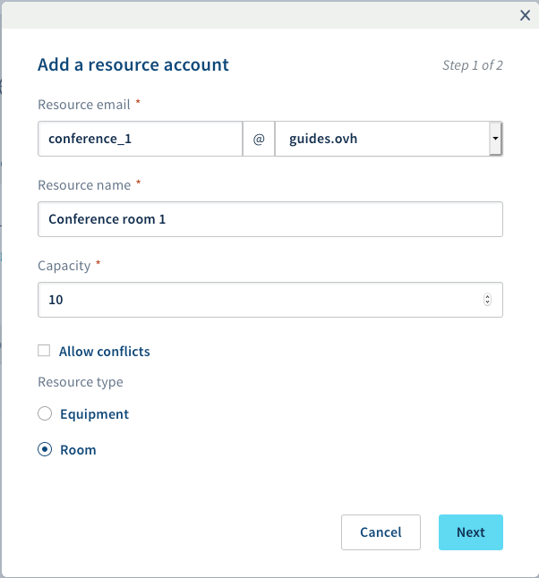
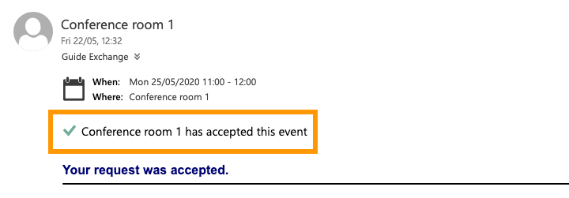

**Ostatnia aktualizacja z dnia 22 grudnia 2020 r**

> [!primary]
> Tłumaczenie zostało wygenerowane automatycznie przez system naszego partnera SYSTRAN. W niektórych przypadkach mogą wystąpić nieprecyzyjne sformułowania, na przykład w tłumaczeniu nazw przycisków lub szczegółów technicznych. W przypadku jakichkolwiek wątpliwości zalecamy zapoznanie się z angielską/francuską wersją przewodnika. Jeśli chcesz przyczynić się do ulepszenia tłumaczenia, kliknij przycisk „Zaproponuj zmianę” na tej stronie.
> 

## Wprowadzenie

Funkcja Exchange pozwala na tworzenie kont e-mail dedykowanych do zasobów Twojej firmy, takich jak sale konferencyjne i wspólne urządzenia. Korzystanie z tych kont zasobów pozwala na zoptymalizowanie organizacji wydarzeń w środowisku pracy zespołowej, poprzez dostarczanie kontroli dostępności i przejrzyste integrowanie zasobów z kalendarzami Exchange.

**Niniejszy przewodnik wyjaśnia, jak zarządzać zasobami przy użyciu Panelu klienta OVHcloud oraz aplikacji Outlook Web App (OWA).**

## Wymagania początkowe

- Posiadanie [rozwiązania Exchange OVHcloud](https://www.ovh.pl/emaile/hosted-exchange/)
- Dostęp do [Panelu klienta OVHcloud](https://www.ovh.com/auth/?action=gotomanager)
- Posiadanie danych do logowania dla konta lub kont poczty elektronicznej mających dostęp do zasobu

## W praktyce

Zaloguj się do swojego [panelu klienta OVHcloud](https://www.ovh.com/auth/?action=gotomanager) i na górnym pasku nawigacji wybierz `Web Cloud`{.action}. Kliknij `Microsoft`{.action} na pasku usług po lewej stronie, a następnie `Exchange`{.action}. Następnie wybierz odpowiednią usługę Exchange. Kliknij kartę `Plus +`{.action}, a następnie `Zasoby`{.action}.

### Etap 1: tworzenie zasobów

{.thumbnail}

Kliknij przycisk `Dodaj konto zasobów`{.action}, aby utworzyć pierwszy zasób. W nowym oknie wprowadź następujące pola:

{.thumbnail}

|Nazwa|Opis|
|---|---|
|E-mail dotyczący zasobu|Wprowadź adres zasobu. Pamiętaj, że nie możesz wybrać istniejącego konta e-mail.|
|Nazwa zasobu|Pełna nazwa wyświetlana jest w [Panelu klienta OVHcloud](https://www.ovh.com/auth/?action=gotomanager) i [w interfejsie Webmail OVHcloud](https://www.ovh.pl/mail/) (OWA).|
|Rozmiar|Można określić maksymalny rozmiar zasobu (np. liczba miejsc siedzących w pomieszczeniu lub siedzeń wspólnego pojazdu).|
|Pozwól na konflikty|Jeśli to pole jest zaznaczone, możesz utworzyć zdarzenia kalendarza pokrywające się i obejmujące ten sam zasób.|
|Rodzaj zasobów|Wybierz rodzaj zasobów: "Sprzęt" lub "Sala".|

Kliknij `Dalej`{.action}, aby przejść do podsumowania, a następnie zatwierdź zadanie, klikając `Utwórz`{.action}.

### Etap 2: korzystanie z zasobów

Możesz zarządzać zasobami, korzystając z tabeli w zakładce "Zasoby". Kliknij `...`{.action}, aby zmienić lub usunąć zasób. Pojawi się również opcja `Konfiguracja uprawnień`{.action}. Dzięki tej opcji będziesz mógł delegować dostęp w taki sam sposób, jak w przypadku konta Exchange. Szczegóły znajdziesz w [tym przewodniku](../exchange_2013_przyznanie_uprawnien_full_access/).

{.thumbnail}

### Dodaj kalendarz zasobów w OWA

> [!primary]
>
Zapoznaj się również z naszym przewodnikiem dotyczącym [Współdzielenia kalendarzy w interfejsie OWA](../exchange_2016_wspoldzielenie_kalendarza_poprzez_webmail_owa/).
>

Zaloguj się do konta Exchange przez [webmail OVHcloud](https://www.ovh.pl/mail/). Przejdź do interfejsu "Harmonogram", klikając "przycisk aplikacji" w lewym górnym rogu, a następnie wybierając ikonę `Kalendarz`{.action}.

{.thumbnail}

Na górnym pasku nawigacji kliknij `Dodaj kalendarz`{.action}, a następnie `Od książki adresowej`{.action}.

{.thumbnail}

Wpisz tekst, aby wyświetlić sugestie swoich kontaktów, wpisz pełny adres e-mail lub skorzystaj z opcji wyszukiwania `Od książki adresowej`{.action}. Na tym etapie należy jednak zaproponować adres e-mail zasobu, ponieważ został on automatycznie dodany do ogólnej listy adresów (LGD) podczas jego tworzenia. Kliknij `Otwórz`{.action}, aby dodać kalendarz tego zasobu do ogólnego widoku kalendarza.

### Utwórz wydarzenie w OWA

Aby zaplanować wydarzenie, kliknij najpierw `Nowy`{.action} na górnym pasku menu i wybierz `Wydarzenie kalendarza`{.action}. W nowym oknie możesz określić szczegóły zdarzenia i dodać wymagane wyposażenie i lokalizację dodając odpowiednie zasoby.

{.thumbnail}

Zarządca zdarzeń składa się z trzech części:

#### Szczegóły

- (1) Dodanie tytułu dla wydarzenia: zostanie to wyświetlone w kalendarzach.
- (2) Dodaj lokalizację lub pokój: możesz wybrać spośród swoich kont zasobów.
- (3) Początek/Zakończenie: zdefiniuj czas trwania wydarzenia.
- (4) Powtarzać: w razie potrzeby wybierz cykl powtarzania (codziennie, w tym samym dniu każdego miesiąca itp.).
- (5) Przypomnienie: OWA wyświetla okno przypomnienia o określonej godzinie.
- (6) Wyświetl jako: wybierz stan Twojego kalendarza.
- (7) Dodaj przypomnienie pocztą: opcja umożliwiająca wysyłanie przypomnień e-mailem do siebie lub wszystkich uczestników.

Wpisz swój komunikat zaproszenia w edytorze (8) i nadal dodawaj uczestników do swojego wydarzenia.

Jeśli chcesz dodać zasób już zarezerwowany ("zajęty"), wyświetli się komunikat i sugeruje użycie [Kreatora Planowania](./#planowanie) (9), który przedstawia szerszy przegląd harmonogramu wybranego okresu.

#### Kontakt

Ponieważ konto zasobów jest również kontaktem, można dodać sale i sprzęt w tej części, tak jak w przypadku innych uczestników (10). Zacznij pisać, aby wyświetlić sugestie swoich kontaktów, wpisać kompletny e-mail lub skorzystać z opcji wyszukiwania (kliknij `+`{.action} otworzy kontakty).

Po zakończeniu planowania klikając na `Wyślij`{.action} na górnym pasku menu, konto zasobów wysyła komunikat, w którym potwierdzisz, że jest zarezerwowane dla wydarzenia. Zaznacz kratkę "Prosimy o odpowiedzi", jeśli potrzebujesz aktywnego potwierdzenia ze strony gości, aby automatycznie zaktualizować kalendarz.

#### Planowanie

Fragment kalendarza swoich własnych wydarzeń, zatytułowany **Planowanie**, pojawia się po prawej stronie, gdy dodajesz zasób lub osobę do wydarzenia. Zapewnia graficzny przegląd dostępności zasobów w wybranym dniu; można określić godzinę i czas trwania zdarzenia bezpośrednio klikając myszką i wybierając menu w prawym górnym rogu.

W razie potrzeby kliknij `Kreator Planowania`{.action} w sekcji **Kontakty**, aby otworzyć jeszcze bardziej szczegółowy przegląd. Ten asystent jest przydatny w najważniejszych wydarzeń lub jeśli musisz zarządzać konfliktami, ponieważ wizualizuje cały proces planowania. Możesz sprawdzić dostępność i zmienić planowanie wybierając lokalizacje i kontakty bez wychodzenia z tego interfejsu.

{.thumbnail}

### Wiadomości odpowiedzi zasobów

Po utworzeniu wydarzenia (kliknij `Wyślij`{.action} na górnym pasku menu), Exchange automatycznie wyśle wiadomości:

- Uczestnicy otrzymają zaproszenia (w celu aktualizacji kalendarzy lub tylko ich kalendarzy, w zależności od wyboru "Prośba o odpowiedzi" wcześniej).

- Otrzymasz e-mail z potwierdzeniem wysłany z każdego wybranego konta zasobów (jeśli zasób jest dostępny lub jest zarezerwowany, ale **zaznaczyłeś** "Zezwalaj na konflikty" podczas tworzenia).

{.thumbnail}

- Otrzymasz e-mail z odmową wychodzącą z każdego wybranego konta zasobów (jeśli zasób nie jest dostępny i **nie zaznaczyłeś** "Pozwalaj na konflikty" podczas tworzenia).

{.thumbnail}

## Sprawdź również

[Sprawdź konto Exchange w interfejsie OWA](../exchange_2016_przewodnik_dotyczacy_korzystania_z_outlook_web_app/)

[Współdzielenie kalendarza w interfejsie OWA](../exchange_2016_wspoldzielenie_kalendarza_poprzez_webmail_owa/)

[Współdzielenie katalogu w interfejsie OWA](../exchange_2016_wspoldzielenie_katalogu_poprzez_webmail_owa/)

Dołącz do społeczności naszych użytkowników na stronie <https://community.ovh.com/en/>.
