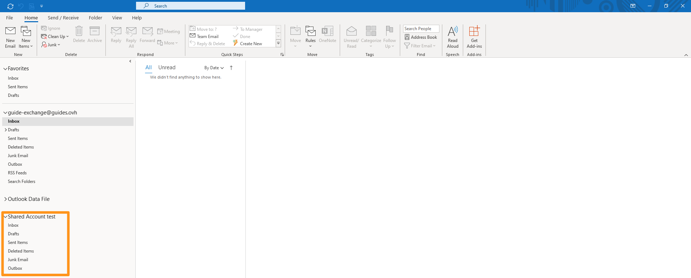

> [!primary]
> Diese Übersetzung wurde durch unseren Partner SYSTRAN automatisch erstellt. In manchen Fällen können ungenaue Formulierungen verwendet worden sein, z.B. bei der Beschriftung von Schaltflächen oder technischen Details. Bitte ziehen Sie beim geringsten Zweifel die englische oder französische Fassung der Anleitung zu Rate. Möchten Sie mithelfen, diese Übersetzung zu verbessern? Dann nutzen Sie dazu bitte den Button «Mitmachen» auf dieser Seite.
>

**Stand 15.06.2021**

## Ziel

Ein **freigegebenes Postfach** ist eine Mailbox, die zwischen mehreren Exchange Accounts geteilt wird und ausschließlich über diese erreichbar ist. Ein freigegebenes Postfach hat kein Passwort. Daher muss der Zugriff auf ein oder mehrere Konten auf der Exchange Plattform delegiert werden.
 Freigegebene Postfächer sind über eine Delegation über OWA (Exchange Webmail) oder das Outlook-E-Mail-Programm erreichbar.

**In dieser Anleitung erfahren Sie, wie Sie ein freigegebenes Exchange Konto auf Ihrer Exchange Plattform erstellen und verwalten.**

## Voraussetzungen

- Sie sind in Ihrem [OVHcloud Kundencenter](https://www.ovh.com/auth/?action=gotomanager&from=https://www.ovh.de/&ovhSubsidiary=de) angemeldet.
- Sie haben ein [OVHcloud Exchange Angebot abonniert](https://www.ovh.de/emails/hosted-exchange/).

## In der praktischen Anwendung

### Freigegebenes Postfach hinzufügen

Melden Sie sich in Ihrem [OVHcloud Kundencenter](https://www.ovh.com/auth/?action=gotomanager&from=https://www.ovh.de/&ovhSubsidiary=de) an. Gehen Sie in den Bereich "Web" und wählen Sie im linken Menü Ihren Exchange Dienst unter `Microsoft`{.action} und `Exchange`{.action}.

Wählen Sie im horizontalen Menü den Tab `Geteilte Accounts`{.action} aus und klicken Sie auf `Freigegebenes Postfach hinzufügen`{.action}.

{.thumbnail}

Geben Sie die angeforderten Felder ein:

|Funktion|Beschreibung|
|---|---|
|E-Mail-Account|Wählen Sie den Namen Ihres freigegebenen Accounts aus. **Es darf sich nicht um eine bestehende E-Mail-Adresse handeln.**|
|Quota|Geben Sie das gewünschte Speicherquota für Ihr freigegebenes Postfach ein. Das maximale Quota beträgt **10 GB für alle Ihre freigegebenen Postfächer**.|
|Anzeigename|Anzeigename, die Sie beim Versand über Ihr freigegebenes Postfach anzeigen möchten.|
|Die Adresse im Adressbuch ausblenden|Das Ausblenden der Adresse im Adressbuch sorgt dafür, dass die Adresse des freigegebenen Postfachs nicht in der Adressliste Ihrer Exchange-Plattform angezeigt wird.|

Klicken Sie dann auf `Weiter`{.action}, um zur Zusammenfassung zu gelangen. Klicken Sie auf `Bestätigen`{.action}.

{.thumbnail}

### Verwaltung der Delegation eines freigegebenen Postfachs

Sobald Ihr freigegebenes Postfach erstellt wurde, muss der Zugriff auf ein oder mehrere Konten Ihrer Plattform delegiert werden.

Ein freigegebenes Postfach ist nicht direkt erreichbar, da dieses kein Passwort besitzt. Sie ist also nicht direkt in einem Client vom Typ Outlook konfigurierbar oder über Webmail erreichbar.

Es muss unbedingt eine Delegation zwischen einem Exchange Account und dem freigegebenen Postfach eingerichtet werden.

Klicken Sie im Tab `Geteilte`{.action} Accounts Ihrer Exchange-Plattform auf den Button `...`{.action} vor dem geteilten Konto und anschließend auf `Delegationen konfigurieren`{.action}. Sie können dann in Ihrer Liste diejenigen auswählen, die die Möglichkeit haben, auf das freigegebene Postfach zuzugreifen.

{.thumbnail}

Wählen Sie für den ausgewählten Account die möglichen Aktionen aus:

|Funktion|Beschreibung|
|---|---|
|Senden als|Erlaubt dem ausgewählten E-Mail-Account, die geteilte E-Mail-Adresse "als" zu versenden.|
|Senden im Auftrag von|Erlaubt dem ausgewählten E-Mail-Account, einen "Versand von" der geteilten E-Mail-Adresse durchzuführen.|
|Auskunftsrecht|Erlaubt dem ausgewählten E-Mail-Account, das freigegebene Postfach über OWA (Webmail) oder Outlook anzuzeigen und zu verwalten.|

Klicken Sie anschließend auf `Weiter`{.action} und `Bestätigen`{.action}, um die Änderungen zu speichern.

{.thumbnail}

In unserem Beispiel erlauben wir den Accounts **guide-exchange@** et **test@**auf das freigegebene **shared_test@**.
 Der E-Mail-Account **guide-exchange@** hat auch das Recht, E-Mails "als" **shared_test@** zu versenden.
 Der E-Mail-Account **test@** kann auch E-Mails "von" **shared_test@** versenden.

### Nutzung des freigegebenen Postfachs über OWA (Webmail)

Verbinden Sie sich mit dem Exchange Webmail (OWA) an der Adresse <https://www.ovh.de/mail/> mit einem E-Mail-Account, der Zugriff auf das freigegebene Postfach hat.
 In unserem Beispiel verbinden wir uns mit dem **guide-exchange@** account.

Wenn Sie eingeloggt sind, klicken Sie in der linken Spalte mit der rechten Maustaste Ihrer E-Mail-Adresse und anschließend auf `Freigegebenen Ordner hinzufügen`{.action}. 

{.thumbnail}

Geben Sie anschließend den Namen Ihres freigegebenen Accounts ein und klicken Sie auf `Hinzufügen`{.action}, wenn dieser im Exchange Verzeichnis gefunden wurde.

{.thumbnail}

In unserem Beispiel ist das freigegebene Postfach nun über den **guide-exchange@** exchange verfügbar.

{.thumbnail}

### Verwendung des freigegebenen Accounts in Outlook

Mit Ihrem Outlook finden Sie Ihr geteiltes Konto in der linken Spalte wieder, genau wie im Webmail.

{.thumbnail}

## Weiterführende Informationen

[Ihren Exchange Account über das OWA Interface einsehen](https://docs.ovh.com/de/microsoft-collaborative-solutions/exchange_2016_verwendung_der_outlook_web_app/)

[Berechtigungen auf einem Exchange Account delegieren](https://docs.ovh.com/de/microsoft-collaborative-solutions/exchange_2013_send_as_versand_als/)

[Einen Kontakt über das OWA Webmail-Interface teilen](https://docs.ovh.com/de/microsoft-collaborative-solutions/exchange_2016_einen_kalender_via_owa_webmail_freigeben/)

[Einen Seitenfuß für Ihre Exchange Accounts hinzufügen](https://docs.ovh.com/de/microsoft-collaborative-solutions/exchange_20132016_automatische_signatur_-_disclaimer/)

Für den Austausch mit unserer User Community gehen Sie auf <https://community.ovh.com/en/>.
