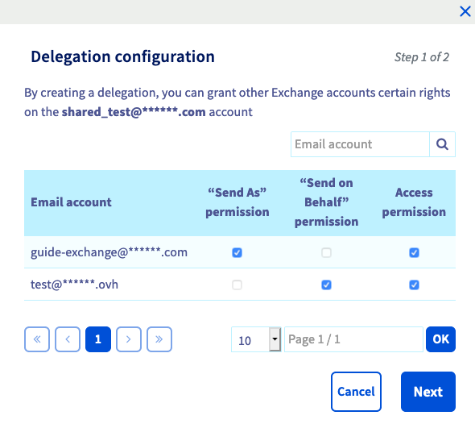

**Last updated 15th June 2021**

## Objective

A **shared account** is a mailbox shared between several Exchange accounts and can only be accessed through them. A shared account does not have a password. It is therefore necessary to delegate its access to one or more Exchange accounts of the same service.
 Shared accounts can be accessed via delegation from OWA (Exchange webmail) or via Outlook email software.

**This guide explains how to create and manage a shared account on your Exchange platform.**

## Requirements

- access to the [OVHcloud Control Panel](https://www.ovh.com/auth/?action=gotomanager&from=https://www.ovh.ie/&ovhSubsidiary=ie)
- an [OVHcloud Exchange solution](https://www.ovhcloud.com/en-ie/emails/hosted-exchange/)

## Instructions

### Adding a shared account

Log in to the [OVHcloud Control Panel](https://www.ovh.com/auth/?action=gotomanager&from=https://www.ovh.ie/&ovhSubsidiary=ie). Go to the `Web Cloud`{.action} section and select your service in under `Microsoft`{.action}, then `Exchange`{.action}.

Select the `Shared accounts`{.action} tab in the horizontal menu and click on `Add a shared account`{.action}.

{.thumbnail}

Fill in the requested fields:

|Field|Description|
|---|---|
|Email account|Choose the name of your shared account. **This must not be an existing email address.**|
|Quota|Enter the storage quota you want for your shared account. The maximum quota is **10 GB for all of your shared accounts**.|
|Display name|The display name you want to appear when sending from your shared account.|
|Hide the address in the directory|By hiding the address in the directory you can ensure that the shared account is not visible in the address list of your Exchange service.|

Click `Next`{.action} to proceed to the summary. Complete the operation by clicking on `Confirm`{.action}.

{.thumbnail}

### Managing the delegation of a shared account

Once you have created your shared account, you will need to grant access permissions to one or more accounts of the Exchange service.

A shared account cannot be accessed directly because it does not have a password. It cannot be configured directly in an Outlook client, or accessed via webmail.

You will need to set up a delegation between an Exchange account and the shared account.

In the `Shared accounts`{.action} tab of your Exchange service, click on the `...`{.action} button next to the shared account, then click `Manage  delegations`{.action}. You can then choose which accounts can access the shared account.

{.thumbnail}

Choose the permissions for the selected account:

|Permission|Description|
|---|---|
|"Send As" permission|Allows the selected email account to send an email as the shared email address.|
|"Send on Behalf" permission|Allows the selected email account to send on behalf of the shared email address.|
|Access permission|Allows the selected email account to view and manage the shared account from OWA or Outlook.|

Then click `Next`{.action} and `Confirm`{.action} to save the changes.

{.thumbnail}

In our example, we allow the accounts **guide-exchange@** and **test@** to access **shared_test@**.
 The account **guide-exchange@** will also have the right to send mails "as" **shared_test@**.
 The account **test@** can also send emails "on behalf of" **shared_test@**.

### Using the account shared from OWA (webmail)

Log in to [webmail](https://www.ovh.ie/mail/) with an Exchange account that has access to the shared account.
 In our example, we connect with the **guide-exchange@** account.

Once you have logged in, right-click on the main tree for your email address in the left-hand column. Select `Add shared folder...`{.action} from the context menu. 

{.thumbnail}

Enter the name of your shared account and click `Add`{.action} when it is found in the Exchange directory.

{.thumbnail}

In our example, the shared account is now accessible from the **guide-exchange@** account.

{.thumbnail}

### Using the shared account from Outlook

In the Outlook application, you will see your shared account in the left-hand column in the same way as in OWA.

{.thumbnail}

## Go further

[Using the Outlook Web App with an Exchange account](../exchange_2016_outlook_web_app_user_guide/)

[Delegating permissions on an Exchange account](../exchange_2013_how_to_grant_full_access_permissions_for_an_account/)

[How to share calendars via OWA](../exchange_2016_how_to_share_calendars_via_owa/)

[Creating automatic signatures](../exchange_20132016_how_to_create_an_automatic_signature/)

Join our community of users on <https://community.ovh.com/en/>.
