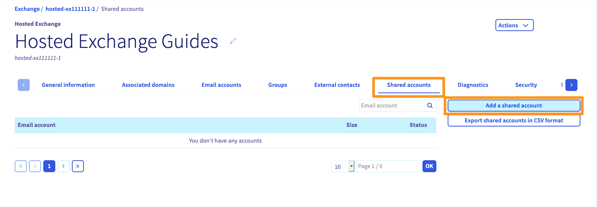
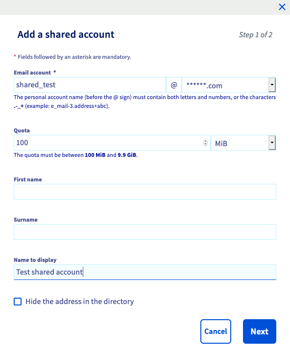

**Dernière mise à jour le 15/06/2021**

## Objectif

Un **compte partagé** est une boîte e-mail partagée entre plusieurs comptes Exchange et uniquement accessible via ces derniers. Un compte partagé ne possède pas de mot de passe, il est donc nécessaire de déléguer son accès à un ou plusieurs comptes de la plateforme Exchange.
 Les comptes partagés sont accessibles, grâce à une délégation, depuis OWA (webmail Exchange) ou via le logiciel de messagerie Outlook.

**Découvrez comment créer et gérer un compte partagé sur votre plateforme Exchange.**

## Prérequis

- Être connecté à votre [espace client OVHcloud](https://ca.ovh.com/auth/?action=gotomanager&from=https://www.ovh.com/ca/fr/&ovhSubsidiary=qc).
- Avoir souscrit une offre [Exchange OVHcloud](https://www.ovhcloud.com/fr-ca/emails/hosted-exchange/).

## En pratique

### Ajouter un compte partagé

Connectez-vous à votre [espace client OVHcloud](https://ca.ovh.com/auth/?action=gotomanager&from=https://www.ovh.com/ca/fr/&ovhSubsidiary=qc). Accédez à la section `Web Cloud`{.action} et sélectionnez votre service sous `Microsoft`{.action} puis `Exchange`{.action}.

Sélectionnez l’onglet `Comptes partagés`{.action} dans le menu horizontal et cliquez sur `Ajouter un compte partagé`{.action}.

{.thumbnail}

Renseignez les champs demandés :

|Fonction|Description|
|---|---|
|Compte e-mail|Choisissez le nom de votre compte partagé. **Il ne doit pas s'agir d'une adresse e-mail existante.**|
|Quota|Indiquez le quota de stockage souhaité pour votre compte partagé. Le quota maximal est de **10 Go pour l'ensemble de vos comptes partagés**.|
|Nom à afficher|Le nom d'affichage que vous souhaitez faire apparaître lors d'un envoi depuis votre compte partagé.|
|Cacher l'adresse dans l'annuaire|Cacher l’adresse dans l’annuaire permet de faire en sorte que l’adresse du compte partagé ne soit pas visible dans la liste des adresses de votre plateforme Exchange.|

Cliquez ensuite sur `Suivant`{.action} pour accéder au récapitulatif. Finalisez l'opération en cliquant sur `Valider`{.action}.

{.thumbnail}

### Gérer la délégation d'un compte partagé

Une fois votre compte partagé créé, il est nécessaire de déléguer son accès à un ou plusieurs comptes de votre plateforme.

Un compte partagé n'est pas directement accessible car celui-ci ne possède pas de mot de passe. Il n'est donc pas configurable directement dans un client de type Outlook, ou accessible depuis le webmail.

Une délégation doit nécessairement être mise en place entre un compte Exchange et le compte partagé.

Depuis l’onglet `Comptes partagés`{.action} de votre plateforme Exchange, cliquez sur le bouton `...`{.action} devant le compte partagé, puis cliquez sur `Configurer les délégations`{.action}. Vous pourrez alors choisir, dans votre liste de comptes, ceux qui auront la possibilité d'accéder au compte partagé.

{.thumbnail}

Choisissez les actions possibles sur le compte sélectionné :

|Fonction|Description|
|---|---|
|Droit d’envoi|Permet au compte e-mail sélectionné de réaliser un envoi « en tant que » l'adresse e-mail partagée.|
|Droit d’envoyer de la part|Permet au compte e-mail sélectionné de réaliser un envoi « de la part de » l'adresse e-mail partagée.|
|Droit d’accès|Autorise le compte e-mail sélectionné à afficher et gérer le compte partagé depuis OWA (webmail) ou Outlook.|

Cliquez ensuite sur `Suivant`{.action} et `Valider`{.action} pour enregistrer les modifications.

{.thumbnail}

Dans notre exemple, nous permettons aux comptes **guide-exchange@** et **test@** d'avoir accès au compte partagé **shared_test@**.
 Le compte e-mail **guide-exchange@** aura aussi le droit d'envoyer des e-mails « en tant que » **shared_test@**.
 Le compte e-mail **test@** pourra aussi envoyer des e-mails « de la part de » **shared_test@**.

### Utilisation du compte partagé depuis OWA (webmail)

Connectez-vous au webmail Exchange (OWA) à l'adresse <https://www.ovh.com/ca/fr/mail/> avec un compte e-mail ayant le droit d'accès au compte partagé. 
 Dans notre exemple, nous nous connectons avec le compte **guide-exchange@**.

Une fois connecté, dans la colonne de gauche, faites un clic droit sur l'arborescence principale de votre adresse e-mail puis sur `Ajouter un dossier partagé`{.action}. 

{.thumbnail}

Saisissez ensuite le nom de votre compte partagé, puis cliquez sur `Ajouter`{.action} lorsque celui-ci a été trouvé dans l'annuaire Exchange.

{.thumbnail}

Dans notre exemple, le compte partagé est maintenant accessible depuis le compte **guide-exchange@**.

{.thumbnail}

### Utilisation du compte partagé depuis Outlook

Depuis votre logiciel Outlook, vous retrouverez votre compte partagé dans la colonne de gauche, de la même façon que sur le webmail.

{.thumbnail}

## Aller plus loin

[Consulter son compte Exchange depuis l’interface OWA](/pages/web/emails/email_owa)

[Déléguer des permissions sur un compte Exchange](../exchange-donner-les-droits-full-access-sur-un-compte/)

[Partager un calendrier via le webmail OWA](/pages/web/microsoft-collaborative-solutions/owa_calendar_sharing)

[Ajouter un pied de page pour vos comptes Exchange](../exchange-signature-automatique-disclaimer/)

Échangez avec notre communauté d'utilisateurs sur <https://community.ovh.com/>.
