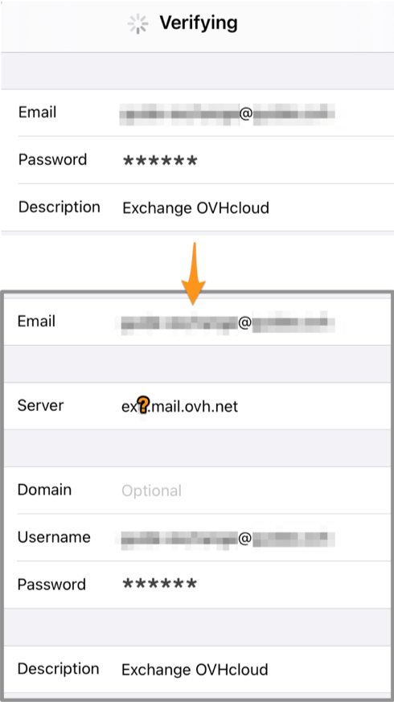

> [!primary]
> Diese Übersetzung wurde durch unseren Partner SYSTRAN automatisch erstellt. In manchen Fällen können ungenaue Formulierungen verwendet worden sein, z.B. bei der Beschriftung von Schaltflächen oder technischen Details. Bitte ziehen Sie beim geringsten Zweifel die englische oder französische Fassung der Anleitung zu Rate. Möchten Sie mithelfen, diese Übersetzung zu verbessern? Dann nutzen Sie dazu bitte den Button «Mitmachen» auf dieser Seite.
>

**Letzte Aktualisierung am 21.05.2020**

## Ziel

Exchange Accounts können auf verschiedenen, kompatiblen E-Mail-Clients eingerichtet werden. So können Sie Ihr bevorzugtes Gerät für Ihre E-Mail-Adressen verwenden.

**Hier erfahren Sie, wie Sie Ihren Exchange Account über die Mail App auf einem iPhone oder iPad einrichten.**

> [!warning]
>
> OVHcloud stellt Ihnen Dienstleistungen zur Verfügung, für deren Konfiguration und Verwaltung Sie die alleinige Verantwortung tragen. Es liegt somit bei Ihnen, sicherzustellen, dass diese ordnungsgemäß funktionieren.
>
> Wir stellen Ihnen diese Anleitung zur Verfügung, um Sie bei alltäglichen Aufgaben bestmöglich zu unterstützen. Dennoch empfehlen wir Ihnen, falls Sie Hilfe brauchen, einen spezialisierten Dienstleister und/oder den Herausgeber des Dienstes zu kontaktieren. Für externe Dienstleistungen bietet OVHcloud leider keine Unterstützung. Genauere Informationen finden Sie im Teil „Weiterführende Informationen" dieser Anleitung.
>

## Voraussetzungen

- Sie verfügen über einen [Exchange E-Mail Account](https://www.ovh.de/emails/){.external}.
- Die Mail App ist auf Ihrem iOS Gerät installiert.
- Sie haben die Login-Daten der E-Mail-Adresse, die Sie einrichten möchten.

## In der praktischen Anwendung

### Account hinzufügen 

> [!primary]
>
> In unserem Beispiel verwenden wir den Servernamen: ex**?**.mail.ovh.net Ersetzen Sie das "?" durch die Zahl für den Server Ihres E-Mail Pro Dienstes.
>
> Diese Zahl finden Sie in Ihrem [OVHcloud Kundencenter](https://www.ovh.com/auth/?action=gotomanager&from=https://www.ovh.de/&ovhSubsidiary=de){.external}  im Bereich `Web Cloud`{.action} und dann `Microsoft`{.action} links.
> Klicken Sie auf `Exchange`{.action} und dann auf die gewünschte Exchange-Plattform. Den Servernamen sehen Sie im Rahmen  **Verbindung** des Tabs `Allgemeine Informationen`{.action}.
>

Gehen Sie auf den Bildschirm Ihres Geräts und klicken Sie auf `Einstellungen`{.action} (Zahnradsymbol). Je nach Ihrer iOS-Version erfolgt das Hinzufügen eines Accounts auf verschiedene Arten:

- **iOS 7, 8, 9 und 10**: tippen Sie auf `Mail, Kontakte, Kalender`{.action} und dann auf `Account hinzufügen`{.action}. Als Accounttyp wählen Sie `Andere`{.action}, und klicken anschließend auf `Mail-Account hinzufügen`{.action}. Gehen Sie dann zu Schritt 5 der folgenden Tabelle.

- **iOS 11**: tippen Sie `auf Accounts und Passwörter`{.action} und dann auf `Account hinzufügen`{.action}. Als Accounttyp wählen Sie `Andere`{.action}, und klicken anschließend auf `Mail-Account hinzufügen`{.action}. Gehen Sie dann zu Schritt 5 der folgenden Tabelle.

- **Für die aktuellen Versionen**: Folgen Sie den Anweisungen in der folgenden Tabelle.

| | |
|---|---|
|{.thumbnail}|1. In `Einstellungen` gehen Sie auf `Mail`.    2. Tippen Sie auf `Accounts`.   3. Tippen Sie auf `Account hinzufügen`.   4. Wählen Sie `Microsoft Exchange`.|
|5. Geben Sie Ihre **E-Mail**-Adresse und eine **Beschreibung** Ihres E-Mail-Accounts ein und tippen Sie auf `Weiter`.  6. Wählen Sie `Manuelle Konfiguration` aus.  |{.thumbnail}|
|{.thumbnail}|7. Geben Sie an:  - Server **ex?.mail.ovh.net** ( ersetzen Sie **?** pro [die Nummer Ihres Exchange Servers](#addaccount)) - Ihre **vollständige E-Mail-Adresse** im Benutzernamen  - das Passwort Ihrer E-Mail-Adresse|
|8. Stellen Sie sicher, dass Sie mindestens `Mail`{.action} auswählen, damit die App diesen Account verwenden kann. Die anderen Apps (wie *Kalender* und *Notizen*) können einige der kollaborativen Funktionen von Exchange nutzen.  9. Tippen Sie auf `Speichern`, um das Hinzufügen Ihres Exchange Accounts abzuschließen.|{.thumbnail}|

Sie können eine Test-E-Mail versenden, um zu überprüfen, ob der Account korrekt eingerichtet ist.

### E-Mail-Adresse verwenden

Wenn Ihre E-Mail-Adresse eingerichtet ist, können Sie sie verwenden. Sie können ab sofort E-Mails versenden und empfangen.

OVHcloud bietet auch eine Webanwendung mit [kollaborativen Exchange](https://www.ovh.de/emails/){.external}-Funktionen unter <https://www.ovh.de/mail/>. Sie können sich mit den Login-Daten Ihrer E-Mail-Adresse anmelden.

> [!primary]
>
> Bei Schwierigkeiten beim Empfang oder beim Versand von E-Mails konsultieren Sie bitte unsere [FAQ zu den OVHcloud E-Mail-Diensten](https://docs.ovh.com/de/emails/e-mails-faq/).
>

## Weiterführende Informationen

[Konfiguration Ihrer E-Mail-Adresse aus dem MX Plan Angebot oder aus einem Webhosting Angebot auf iPhone oder iPad](https://docs.ovh.com/de/emails/mail-konfiguration-iphone-ios-91/)

[Konfiguration von E-Mail Pro auf iPhone oder iPad](https://docs.ovh.com/de/emails-pro/iphone-konfiguration/)

[E-Mails FAQ](https://docs.ovh.com/de/emails/e-mails-faq/)

Für den Austausch mit unserer User Community gehen Sie auf <https://community.ovh.com/en/>.