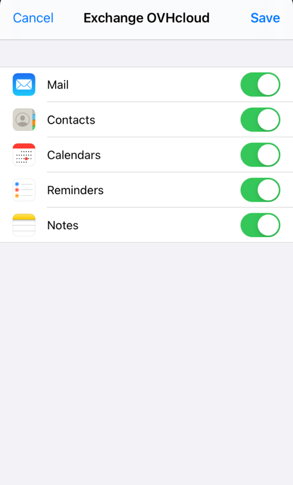

**Last updated 21th May 2021**

## Objective

You can configure Exchange accounts on email clients, if they are compatible. By doing so, you can use your email address through your preferred email application.

**Find out how to configure your Exchange account on iPhone and iPad, via the Mail app.**

> [!warning]
>
> OVHcloud provides services which you are responsible for with regard to their configuration and management. You are therefore responsible for ensuring they function correctly.
>
> This guide is designed to assist you in common tasks as much as possible. Nevertheless, we recommend contacting a specialist provider and/or the service’s software publisher if you encounter any difficulties. We will not be able to assist you ourselves. You can find more information in the “Go further” section of this guide.
>

## Requirements

- You must have an [Exchange email account](https://www.ovh.co.uk/emails/){.external}.
- You need to have the Mail app installed on your iOS device.
- the required credentials for the email address you would like to configure

## Instructions

### Add account 

> [!primary]
>
> In our example, we use the server comment: ex**?*.mail.ovh.net. You will need to replace the "?" by the number designating the server for your Email Pro service.
>
> You can find this figure in your  [OVHcloud ControlPanel](https://www.ovh.com/auth/?action=gotomanager&from=https://www.ovh.co.uk/&ovhSubsidiary=GB){.external}, in the `Web Cloud`{.action} section, then `Microsoft`{.action} on the left.
> Click `Exchange`{.action}, then the Exchange platform you want. The server name is visible in the **Connection** box on the `General Information`{.action} tab.
>

On your device’s homepage, go to `Settings`{.action} (cogwheel icon). There are several ways you can add an account, depending on your iOS version:

- **For iOS 7, 8, 9 and 10**: Go to `Mail, Contacts, Calendar`{.action}, then `Add account`{.action}. Choose `Other`{.action}, then `Add Mail Account`{.action}. Then proceed to step 5 of the following table.

- **For iOS 11**: Go to `Accounts and passwords`{.action}, then `Add account`{.action}. Choose `Other`{.action}, then `Add Mail Account`{.action}. Then proceed to step 5 of the following table.

- **For current** versions: follow the instructions in the following table.

| | |
|---|---|
|{.thumbnail}|1. In `Settings`, go to `Mail`.    2. Tap `Accounts`.   3. Tap `Add Account`.   4. Choose `Microsoft Exchange`.|
|5. Enter your email **address** and email account **description**, tap `Next`.  6. Select `Configure Manual`.  |{.thumbnail}|
|{.thumbnail}|7. Enter:  - the server **ex?.mail.ovh.net** ( replace the **?** by [your Exchange server number](#addaccount)) -your **full email address** in username  - your email password|
|8. Please ensure that you leave `Mail`{.action} ticked, so that the application can use this account. Other applications (e.g. *Calendar* and *Notes*) can use some of some of Exchange’s collaborative features.  9. Tap `Save` to finish adding your exchange account.|{.thumbnail}|

To check that the account has been correctly configured, you can send a test email.

### Use email address

Once you have configured your email address, you can start using it! You can now send and receive emails.

OVHcloud also offers a web application that includes [Exchange collaborative features](https://www.ovh.co.uk/emails/){.external} , accessible via <https://www.ovh.co.uk/mail/>. You can log in using your email credentials.

> [!primary]
>
> If you experience any difficulties receiving or sending emails, please read our [FAQ on OVHcloud](https://docs.ovh.com/gb/en/emails/emails-faq/) email services.
>

## Go further

[Email Hosting - iPhone IOS 9.1 configuration](https://docs.ovh.com/gb/en/emails/email_hosting_iphone_ios_91_configuration/){.external}.

[Configuring an Email Pro solution on iPhone and iPad](https://docs.ovh.com/gb/en/emails-pro/iphone-configuration/){.external}.

[Email FAQ](https://docs.ovh.com/gb/en/emails/emails-faq/)

Join our community of users on <https://community.ovh.com/en/>.