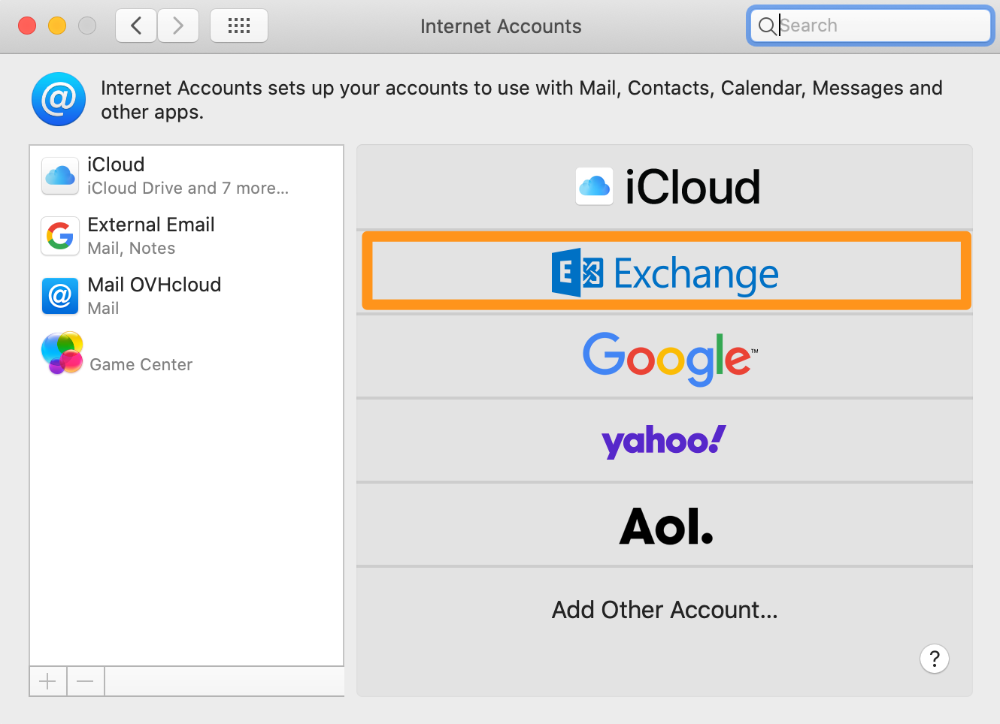
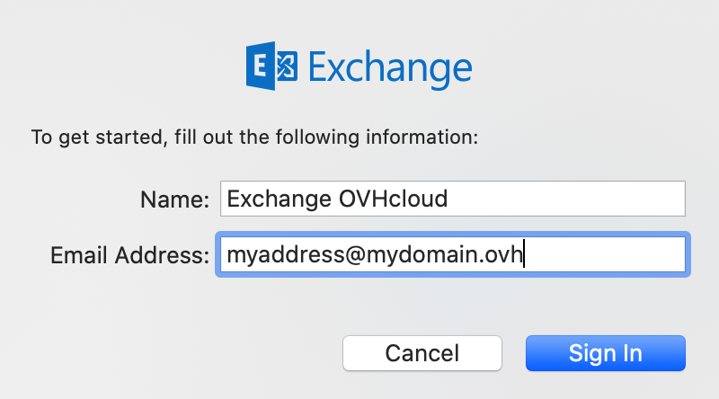

**Stand 28.12.2021**

> [!primary]
> Diese Übersetzung wurde durch unseren Partner SYSTRAN automatisch erstellt. In manchen Fällen können ungenaue Formulierungen verwendet worden sein, z.B. bei der Beschriftung von Schaltflächen oder technischen Details. Bitte ziehen Sie beim geringsten Zweifel die englische oder französische Fassung der Anleitung zu Rate. Möchten Sie mithelfen, diese Übersetzung zu verbessern? Dann nutzen Sie dazu bitte den Button “Mitmachen“ auf dieser Seite.
>

## Ziel

Exchange Accounts können auf verschiedenen kompatiblen E-Mail-Clients eingerichtet werden. So können Sie Ihr bevorzugtes Gerät für Ihre E-Mail-Adressen verwenden. Die Mail App auf macOS ist auf allen Mac kostenlos verfügbar.

**So konfigurieren Sie Ihre Exchange E-Mail-Adresse auf macOS Mail.**

> [!warning]
>
> OVHcloud stellt Ihnen Dienstleistungen zur Verfügung, für deren Konfiguration und Verwaltung Sie die alleinige Verantwortung tragen. Es liegt somit bei Ihnen, sicherzustellen, dass diese ordnungsgemäß funktionieren.
> 
> Wir stellen Ihnen diese Anleitung zur Verfügung, um Ihnen bei der Bewältigung alltäglicher Verwaltungsaufgaben zu helfen. Dennoch empfehlen wir Ihnen, falls Sie Hilfe brauchen, einen [spezialisierten Dienstleister](https://partner.ovhcloud.com/de/directory/) und/oder den Herausgeber des Dienstes zu kontaktieren. Für externe Dienstleistungen bietet OVHcloud leider keine Unterstützung. Genauere Informationen finden Sie im Teil “Weiterführende Informationen“ dieser Anleitung.
> 

## Voraussetzungen

- Sie besitzen eine [Exchange E-Mail-Adresse](https://www.ovhcloud.com/de/emails/hosted-exchange/).
- Sie verfügen über das auf Ihrem Mac installierte Mail-Programm.
- Sie haben die Login-Daten der E-Mail-Adresse, die Sie einrichten möchten.
 
## In der praktischen Anwendung

### Account hinzufügen

- **Beim ersten Start der Anwendung**: Es wird direkt ein Konfigurationsassistent angezeigt und Sie werden gebeten, Ihren Kontotyp zu wählen.

- **Wenn ein Account bereits eingerichtet wurde**: Klicken Sie auf `Mail`{.action} im Menü oben auf Ihrem Bildschirm und dann auf `Accounts`{.action}.

| | |
|---|---|
|{.thumbnail}|Wählen Sie `Exchange aus`{.action}|
|Geben Sie den **Namen** Ihres E-Mail-Accounts und Ihrer **E-Mail-Adresse** ein und klicken Sie auf `Anmelden`{.action}|{.thumbnail}|
|{.thumbnail}|Klicken Sie im folgenden Fenster auf `Manuelle Configuration`{.action}:  - Legen Sie den **Namen** fest, der im Interface für die Navigation angezeigt werden soll  - Hinterlassen Sie Ihre **E-Mail-Adresse** - Lassen Sie Ihr **Passwort** bereits eingegeben   Um die Konfiguration abzuschließen, klicken Sie auf `Anmelden`{.action}|
|Neben Ihren E-Mails können Sie auch andere Exchange Funktionen auswählen, die Sie über Ihren Mac verwalten möchten.|{.thumbnail}|

### E-Mail-Adresse verwenden

Wenn Ihre E-Mail-Adresse eingerichtet ist, können Sie sie verwenden. Sie können ab sofort E-Mails versenden und empfangen.

OVHcloud bietet auch eine Webanwendung, mit der Sie über einen Webbrowser auf Ihre E-Mail-Adresse zugreifen können. Diese ist über <https://www.ovh.de/mail/> verfügbar. Sie können sich mit den Login-Daten Ihrer E-Mail-Adresse anmelden. Für Fragen zur Verwendung lesen Sie unsere Anleitung [Ihren Account über OWA](https://docs.ovh.com/de/microsoft-collaborative-solutions/exchange_2016_verwendung_der_outlook_web_app/).

### Backup Ihrer E-Mail-Adresse abrufen

Wenn Sie eine Änderung vornehmen müssen, die den Verlust der Daten Ihres E-Mail-Accounts zur Folge haben könnte, empfehlen wir Ihnen eine vorherige Sicherung des betreffenden E-Mail-Accounts. Lesen Sie hierzu den Abschnitt “**Exportieren**“ im Abschnitt “**Mail auf Mac OS**“ unserer Anleitung [E-Mail-Adresse manuell migrieren](https://docs.ovh.com/de/emails/email-adressen-manuell-migrieren/#exportieren).

### Bestehende Einstellungen ändern

Wenn Ihr E-Mail-Account bereits eingerichtet ist und Sie auf die Account-Einstellungen zugreifen müssen, um diese zu ändern:

- Klicken Sie auf `Mail`{.action} im Menü oben auf Ihrem Bildschirm und dann auf `Einstellungen`{.action}.
- Wählen Sie in der linken Spalte den betreffenden Account aus und klicken Sie auf `Server-Einstellungen`{.action}.

{.thumbnail}

## Weiterführende Informationen
 
Für den Austausch mit unserer User Community gehen Sie auf <https://community.ovh.com/en/>.
