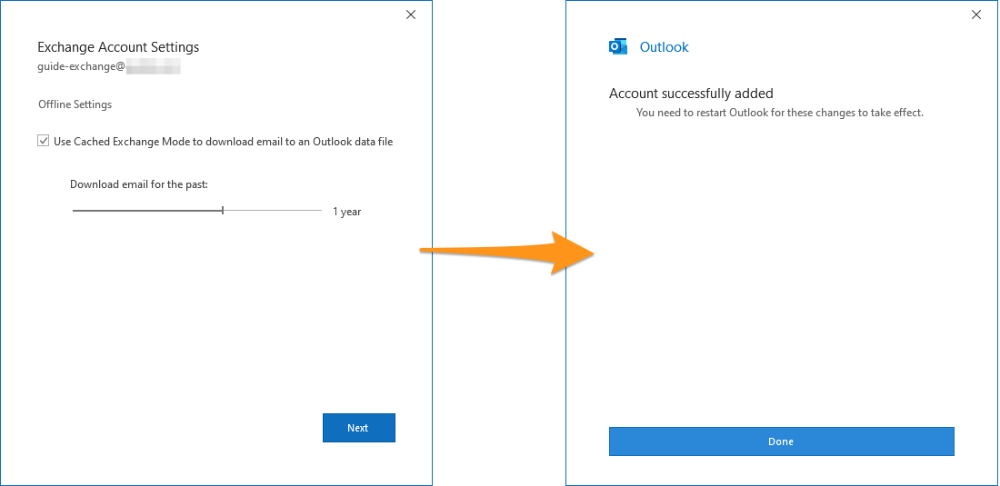

 
**Last updated 5th July 2021**

## Objective

You can configure Exchange accounts on email clients, if they are compatible. By doing so, you can use your email address through your preferred email application. Microsoft Outlook is the recommended software for using an Exchange email address with its collaborative features.

**Find out how to configure an Exchange account in Microsoft Outlook for Windows.**

> [!warning]
>
> OVHcloud provides services which you are responsible for with regard to their configuration and management. You are therefore responsible for ensuring they function correctly.
> 
> We have provided you with this guide in order to help you with common tasks. Nevertheless, we recommend contacting a specialist provider and/or the service’s software publisher if you encounter any difficulties. We will not be able to assist you ourselves. You can find more information in the “Go further” section of this guide.
> 

## Requirements

- an [Exchange](https://www.ovh.co.uk/emails/){.external} solution
- You must have Microsoft Outlook 2016 or later installed on your computer.
- You need to have the required credentials for the email address you would like to configure.
- The OVHcloud SRV record must be correctly configured in the domain name’s DNS zone. Please refer to our guide on [Adding a domain name to an Exchange](https://docs.ovh.com/gb/en/microsoft-collaborative-solutions/adding-domain-exchange/) service.

> [!primary]
>
> Are you using Outlook 2016 and later for Mac? Read our guide: [Configuring your Exchange account in Outlook 2016 for Mac.](https://docs.ovh.com/gb/en/microsoft-collaborative-solutions/configuration-outlook-2016-mac/){.external}
>

## Instructions

### Add account

- **When you start the application for the first time**\: A setup wizard will appear and prompt you to enter your email address.

- **If you have already added an account:** Click `File`{.action} in the menu bar at the top of your screen, then `Add account`{.action}.

- Enter your email address, then click `Advanced options`{.action}. Tick the box that appears next to `Configure my account manually`{.action}, then click `Connection`{.action}. 

{.thumbnail}

- Select **Exchange** from the list of account types.

- Enter your email password in the next window, tick the box to store it, then click `OK`{.action}.

{.thumbnail}

> [!primary]
> 
> If you get a message saying that Outlook was unable to configure your account, this may mean that the OVHcloud SRV field is not correctly configured in your domain name’s DNS zone.
> 
> {.thumbnail}
>
> We recommend that you check the domain name configuration on your Exchange service in your [OVHcloud Control Panel](https://www.ovh.com/auth/?action=gotomanager&from=https://www.ovh.co.uk/&ovhSubsidiary=GB), in the Associated `domains`{.action} tab, then the `Diagnostic`{.action} column of the table.
>

- If your domain name’s configuration is valid, you may receive a login authorisation message for your OVHcloud servers. Accept this to allow your Exchange account to be configured automatically.
- Then determine how often you want to keep your Exchange account items **locally on your computer**. Click `Next`{.action}, and then click `Done`{.action}.

{.thumbnail}

### Use email address

Once you have configured your email address, you can start using it! You can now send and receive emails.

Your Exchange email address and all of its collaborative features are also available via the [OWA](https://www.ovh.co.uk/mail/) interface. If you have any questions about how to use it, please refer to our guide on [Using an Exchange account in the OWA](https://docs.ovh.com/gb/en/microsoft-collaborative-solutions/exchange_2016_outlook_web_app_user_guide/) interface.

### Retrieve a backup of your email address

If you need to make a change that could lead to the loss of your email account data, we advise you to make a backup of the email account concerned beforehand. To do this, please read the “**Export from Windows**” section in our guide on [Migrating your email](https://docs.ovh.com/gb/en/emails/migrate-email-addresses-manually/#exporting-from-windows) address manually.

## Go further

[Configuring your email address provided as part of your MX Plan or web hosting plan in Outlook 2016 for Windows](https://docs.ovh.com/gb/en/emails/configuration-outlook-2016/){.external}.

[Configuring your Email Pro account in Outlook 2016 for Windows](https://docs.ovh.com/gb/en/emails-pro/configuration-outlook-2016/){.external}

Join our community of users on <https://community.ovh.com/en/>.
