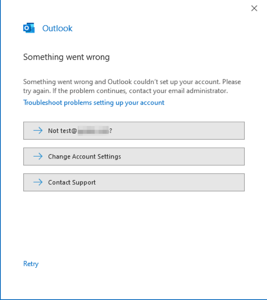

**Dernière mise à jour le 05/07/2021**

## Objectif

Les comptes Exchange peuvent être configurés sur différents logiciels de messagerie compatibles. Cela vous permet d'utiliser votre adresse e-mail depuis l'appareil de votre choix. Microsoft Outlook est le logiciel recommandé pour utiliser une adresse e-mail Exchange avec ses fonctions collaboratives.

**Découvrez comment configurer un compte Exchange sur Microsoft Outlook pour Windows.**

> [!warning]
>
> OVHcloud met à votre disposition des services dont la configuration, la gestion et la responsabilité vous incombent. Il vous revient de ce fait d'en assurer le bon fonctionnement.
> 
> Nous mettons à votre disposition ce guide afin de vous accompagner au mieux sur des tâches courantes. Néanmoins, nous vous recommandons de faire appel à un prestataire spécialisé et/ou de contacter l'éditeur du service si vous éprouvez des difficultés. En effet, nous ne serons pas en mesure de vous fournir une assistance. Plus d'informations dans la section « Aller plus loin » de ce guide.
> 

## Prérequis

- Disposer d'une offre [Exchange](https://www.ovh.com/fr/emails/){.external}.
- Disposer du logiciel Microsoft Outlook 2016 ou ultérieur, installé sur votre ordinateur.
- Posséder les identifiants relatifs à l'adresse e-mail que vous souhaitez paramétrer.
- Le champ SRV d'OVHcloud doit être correctement configuré dans la zone DNS du nom de domaine, n'hésitez pas à consulter notre guide [Ajouter un nom de domaine sur son service Exchange](https://docs.ovh.com/fr/microsoft-collaborative-solutions/ajouter-domaine-exchange/).

> [!primary]
>
> Vous utilisez Outlook 2016 et ultérieur pour Mac ? Consultez notre documentation : [Configurer son compte Exchange sur Outlook 2016 pour Mac](https://docs.ovh.com/fr/microsoft-collaborative-solutions/configuration-outlook-2016-mac/){.external}.
>

## En pratique

### Ajouter le compte

- **Lors du premier démarrage de l'application** : un assistant de configuration s'affiche et vous invite à renseigner votre adresse e-mail.

- **Si un compte a déjà été paramétré** : cliquez sur `Fichier`{.action} dans la barre de menu en haut de votre écran, puis sur `Ajouter un compte`{.action}.

- Renseignez à présent votre adresse e-mail, puis appuyez sur `Options avancées`{.action}. Cochez la case à côté de `Configurer mon compte manuellement`{.action} qui vient d'apparaître, puis cliquez sur `Connexion`{.action}. 

{.thumbnail}

- Parmi les types de comptes, choisissez **Exchange**.

- Renseignez le mot de passe de votre adresse e-mail dans la fenêtre suivante, cochez la case pour le mémoriser puis cliquez sur `OK`{.action}.

{.thumbnail}

> - Si un message vous indique qu'Outlook n'a pas pu paramétrer votre compte, cela peut indiquer que le champ SRV d'OVHcloud n'est pas correctement configuré dans la zone DNS de votre nom de domaine.
> {.thumbnail}
>
> Nous vous conseillons de vérifier la configuration du nom de domaine paramétré sur votre service Exchange dans votre [espace client OVHcloud](https://www.ovh.com/auth/?action=gotomanager&from=https://www.ovh.com/fr/&ovhSubsidiary=fr){.external}, onglet `Domaines associés`{.action}, puis colonne `Diagnostic`{.action} du tableau.
>

- Si la configuration de votre nom de domaine est valide, un message d'autorisation de connexion aux serveurs d'OVHcloud peu apparaître. Acceptez celui-ci pour permettre la configuration automatique de votre compte Exchange.
- Déterminez ensuite la périodicité de conservation des éléments de vote compte Exchange, **en local sur votre ordianteur**. Cliquez sur `suivant`{.action}, puis sur `Terminé`{.action}

{.thumbnail}

### Utiliser l'adresse e-mail

Une fois l'adresse e-mail configurée, il ne reste plus qu’à l'utiliser ! Vous pouvez dès à présent envoyer et recevoir des messages.

Votre adresse e-mail Exchange, ainsi que toutes ses fonctions collaboratives, sont également disponibles via l'interface [OWA](https://www.ovh.com/fr/mail/). Pour toute question relative à son utilisation, n'hésitez pas à consulter notre guide [Consulter son compte Exchange depuis l’interface OWA](https://docs.ovh.com/fr/microsoft-collaborative-solutions/exchange-2016-guide-utilisation-outlook-web-app/).

### Récupérer une sauvegarde de votre adresse e-mail

Si vous devez effectuer une manipulation qui risquerait d'entrainer la perte des données de votre compte e-mail, nous vous conseillons d'effectuer une sauvegarde préalable du compte e-mail concerné. Pour ce faire, consulter le paragraphe « **Exporter depuis Windows** » sur notre guide [Migrer manuellement votre adresse e-mail](https://docs.ovh.com/fr/emails/migrer-ses-adresses-email-manuellement/#exporter-depuis-windows).

## Aller plus loin

[Configurer son adresse e-mail comprise dans l’offre MX Plan ou dans une offre d’hébergement web sur Outlook 2016 pour Windows](https://docs.ovh.com/fr/emails/configuration-outlook-2016/){.external}

[Configurer son compte E-mail Pro sur Outlook 2016 pour Windows](https://docs.ovh.com/fr/emails-pro/configuration-outlook-2016/){.external}

Échangez avec notre communauté d'utilisateurs sur <https://community.ovh.com>.