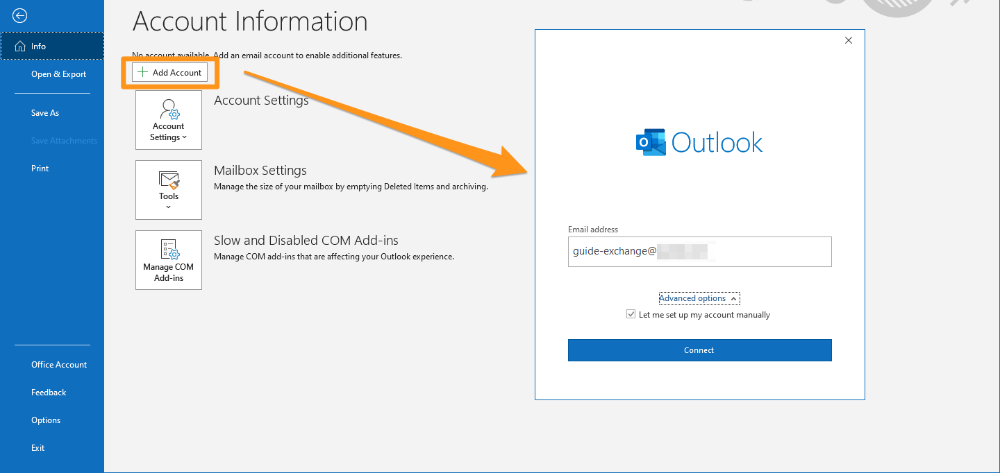

 
> [!primary]
> Tłumaczenie zostało wygenerowane automatycznie przez system naszego partnera SYSTRAN. W niektórych przypadkach mogą wystąpić nieprecyzyjne sformułowania, na przykład w tłumaczeniu nazw przycisków lub szczegółów technicznych. W przypadku jakichkolwiek wątpliwości zalecamy zapoznanie się z angielską/francuską wersją przewodnika. Jeśli chcesz przyczynić się do ulepszenia tłumaczenia, kliknij przycisk "Zgłóś propozycję modyfikacji" na tej stronie.
>
 
**Ostatnia aktualizacja z dnia 05-07-2021**

## Wprowadzenie

Konta Exchange mogą być skonfigurowane w jednym z kompatybilnych programów pocztowych.  Dzięki temu możesz używać Twojego konta e-mail, korzystając z wybranej przez Ciebie aplikacji. Microsoft Outlook jest aplikacją zalecaną do korzystania z konta e-mail Exchange ze swoimi funkcjami współpracy.

**Dowiedz się, jak skonfigurować konto Exchange w programie Microsoft Outlook na urządzeniu z systemem Windows.**

> [!warning]
>
> OVHcloud udostępnia różnorodne usługi, jednak to Ty odpowiadasz za ich konfigurację i zarządzanie nimi. Ponosisz więc odpowiedzialność za ich prawidłowe funkcjonowanie.
> 
> Oddajemy w Twoje ręce niniejszy przewodnik, którego celem jest pomoc w wykonywaniu bieżących zadań. W przypadku trudności zalecamy skorzystanie z pomocy wyspecjalizowanego webmastera lub kontakt z producentem oprogramowania. Niestety firma OVHcloud nie będzie mogła udzielić wsparcia w tym zakresie. Więcej informacji znajduje się w sekcji „Sprawdź również”.
> 

## Wymagania początkowe

- Wykupienie usługi [Exchange](https://www.ovhcloud.com/pl/emails/){.external}.
- Instalacja programu Microsoft Outlook 2016 lub nowszego oprogramowania na Twoim komputerze
- Dane do logowania do konta e-mail, które chcesz skonfigurować
- Pole SRV OVHcloud musi być poprawnie skonfigurowane w strefie DNS domeny. Sprawdź nasz przewodnik [Dodaj domenę do usługi Exchange](https://docs.ovh.com/pl/microsoft-collaborative-solutions/dodanie-domeny-exchange/).

> [!primary]
>
> Używasz programu Outlook 2016 i później na urządzeniu Mac? Zapoznaj się z naszą dokumentacją: [Konfiguracja konta Exchange w programie Outlook 2016 na urządzeniu Mac](https://docs.ovh.com/pl/microsoft-collaborative-solutions/konfiguracja-outlook-2016-mac/){.external}.
>

## W praktyce

### Dodaj konto

- **Podczas pierwszego uruchomienia aplikacji**: wyświetli się asystent konfiguracji i poprosi o wpisanie adresu e-mail.

- **Jeżeli inne konto zostało wcześniej skonfigurowane**: kliknij `Plik`{.action} na pasku menu na górze Twojego ekranu, a następnie kliknij `Dodaj konto`{.action}.

- Wpisz hasło dla Twojego konta e-mail, po czym kliknij `Dalej`{.action}. Zaznacz kratkę obok komunikatu `Pozwól mi ręcznie skonfigurować moje konto `{.action}, a następnie kliknij `Połącz`{.action}. 

{.thumbnail}

- Spośród różnych rodzajów kont wybierz **Exchange**.

- Wpisz hasło przypisane do Twojego konta e-mail w kolejnym oknie, zaznacz kratkę, aby je zapamiętać, następnie kliknij `OK`{.action}.

{.thumbnail}

> [!primary]
> 
> Jeśli pojawi się komunikat, że Outlook nie mógł skonfigurować Twojego konta, może to oznaczać, że pole SRV OVHcloud nie jest poprawnie skonfigurowane w strefie DNS Twojej domeny.
> 
> {.thumbnail}
>
> Zalecamy sprawdzenie konfiguracji domeny w Twojej usłudze Exchange w [Panelu klienta OVHcloud](https://www.ovh.com/auth/?action=gotomanager&from=https://www.ovh.pl/&ovhSubsidiary=pl), w zakładce `Powiązane domeny `{.action}, a następnie w kolumnie `Diagnostyka`{.action} w tabeli.
>

- Jeśli konfiguracja Twojej domeny jest prawidłowa, może pojawić się komunikat o autoryzacji połączenia z serwerami OVHcloud. Zaakceptuj to, aby umożliwić automatyczną konfigurację konta Exchange.
- Następnie określ częstotliwość przechowywania danych na koncie Exchange, dostępna **lokalnie na komputerze**. Kliknij `Dalej`{.action}, a następnie `Zakończ`{.action}.

{.thumbnail}

### Użyj konta e-mail

Po zakończeniu konfiguracji konto jest gotowe do użytku. Możesz teraz zacząć wysyłać i odbierać wiadomości.

Twój adres e-mail Exchange oraz wszystkie jego funkcje do pracy zespołowej są również dostępne w interfejsie [OWA](https://www.ovh.pl/mail/). W przypadku pytań dotyczących korzystania z tego konta, zapoznaj się z naszym przewodnikiem [Sprawdź konto Exchange w interfejsie OWA](https://docs.ovh.com/pl/microsoft-collaborative-solutions/exchange_2016_przewodnik_dotyczacy_korzystania_z_outlook_web_app/).

### Pobierz kopię zapasową Twojego konta e-mail

Jeśli musisz wykonać operację, która może spowodować utratę danych przypisanych do Twojego konta e-mail, zalecamy wykonanie kopii zapasowej odpowiedniego konta e-mail. W tym celu zapoznaj się z sekcją "**Eksport z systemu Windows**" w przewodniku [Ręczna migracja Twojego konta e-mail](https://docs.ovh.com/pl/emails/przenoszenie-kont-e-mail/#eksport-z-systemu-windows).

## Sprawdź również

[Konfiguracja konta e-mail, zawartego w usłudze MX Plan lub usłudze hostingu, w programie Outlook 2016 na urządzeniu z systemem Windows](https://docs.ovh.com/pl/emails/konfiguracja-outlook-2016/){.external}.

[Konfiguracja konta E-mail Pro w programie Outlook 2016 na urządzeniu z systemem Windows](https://docs.ovh.com/pl/emails-pro/konfiguracja-outlook-2016/){.external}

Dołącz do społeczności naszych użytkowników na stronie <https://community.ovh.com/en/>.
