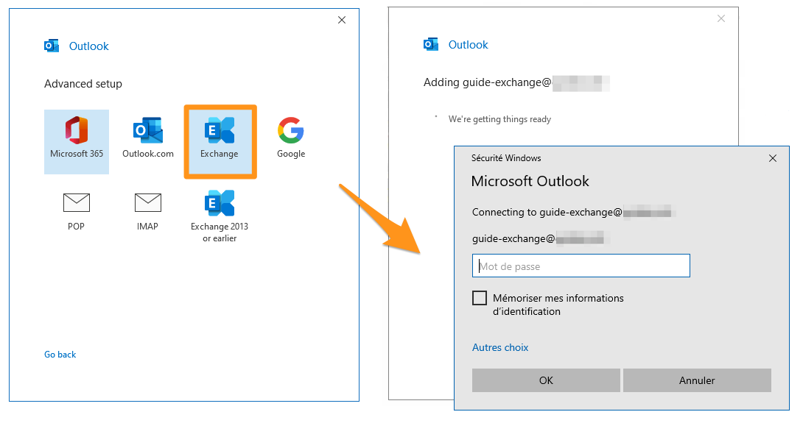

 
> [!primary]
> Esta tradução foi automaticamente gerada pelo nosso parceiro SYSTRAN. Em certos casos, poderão ocorrer formulações imprecisas, como por exemplo nomes de botões ou detalhes técnicos. Recomendamos que consulte a versão inglesa ou francesa do manual, caso tenha alguma dúvida. Se nos quiser ajudar a melhorar esta tradução, clique em "Contribuir" nesta página.
>
 
**Última atualização: 05/07/2021**

## Objetivo

As contas Exchange podem ser usadas com vários softwares de e-mail (desde que sejam compatíveis). Isto permite-lhe usar o seu endereço de e-mail no dispositivo que preferir. Microsoft Outlook é o software recomendado para utilizar um endereço de e-mail Exchange com as suas funções colaborativas.

**Saiba como configurar uma conta Exchange no Microsoft Outlook para Windows.**

> [!warning]
>
> A responsabilidade sobre a configuração e a gestão dos serviços que a OVHcloud disponibiliza recai sobre o utilizador. Assim, deverá certificar-se de que estes funcionam corretamente.
> 
> Este manual fornece as instruções necessárias para realizar as operações mais habituais. No entanto, se encontrar dificuldades, recomendamos que recorra a um [prestador de serviços especializado](https://partner.ovhcloud.com/pt/directory/) e/ou que contacte o editor do serviço. Não poderemos proporcionar-lhe assistência técnica. Para mais informações, aceda à secção «Quer saber mais?» deste guia.
> 

## Requisitos

- Ter o serviço [E-mail Pro](https://www.ovhcloud.com/pt/emails/){.external}.
- Dispor do programa Microsoft Outlook 2016 ou posterior, instalado no seu computador.
- Dispor das credenciais do endereço de e-mail que pretende configurar.
- O campo SRV da OVHcloud deve estar corretamente configurado na zona DNS do domínio. Por favor, consulte o nosso guia [Adicionar um domínio ao serviço Exchange](/pages/web/microsoft-collaborative-solutions/exchange_adding_domain).

> [!primary]
>
> Utiliza o Outlook 2016 e posterior para Mac? consulte o nosso manual [Configurar uma conta Exchange no Outlook 2016 para Mac](/pages/web/microsoft-collaborative-solutions/how_to_configure_outlook_2016_mac){.external} (versão em inglês).
>

## Instruções

### Adicionar a conta

- **Se for a primeira vez que utiliza a aplicação**, aparecerá um assistente de configuração que lhe irá solicitar o seu endereço de e-mail.

- **Se já tem uma conta configurada**, clique em `Ficheiro`{.action} e selecione `Adicionar Conta`{.action}.

- Introduza o seu endereço de e-mail e clique em `Opções avançadas`{.action}. De seguida, selecione a caixa `Permitir configurar manualmente a minha conta`{.action} e clique em `Ligar`{.action}. 

{.thumbnail}

- Entre os diferentes tipos de conta, selecione **Exchange**.

- Introduza a palavra-passe do seu endereço de e-mail na janela seguinte, selecione a caixa para a memorizar e clique em `OK`{.action}.

{.thumbnail}

> [!primary]
> 
> Se receber uma mensagem indicando que o Outlook não pôde configurar a sua conta, isso poderá indicar que o campo SRV da OVHcloud não está corretamente configurado na zona DNS do seu domínio.
> 
> {.thumbnail}
>
> Sugerimos que verifique a configuração do domínio configurado no seu serviço Exchange na [Área de Cliente OVHcloud](https://www.ovh.com/auth/?action=gotomanager&from=https://www.ovh.pt/&ovhSubsidiary=pt), no separador `Domínios associados`{.action} e na coluna `Diagnóstico`{.action} da tabela.
>

- Se a configuração do domínio estiver válida, poderá aparecer uma mensagem de autorização de ligação aos servidores da OVHcloud. Aceite este último para permitir a configuração automática da sua conta Exchange.
- Determine a periodicidade de conservação dos elementos da sua conta Exchange, **localmente no seu computador**. Clique em `Seguinte`{.action} e, a seguir, em `Terminado`{.action}.

{.thumbnail}

### Utilizar o endereço de e-mail

Após a configuração, a conta de e-mail está pronta a usar e pode começar a enviar e receber mensagens no seu dispositivo.

O seu endereço de e-mail Exchange, bem como todas as suas funções de colaboração, estão igualmente disponíveis através da interface [OWA](https://www.ovh.pl/mail/). Para qualquer questão relativa à sua utilização, não hesite em consultar o nosso guia [Consultar a sua conta Exchange a partir da interface OWA](/pages/web/emails/email_owa).

### Recuperar um backup do seu endereço de e-mail

Se tiver de efetuar uma operação suscetível de causar a perda dos dados da sua conta de e-mail, sugerimos que efetue uma cópia de segurança da conta de e-mail em questão. Para isso, consulte o manual "**Exportar do Windows**" no manual [Migrar o seu endereço de e-mail](/pages/web/emails/manual_email_migration#exportar-a-partir-do-windows).

## Quer saber mais?

[Configurar um endereço de e-mail no Outlook 2016 para Windows](/pages/web/emails/how_to_configure_outlook_2016){.external}

[Configurar uma conta Email Pro no Outlook 2016 para Windows](/pages/web/emails-pro/how_to_configure_outlook_2016){.external}

Fale com a nossa comunidade de utilizadores: <https://community.ovh.com/en/>.
