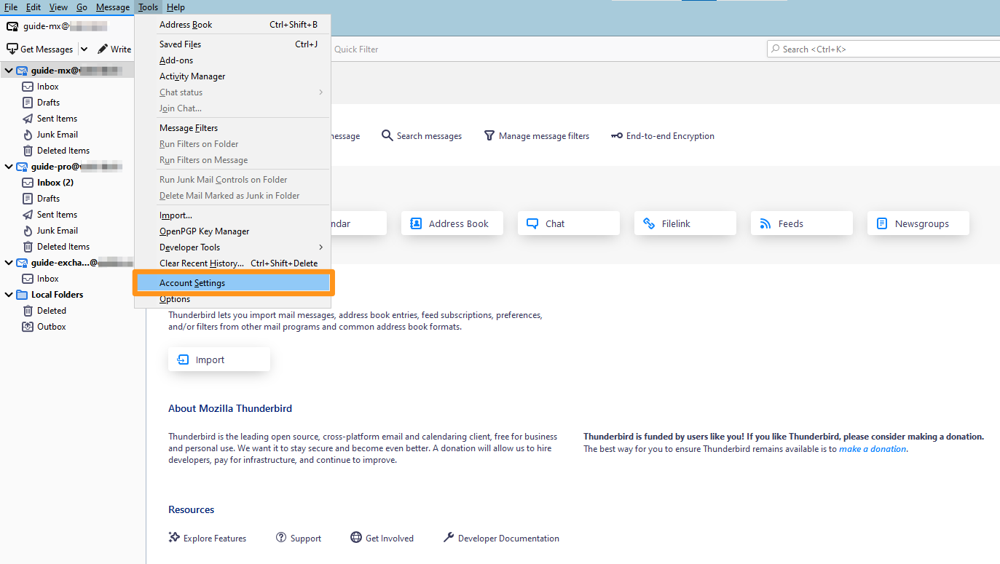

> [!primary]
> Diese Übersetzung wurde durch unseren Partner SYSTRAN automatisch erstellt. In manchen Fällen können ungenaue Formulierungen verwendet worden sein, z.B. bei der Beschriftung von Schaltflächen oder technischen Details. Bitte ziehen Sie beim geringsten Zweifel die englische oder französische Fassung der Anleitung zu Rate. Möchten Sie mithelfen, diese Übersetzung zu verbessern? Dann nutzen Sie dazu bitte den Button «Mitmachen» auf dieser Seite.
>

**Letzte Aktualisierung am 26.08.2021**

## Ziel

Exchange Accounts können auf verschiedenen kompatiblen E-Mail-Clients eingerichtet werden. So können Sie Ihr bevorzugtes Gerät für Ihre E-Mail-Adressen verwenden. Thunderbird ist ein freier E-Mail-Client.

**Hier erfahren Sie, wie Sie Ihre Exchange Adresse auf Windows einrichten.**

> [!warning]
>
> OVHcloud stellt Ihnen Dienstleistungen zur Verfügung, für deren Konfiguration und Verwaltung Sie die alleinige Verantwortung tragen. Es liegt somit bei Ihnen, sicherzustellen, dass diese ordnungsgemäß funktionieren.
> 
> Wir stellen Ihnen diese Anleitung zur Verfügung, um Ihnen bei der Bewältigung alltäglicher Verwaltungsaufgaben zu helfen. Dennoch empfehlen wir Ihnen, falls Sie Hilfe brauchen, einen spezialisierten Dienstleister und/oder den Herausgeber des Dienstes zu kontaktieren. Für externe Dienstleistungen bietet OVHcloud leider keine Unterstützung. Genauere Informationen finden Sie im Teil „Weiterführende Informationen" dieser Anleitung.
> 

## Voraussetzungen

- Sie verfügen über eine [Exchange Adresse](https://www.ovh.com/fr/emails/hosted-exchange/) .
- Sie verfügen über das auf Windows installierte Thunderbird-Programm.
- Sie haben die Login-Daten der E-Mail-Adresse, die Sie einrichten möchten.
 
## In der praktischen Anwendung

> [!warning]
>
> In unserem Beispiel verwenden wir den Servernamen: ex**?**.mail.ovh.net Ersetzen Sie das "? " durch die Zahl für den Server Ihres Exchange Dienstes.
> 
> Diese Zahl finden Sie in [Ihrem OVHcloud](https://www.ovh.com/auth/?action=gotomanager&from=https://www.ovh.de/&ovhSubsidiary=de){.external} Kundencenter im Bereich `Web Cloud`{.action} und `Microsoft`{.action}/`Exchange`{.action}
> in der Spalte links. Den Servernamen sehen Sie im Rahmen  **Verbindung** des Tabs `Allgemeine Informationen`{.action}.
> 

### Account hinzufügen

- **Wenn Sie die Anwendung zum ersten Mal starten**, öffnet sich ein Konfigurationsassistent und Sie werden dazu aufgefordert, Ihre E-Mail-Adresse einzugeben.

- **Wenn ein Account bereits eingerichtet wurde**: Klicken Sie `oben`{.action} auf Datei im Menü, dann `Neu`{.action} und `dann Einen neuen Mail Account erhalten..`{.action}.

| | |
|---|---|
|{.thumbnail}|Geben Sie im angezeigten Fenster die folgenden 3 Informationen ein:  - Ihr vollständiger Name (Anzeigename) - E-Mail-Adresse  - Passwort.|
|Klicken Sie anschließend auf `Manuell konfigurieren...`{.action} um die Einstellungen des **EINGEHEND** Servers einzugeben:  - Protokoll **IMAP**  - Server **ex?.mail.ovh.net** (ersetzen Sie gut "**?**"durch die Nummer Ihres Servers) - Port **993**  - SSL **SSL/TLS**  - Authentifizierung **Normales Passwort**  - Kennung **Ihrer vollständigen E-Mail-Adresse**|{.thumbnail}|
|{.thumbnail}|Geben Sie die Einstellungen des **AUSGEHEND** Servers an:  - Protokoll **SMTP**  - Server **ex?.mail.ovh.net** (ersetzen Sie gut "**?**"durch die Nummer Ihres Servers) - Port **587**  - SSL **STARTTLS**  - Authentifizierung **Normales Passwort**  - Kennung **Ihrer vollständigen E-Mail-Adresse**  Um die Konfiguration abzuschließen, klicken Sie auf `Fertig`{.action}|

Bei einer **POP** Konfiguration ergeben sich folgende Werte:

|Server-Typ|Servername|Verschlüsselungsmethode|Port|
|---|---|---|---|
|Eingangsserver|ex**?**.mail.ovh.net (Angabe**"?"** soll durch die Nummer Ihres Servers ersetzt werden)|SSL/TLS|995|
|Ausgangsserver|ex**?**.mail.ovh.net (Angabe**"?"** soll durch die Nummer Ihres Servers ersetzt werden)|STARTTLS|587|

### E-Mail-Adresse verwenden

Wenn Ihre E-Mail-Adresse eingerichtet ist, können Sie sie verwenden. Sie können ab sofort E-Mails versenden und empfangen.

OVHcloud bietet auch eine Webanwendung, mit der Sie über einen Webbrowser auf Ihre E-Mail-Adresse zugreifen können. Diese ist über <https://www.ovh.de/mail/> verfügbar. Sie können sich mit den Login-Daten Ihrer E-Mail-Adresse anmelden. Für Fragen zur Verwendung lesen Sie unsere Anleitung [Ihren Exchange Account über OWA](https://docs.ovh.com/de/microsoft-collaborative-solutions/exchange_2016_verwendung_der_outlook_web_app/).

### Backup Ihrer E-Mail-Adresse abrufen

Wenn Sie eine Änderung vornehmen müssen, die den Verlust der Daten Ihres E-Mail-Accounts zur Folge haben könnte, empfehlen wir Ihnen eine vorherige Sicherung des betreffenden E-Mail-Accounts. Lesen Sie hierzu den Abschnitt "**Exportieren**"im Abschnitt "**Thunderbird**"unserer Anleitung [E-Mail-Adresse manuell migrieren](https://docs.ovh.com/de/emails/email-adressen-manuell-migrieren/#exportieren_1).

### Bestehende Einstellungen ändern

> [!warning]
>
> In unserem Beispiel verwenden wir den Servernamen: ex**?**.mail.ovh.net Ersetzen Sie das "? " durch die Zahl für den Server Ihres Exchange Dienstes.
> 
> Diese Zahl finden Sie in [Ihrem OVHcloud](https://www.ovh.com/auth/?action=gotomanager&from=https://www.ovh.de/&ovhSubsidiary=de){.external} Kundencenter im Bereich `Web Cloud`{.action} und `Microsoft`{.action}/`Exchange`{.action}
> in der Spalte links. Den Servernamen sehen Sie im Rahmen  **Verbindung** des Tabs `Allgemeine Informationen`{.action}.
> 

Wenn Ihr E-Mail-Account bereits eingerichtet ist und Sie auf die Account-Einstellungen zugreifen müssen, um diese zu ändern:

- Gehen Sie `über`{.action} die Menüleiste oben auf Ihrem Bildschirm in Werkzeuge.
- Klicken Sie auf `Einstellungen der Accounts`{.action}.

{.thumbnail}

- Um die Einstellungen für den **Empfang** Ihrer E-Mails zu ändern, klicken Sie in der linken `Spalte`{.action} unter Ihrer E-Mail-Adresse auf Server-Einstellungen.

{.thumbnail}

- Um die Einstellungen für den **Versand** Ihrer E-Mails zu ändern, klicken Sie auf `Ausgangsserver (SMTP)`{.action} ganz unten in der linken Spalte.
- Klicken Sie auf die entsprechende E-Mail-Adresse in der Liste und anschließend auf `Ändern`{.action}.

{.thumbnail}

## Weiterführende Informationen

Für den Austausch mit unserer User Community gehen Sie auf <https://community.ovh.com/en/>.