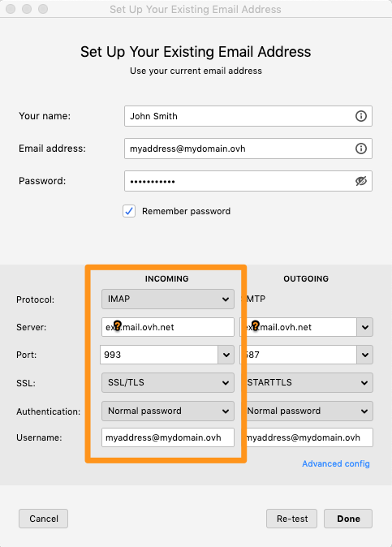

**Last updated 26/08/2021**

## Objective

You can configure Exchange accounts on email clients, if they are compatible. By doing so, you can use your email address through your preferred email application. Thunderbird is a free email client.

**Find out how to configure your Exchange  address on Thunderbird on macOS.**

> [!warning]
>
> OVHcloud provides services which you are responsible for with regard to their configuration and management. You are therefore responsible for ensuring they function correctly.
> 
> We have provided you with this guide in order to help you with common tasks. Nevertheless, we recommend contacting a specialist provider and/or the service’s software publisher if you encounter any difficulties. We will not be able to assist you ourselves. You can find more information in the “Go further” section of this guide.
> 

## Requirements

- You must have an [Exchange](https://www.ovh.co.uk/emails/hosted-exchange/)account.
- Thunderbird software installed on your macOS system
- You need to have the required credentials for the email address you would like to configure.
 
## Instructions

> [!warning]
>
> In our example, we use the server comment: ex**?**.mail.ovh.net. You will need to replace the “?” by the number designating the server for your Exchange service.
> 
> You can find this figure in your [OVHcloud Control Panel](https://www.ovh.com/auth/?action=gotomanager&from=https://www.ovh.co.uk/&ovhSubsidiary=GB){.external}, in the `Web Cloud`{.action} section, then `Microsoft`{.action}/`Exchange`{.action}.
> in the left-hand column. The server name is visible in the **Connection** box on the `General`{.action} Information tab.
> 

### Add account

- **When you start the application for the first time**: A setup wizard will appear and prompt you to enter your email address.

- **If an account has already been set up**: click `File`{.action} in the menu bar at the top of your screen, then `New`{.action} and finally `Get a new email account...`{.action}.

| | |
|---|---|
|{.thumbnail}|In the window that appears, enter the following 3 information:  - Your display name - Email  - Password|
|Then click `Configure manually...`{.action} to enter the **INCOMING** server settings:  - **IMAP protocol**  - Server **ex?.mail.ovh.net** (replace “**?**” with your server number) - Port **993**  - SSL **SSL/TLS**  - Authentication **Normal password**  - Identifying **your full email address**|{.thumbnail}|
|{.thumbnail}|Enter **OUTGOING** server settings:  - **SMTP Protocol**  - Server **ex?.mail.ovh.net** (replace “**?**” with your server number) - Port **587**  - SSL **STARTTLS**  - Authentication **Normal password**  - Identifying **your full email address**  To complete the configuration, click `Done`{.action}|

For **POP** configuration, the values are:

|Server type|Server name|Encryption method|Port|
|---|---|---|---|
|Incoming|ex**?**.mail.ovh.net (the word **?** should be replaced by your server number)|SSL/TLS|995|
|Outgoing|ex**?**.mail.ovh.net (the word **?** should be replaced by your server number)|STARTTLS|587|

### Use email address

Once you have configured your email address, you can start using it! You can now send and receive emails.

OVHcloud also has a web application you can use to access your email address from your browser. You can access this application at <https://www.ovh.co.uk/mail/>. You can log in using your email credentials. If you have any questions about how to use it, you can refer to our guide on [Using an Exchange account in the OWA](https://docs.ovh.com/gb/en/microsoft-collaborative-solutions/exchange_2016_outlook_web_app_user_guide/) interface.

### Retrieve a backup of your email address

If you need to make a change that could lead to the loss of your email account data, we advise you to make a backup of the email account concerned beforehand. To do this, please read the “**Export**” section in the “**Thunderbird**” section of our guide on Manually [migrating your email](https://docs.ovh.com/gb/en/emails/migrate-email-addresses-manually/#exporting_1) address.

### Modify existing settings

> [!warning]
>
> In our example, we use the server comment: ex**?**.mail.ovh.net. You will need to replace the “?” by the number designating the server for your Exchange service.
> 
> You can find this figure in your [OVHcloud Control Panel](https://www.ovh.com/auth/?action=gotomanager&from=https://www.ovh.co.uk/&ovhSubsidiary=GB){.external}, in the `Web Cloud`{.action} section, then `Microsoft`{.action}/`Exchange`{.action}.
> in the left-hand column. The server name is visible in the **Connection** box on the `General`{.action} Information tab.
> 

If your email account has already been set up and you need to access the account settings to change them:

- Go to `Tools`{.action} from the menu bar at the top of your screen.
- Click `Account`{.action} Settings.

{.thumbnail}

- To change the settings for **receiving** your emails, click `Server`{.action} settings in the left-hand column below your email address.

{.thumbnail}

- To change **the settings for sending** emails, click Outgoing `server (SMTP)`{.action} at the bottom of the left-hand column.
- Click the email address in the list, and then click `Edit`{.action}.

{.thumbnail}

## Go further

Join our community of users on <https://community.ovh.com/en/>.