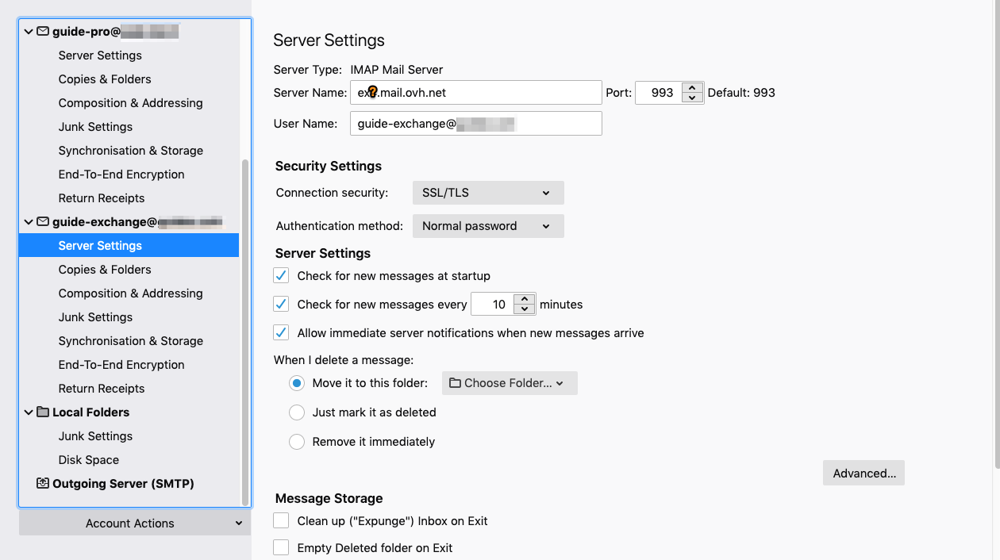

**Dernière mise à jour le 23/08/2021**

## Objectif

Les comptes Exchange peuvent être configurés sur différents logiciels de messagerie compatibles. Cela vous permet d’utiliser votre adresse e-mail depuis l’appareil de votre choix. Thunderbird est un client de messagerie libre et gratuit.

**Découvrez comment configurer votre adresse e-mail Exchange sur Thunderbird pour Mac OS.**

> [!warning]
>
> OVHcloud met à votre disposition des services dont la configuration, la gestion et la responsabilité vous incombent. Il vous revient de ce fait d'en assurer le bon fonctionnement.
> 
> Nous mettons à votre disposition ce guide afin de vous accompagner au mieux sur des tâches courantes. Néanmoins, nous vous recommandons de faire appel à un prestataire spécialisé et/ou de contacter l'éditeur du service si vous éprouvez des difficultés. En effet, nous ne serons pas en mesure de vous fournir une assistance. Plus d'informations dans la section « Aller plus loin » de ce guide.
> 

## Prérequis

- Disposer d’une adresse e-mail [Exchange](https://www.ovhcloud.com/fr-ca/emails/hosted-exchange/).
- Disposer du logiciel Thunderbird installé sur votre Mac.
- Posséder les identifiants relatifs à l'adresse e-mail que vous souhaitez paramétrer.
 
## En pratique

> [!warning]
>
> Dans notre exemple, nous utilisons la mention serveur : ex**?**.mail.ovh.net. Vous devrez remplacer le « ? » par le chiffre désignant le serveur de votre service Exchange.
> 
> Retrouvez ce chiffre dans votre [espace client OVHcloud](https://ca.ovh.com/auth/?action=gotomanager&from=https://www.ovh.com/ca/fr/&ovhSubsidiary=qc){.external}, dans la rubrique `Web Cloud`{.action} puis `Exchange`{.action}
> dans la colonne de gauche. Le nom du serveur est visible dans le cadre **Connexion** de l'onglet `Informations Générales`{.action}.
> 

### Ajouter le compte

- **Lors du premier démarrage de l'application** : un assistant de configuration s'affiche et vous invite à renseigner votre adresse e-mail.

- **Si un compte a déjà été paramétré** : cliquez sur `Fichier`{.action} dans la barre de menu en haut de votre écran, puis `Nouveau`{.action} et enfin `Obtenir un nouveau compte courrier…`{.action}.

| | |
|---|---|
|{.thumbnail}|Dans la fenêtre qui s'affiche, saisissez les 3 informations suivantes:  - Votre nom complet (Nom d'affichage) - Adresse électronique  - Mot de passe.|
|Cliquez ensuite sur `Configurer manuellement...`{.action} pour saisir les paramètres de serveur **ENTRANT**:  - Protocole **IMAP**  - Serveur **ex?.mail.ovh.net** (remplacez bien «**?**» par le numéro de votre serveur) - Port **993**  - SSL **SSL/TLS**  - Authentification **Mot de passe normal**  - Identifiant **votre adresse e-mail complète**|{.thumbnail}|
|{.thumbnail}|Saisir les paramètres de serveur **SORTANT**:  - Protocole **SMTP**  - Serveur **ex?.mail.ovh.net** (remplacez bien «**?**» par le numéro de votre serveur) - Port **587**  - SSL **STARTTLS**  - Authentification **Mot de passe normal**  - Identifiant **votre adresse e-mail complète**  Pour finaliser la configuration, cliquez sur `Terminé`{.action}|

Dans le cadre d'une configuration en **POP**, les valeurs sont les suivantes:

|Type de serveur|Nom du serveur|Méthode de chiffrement|Port|
|---|---|---|---|
|Entrant|ex**?**.mail.ovh.net (la mention **«?»** est à remplacer par le numéro de votre serveur)|SSL/TLS|995|
|Sortant|ex**?**.mail.ovh.net (la mention **«?»** est à remplacer par le numéro de votre serveur)|STARTTLS|587|

### Utiliser l'adresse e-mail

Une fois l'adresse e-mail configurée, il ne reste plus qu’à l'utiliser ! Vous pouvez dès à présent envoyer et recevoir des messages.

OVHcloud propose aussi une application web permettant d'accéder à votre adresse e-mail depuis un navigateur internet. Celle-ci est accessible à l’adresse <https://www.ovh.com/ca/fr/mail/>. Vous pouvez vous y connecter grâce aux identifiants de votre adresse e-mail. Pour toute question relative à son utilisation, aidez-vous de notre guide [Consulter son compte Exchange depuis l’interface OWA](https://docs.ovh.com/ca/fr/microsoft-collaborative-solutions/exchange-2016-guide-utilisation-outlook-web-app/).

### Récupérer une sauvegarde de votre adresse e-mail

Si vous devez effectuer une manipulation qui risquerait d'entrainer la perte des données de votre compte e-mail, nous vous conseillons d'effectuer une sauvegarde préalable du compte e-mail concerné. Pour ce faire, consultez le paragraphe « **Exporter** » dans la partie « **Thunderbird** » de notre guide [Migrer manuellement votre adresse e-mail](https://docs.ovh.com/ca/fr/emails/migrer-ses-adresses-email-manuellement/#exporter_1).

### Modifier les paramètres existants

> [!warning]
>
> Dans notre exemple, nous utilisons la mention serveur : ex**?**.mail.ovh.net. Vous devrez remplacer le « ? » par le chiffre désignant le serveur de votre service Exchange.
> 
> Retrouvez ce chiffre dans votre [espace client OVHcloud](https://ca.ovh.com/auth/?action=gotomanager&from=https://www.ovh.com/ca/fr/&ovhSubsidiary=qc){.external}, dans la rubrique `Web Cloud`{.action} puis `Exchange`{.action}
>  dans la colonne de gauche. Le nom du serveur est visible dans le cadre **Connexion** de l'onglet `Informations Générales`{.action}.
> 

Si votre compte e-mail est déjà paramétré et que vous devez accéder aux paramètres du compte pour les modifier :

- Allez dans `Outils`{.action} depuis la barre de menu en haut de votre écran.
- Cliquez sur `Paramètres des comptes`{.action}.

{.thumbnail}

- Pour modifier les paramètres liés à la **réception** de vos e-mails, cliquez sur `Paramètres serveur`{.action} dans la colonne de gauche sous votre adresse e-mail.

{.thumbnail}

- Pour modifier les paramètres liés à **l'envoi** de vos e-mails, cliquez sur `Serveur sortant (SMTP)`{.action} tout en bas de la colonne de gauche.
- Cliquez sur l'adresse e-mail concernée dans la liste, puis cliquez sur `Modifier`{.action}.

{.thumbnail}

## Aller plus loin

Échangez avec notre communauté d'utilisateurs sur <https://community.ovh.com>.
