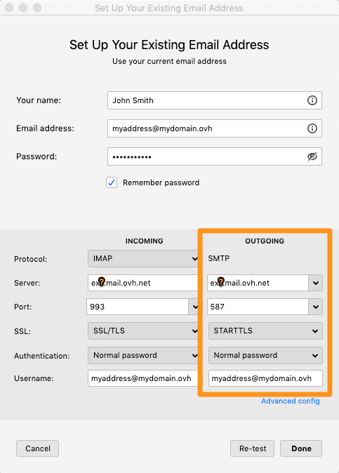
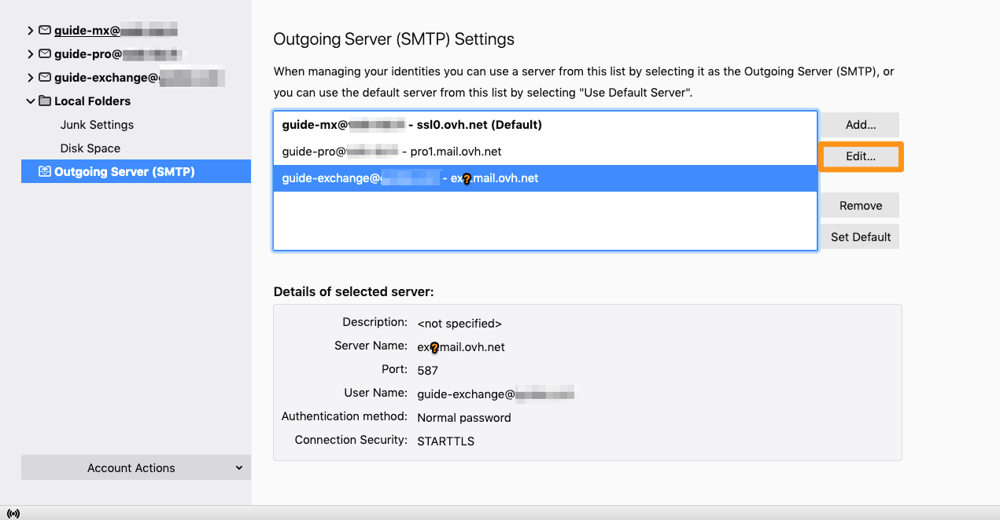

> [!primary]
> Tłumaczenie zostało wygenerowane automatycznie przez system naszego partnera SYSTRAN. W niektórych przypadkach mogą wystąpić nieprecyzyjne sformułowania, na przykład w tłumaczeniu nazw przycisków lub szczegółów technicznych. W przypadku jakichkolwiek wątpliwości zalecamy zapoznanie się z angielską/francuską wersją przewodnika. Jeśli chcesz przyczynić się do ulepszenia tłumaczenia, kliknij przycisk „Zaproponuj zmianę” na tej stronie.
>

**Ostatnia aktualizacja z dnia 26-08-2021**

## Wprowadzenie

Konta Exchange mogą być skonfigurowane w jednym z kompatybilnych programów pocztowych. Dzięki temu możesz używać Twojego konta e-mail, korzystając z wybranej przez Ciebie aplikacji. Thunderbird to darmowy program pocztowy.

**Dowiedz się, jak skonfigurować Twoje konto Exchange w programie Thunderbird w systemie macOS.**

> [!warning]
>
> OVHcloud udostępnia różnorodne usługi, jednak to Ty odpowiadasz za ich konfigurację i zarządzanie nimi. Ponosisz więc odpowiedzialność za ich prawidłowe funkcjonowanie.
> 
> Oddajemy w Twoje ręce niniejszy przewodnik, którego celem jest pomoc w wykonywaniu bieżących zadań. W przypadku trudności zalecamy skorzystanie z pomocy wyspecjalizowanego webmastera lub kontakt z producentem oprogramowania. Niestety firma OVHcloud nie będzie mogła udzielić wsparcia w tym zakresie. Więcej informacji znajduje się w sekcji „Sprawdź również”.
> 

## Wymagania początkowe

- Posiadanie konta [Exchange](https://www.ovhcloud.com/pl/emails/hosted-exchange/).
- Instalacja programu Thunderbird na Twoim urządzeniu z systemem macOS.
- Dane do logowania do konta e-mail, które chcesz skonfigurować.
 
## W praktyce

> [!warning]
>
> Poniżej stosujemy przykładową nazwę serwera: ex**?**.mail.ovh.net. Chcesz zastąpić "? "cyfrą wskazującą serwer Twojej usługi Exchange.
> 
> Zapoznaj się z tą cyfrą w [Panelu klienta OVHcloud](https://www.ovh.com/auth/?action=gotomanager&from=https://www.ovh.pl/&ovhSubsidiary=pl){.external}, w sekcji `Web Cloud`{.action}, a następnie w sekcji `Microsoft`{.action}/`Exchange`{.action}. Nazwa serwera jest widoczna w ramce **Połączenie** w karcie `Informacje ogólne`{.action}.
> 

### Dodaj konto

- **Podczas pierwszego uruchomienia aplikacji**: wyświetli się asystent konfiguracji i poprosi o wpisanie adresu e-mail.

- **Jeśli konto zostało wcześniej skonfigurowane**: kliknij `Plik`{.action} na pasku menu na górze ekranu, a następnie `Nowy`{.action} i wreszcie `Uzyskać nowe konto pocztowe...`{.action}.

| | |
|---|---|
|{.thumbnail}|W oknie, które się wyświetla wprowadź 3 następujące informacje:  - Pełna nazwa (nazwa wyświetlacza) - Adres e-mail  - Hasło.|
|Następnie kliknij `Konfiguracja ręcznie...`{.action}, aby wprowadzić parametry serwera **PRZYCHODZĄCEGO**:  - Protokół **IMAP**  - Serwer **ex?.mail.ovh.net** (zmień "**?**" na numer serwera) - Port **993**  - SSL **SSL/TLS**  - Uwierzytelnianie **Zwykłe hasło**  - Identyfikator **Twojego kompletnego konta e-mail**|{.thumbnail}|
|{.thumbnail}|Wpisz parametry serwera **WYCHODZĄCEGO**:  - Protokół **SMTP**  - Serwer **ex?.mail.ovh.net** (zmień "**?**" na numer serwera) - Port **587**  - SSL **STARTTLS**  - Uwierzytelnianie **Zwykłe hasło**  - Identyfikator **Twojego kompletnego konta e-mail**  Aby zakończyć konfigurację, kliknij `Zakończ`{.action}|

W przypadku konfiguracji **POP** wartości są następujące:

|Typ serwera|Nazwa serwera|Metoda szyfrowania|Port|
|---|---|---|---|
|Serwer poczty przychodzącej|ex**?**.mail.ovh.net (nazwa **"?"** należy zastąpić numerem serwera)|SSL/TLS|995|
|Serwer poczty wychodzącej|ex**?**.mail.ovh.net (nazwa **"?"** należy zastąpić numerem serwera)|STARTTLS|587|

### Użyj konta e-mail

Po zakończeniu konfiguracji konto jest gotowe do użytku. Możesz teraz zacząć wysyłać i odbierać wiadomości.

OVHcloud oferuje również aplikację internetową umożliwiającą korzystanie z Twojego konta e-mail przy użyciu przeglądarki internetowej. Jest ona dostępna pod adresem <https://www.ovh.pl/mail/>. Możesz się do niej zalogować, używając tych samych danych, których używasz do logowania się do konta e-mail. W przypadku pytań dotyczących korzystania z tego konta, skorzystaj z naszego przewodnika [Sprawdź konto Exchange w interfejsie OWA](https://docs.ovh.com/pl/microsoft-collaborative-solutions/exchange_2016_przewodnik_dotyczacy_korzystania_z_outlook_web_app/).

### Pobierz kopię zapasową Twojego konta e-mail

Jeśli musisz wykonać operację, która może spowodować utratę danych przypisanych do Twojego konta e-mail, zalecamy wykonanie kopii zapasowej odpowiedniego konta e-mail. W tym celu zapoznaj się z sekcją "**Eksport**" w części "**Thunderbird**" w naszym przewodniku [Ręczna migracja Twojego konta e-mail](https://docs.ovh.com/pl/emails/przenoszenie-kont-e-mail/#eksport_1).

### Zmień istniejące parametry

> [!warning]
>
> Poniżej stosujemy przykładową nazwę serwera: ex**?**.mail.ovh.net. Chcesz zastąpić "? "cyfrą wskazującą serwer Twojej usługi Exchange.
> 
> Zapoznaj się z tą cyfrą w [Panelu klienta OVHcloud](https://www.ovh.com/auth/?action=gotomanager&from=https://www.ovh.pl/&ovhSubsidiary=pl){.external}, w sekcji `Web Cloud`{.action}, a następnie w sekcji `Microsoft`{.action}/`Exchange`{.action}. Nazwa serwera jest widoczna w ramce **Połączenie** w karcie `Informacje ogólne`{.action}.
> 

Jeśli Twoje konto e-mail zostało już skonfigurowane i musisz mieć dostęp do parametrów konta, aby je zmienić:

- Przejdź do `Narzędzi`{.action} z paska menu na górze ekranu.
- Kliknij `Ustawienia kont`{.action}.

{.thumbnail}

- Aby zmienić parametry związane z **otrzymywaniem** wiadomości, w kolumnie po lewej stronie kliknij `Parametry serwera`{.action} pod adresem e-mail.

{.thumbnail}

- Aby zmienić parametry związane **z wysyłką** e-maili, kliknij `Serwer poczty wychodzącej (SMTP)`{.action} na dole kolumny po lewej stronie.
- Kliknij odpowiedni adres e-mail na liście, po czym kliknij `Zmień`{.action}.

{.thumbnail}

## Sprawdź również

Dołącz do społeczności naszych użytkowników na stronie <https://community.ovh.com/en/>.