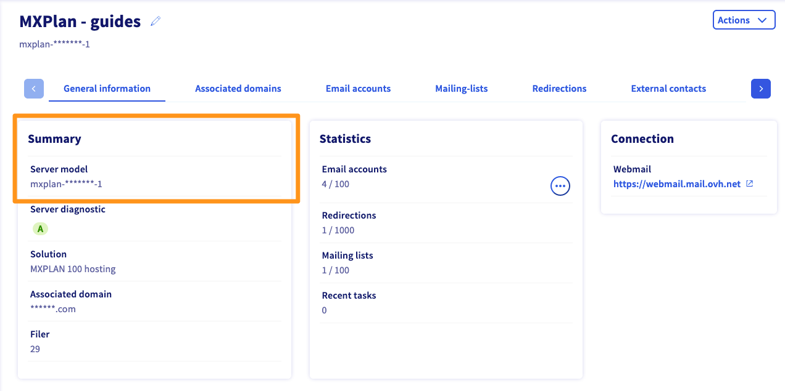
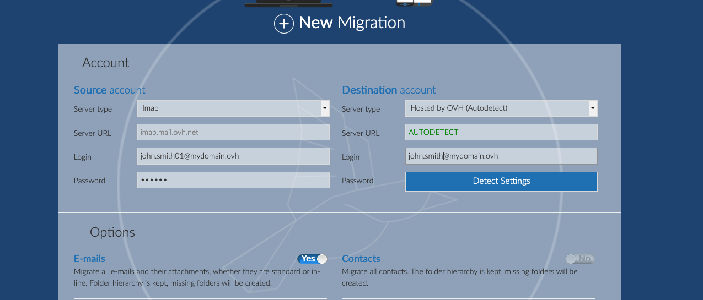

**Ultimo aggiornamento: 22/02/2022**

> [!primary]
> Questa traduzione è stata generata automaticamente dal nostro partner SYSTRAN. I contenuti potrebbero presentare imprecisioni, ad esempio la nomenclatura dei pulsanti o alcuni dettagli tecnici. In caso di dubbi consigliamo di fare riferimento alla versione inglese o francese della guida. Per aiutarci a migliorare questa traduzione, utilizza il pulsante "Modifica" di questa pagina.
>

## Obiettivo

OVHcloud propone diverse soluzioni email: MX Plan (venduto da solo o incluso in un'offerta di hosting Web), Email Pro ed Exchange. che possono usufruire di funzionalità proprie e adattarsi a diversi utilizzi. Le tue necessità si evolvono? OVHcloud mette a tua disposizione uno strumento di migrazione che ti permette di passare da una soluzione a un'altra.

**Questa guida ti mostra come migrare un indirizzo email MX Plan verso un account Email Pro o Exchange.**

## Prerequisiti

- Disporre di un account email MX Plan (incluso in una soluzione di [hosting Web OVHcloud](https://www.ovhcloud.com/it/web-hosting/){.external})
- Disporre di un servizio [Exchange](https://www.ovhcloud.com/it/emails/hosted-exchange/){.external} o [Email Pro](https://www.ovhcloud.com/it/emails/email-pro/){.external} con almeno un account non configurato (che apparirà nel formato "@configureme.me")
- **Non aver configurato un reindirizzamento sull'indirizzo email MX Plan che vuoi migrare.**
- Avere accesso allo [Spazio Cliente OVHcloud](https://www.ovh.com/auth/?action=gotomanager&from=https://www.ovh.it/&ovhSubsidiary=it){.external}

## Procedura

### Step 1: definisci il tuo progetto

Le soluzioni Email Pro ed Exchange dispongono di una base di funzionalità comune. Permangono, tuttavia, differenze a seconda dei casi di utilizzo. Scegliendo un indirizzo Exchange, disporrete di tutte le funzioni collaborative, come la sincronizzazione del calendario e dei contatti. Email Pro, invece, ne propone alcune ma sono limitate all'utilizzo esclusivamente via Webmail.

Prima di proseguire, è importante sapere verso quale offerta vuoi migrare i tuoi indirizzi email MX Plan. Per maggiori informazioni, consulta la pagina delle [soluzioni email professionali di OVHcloud](https://www.ovhcloud.com/it/emails/){.external} che propone un confronto dettagliato delle offerte. Puoi cumulare le soluzioni e quindi utilizzare per uno stesso dominio uno o più account Email Pro ed Exchange. In caso di migrazione di più account, ti consigliamo di impostare un piano di migrazione.

### Step 2: ordina i tuoi account Email Pro o Exchange

Questo step è facoltativo se disponi già di un servizio Exchange o Email Pro verso cui effettuare la migrazione.

In caso contrario, accedi allo [Spazio Cliente OVHcloud](https://www.ovh.com/auth/?action=gotomanager&from=https://www.ovh.it/&ovhSubsidiary=it) e ordina il servizio Email Pro o Exchange di tua scelta. Segui gli step e attendi fino all'installazione del servizio. Riceverai un'email al termine dell'operazione.

> [!primary]
>
> Una volta ordinato l'account, lascialo nel formato "@configureme.me". La sua denominazione sarà infatti rinominata durante la migrazione.
>

### Step 3: Realizza la migrazione

Prima di avviare la migrazione, dovrai identificare la versione del MXPlan dal quale effettui la migrazione.

accedendo allo [Spazio Cliente OVHcloud](https://www.ovh.com/auth/?action=gotomanager&from=https://www.ovh.it/&ovhSubsidiary=it){.external}, sezione `Web Cloud`{.action}. e seleziona il tuo servizio nella sezione `Email`{.action}. Prosegui nella lettura di questa guida in base alla versione di cui disponi, riferendosi alla tabella qui sotto.

|Vecchia versione della soluzione MX Plan|Nuova versione della soluzione MX Plan|
|---|---|
|{.thumbnail}  La tua offerta rientra nella sezione "Abbonamento"|{.thumbnail} Nel riquadro "Riassunto", ritrovi un `Referenza server` che inizia con "mxplan-"|
|Consulta il paragrafo: [Vecchia versione della soluzione MX Plan](#VersionHistoriqueMxplan)|Consulta il paragrafo: [Nuova versione della soluzione MX Plan](#NouvelleVersionMxplan)|

#### 3.1 Migrare un'offerta MXPlan storica 

> [!primary]
>
> Il tuo account OVHcloud deve prima essere contatto amministratore e contatto tecnico del servizio Email Pro o Exchange verso cui migri.
>
> Per maggiori informazioni sulle modifiche dei contatti, consulta la nostra guida per [gestire i contatti dei servizi](../../customer/gestisci_i_tuoi_contatti/).
>

La migrazione può essere effettuata da due interfacce: 

- **quella dell'assistente di configurazione Hosted Exchange**, solo se hai appena ordinato un servizio Hosted Exchange e non hai ancora configurato nulla su quest'ultimo;
- **la soluzione MX Plan**, non appena disponi di un servizio Email Pro o Exchange (già configurato o meno) e di un indirizzo MX Plan da migrare.

> Ti ricordiamo che, prima di iniziare la migrazione, assicurati che sul tuo MXplan non siano configurati **reindirizzamento** o che non siano impostati **segreteria**.
> {.thumbnail}

Quando tutto è pronto, prosegui nella lettura di questa guida utilizzando l'interfaccia selezionata. Ti ricordiamo che il tempo di migrazione dipende dalla quantità di contenuto da migrare verso il tuo nuovo account. che può variare da pochi minuti a diverse ore.

> [!warning]
>
> Una volta confermata la migrazione, non sarà più possibile accedere al vecchio indirizzo email MX Plan né annullare il processo di migrazione. Ti consigliamo vivamente di effettuare questa operazione in base all'orario previsto.
>
> Anche se non sarà più possibile accedere al tuo indirizzo email corrente, i messaggi già ricevuti e quelli ricevuti non saranno persi. Tutti saranno immediatamente accessibili dal tuo nuovo account.
>

##### **Migrazione dall'assistente di configurazione Exchange**

Nello [Spazio Cliente OVHcloud](https://www.ovh.com/auth/?action=gotomanager&from=https://www.ovh.it/&ovhSubsidiary=it){.external} è possibile selezionare il servizio. L'assistente dovrebbe apparire per aiutarti a configurare il tuo nuovo servizio Exchange. Durante questo processo, è possibile selezionare gli account email MX Plan da migrare.

Se l'assistente di configurazione non compare, visualizzi le informazioni generali del servizio Exchange. In questo caso, sarà necessario effettuare la migrazione dei tuoi account tramite l'interfaccia MX Plan.

##### **Migrazione dall'interfaccia MX Plan**

Per effettuare la migrazione da questa interfaccia, accedi alla sezione `Email`{.action} del tuo Spazio Cliente OVHcloud. A questo punto scegli il servizio con il dominio dei tuoi indirizzi email. Clicca sull'icona a forma di ingranaggio sulla riga dell'account email interessato (chiamato anche account sorgente) e poi su `Migrare l'account`{.action}.

{.thumbnail}

Nella nuova finestra, seleziona il servizio di destinazione (quello verso cui vuoi migrare l'indirizzo) e clicca su `Avanti`{.action}. Se ha almeno un account "libero" (cioè non ancora configurato), la migrazione avverrà verso uno di questi account. Leggi le informazioni mostrate, conferma e clicca su `Avanti`{.action} per continuare.

Se non hai un account "libero", apparirà un pulsante `Ordina account`{.action}. Segui gli step e attendi che gli account siano installati per eseguire di nuovo l'operazione.

Conferma la password associata all'indirizzo email sorgente (quello che vuoi migrare) e clicca su `Migrare`{.action}. Questa operazione deve essere ripetuta per ogni trasferimento di account.

{.thumbnail}

#### 3.2 Migrare la nuova versione del MXPlan 

> [!warning]
>
> Se hai appena ordinato il nuovo servizio di posta, aggiungi il dominio alla tua piattaforma di posta prima di iniziare la migrazione.   - *Ad esempio, per migrare l'account "myemail@mydomain.ovh", è necessario aggiungere il dominio "mydomain.ovh" alla tua piattaforma.*
>
>Seleziona la scheda `Domini associati`{.action} sulla tua piattaforma e clicca su `Aggiungi un dominio`{.action}. Una volta che il dominio è stato aggiunto, assicurati che la voce `OK` figuri nella colonna `Stato`
>
>{.thumbnail}
>
> Per maggiori dettagli sull'aggiunta di un dominio, segui [la guida Email Pro](https://docs.ovh.com/it/emails-pro/prima-configurazione/#step-2-aggiungi-il-dominio) o [la guida Exchange](https://docs.ovh.com/it/microsoft-collaborative-solutions/aggiungere-dominio-su-exchange/).

La migrazione del tuo MXPlan avverrà in 3 step, **Rinommer**, **Creare** e **Migrare**.

{.thumbnail}

1\. **Rinomina** l'account MXPlan da migrare con un nome provvisorio (ad esempio: per migrare l'account MX plan *john.smith@mydomain.ovh*, rinominalo in *john.smith01@mydomain.ovh*).

Nella scheda `Account email`{.action} della tua piattaforma MX Plan, clicca sul pulsante `...`{.action} e poi su `Modifica`{.action}.

{.thumbnail}

> [!primary]
>
> La modifica dell'account non è immediata, ti preghiamo di attendere fino al termine dell'operazione prima di passare allo step successivo.

2\. **Crea** il tuo indirizzo email sul nuovo account della tua piattaforma Email Pro o Exchange (prendendo l'esempio precedente, creerai *john.smith@mydomain.ovh* sulla tua nuova piattaforma).

Nella scheda `Account email`{.action} della tua piattaforma Email Pro o Exchange, clicca sul pulsante `...`{.action} e poi su `Modifica`{.action}.

{.thumbnail}

3\. **Migra** l'account MXPlan verso l'account della tua nuova piattaforma con l'aiuto del nostro tool [OMM](https://omm.ovh.net/) (OVH Mail Migrator).

Per maggiori informazioni su OMM, consulta la guida [Migrare account email via OVH Mail Migrator](../migrazione-account-email-con-ovh-mail-migrator/).

{.thumbnail}

Il tempo di migrazione dipende dalla quantità di contenuto da migrare verso il nuovo account. che può variare da pochi minuti a diverse ore.

Una volta completata la migrazione, verifica di trovare i tuoi elementi accedendo alla Webmail all'indirizzo <https://www.ovh.com/it/mail/>

Dopo la migrazione è possibile conservare o eliminare l'account di origine.

Per eliminarlo, seleziona la scheda `Account email`{.action} del tuo MXPlan, clicca sul pulsante `...`{.action} e poi su `Reimposta questo account`{.action}.

### Step 4: verifica o modifica la configurazione del tuo dominio

In questa fase, gli account email devono essere già migrati e funzionali. Per motivi di sicurezza, ti consigliamo di assicurarti che la configurazione del tuo dominio sia corretta consultando il tuo Spazio Cliente OVH.

seleziona il tuo servizio Email Pro o Exchange e clicca sulla scheda `Domini associati`{.action}. Nella tabella che appare, la colonna "Diagnostica" ti permette di vedere se la configurazione DNS è corretta: se è necessario modificare la configurazione, appare una casellina rossa.

> [!primary]
>
> Se hai appena effettuato la migrazione o modificato un record DNS del tuo dominio, è possibile che l'aggiornamento della pagina nello [Spazio Cliente OVHcloud](https://www.ovh.com/auth/?action=gotomanager&from=https://www.ovh.it/&ovhSubsidiary=it){.external} richieda qualche ora.
>

Per modificare la configurazione, clicca sulla casellina rossa e esegui l'operazione. La propagazione delle modifiche potrebbe richiedere da 4 a 24 ore.

{.thumbnail}

### Step 5: utilizza i tuoi account email migrati

A questo punto non ti resta che utilizzare i tuoi account email migrati. OVHcloud mette a disposizione un'applicazione online (_Web app_) accessibile all'indirizzo <https://www.ovh.com/it/mail/>. inserendo le credenziali associate al tuo indirizzo email.

Se hai configurato uno degli account migrati su un client di posta elettronica (come Outlook), è necessario impostarlo nuovamente. Le informazioni di connessione al server OVHcloud sono cambiate in seguito alla migrazione. Per maggiori informazioni sulle operazioni da effettuare, consulta la nostra documentazione nelle sezioni delle guide dedicate a [Email Pro](../../emails-pro/) e [Hosted Exchange](../). Se non sei in grado di riconfigurare l'account nell'immediato, l'accesso tramite l'applicazione online è sempre possibile.

### Organizzazione del contenuto dei tuoi indirizzi email in seguito a una migrazione 

Quando ti connetti per la prima volta al tuo nuovo account email, il contenuto migrato può essere parzialmente nascosto. Per visualizzare tutti gli elementi, clicca sul tuo nome utente in corrispondenza della `Casella di ricevimento` e inserisci le sottocartelle. Il contenuto migrato del tuo vecchio account email dovrebbe apparire.

{.thumbnail}

Le cartelle predefinite, come "elementi inviati" o "cestino", sono disponibili in inglese ("Sent items" e "Trash"), ad eccezione delle cartelle che hai creato.

Una volta completata la migrazione, esplora tutte le cartelle e sottocartelle del tuo account per assicurarti che siano presenti tutti gli elementi.

### Migrare Manualmente

Inoltre, è possibile migrare manualmente i tuoi indirizzi email verso il nuovo servizio di posta OVHcloud utilizzando esclusivamente il client di posta. Clicca sulla guida [Migrare manualmente il tuo indirizzo email](../../emails/migrare-i-indirizzi-email-manualmente/). Vi consigliamo tuttavia di utilizzare questo metodo solo quando non sono possibili i metodi principali.

## Per saperne di più

[Gestire i contatti dei servizi](../../customer/gestisci_i_tuoi_contatti/){.external} .

[Guide Email Pro](../../emails-pro/){.external}.

[Guide Exchange](../../microsoft-collaborative-solutions/){.external}.

Contatta la nostra Community di utenti all’indirizzo <https://community.ovh.com/en/>.
