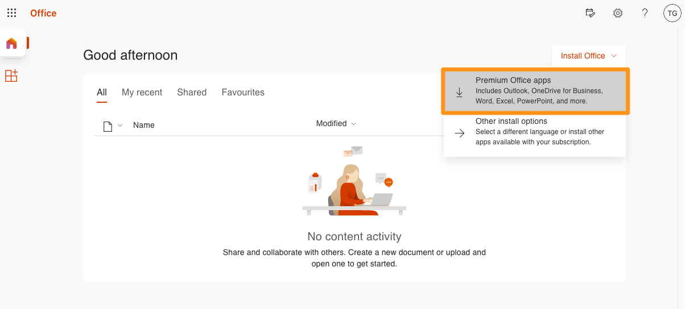

> [!primary]
> Diese Übersetzung wurde durch unseren Partner SYSTRAN automatisch erstellt. In manchen Fällen können ungenaue Formulierungen verwendet worden sein, z.B. bei der Beschriftung von Schaltflächen oder technischen Details. Bitte ziehen Sie beim geringsten Zweifel die englische oder französische Fassung der Anleitung zu Rate. Möchten Sie mithelfen, diese Übersetzung zu verbessern? Dann nutzen Sie dazu bitte den Button «Mitmachen» auf dieser Seite.
>

**Letzte Aktualisierung am 09.09.2021**

## Ziel

Die Angebote von OVHcloud **Microsoft 365 apps for business** oder **Microsoft 365 apps for enterprise bieten mehrere Vorteile**. Die Abrechnung erfolgt monatlich und Sie können eine Lizenz auf 5 PCs/Macs, 5 Tablets und 5 Smartphones installieren.

Ihre Microsoft 365 Lizenzen werden zu einer Gruppe zusammengefasst, auch "Dienst" genannt. Eine Gruppe von Apps for Business Lizenzen kann maximal 300 Lizenzen enthalten, eine Gruppe von Apps for Enterprise Lizenzen ist unbegrenzt.

Hier die Liste der Software im Folgenden:

- Apps for business Lizenzen: Excel, Word, PowerPoint, Outlook, Note, Publisher.
- Apps for enterprise Lizenzen: Excel, Word, PowerPoint, Outlook, Note, Publisher, Access.

**Hier erfahren Sie, wie Sie eine Microsoft 365 Lizenz bestellen und in Ihrem OVHcloud Kundencenter verwalten.**

## Voraussetzungen

- Sie sind im [OVHcloud Kundencenter](https://www.ovh.com/auth/?action=gotomanager&from=https://www.ovh.de/&ovhSubsidiary=de) eingeloggt

## In der praktischen Anwendung

### Eine Lizenz bestellen

Begeben Sie sich auf unsere [OVHcloud.com](https://www.ovh.de/office-365/){.external}-Website und wählen Sie den Bereich "Kollaborative Tools"in unserem Bereich "Web Cloud"aus. 

Sie können auch eine Lizenz über das [OVHcloud Kundencenter](https://www.ovh.com/auth/?action=gotomanager&from=https://www.ovh.de/&ovhSubsidiary=de) bestellen. Wenn Sie eingeloggt sind, wählen Sie `Web Cloud`{.action} im oberen Banner aus und klicken Sie dann auf `Bestellen`{.action} und `o365`{.action}.

- Wählen Sie aus unseren verfügbaren Angeboten "Apps for business"und "Apps for enterprise".
- Legen Sie das Verlängerungsintervall Ihrer Lizenzgruppe fest.
- Geben Sie die gewünschte Anzahl an Lizenzen ein und klicken Sie auf `Bestellen`{.action}.

Sie werden zur Bestellseite weitergeleitet, um diese zu validieren und zu begleichen.

### Lizenz aktivieren

Nachdem Sie Ihre Lizenz bestellt haben, aktivieren Sie diese über Ihr [OVHcloud Kundencenter](https://www.ovh.com/auth/?action=gotomanager&from=https://www.ovh.de/&ovhSubsidiary=de). Klicken Sie im Bereich `Web` Cloud links im Menü auf `Microsoft`{.action} und dann auf `Office`{.action} und wählen Sie die betreffende Lizenzgruppe aus.

Klicken Sie auf den Button `...`{.action} vor der Lizenz und dann auf `Account bearbeiten`{.action}.

{.thumbnail}

Tragen Sie die Informationen zum Benutzer der Lizenz ein, klicken Sie auf `Weiter`{.action} und dann auf `Bestätigen`{.action}

{.thumbnail}

### Microsoft 365 Suite auf Ihrer Maschine installieren

Sobald die Lizenz aktiviert ist, erhalten Sie eine E-Mail an die Kontakt-E-Mail-Adresse Ihres OVHcloud Accounts. Sie können diese E-Mail auch in Ihrem [OVHcloud Kundencenter](https://www.ovh.com/auth/?action=gotomanager&from=https://www.ovh.de/&ovhSubsidiary=de) einsehen, indem Sie oben rechts auf Ihr Profil klicken und dann im Bereich `Verknüpfungen`{.action}  auf `E-Mails vom support`{.action} klicken.

Diese E-Mail enthält die notwendigen Informationen zum Download und zur Installation Ihrer Microsoft 365 Suite, nämlich **Aktivierungse-Mail-Adresse** und **Passwort**.

>
> Wenn Sie das Passwort selbst festlegen möchten, müssen Sie dies über Ihr Kundencenter tun. Klicken Sie im Bereich `Web` Cloud links im Menü auf `Microsoft`{.action} und dann auf `Office`{.action} und wählen Sie die betreffende Lizenzgruppe aus.
>
> Klicken Sie rechts neben der betreffenden Lizenz auf `...`{.action}. und dann auf `Passwort ändern`{.action}.
>
>{.thumbnail}
>

Gehen Sie auf <https://portal.office.com/> die **Aktivierungse-Mail-Adresse** und das zuvor konfigurierte **Passwort** und loggen Sie sich ein. Sie werden zu einem Fenster weitergeleitet, in dem Sie die Microsoft 365 Suite mit den Installationsanweisungen auf Ihrem Computer herunterladen können.

{.thumbnail}

> [!primary]
>
> Der Benutzer kann die Microsoft 365 Suite auf 5 Maschinen auf Windows oder macOS, 5 Tablets und 5 Smartphones installieren.
>

### Eine Lizenz zu einer bestehenden Gruppe hinzufügen

Wenn Sie eine oder mehrere Lizenzen zu Ihrer bestehenden Lizenzgruppe hinzufügen möchten, können Sie diese über Ihr [OVHcloud Kundencenter](https://www.ovh.com/auth/?action=gotomanager&from=https://www.ovh.de/&ovhSubsidiary=de) hinzufügen. Klicken Sie im Bereich `Web` Cloud links im Menü auf `Microsoft`{.action} und dann auf `Office`{.action} und wählen Sie die betreffende Lizenzgruppe aus.

Klicken Sie rechts auf `den Button Weitere`{.action} Lizenzen bestellen. Geben Sie die Anzahl und den Typ der Lizenzen an, die Sie bestellen möchten.

{.thumbnail}

## Weiterführende Informationen

[Remote Desktop mit Microsoft 365 Apps verwenden](https://docs.ovh.com/de/microsoft-collaborative-solutions/office365-proplus-remotedesktopdienste/)

Für den Austausch mit unserer User Community gehen Sie auf <https://community.ovh.com/en/>.
