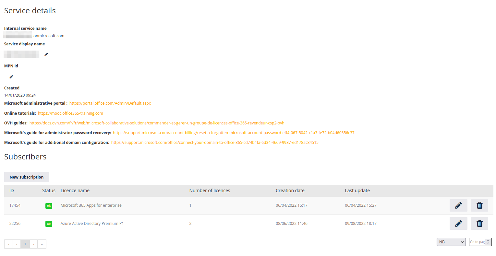

> [!primary]
> Diese Übersetzung wurde durch unseren Partner SYSTRAN automatisch erstellt. In manchen Fällen können ungenaue Formulierungen verwendet worden sein, z.B. bei der Beschriftung von Schaltflächen oder technischen Details. Bitte ziehen Sie beim geringsten Zweifel die englische oder französische Fassung der Anleitung zu Rate. Möchten Sie mithelfen, diese Übersetzung zu verbessern? Dann nutzen Sie dazu bitte den Button «Mitmachen» auf dieser Seite.
>

**Letzte Aktualisierung am 13.09.2021**

## Ziel

Office 365 Reseller (CSP2) ist ein Dienst, mit dem Sie verschiedene Arten von Microsoft 365 Lizenzen zu Sonderpreisen nutzen können, damit Sie diese bei Ihren Kunden verkaufen können.

**Diese Anleitung erklärt, wie Sie einen Office 365 Reseller Dienst (CSP2) bei OVHcloud abonnieren und verwalten.**

## Voraussetzungen

- Sie haben Zugriff auf Ihr [OVHcloud Kundencenter](https://www.ovh.com/auth/?action=gotomanager&from=https://www.ovh.de/&ovhSubsidiary=de).

## In der praktischen Anwendung

### Office 365 Reseller bestellen

Um einen Office 365 Reseller Dienst zu bestellen, loggen Sie sich in Ihr [OVHcloud Kundencenter](https://www.ovh.com/auth/?action=gotomanager&from=https://www.ovh.de/&ovhSubsidiary=de) ein und wählen Sie `Sunrise`{.action} im oberen Menu aus. Klicken Sie dann auf `Office 365 Revendeurs`{.action}.

- Vervollständigen Sie die Kontaktinformationen des Endkunden. Diese werden angefordert, um den Manager der Lizenzgruppe ("Tenant") zu definieren, die Sie erstellen möchten.

> [!primary]
>
> - Wenn Sie bereits über einen Office 365 CSP2 Dienst bei Microsoft verfügen, können Sie dessen Verwaltung an OVHcloud delegieren. So können Sie direkt über Ihr OVHcloud Kundencenter zusätzliche Abonnements hinzufügen. Wenn Sie eine neue Lizenzgruppe bestellen, wählen Sie `Delegation einer zuvor bei Microsoft erstellten Plattform`{.action}.
>
> - Wenn Sie über eine Microsoft Partner ID verfügen, können Sie diese über das gleiche Interface eingeben. So können Sie ein Cashback auf Abonnements erhalten, die Sie über unser Kundencenter bestellen. Dieses Cashback unterliegt den von Microsoft definierten Regeln und hängt von der Menge der bestellten Abonnements ab.
>

- Geben Sie in der Liste die Lizenzen ein, die Sie zu Ihrer Gruppe hinzufügen möchten.

- Klicken Sie auf `Bestellen`{.action}, um Ihre Bestellung abzuschließen.

> [!warning]
>
> Bitte überprüfen Sie die Gültigkeit der bei der Erstellung Ihrer Lizenzgruppe angegebenen E-Mail-Adresse, da diese die Login-Daten auf der Microsoft Plattform erhält.
>

{.thumbnail}

### Office 365 Reseller Dienste verwalten

Sobald der Office 365 Dienst verfügbar ist, können Sie ihn über Ihr [OVHcloud Kundencenter](https://www.ovh.com/auth/?action=gotomanager&from=https://www.ovh.de/&ovhSubsidiary=de) verwalten.

Gehen Sie hierzu in den Bereich `Sunrise`{.action}. Im Menü auf der linken Seite wählen Sie `Office 365 Revendeurs`{.action}, und dann den Dienst aus.

Folgende Angaben werden angezeigt:

- **Interner Name der Dienstleistung**: zeigt den Namen Ihrer Dienstleistung an. Dieser ist nur in Ihrem Kundencenter sichtbar.
- **Anzeigename der Dienstleistung**: erlaubt es, den Anzeigenamen des Dienstes in Ihrem Kundencenter zu personalisieren.
- **Erstellt**: gibt das Erstellungsdatum des Dienstes an.
- **Microsoft Administrationsportal**: URL zur Office Verwaltungsoberfläche, über die Sie Ihre Abonnements verwalten können.
- **Adminpasswort zurücksetzen**: ermöglicht die Änderung des Login-Passworts zum Microsoft Administrationsportal.

{.thumbnail}

### Eine bei OVHcloud gehostete Domain automatisch konfigurieren

OVHcloud stellt Ihnen ein Tool zur Verfügung, das die Konfiguration der DNS-Zone Ihres Domainnamens vereinfacht. So können Sie Domainnamen, die OVHcloud DNS-Zonen verwenden, automatisch konfigurieren, damit sie mit folgenden Lösungen funktionieren:

- Exchange Online
- Skype
- Intune

Wählen Sie hierzu die entsprechende Domain in der Drop-down-Liste und anschließend die gewünschten Lösungen aus. Wir erstellen dann die entsprechenden DNS-Einträge in der OVHcloud DNS-Zone der Domain.

> [!warning]
> Damit die Konfiguration funktioniert, müssen Sie sicherstellen, dass Sie die OVHcloud DNS-Server für die betreffenden Domains verwenden. Lesen Sie dazu unsere Anleitung "[DNS-Server einer OVHcloud Domain ändern](https://docs.ovh.com/de/domains/webhosting_allgemeine_informationen_zu_den_dns_servern/)".
>

{.thumbnail}

### Ihre Abos verwalten

Mit der Verwaltung Ihrer Abos können Sie die zu Ihrer Abonnementgruppe gehörenden Lizenzen erhöhen oder stornieren. Die Details können Sie in der Tabelle sehen:

- **ID**: Jeder Typ einer bestellten Lizenz verfügt über eine eindeutige Kennung (ID).
- **Status**: zeigt den Status Ihrer Lizenz.
- **Name der Lizenz**: gibt die Art der bestellten Lizenz an.
- **Anzahl der Lizenzen**: gibt die Anzahl der verfügbaren Lizenzen an.
- **Erstellungsdatum**: gibt das Erstellungsdatum des Abonnements für den ausgewählten Lizenztyp an.
- **Letztes Update**: gibt das Datum an, an dem das Abonnement zuletzt aktualisiert wurde (z.B. durch Hinzufügen einer Lizenz).

Mit dem Stift-Button können Sie die Gesamtzahl der Lizenzen des Abonnements ändern. Mit dem Papierkorb-Button können Sie das Abonnement und alle Lizenzen kündigen.

> [!primary]
>
> Für Office 365 Education sind besondere Lizenzbedingungen von Microsoft einzuhalten. Die entsprechenden offiziellen Dokumente stehen Ihnen je nach Region und Sprache [hier](http://www.microsoftvolumelicensing.com/DocumentSearch.aspx?Mode=2&Keyword=AcademicQualEdUserDef){.external} zur Verfügung.
>

{.thumbnail}

### Benutzer verwalten

Sobald Sie über eine ausreichende Anzahl an Lizenzen verfügen, müssen Sie die Benutzer verwalten, die diese verwenden. Dieser Schritt erfolgt direkt über das [Verwaltungsportal von Microsoft](https://portal.office.com/Admin/Default.aspx){.external}.

Um sich dort einzuloggen, geben Sie Ihre Kundenkennung und das Passwort ein, das Sie in der Bestätigungsmail von OVHcloud zur Installation Ihrer Lizenzgruppe erhalten haben. Diese Informationen werden an die bei der Erstellung der Lizenzgruppe angegebene Adresse versandt.

## Weiterführende Informationen

Für den Austausch mit unserer User Community gehen Sie auf <https://community.ovh.com/en/>.
