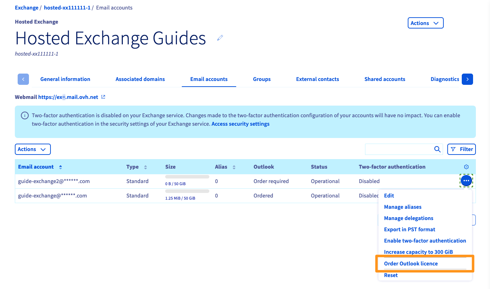
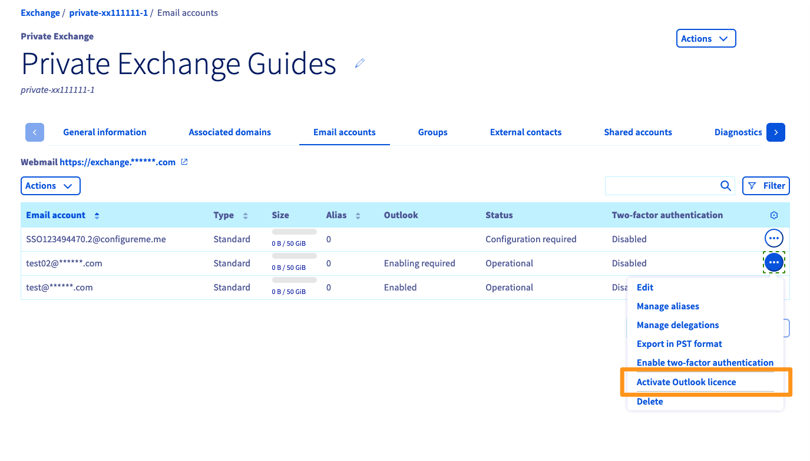
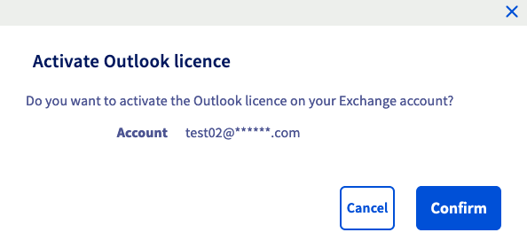
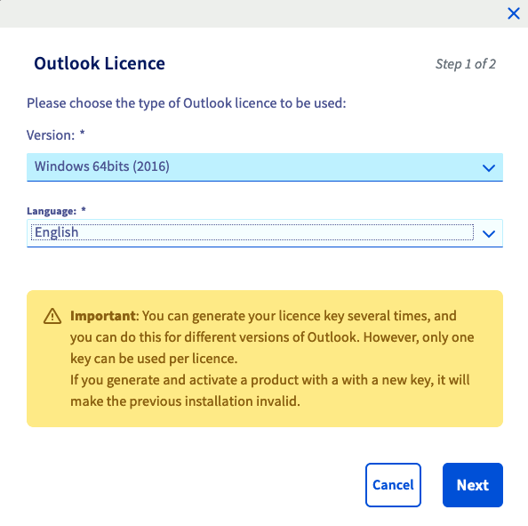

> [!primary]
> Esta traducción ha sido generada de forma automática por nuestro partner SYSTRAN. En algunos casos puede contener términos imprecisos, como en las etiquetas de los botones o los detalles técnicos. En caso de duda, le recomendamos que consulte la versión inglesa o francesa de la guía. Si quiere ayudarnos a mejorar esta traducción, por favor, utilice el botón «Contribuir» de esta página.
>

**Última actualización: 07/09/2021**

## Objetivo

Desea disfrutar de una licencia Outlook para consultar y gestionar sus emails en su cuenta Exchange.

OVHcloud le ofrece el cliente de correo Outlook al precio de 2 euros (+IVA) al mes. Estará asociado a una cuenta Exchange de OVHcloud de la que usted es responsable.

Una vez contratada, puede descargar Outlook de una de las 6 versiones siguientes:

- Outlook 2013 para Windows 32 bits.
- Outlook 2013 para Windows 64 bits.
- Outlook 2016 para Windows 32 bits.
- Outlook 2016 para Windows 64 bits.
- Outlook 2011 para MAC 64 bits.
- Outlook 2016 para MAC 64 bits.

**Esta guía explica cómo contratar e instalar una licencia Outlook desde una plataforma Exchange de OVHcloud.**

## Procedimiento

### Contratar una licencia Outlook

#### Para una cuenta Hosted Exchange

Inicie sesión en el [área de cliente de OVHcloud](https://www.ovh.com/auth/?action=gotomanager&from=https://www.ovh.es/&ovhSubsidiary=es) y acceda al apartado `Web Cloud`. En la columna izquierda, haga clic en `Microsoft`{.action}, luego en `Exchange`{.action} y seleccione la plataforma **Hosted Exchange** correspondiente.

Haga clic en el icono `...`{.action} a la derecha de la cuenta correspondiente y, seguidamente, en `Contratar una licencia Outlook`{.action}.

{.thumbnail}

Indique la frecuencia de renovación de la licencia Outlook y acepte las condiciones. Haga clic en `Siguiente`{.action} para continuar.

{.thumbnail}

Una vez hecho el resumen del pedido, utilice el botón `Abonar`{.action} para generar la orden de pedido. Será redirigido a una nueva página en la que podrá abonar el pedido utilizando las formas de pago que tenga a su disposición.

Espere a que se ponga a su disposición la licencia Outlook en el área de cliente.

#### Para una cuenta Private Exchange

Inicie sesión en el [área de cliente de OVHcloud](https://www.ovh.com/auth/?action=gotomanager&from=https://www.ovh.es/&ovhSubsidiary=es) y acceda al apartado `Web Cloud`. En la columna izquierda, haga clic en `Microsoft`{.action}, luego en `Exchange`{.action} y seleccione la plataforma **Private Exchange** correspondiente.

Haga clic en el icono `...`{.action} a la derecha de la cuenta correspondiente y, seguidamente, en `Activar la licencia Outlook`{.action}.

{.thumbnail}

Una ventana le pregunta si quiere activar la licencia Outlook en su cuenta Exchange. Haga clic en `Aceptar`{.action} para activar la licencia en la cuenta correspondiente.

{.thumbnail}

Espere a que se ponga a su disposición la licencia Outlook en el área de cliente.

> [!primary]
>
> La facturación de la licencia Outlook se integrará en la de su plataforma Private Exchange cada mes.
>

### Descargar e instalar Outlook

Ya puede descargar el archivo de instalación de Outlook para su máquina.

Desde la interfaz de gestión de su plataforma Exchange, haga clic en el icono `...`{.action} a la derecha de la cuenta correspondiente y, seguidamente, en `Utilizar la licencia Outlook.`{.action}

Seleccione la versión en el menú desplegable, en función de su sistema operativo y del idioma, y haga clic en `Siguiente.`{.action}

{.thumbnail}

Al cabo de unos minutos, se generará un enlace de descarga y una clave de licencia para instalar en la máquina.

{.thumbnail}

El archivo descargado tiene el formato .ISO, es decir, una imagen de disco. Ejecute la instalación e introduzca la clave de licencia cuando se le pida.

### Eliminar la licencia Outlook de su cuenta

Inicie sesión en el [área de cliente de OVHcloud](https://www.ovh.com/auth/?action=gotomanager&from=https://www.ovh.es/&ovhSubsidiary=es) y acceda al apartado `Web Cloud`. En la columna izquierda, haga clic en `Microsoft`{.action}, luego en `Exchange`{.action} y, por último, seleccione la plataforma Exchange correspondiente.

Haga clic en el icono `...`{.action} a la derecha de la cuenta correspondiente y, seguidamente, en `Eliminar la licencia Outlook.`{.action}

{.thumbnail}

Tras la validación, le recordamos que la licencia se eliminará definitivamente en su fecha de expiración

## Más información
  
Interactúe con nuestra comunidad de usuarios en <https://community.ovh.com/en/>.
