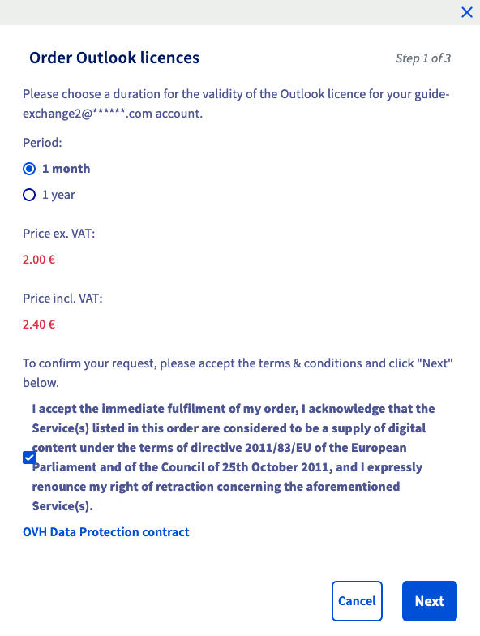

**Dernière mise à jour le 07/09/2021**

## Objectif

Vous souhaitez bénéficier d'une licence Outlook pour consulter et gérer vos e-mails sur votre compte Exchange. 

OVHcloud vous propose le client de messagerie Outlook au tarif de 2 euros HT par mois. Il sera associé à un compte Exchange OVHcloud dont vous avez la gestion.

Après votre souscription, vous pouvez télécharger Outlook parmis l'une des 6 versions suivante:

- Outlook 2013 pour Windows 32 bits.
- Outlook 2013 pour Windows 64 bits.
- Outlook 2016 pour Windows 32 bits.
- Outlook 2016 pour Windows 64 bits.
- Outlook 2011 pour MAC 64 bits.
- Outlook 2016 pour MAC 64 bits.

**Découvrez comment souscrire à une licence Outlook depuis votre plateforme Exchange OVHcloud et l'installer.**

## En Pratique

### Commander une licence Outlook

#### **Pour un compte Hosted Exchange**

Connectez-vous à votre [espace client OVHcloud](https://www.ovh.com/auth/?action=gotomanager&from=https://www.ovh.com/fr/&ovhSubsidiary=fr) et dirigez-vous dans la section `Web`. Cliquez sur `Microsoft`{.action} dans la barre de services à gauche puis sur `Exchange`{.action} et sélectionnez la plateforme **Hosted Exchange** concernée.

Cliquez sur l'icone `...`{.action} à droite du compte concerné, puis sur `Commander une licence Outlook`{.action}.

{.thumbnail}

Définissez la fréquence de renouvellment de votre licence Outlook et validez les conditions. Cliquez ensuite sur `Suivant`{.action}.

{.thumbnail}

Après le récapitulatif de votre commande, utilisez le bouton `Régler`{.action} afin de générer le bon de commande. Vous serez redirigé vers une page internet OVHcloud qui vous permettra de régler selon vos moyens de paiement disponibles.

Patientez quelques instants le temps de la mise à dispostion de votre licence Outlook dans votre espace client.

#### **Pour un compte Private Exchange**

Connectez-vous à votre [espace client OVHcloud](https://www.ovh.com/auth/?action=gotomanager&from=https://www.ovh.com/fr/&ovhSubsidiary=fr) et dirigez-vous dans la section `Web`. Cliquez sur `Microsoft`{.action} dans la barre de services à gauche puis sur `Exchange`{.action} et sélectionnez la plateforme **Private Exchange** concernée.

Cliquez sur l'icone `...`{.action} à droite du compte concerné, puis sur `Activer la licence Outlook`{.action}.

{.thumbnail}

Une fenêtre vous demande si vous souhaitez activer la licence Outlook sur votre compte Exchange. Cliquez sur `Valider`{.action} pour activer la licence sur le compte concerné.

{.thumbnail}

Patientez quelques instants le temps de la mise à dispostion de votre licence Outlook dans votre espace client.

> [!primary]
>
> La facturation de votre licence Outlook sera implémentée à celle de votre Plateforme Private Exchange, chaque mois.

### Telecharger et installer Outlook

Il vous faut maintenant télécharger le fichier d'installation d'Outlook pour votre machine.

Depuis l'interface de gestion de votre plateforme Exchange, cliquez sur l'icone `...`{.action} à droite du compte concerné, puis sur  `Utiliser la licence Outlook`{.action}

Choisissez la version dans le menu déroulant en fonction de votre système d'exploitation et la langue. puis cliquez sur `Suivant`{.action}

{.thumbnail}

Après quelques instants, un lien de téléchargement est généré, ainsi qu'une clé de licence à utiliser lors de l'installation sur votre machine.

{.thumbnail}

Le fichier téléchargé est au format .ISO, c'est à dire une image disque. Lancez l'installation et saisissez la clé de licence  lorsqu'elle vous sera demandé.

### Supprimer la licence Outlook de votre compte

Connectez-vous à votre [espace client OVHcloud](https://www.ovh.com/auth/?action=gotomanager&from=https://www.ovh.com/fr/&ovhSubsidiary=fr) et dirigez-vous dans la section `Web`. Cliquez sur `Microsoft`{.action} dans la barre de services à gauche puis sur `Exchange`{.action} et sélectionnez la plateforme Exchange concernée.

Cliquez sur l'icone `...`{.action} à droite du compte concerné, puis sur `Supprimer la licence Outlook`{.action}

{.thumbnail}

Après validation, il vous est rappelé que la licence sera définitvement supprimée à sa date d'expiration

## Aller plus loin
 
Échangez avec notre communauté d'utilisateurs sur <https://community.ovh.com/>.