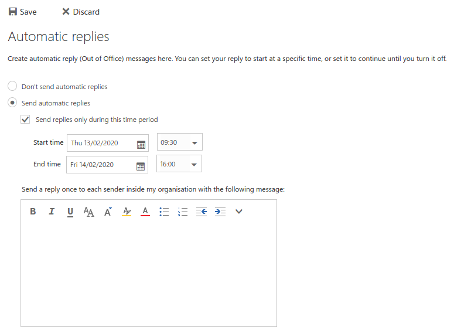

**Ostatnia aktualizacja: 20-07-2020**

## Wprowadzenie

Ta funkcja programu Exchange umożliwia skonfigurowanie automatycznych odpowiedzi na e-maile przysłane na Twoje konto w różnych sytuacjach, na przykład podczas nieobecności.

**Dowiedz się, jak włączyć odpowiedzi automatyczne przy użyciu interfejsu Outlook Web App (OWA).**

## Wymagania początkowe

 - Instalacja rozwiązania poczty elektronicznej OVHcloud [Exchange](https://www.ovhcloud.com/fr/emails/hosted-exchange/) lub [Email Pro](https://www.ovhcloud.com/fr/emails/email-pro/)
- dostęp do konta e-mail (adres e-mail i hasło)

## W praktyce

### Włączanie funkcji

Zaloguj się na konto Exchange przy użyciu interfejsu [OVHcloud webmail](https://www.ovh.pl/mail/). Kliknij ikonę koła zębatego w prawym górnym rogu, aby rozwinąć menu „Opcje”, i wybierz pozycję `Odpowiedzi automatyczne`{.action}.

{.thumbnail}

W interfejsie po prostu włącz funkcję, zaznaczając opcję `Wysyłaj odpowiedzi automatyczne`{.action}. W poniższych polach możesz ustawić dokładny okres wysyłania odpowiedzi lub włączyć funkcję na czas nieokreślony. Jeśli nie określisz czasu rozpoczęcia i zakończenia, funkcję trzeba będzie wyłączyć ręcznie. 

Ułóż wiadomość w polu edytora i potwierdź, klikając przycisk `Zapisz`{.action} w lewym górnym rogu.

{.thumbnail}

### Typy odpowiedzi

Powyższe instrukcje dotyczą odpowiedzi na e-maile wysłane przez użytkowników w usłudze Exchange. Jeśli zaznaczysz pole wyboru „Wysyłaj odpowiedzi automatyczne do nadawców spoza mojej organizacji”, możesz przygotować osobną wiadomość dla innych nadawców. W takim przypadku będą dostępne dwie dodatkowe opcje odpowiedzi automatycznych:

- **„Wysyłaj odpowiedzi tylko do nadawców z mojej listy kontaktów”**: wiadomość otrzymają tylko Twoje kontakty.

- **„Wysyłaj odpowiedzi automatyczne do wszystkich zewnętrznych nadawców”**: wiadomość otrzyma każdy, kto przyśle e-maila podczas Twojej nieobecności.

Alternatywną wiadomość dla nadawców zewnętrznych można wprowadzić w drugim polu edytora. Zwykle pierwsza wiadomość jest przeznaczona dla współpracowników, a druga dla znajomych, klientów lub innych osób, które mogą się z Tobą skontaktować.

{.thumbnail}

### Informacje dodatkowe

- Po włączeniu funkcji odpowiedzi automatycznych e-maile będą przychodzić jak zwykle do Twojej skrzynki odbiorczej.

- Aby uniknąć spamu i pętli e-maili, każdy nadawca otrzyma tylko jedną odpowiedź automatyczną.

## Sprawdź również

[Korzystanie z interfejsu Outlook Web App wraz z kontem Exchange](/pages/web/emails/email_owa)

[Delegowanie uprawnień do konta Exchange](/pages/web/microsoft-collaborative-solutions/feature_delegation)

[Exchange: współdzielenie kalendarza w interfejsie OWA](/pages/web/microsoft-collaborative-solutions/owa_calendar_sharing)

Dołącz do naszej społeczności użytkowników: <https://community.ovh.com/en/>.