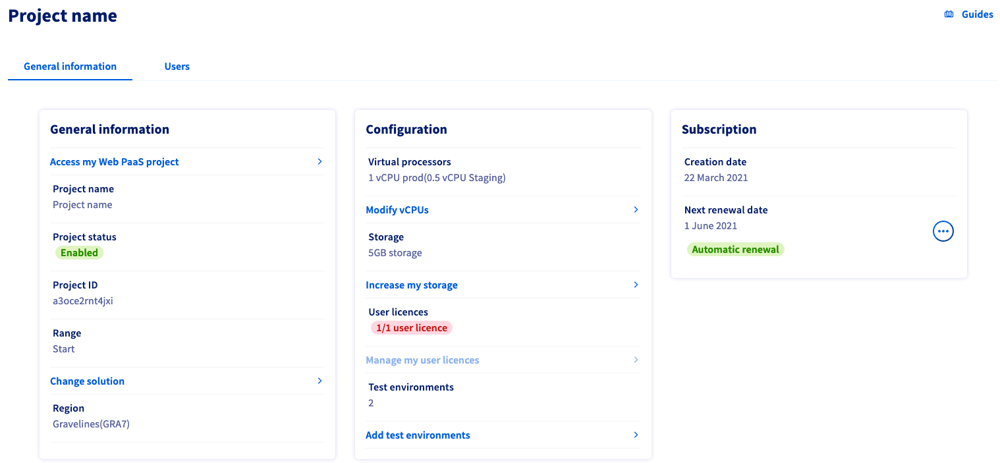

**Last updated 28th May 2021**

## Objective

The subscription details and attributes of your Web PaaS projects can be managed in the OVHcloud Control Panel.

**This guide explains how to configure Web PaaS powered by Platform.sh in the OVHcloud Control Panel.**

## Requirements

- a [Web PaaS solution](https://www.ovhcloud.com/en-gb/web-paas/) in your OVHcloud account, created by following [this guide](../web-paas-manager-setup/)
- access to the [OVHcloud Control Panel](https://www.ovh.com/auth/?action=gotomanager&from=https://www.ovh.co.uk/&ovhSubsidiary=GB)

## Instructions

Log in to your [OVHcloud Control Panel](https://www.ovh.com/auth/?action=gotomanager&from=https://www.ovh.co.uk/&ovhSubsidiary=GB) and switch to `Web Cloud`{.action} in the top navigation bar.

Select `Web PaaS`{.action} in the services bar on the left-hand side.

### Projects overview

On the Web PaaS home page, a table will list your projects and their attributes.

{.thumbnail}

Each project equals a service subscription. The button `New project`{.action} starts the process of ordering a [new project](../web-paas-manager-setup/).

You can carry out some actions by clicking on the `...`{.action} button in each row:

- **Access Web PaaS**: opens the Management Console of your project.
- **View dashboard**: opens the [dashboard of your project](#dashboard) inside the OVHcloud Control Panel.
- **Manage my user licenses**: A project can be upgraded to [allow more users](#managingusers) on it.
- **Change solution**: starts the process of [changing your subscription](#changeplan).
- **Delete project**: will cancel the subscription concerned after confirming in the popup window. 

### Managing a project 

After selecting your project, the `General information`{.action} tab displays the technical details of your plan as well as some subscription information.

{.thumbnail}

You can open the Management Console of your project by clicking on the link `Access my Web PaaS project`{.action}.

#### **Switching to a different plan** 

Click on `Change solution`{.action} in order to choose a [different subscription](../web-paas-manager-setup/). The only limitation is that you cannot downgrade to the `Start` plan.

#### **Adding or removing vCPUs**

Clicking on the link `Modify vCPUs`{.action} allows you to modify the number of assigned vCPUs of the production environment. Your test environments will always have half the number of production vCPUs at their disposal. This will change the subscription accordingly.

Take note of the billing information and click on `Confirm`{.action} to proceed.

#### **Adding storage**

A click on `Increase my storage`{.action} opens a new window in which you can incrementally add more storage space as per the requirements of your project. Bear in mind that storage cannot be decreased again.

Take note of the billing information and click on `Confirm`{.action} to proceed.

#### **Configuring test environments**

A click on `Add test environments`{.action} opens a new window in which you can add environments to your project.

Take note of the pricing information and click on `Confirm`{.action} to proceed.

#### **Managing users** 

- **User licences**

Clicking on the link `Manage user licenses`{.action} allows you to modify the number of additional user licenses for the project. The total number of possible licenses is determined by the current subscription.    

Take note of the pricing information and click on `Confirm`{.action} to proceed.

- **Users**

Switch to the tab `Users`{.action}. The table displays the users attached to this project. If licenses are available, you can invite a new user by clicking on `Add a user`{.action}. 

Enter a customer ID (NIC handle) and click on `Add user`{.action}. An invitation will be sent to the email address attached to this OVHcloud account.

The number of users you can add is limited by the available user licenses.

## Go further

Join our community of users on <https://community.ovh.com/en/>.